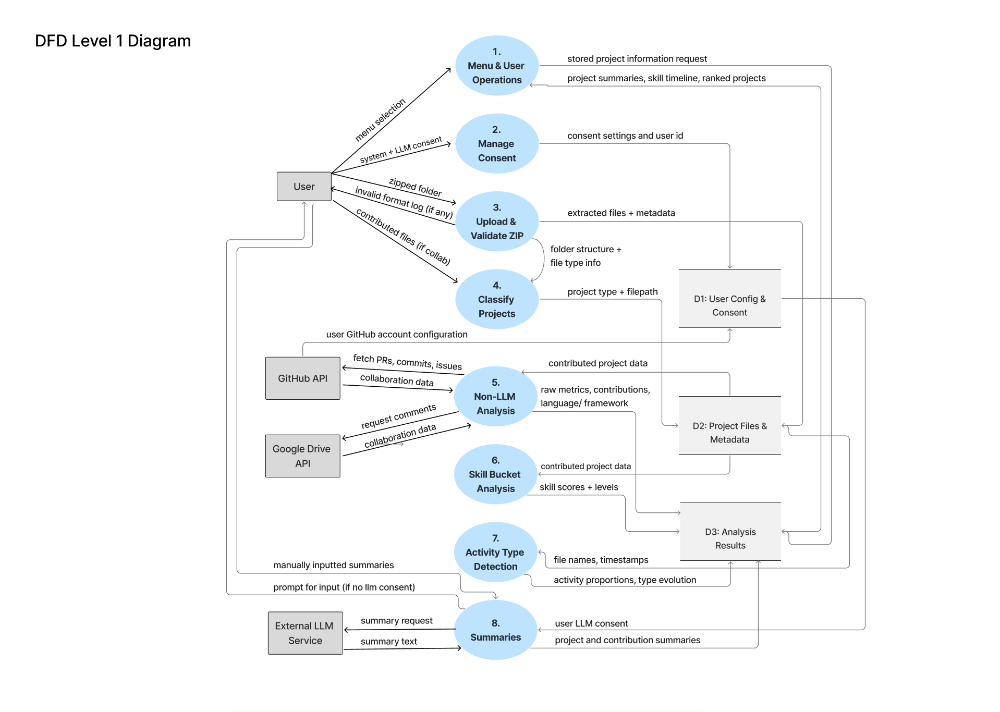

[](https://classroom.github.com/online_ide?assignment_repo_id=20544404&assignment_repo_type=AssignmentRepo)

# Capstone Project - Mining Digital Work Artifacts

## Team Contract

Our team contract outlining roles, responsibilities, communication expectations, and conflict resolution is available here:

[View Team Contract](docs/team/COSC%20499%20-%20Team%20Contract.pdf)

## Local Development Setup

### 1. Clone the Repository

```bash
git clone <repo-url> capstone-project-team-19
cd capstone-project-team-19
```

### 2. Create and Activate a Virtual Environment

#### On Windows

```bash
python -m venv venv
.\venv\Scripts\Activate.ps1
```

**Note for Windows:** If `pytest` returns an error, instead of `.\venv\Scripts\Activate.ps1`, try `source venv/bin/activate`.

#### On Mac/Linux

```bash
python -m venv venv
source venv/bin/activate
```

**Note for Mac users:** If you have multiple Python versions installed or `python` is not found, you may need to use `python3` instead:

```bash
python3 -m venv venv
source venv/bin/activate
```

### 3. Install Dependencies

```bash
pip install --upgrade pip           # Upgrade pip to avoid weird dependency errors
pip install -r requirements.txt
```

### 4. Configure Environment Variables

Copy the example environment file and update it with your configuration:

```bash
cp .env.example .env
```

**Important:** Make sure to add a secure `JWT_SECRET` value to your `.env` file. You can generate a secure random string using:

```bash
python -c "import secrets; print(secrets.token_urlsafe(32))"
```

Then add it to your `.env`:

```
JWT_SECRET=<your_generated_secure_string>
```

### 5. Run Tests
Ensure you are in the main directory `/capstone-project-team-19`.

```bash
pytest tests
```

If everything is set up correctly, you should see the tests pass.

### 5. Run the system

This project can be run in **one of two modes** - choose the one that fits your needs:

#### Option 1: API Mode (For Frontend Integration)

Runs the system as a web service using FastAPI. Use this mode when you want to connect a frontend application or make HTTP requests to the API.

```bash
# Ensure you are in the main directory
cd capstone-project-team-19

# Start the API server
uvicorn src.api.main:app --reload
```

The API will be available at `http://localhost:8000`. You can:
    - View interactive API documentation at `http://localhost:8000/docs`
    - View alternative API docs at `http://localhost:8000/redoc`
    - Make HTTP requests to the API endpoints from your frontend or API client

You can also check the API is running correctly:
    - `http://localhost:8000/health` (returns `{"status": "ok"}`)

> **Note:** The API server runs independently - you do not need to run the CLI application.

#### Option 2: CLI Mode (For Direct Use)

Runs the system as a command-line interface. Use this mode for direct interaction via terminal prompts.

```bash
# Ensure you are in the main directory
cd capstone-project-team-19

# Start the CLI application
python -m src.main
```

> **Note:** The CLI runs independently - you do not need to run the API server. Both modes use the same underlying code and database.

### Preparing Your ZIP Upload

To keep analysis simple, please structure the folder you zip and upload like this:

1. Place everything inside a single top-level directory (your "root" folder). The ZIP should contain only this folder at its highest level.
2. Inside the root folder you may optionally create subfolders named `individual/` and `collaborative/`.
   - If you create these folders, add each project as a subfolder beneath the appropriate one. Every subfolder under `individual/` is treated as an individual project; every subfolder under `collaborative/` is treated as a collaborative project.
3. If you do **not** create `individual/` or `collaborative/`, simply keep each project as a child folder directly under the root. The CLI will then ask you to classify each project one-by-one.
   - Any loose files left directly in the root (not inside a project folder) are ignored during analysis, so be sure to nest everything you want processed inside a project directory.

Example structures:

```
my-workspace/
├── individual/
│   ├── blog-site/
│   └── data-journal/
└── collaborative/
    ├── hackathon-app/
    └── research-tool/
```

or, if you prefer to classify through the prompts:

```
my-workspace/
├── blog-site/
├── data-journal/
├── hackathon-app/
└── research-tool/
```

After arranging your files, zip the root folder (e.g., zip `my-workspace/` into `my-workspace.zip`) and provide that ZIP file path to the CLI when prompted.

> **Note:**
> Do not change the name of the ZIP folder, it should match the root folder exactly.
> Local .git analysis will not work if the folder names do not match.

## Google Drive Integration

This project optionally supports Google Drive analysis through the Google Drive API.
All access is strictly consent-based and is not required for a project to be analyzed.

### For Course Evaluators (TAs)

Google Drive integration **can be tested by course evaluators**.


To enable Google Drive integration during evaluation, follow these steps:

Create a Google Cloud Project
1. Go to: https://console.cloud.google.com 
2. Click Select a project -> New Project
3. Name it anything ( ex. Drive-API-Grading), Location can be left as "No organization"
4. Click Create

Enable the Google Drive API
1. Check you are in the project just created ( will say "you are working in [project_name] " )
   if project is a different one click and select apporpriate project
2. Go to navigation menu - > APIs & Services -> Enable APIs & services
3. Click " + Enable APIs and services"
4. Search for Google Drive API 
3. Click it -> Enable

Configure OAuth Consent Screen
1. Go to APIs & Services -> OAuth consent screen 
2. Click "Get Started"
3. Fill out:
      App name: (ex:"TestingTeam19")   
      User support email
4. Click "Next"
5. Select External, Click "Next"
6. Fill out email address for contact information, Click "Next"
7. Select "I agree to the Google API Services: User Data Policy. ", Click "Continue"
8. Click save

Create OAuth Credentials
1. Go to APIs & Services -> Credentials
2. Click "+ Create Credentials" -> OAuth client ID
3. Choose Desktop app
4. Name it anything
5. Click "Create"
6. Click "Download JSON"
7. Rename it to "credentials.json"

Placing the Credentials file within the project
1. Place the file so its path is: `src/integrations/google_drive/google_drive_auth/credentials.json`
2. Verify the path is correct before running the application.

If credentials are not provided, the system will fall back to local-only analysis,
and all core functionality will remain available.

> Note: Google Drive OAuth requires the evaluator’s email to be a Google account (e.g., Gmail).


### For Team Development Use
Each team member has been added as a test user in the Google Drive API project
using the email associated with the **"COSC 499 - GROUP 19"** shared Google Drive folder.

To enable Google Drive integration locally:

1. Obtain `credentials.json` from the team (via private communication).
2. Place the file at: `src/integrations/google_drive/google_drive_auth/credentials.json`
3. Verify the path is correct before running the application.

> **Security Note**  
> `credentials.json` contains sensitive OAuth credentials.  
> This file is included in `.gitignore` and must never be committed to version control.

## Environment Variables and OAuth Setup

This project requires a `.env` file to exist in the project root in order to run,
even if optional API integrations are not used.

A template file (`.env.example`) is provided and should be copied directly.

### Required `.env` Setup

1. Copy the example file (manually or using a command):
    ```bash
    cp .env.example .env
    ```
    (On Windows, create the `.env` file manually or use `copy .env.example .env`.)

2. Ensure all variables below are present in `.env`:
    ```env
    GROQ_API_KEY=<your-api-key>
    GITHUB_CLIENT_ID=""
    GITHUB_CLIENT_SECRET=<your-new-client-secret>
    
    GITHUB_REDIRECT_URI=http://localhost:8000/auth/github/callback
    DEVICE_CODE_URL="https://github.com/login/device/code"
    TOKEN_URL="https://github.com/login/oauth/access_token"
    ```
    The values for GROQ_API_KEY and GITHUB_CLIENT_ID may be left empty.
    The URL values are required and should not be modified.

> **Security Note**
> The `.env` file may contain sensitive information and is ignored by Git via `.gitignore`.
> Never commit real API keys or OAuth credentials to version control.

### GitHub OAuth (optional)

GitHub OAuth is used to analyze collaboration metrics such as commits, pull requests, reviews, and contribution frequency. This integration uses GitHub's **Code Flow OAuth**.

To enable GitHub analysis:
1. Create a GitHub OAuth App:
   - Visit https://github.com/settings/developers
   - Select **OAuth Apps --> New OAuth App**
   - Application name: `Capstone Portfolio Analyzer`
   - Homepage URL: `http://localhost:8000`
   - Authorization callback URL: `http://localhost:8000/auth/github/callback`
2. Copy the **Client ID** from the OAuth app.
3. Generate a client secret:
   - Click "Generate a new client secret"
   - Copy the client secret and add to your `.env` file 
4. Add the following to your `.env` file (as shown in `.env.example`):
    ```env
    GITHUB_CLIENT_ID=<your-client-id>
    ```

### LLM Services (optional)

Advanced analysis features (e.g., project summaries using an LLM) use the **Groq API**. This integration is optional and fully consent-based.

If no Groq API key is provided, the system will fall back to local-only analysis.

#### How to Set Up a Groq API Key

1. Log in or create a Groq account:
   - https://console.groq.com/login

2. Create an API key:
   - https://console.groq.com/keys

3. Add the following to you `.env` file in the project root:
    ```env
    GROQ_API_KEY=<your-groq-api-key>
    ```

> **Security Note** 
> API keys should never be committed to version control.
> The `.env` file is ignored via `.gitignore`, and a template (`.env.example`) is provided for reference.

### Preparing a Local `.git` Repository for Collaborative Analysis

1. **Find your repo**

   - Use a collaborative repo (with multiple authors).

2. **Clone locally**

   - Run:
     ```bash
     git clone <repo-url>
     ```
   - Use **Terminal (macOS)** or **Command Prompt/PowerShell (Windows)**.
     > ⚠️ Don’t download the ZIP — it won’t include `.git` history.

3. **Place the repo**

   - Put the cloned folder either in:
     ```
     root/collaborative/
     ```
     or directly in the **root** (without `collaborative/`).

4. **Zip the folder**
   - From the **root**, compress it into a `.zip`.

## System Architecture Diagram


The System Architecture Diagram outlines the complete pipeline from user data consent through metrics generation and outputs. 
The flow starts when the user login, and choose one of the 8 menu:

- View old project summaries

   List user's past projects that has been analyzed before, and ask user to choose which project summaries the user would like to view.

- View all projects ranked

   Ranking the project based on skills score, collaboration score, activity diversity, and metrics obtained from the analysis.

- View resume items

   Create a frozen resume snapshot or view an existing one. Retrieves data from project_summaries table, rank projects, and includes only the top five project. Show languages and frameworks (for code), summary, contributions, and skills. It also shows skills summary at the bottom of the resume.

- View chronological skills

   Shows skill timeline, what skills obtained, skill level, from what project, and score in a chronological list.

- View portfolio items

   Display each project with its title, importance score, project type, mode, duration, activity breakdown, skills, and summary. It retrieves data from the project_summaries table.

- View all projects

   List all projects chronologically from newest to oldest, and show the date of the project.

- Delete old insight

   Give options for user to delete resume, delete projects, refresh resume based on projects list after deleted, or keep the resume unchanged.

- Analyze new project

   The flow will continue to consent manager, where user will be asked for consent to analyze their files and external services. If consent is granted, the system will parse and inspect the uploaded archive, and files will be sent to analysis layer, then deleted after the analysis done.

   The file type detector and project structure classifier will determine the path of the analysis whether it goes to code/text analysis and individual/collaborative analysis. 
   
   For all analysis, will go through the Non-LLM analysis first, then if LLM access is granted, summarization of project will be done by LLM, if not, user will be asked to enter their own summary.


   There are four path of analysis:

   - For individual code project, language, framework, complexity, git commits, author, and history will be analyzed. If .git does not exist, it will ask for github integration. If integration not granted, git analysis will be skipped.

   - Individual Text Analysis will go through linguistic and readability analysis, CSV analysis, and activity type detection.

   - Collaborative code project analysis will detect for .git file. If it exist, it will be used to filter user's files, and analyze contribution metrics. Github integration will be asked for despite the existence of .git files. If the user choose to integrate their github account, PRs, Issues, and Commits data will be fetched, and user's individual contribution will be analyzed. The github data will also be used to detect the collaborative skills.

      However, if user chose not to integrate their github data, and if .git does not exist, user will be asked to enter their contribution summary. This summary will be used to detect their contribution by matching filenames, file paths and file content. 

      Code files will go through the language & framework detection and activity type detection.

   - Collaborative text project will ask the user to give access to their google drive. The Google API pipeline will extract contribution by fetching the comments, replies, questions in the document. It will be used to calculate collaborative skill.

      However, if user does not give access to google, user will be asked which files and which part of main file did the user work on. Individual contribution files will be passed to the individual text pipeline and contribution will be calculated.

   All files (and contributed files for collaborative project) will be passed to the skill bucket analysis layer, where existence check of each criteria of each skills will be done. Each skills will have score and will be given level based on it's score.

   All of the analysis result has their own tables, and overall project summaries result will be stored to the project_summaries table.

   Activity type analysis has two path:
   - Code Activity, pattern match will be done on filename and PR Title/Body (if github integrated), then stored to database that lists activity type proportion, activity types list and files list for each activity type.

   - Text activity, pattern match will be done on filename. Timestamp will be parsed that will be used to list activity type evolution (created, modified, type listed chronologically)

## Level 1 Data Flow Diagram



The Level 1 DFD illustrates the complete lifecycle of a project analysis request, beginning with the user selecting an action in the menu and ending with the generation of summaries, skills, and portfolio outputs. When the user initiates a new analysis, the system first manages consent by collecting permissions for local analysis, GitHub integration, Google Drive access, and optional LLM summarization. These selections are stored in the consent and configuration data store so that future analyses remain consistent with the user's preferences.

After the user uploads a zipped project folder, the system validates the archive, extracts its contents, and records file metadata. The classification stage determines project boundaries, identifies file types, and separates individual from collaborative projects. Once classified, projects are sent to the non LLM analysis pipeline, which performs linguistic metrics, CSV inspection, readability analysis, language and framework detection, Git commit inspection, and contribution inference depending on the project type and available integrations. All extracted metrics and contribution data are written to the analysis results store.

The skill bucket analysis process then evaluates the available evidence, including text and code metrics, contributions, structural features, and activity traces, to produce skill scores and levels. Activity type detection supplements these results by categorizing user behavior over time, such as coding, testing, documentation, or textual revision patterns.

If LLM access is granted, a summarization process enhances the project record with natural language summaries. Otherwise, the system prompts the user to provide a manual description. These finalized summaries, along with all metrics and skill outputs, are stored as complete project records.

Because all menu operations draw from the same analysis results store, the user can view ranked projects, retrieve chronological skill timelines, build resumes, or revisit past analyses without re running computation. The DFD clearly indicates which components interact with external services, which rely on stored data, and where new analysis paths, such as additional detectors or classifiers, can be integrated into the pipeline.

## Work Breakdown Structure

Work breakdown structure will be updated based on [this google sheets](https://docs.google.com/spreadsheets/d/1yeHoVlBvooq_YpePy--oXryqxtmau8V4wUhEGfgpzfs/edit?usp=sharing) (Milestone 2 and 3 will be updated based on what is updated on canvas.)

| No     | Module/Functionality                                  | Description                                                                                                                                                                                     | Member(s)   | Status          |
| ------ | ----------------------------------------------------- | ----------------------------------------------------------------------------------------------------------------------------------------------------------------------------------------------- | ----------- | --------------- |
| **1**  | **Project Plan**                                      |                                                                                                                                                                                                 |             |                 |
| 1.1    | Project Requirements                                  | Define project goal, do self research on gathering requirements                                                                                                                                 | All Members | Done            |
| 1.2    | System Architecture                                   | Generate system architecture diagram, use case diagram, DFD based on the requirements                                                                                                           | All Members | Done            |
| 1.3    | Project Proposal                                      | Generate project proposal based on requirements and system architecture                                                                                                                         | All Members | Done            |
| 1.4    | Updated Project Plan                                  | Update project plan based on evaluation, including System architecture diagram, DFD, and requirements                                                                                           | All Members | Done            |
| 1.5    | Local Environment                                     | Setup local environment based on project requirements                                                                                                                                           | Timmi       | Done            |
| **2**  | **Backend**                                           |                                                                                                                                                                                                 |             |                 |
| 2.1    | Consent Module                                        |                                                                                                                                                                                                 | Salma       | Done            |
| 2.1.1  | Ask for consent functionality                         | Ask user for consent of accessing data                                                                                                                                                          | Salma       | Done            |
| 2.1.2  | Consent store to database functionality               | Store consent to database for future configuration                                                                                                                                              | Salma       | Done            |
| 2.2    | Folder Processing Module                              |                                                                                                                                                                                                 | Timmi       | Done            |
| 2.2.1  | ZIP Extraction Functionality                          | Parse a specified zipped folder containing nested folders and files                                                                                                                             | Timmi       | Done            |
| 2.2.2  | File checking functionality                           | Check whether file in the folder is according to the accepted file format, if not, return error response                                                                                        | Timmi       | Done            |
| 2.2.3  | Storing to database functionality                     | Store file metadata in SQLite                                                                                                                                                                   | Timmi       | Done            |
| 2.3    | External Service Consent Module                       |                                                                                                                                                                                                 | Ivona       | Done            |
| 2.3.1  | Ask for consent functionality                         | Display permission text and risk                                                                                                                                                                | Salma       | Done            |
| 2.3.2  | Consent Storage                                       | Store consent in database for future configuration                                                                                                                                              | Salma       | Done            |
| 2.4    | File Processing Module                                |                                                                                                                                                                                                 |             | Done            |
| 2.4.1  | Link to External Service Functionality                | Use external service such as LLM to analyze files                                                                                                                                               | Adara, Salma| Done            |
| 2.4.2  | Alternative analysis modules                          | Implement local analysis alternatives that produce the same metrics                                                                                                                             | All Members | Done            |
| 2.4.3  | Metadata Extraction Functionality                     | Extract key information for each project/file                                                                                                                                                   | All Members | Done            |
| 2.4.5  | Skill Extraction Functionality                        | Extract key skills demonstrated in project                                                                                                                                                      | All Members | Done            |
| 2.4.6  | Project Identification Functionality                  | Distinguish individual/collaborative projects, Extrapolate individual contributions in collabortion projects, Extract metrics, identify programming language and framework used if it is a code | All Members | Done            |
| 2.4.7  | Project Information Storage Functionality             | Store identification result in database                                                                                                                                                         | All Members | Done            |
| 2.5    | Information Generator Module                          |                                                                                                                                                                                                 |             | Done            |
| 2.5.1  | Project Ranking Functionality                         | Rank importance of each project based on user's contributions                                                                                                                                   | Timmi       | Done            |
| 2.5.2  | Project Summarizing Functionality                     | Summarize top-ranked projects                                                                                                                                                                   | Timmi       | Done            |
| 2.5.3  | Chronological List Functionality                      | Produce chronological list of projects and skills exercised                                                                                                                                     | Timmi, Ivona | Done            |
| 2.6    | Past Data Modification Module                         |                                                                                                                                                                                                 |             | Done            |
| 2.6.1  | Retrieve Previous Portfolio information Functionality | Retrieve previous data for adding new data in the same project                                                                                                                                  | Adara       | Done            |
| 2.6.2  | Retrieve Previous Resume Item Functionality           | Retrieve previous data for adding new data in the same project                                                                                                                                  | Adara       | Done            |
| 2.6.3  | Delete Past Insights Functionality                    | Deleting past insights which is shared in multiple projects without affecting other projects                                                                                                    | Adara       | Done            |
| **3**  | **Testing and Verification**                          |                                                                                                                                                                                                 |             |                 |
| 3.1    | Unit Testing                                          | Perform unit test for all modules                                                                                                                                                               | All Members | Done            |
| 3.2    | Integration Testing                                   | Perform integration testing between modules                                                                                                                                                     | All Members | Done            |
| **4**  | **Documentation & Report**                            |                                                                                                                                                                                                 |             |                 |
| 4.1    | Milestone 1 Documentation                             | Prepare milestone 1 documentation                                                                                                                                                               | All Members | Done            |
| **5**  | **Review and Evaluation**                             |                                                                                                                                                                                                 |             |                 |
| 5.1    | Milestone #1 Review                                   | Review and Evaluate Milestone #1 for future use in milestone 2                                                                                                                                  | All Members | Done            |
| 5.2    | API Framework Decision                                | Decide API Framework to be used in milestone 2                                                                                                                                                  |             |                 |
| **6**  | **API Implementation**                                |                                                                                                                                                                                                 |             |                 |
| 6.1    | Implement endpoints for some functions                | Implement endpoints for functions such as uploading additional zipped folder, modification of data                                                                                              | All Members | Done            |
| 6.2    | Define acceptable JSON formats                        | Standardized JSON response formats                                                                                                                                                              |             |                 |
| **7**  | **Backend Update**                                    |                                                                                                                                                                                                 |             |                 |
| 7.1    | Incremental Data Addition Module                      |                                                                                                                                                                                                 |             |                 |
| 7.1.1  | Retrieve Previous Data                                | Retrieve previous data to be added (milestone 1)                                                                                                                                                |             | Done            |
| 7.1.2  | Handle Metadata                                       | Handle metadata for version tracking                                                                                                                                                            |             | Done            |
| 7.1.3  | Merge new data functionality                          | Merge new data with previously retrieved data                                                                                                                                                   |             | Done            |
| 7.2    | Duplicate File Handling Modules                       |                                                                                                                                                                                                 |             |                 |
| 7.2.1  | Identify Duplicate Functionality                      | Recognized duplicate files                                                                                                                                                                      |             | Patial          |
| 7.2.2  | Maintain Unique Files                                 | maintain using only one file of duplicates to avoid redundancy                                                                                                                                  |             | Done            |
| 7.2.3  | Return response to users                              | Return response to user for feedback functionality                                                                                                                                              |             | Done            |
| 7.3    | Database Update                                       |                                                                                                                                                                                                 |             |                 |
| 7.3.1  | Implement New Tables                                  | New tables for storing thumbnails image, etc.                                                                                                                                                   |             | Done            |
| 7.3.2  | Resume Text Update                                    | Update resume based on added file                                                                                                                                                               |             | Done            |
| 7.3.3  | Metrics and data updates                              | Update metrics based on added file                                                                                                                                                              |             | Done            |
| **8**  | **Human-in-the-Loop Module**                          |                                                                                                                                                                                                 |             |                 |
| 8.1    | User Customization Interface                          | Allow user to be involved in selection, customization and corrections                                                                                                                           |             |                 |
| 8.1.1  | Re-rank project functionality                         | Allow user to re-rank the project after the analyzation done                                                                                                                                    |             |                 |
| 8.1.2  | Corrections to chronology functionality               | Allow user to correct the chronology                                                                                                                                                            |             |                 |
| 8.1.3  | Modify attributes for project comparison              | Allow user to choose and modify attributes for project comparison                                                                                                                               |             |                 |
| 8.1.4  | Highlight specific skills                             | Allow user to choose specific skills to be represented                                                                                                                                          |             | Done            |
| 8.2    | Role and Evidence Functionality                       |                                                                                                                                                                                                 |             |                 |
| 8.2.1  | Assign user's key role                                | Allow user to input their key role in a project and incorporate it into the data                                                                                                                |             |                 |
| 8.2.2  | Attach success evidence                               | Allow user to attach success evidence of their project                                                                                                                                          |             |                 |
| 8.3    | Project Media Module                                  |                                                                                                                                                                                                 |             |                 |
| 8.3.1  | Project Thumbnail Upload Functionality                | New function to upload project thumbnail                                                                                                                                                        |             |                 |
| 8.4    | Result Customization Module                           |                                                                                                                                                                                                 |             |                 |
| 8.4.1  | Customize Portfolio Information                       | Allow users to customize and save portfolio information                                                                                                                                         |             |                 |
| 8.4.2  | Customize Project Wording                             | Allow users to customize and save the wording of a project used for a resume item                                                                                                               |             |                 |
| **9**  | **Data Display and Output**                           |                                                                                                                                                                                                 |             |                 |
| 9.1    | Portfolio Display Module                              |                                                                                                                                                                                                 |             |                 |
| 9.1.1  | Textual Information Display                           | Display textual information about a project as a portfolio showcase                                                                                                                             |             | Done            |
| 9.2    | Resume Display Module                                 |                                                                                                                                                                                                 |             |                 |
| 9.2.1  | Textual Information Display                           | Display textual information about a project as a résumé item                                                                                                                                    |             | Done            |
| 9.2.2  | Export Functionality                                  | Allow users to download/export the resume generated                                                                                                                                             |             |                 |
| **10** | **Testing**                                           |                                                                                                                                                                                                 |             |                 |
| 10.1   | Unit Test                                             | Perform unit test for all modules                                                                                                                                                               |             | Done            |
| 10.2   | Integration Testing                                   | Perform integration testing between modules                                                                                                                                                     |             | Done            |
| **11** | **Documentation**                                     |                                                                                                                                                                                                 |             |                 |
| 11.1   | Milestone 2 Documentation                             | Prepare for documentation                                                                                                                                                                       |             |                 |
| **12** | **Frontend**                                          |                                                                                                                                                                                                 |             |                 |
| 12.1   | System Plan                                           |                                                                                                                                                                                                 |             |                 |
| 12.1.1 | Review Milestone #2                                   | Review and Evaluate Milestone #1 for future use in milestone 2                                                                                                                                  |             |                 |
| 12.1.2 | Choose front-end framework                            | Decide front-end framework to be used                                                                                                                                                           |             |                 |
| 12.1.3 | Define UI/UX flow                                     | Define flow to be implemented                                                                                                                                                                   |             |                 |
| 12.1.4 | Design                                                | Design interface to be implemented                                                                                                                                                              |             |                 |
| 12.2   | One Page Resume Frontend                              |                                                                                                                                                                                                 |             |                 |
| 12.2.1 | Define resume layout                                  | Define resume layout to be displayed to users                                                                                                                                                   |             |                 |
| 12.2.2 | Implement frontend design and layout                  | Implement frontend design and resume layout                                                                                                                                                     |             |                 |
| 12.2.3 | Integrate Resume data from backend API                |                                                                                                                                                                                                 |             |                 |
| 12.2.4 | Display resume                                        |                                                                                                                                                                                                 |             |                 |
| 12.2.5 | Implement previous milestone's feature                | Implement previous milestone's feature in frontend such as downloading files, etc.                                                                                                              |             |                 |
| 12.3   | Web Portfolio Frontend                                |                                                                                                                                                                                                 |             |                 |
| 12.3.1 | Define layouts                                        | Define portfolio page layout to be displayed to users                                                                                                                                           |             |                 |
| 12.3.2 | Implement design and layout                           | Implement frontend design and layout                                                                                                                                                            |             |                 |
| 12.3.3 | Showcase Section                                      | Showcase of top 3 projects illustrating process to demonstrate evolution of changes                                                                                                             |             |                 |
| 12.3.4 | Integrate data from backend API                       |                                                                                                                                                                                                 |             |                 |
| 12.3.5 | Implement Previous Milestone's features               | Implement previous milestone's features in frontend.                                                                                                                                            |             |                 |
| 12.3.6 | Implement private dashboard                           | Private dashboard where user can interactively customize specific components or visualizations before going live                                                                                |             |                 |
| 12.3.7 | Implement public dashboard                            | Public dashboard where the dashboard information only changes based on search and filter                                                                                                        |             |                 |
| **13** | **Integration and Testing**                           |                                                                                                                                                                                                 |             |                 |
| 13.1   | Frontend and backend APIs integration                 | Integrate backend and frontend                                                                                                                                                                  |             |                 |
| 13.2   | Synchronization Test                                  | Test whether data in backend and frontend synchronized                                                                                                                                          |             |                 |
| 13.3   | User Testing                                          | User manual testing for usability and accessibility                                                                                                                                             |             |                 |
| **14** | **Documentation and Reporting**                       |                                                                                                                                                                                                 |             |                 |
| 14.1   | Milestone 3 Documentation                             | Prepare for milestone 3 documentation                                                                                                                                                           |             |                 |
