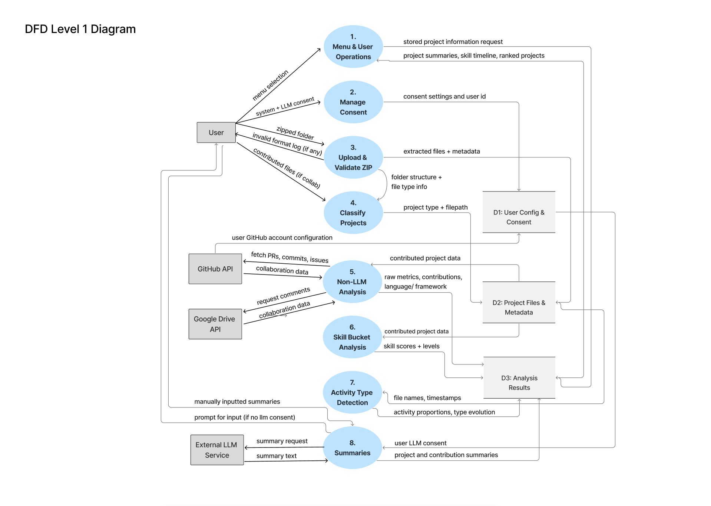

# Capstone Project - resuME

## Team Contract

Our team contract outlining roles, responsibilities, communication expectations, and conflict resolution is available here:

[View Team Contract](docs/team/COSC%20499%20-%20Team%20Contract.pdf)

## System Architecture

TODO make into new README with all system architecture information

## Installation Guide

[Installation Guide](/docs/installation.md)    

## Testing

[Testing Guide](/docs/testing.md)

## System Architecture Diagram

The System Architecture Diagram outlines the complete pipeline from user data consent through metrics generation and outputs. 
The flow starts when the user login, and choose one of the 11 menu:

- View old project summaries

   List user's past projects that has been analyzed before, and ask user to choose which project summaries the user would like to view.

- View all projects ranked

   Ranking the project based on skills score, collaboration score, activity diversity, and metrics obtained from the analysis.

- View resume items

   Create a frozen resume snapshot or view an existing one. Retrieves data from project_summaries table, rank projects, and includes only the top five project. Show languages and frameworks (for code), summary, contributions, and skills. It also shows skills summary at the bottom of the resume.

   This menu also allows user to export their resume snapshot into DOCX/PDF. 

   User can edit wordings of their resume which is done per project. They can edit contribution summary, project summary, display name, or key role, which can be applied either for a certain resume or globally.

   User can also choose whether to show some of their skills or not in a resume.

- View chronological skills

   Shows skill timeline, what skills obtained, skill level, from what project, and score in a chronological list.

- View project feedback

   Shows improvement suggestions per skill, grouped by skill name.

- Edit project dates

   Lets users manually adjust project start/end dates. Will affect skill timeline, and chronological skills.

- Manage project thumbnails

   Upload or edit project thumbnail images, which will be shown in the portfolio

- View portfolio items

   Display each project with its title, importance score, project type, mode, duration, activity breakdown, skills, and summary. It retrieves data from the project_summaries table.

   User will be able to export their portfolio to PDF/DOCX.

   This menu also allows user to edit their portfolio which will be done per project. They can choose to show some skills, edit summary text, contribution bullets, or display name.

- View all projects

   List all projects chronologically from newest to oldest, and show the date of the project.

- Delete old insight

   Give options for user to delete resume, delete projects, refresh resume based on projects list after deleted, or keep the resume unchanged.

- Analyze new project

   The flow will continue to consent manager, where user will be asked for consent to analyze their files and external services. If consent is granted, the system will parse and inspect the uploaded archive, and files will be sent to analysis layer, then deleted after the analysis done.

   The file type detector and project structure classifier will determine the path of the analysis whether it goes to code/text analysis and individual/collaborative analysis. 

   Before analysis, uploaded ZIP is hashed to detect if it's a re-upload or a new version

   Re-uploads are stored as new versions under the same project, not as duplicates
   
   For all analysis, will go through the Non-LLM analysis first, then if LLM access is granted, summarization of project will be done by LLM, if not, user will be asked to enter their own summary.

   There are four path of analysis:

   - For individual code project, language, framework, complexity, git commits, author, and history will be analyzed. If .git does not exist, it will ask for github integration. If integration not granted, git analysis will be skipped.

   - Individual Text Analysis will go through linguistic and readability analysis, CSV analysis, and activity type detection.

   - Collaborative code project analysis will detect for .git file. If it exist, it will be used to filter user's files, and analyze contribution metrics. Github integration will be asked for despite the existence of .git files. If the user choose to integrate their github account, PRs, Issues, and Commits data will be fetched, and user's individual contribution will be analyzed. The github data will also be used to detect the collaborative skills.

      However, if user chose not to integrate their github data, and if .git does not exist, user will be asked to enter their contribution summary. This summary will be used to detect their contribution by matching filenames, file paths and file content. 

      Code files will go through the language & framework detection and activity type detection.

   - Collaborative text project will ask the user to give access to their google drive. The Google API pipeline will extract contribution by fetching the comments, replies, questions in the document. It will be used to calculate collaborative skill.

      However, if user does not give access to google, user will be asked which files and which part of main file did the user work on. Individual contribution files will be passed to the individual text pipeline and contribution will be calculated.

   All files (and contributed files for collaborative project) will be passed to the skill bucket analysis layer, where existence check of each criteria of each skills will be done. Each skills will have score and will be given level based on it's score.

   Skill bucket itself has the feedback, so when one skill does not hit some criteria, it will give the feedback for that certain criteria. After skill extraction, unmet criteria automatically generate improvement suggestions stored in project_feedback table.

   All of the analysis result has their own tables, and overall project summaries result will be stored to the project_summaries table.

   Activity type analysis has two path:
   - Code Activity, pattern match will be done on filename and PR Title/Body (if github integrated), then stored to database that lists activity type proportion, activity types list and files list for each activity type.

   - Text activity, pattern match will be done on filename. Timestamp will be parsed that will be used to list activity type evolution (created, modified, type listed chronologically)

   After analysis, project is automatically scored and ranked

   Uploaded/extracted files will be deleted after analysis completes.

## Level 1 Data Flow Diagram

The Level 1 DFD illustrates the complete lifecycle of a project analysis request, beginning with the user selecting an action in the menu and ending with the generation of summaries, skills, and portfolio outputs. When the user initiates a new analysis, the system first manages consent by collecting permissions for local analysis, GitHub integration, Google Drive access, and optional LLM summarization. These selections are stored in the consent and configuration data store so that future analyses remain consistent with the user's preferences.

After the user uploads a zipped project folder, the system validates the archive, extracts its contents, and records file metadata. If the project has been uploaded before, the versioning and deduplication stage detects duplicates and lets the user skip, create a new project, or add a new version. The classification stage then determines project boundaries, identifies file types, and separates individual from collaborative projects. Once classified, projects are sent to the non-LLM analysis pipeline, which performs linguistic metrics, CSV inspection, readability analysis, language and framework detection, Git commit inspection, and contribution inference depending on the project type and available integrations. All extracted metrics and contribution data are written to the analysis results store.

The skill bucket analysis process then evaluates the available evidence, including text and code metrics, contributions, structural features, and activity traces, to produce skill scores and levels. When a skill detector finds no evidence for a criterion, the feedback system generates actionable improvement suggestions for the user. Activity type detection supplements these results by categorizing user behavior over time, such as coding, testing, documentation, or textual revision patterns.

If LLM access is granted, a summarization process enhances the project record with natural language summaries and extracts a key role (e.g., "Backend Developer") from the user's contribution description. Otherwise, the system prompts the user to provide a manual summary and key role. These finalized summaries, along with all metrics, skill outputs, and contribution descriptions, are stored as complete project records.

Because all menu operations draw from the same analysis results store, the user can view ranked projects, retrieve chronological skill timelines, build and edit resumes, view and edit portfolio cards, review skill feedback, manage project thumbnails, edit project dates, export resumes and portfolios to DOCX or PDF, or revisit past analyses without re-running computation. The system is also accessible via a FastAPI layer with JWT authentication, which mirrors CLI functionality through REST endpoints. The DFD illustrates which components interact with external services, which rely on stored data, and where new analysis paths, such as additional detectors or classifiers, can be integrated into the pipeline.

## Work Breakdown Structure

Work breakdown structure is tracked in [this google sheets](https://docs.google.com/spreadsheets/d/1yeHoVlBvooq_YpePy--oXryqxtmau8V4wUhEGfgpzfs/edit?usp=sharing). The table below reflects progress through Milestone 2.

| No     | Module/Functionality                                  | Description                                                                                                                                                                                     | Member(s)   | Status          |
| ------ | ----------------------------------------------------- | ----------------------------------------------------------------------------------------------------------------------------------------------------------------------------------------------- | ----------- | --------------- |
| **1**  | **Project Plan**                                      |                                                                                                                                                                                                 |             |                 |
| 1.1    | Project Requirements                                  | Define project goal, do self research on gathering requirements                                                                                                                                 | All Members | Done            |
| 1.2    | System Architecture                                   | Generate system architecture diagram, use case diagram, DFD based on the requirements                                                                                                           | All Members | Done            |
| 1.3    | Project Proposal                                      | Generate project proposal based on requirements and system architecture                                                                                                                         | All Members | Done            |
| 1.4    | Updated Project Plan                                  | Update project plan based on evaluation, including System architecture diagram, DFD, and requirements                                                                                           | All Members | Done            |
| 1.5    | Local Environment                                     | Setup local environment based on project requirements                                                                                                                                           | Timmi       | Done            |
| **2**  | **Backend**                                           |                                                                                                                                                                                                 |             |                 |
| 2.1    | Consent Module                                        |                                                                                                                                                                                                 | Salma       | Done            |
| 2.1.1  | Ask for consent functionality                         | Ask user for consent of accessing data                                                                                                                                                          | Salma       | Done            |
| 2.1.2  | Consent store to database functionality               | Store consent to database for future configuration                                                                                                                                              | Salma       | Done            |
| 2.2    | Folder Processing Module                              |                                                                                                                                                                                                 | Timmi       | Done            |
| 2.2.1  | ZIP Extraction Functionality                          | Parse a specified zipped folder containing nested folders and files                                                                                                                             | Timmi       | Done            |
| 2.2.2  | File checking functionality                           | Check whether file in the folder is according to the accepted file format, if not, return error response                                                                                        | Timmi       | Done            |
| 2.2.3  | Storing to database functionality                     | Store file metadata in SQLite                                                                                                                                                                   | Timmi       | Done            |
| 2.3    | External Service Consent Module                       |                                                                                                                                                                                                 | Ivona       | Done            |
| 2.3.1  | Ask for consent functionality                         | Display permission text and risk                                                                                                                                                                | Salma       | Done            |
| 2.3.2  | Consent Storage                                       | Store consent in database for future configuration                                                                                                                                              | Salma       | Done            |
| 2.4    | File Processing Module                                |                                                                                                                                                                                                 |             | Done            |
| 2.4.1  | Link to External Service Functionality                | Use external service such as LLM to analyze files                                                                                                                                               | Adara, Salma| Done            |
| 2.4.2  | Alternative analysis modules                          | Implement local analysis alternatives that produce the same metrics                                                                                                                             | All Members | Done            |
| 2.4.3  | Metadata Extraction Functionality                     | Extract key information for each project/file                                                                                                                                                   | All Members | Done            |
| 2.4.5  | Skill Extraction Functionality                        | Extract key skills demonstrated in project                                                                                                                                                      | All Members | Done            |
| 2.4.6  | Project Identification Functionality                  | Distinguish individual/collaborative projects, Extrapolate individual contributions in collabortion projects, Extract metrics, identify programming language and framework used if it is a code | All Members | Done            |
| 2.4.7  | Project Information Storage Functionality             | Store identification result in database                                                                                                                                                         | All Members | Done            |
| 2.5    | Information Generator Module                          |                                                                                                                                                                                                 |             | Done            |
| 2.5.1  | Project Ranking Functionality                         | Rank importance of each project based on user's contributions                                                                                                                                   | Timmi       | Done            |
| 2.5.2  | Project Summarizing Functionality                     | Summarize top-ranked projects                                                                                                                                                                   | Timmi       | Done            |
| 2.5.3  | Chronological List Functionality                      | Produce chronological list of projects and skills exercised                                                                                                                                     | Timmi, Ivona | Done            |
| 2.6    | Past Data Modification Module                         |                                                                                                                                                                                                 |             | Done            |
| 2.6.1  | Retrieve Previous Portfolio information Functionality | Retrieve previous data for adding new data in the same project                                                                                                                                  | Adara       | Done            |
| 2.6.2  | Retrieve Previous Resume Item Functionality           | Retrieve previous data for adding new data in the same project                                                                                                                                  | Adara       | Done            |
| 2.6.3  | Delete Past Insights Functionality                    | Deleting past insights which is shared in multiple projects without affecting other projects                                                                                                    | Adara       | Done            |
| **3**  | **Testing and Verification**                          |                                                                                                                                                                                                 |             |                 |
| 3.1    | Unit Testing                                          | Perform unit test for all modules                                                                                                                                                               | All Members | Done            |
| 3.2    | Integration Testing                                   | Perform integration testing between modules                                                                                                                                                     | All Members | Done            |
| **4**  | **Documentation & Report**                            |                                                                                                                                                                                                 |             |                 |
| 4.1    | Milestone 1 Documentation                             | Prepare milestone 1 documentation                                                                                                                                                               | All Members | Done            |
| **5**  | **Review and Evaluation**                             |                                                                                                                                                                                                 |             |                 |
| 5.1    | Milestone #1 Review                                   | Review and Evaluate Milestone #1 for future use in milestone 2                                                                                                                                  | All Members | Done            |
| 5.2    | API Framework Decision                                | Decide API Framework to be used in milestone 2                                                                                                                                                  | All Members | Done            |
| **6**  | **API Implementation**                                |                                                                                                                                                                                                 |             |                 |
| 6.1    | Implement endpoints for some functions                | Implement endpoints for functions such as uploading additional zipped folder, modification of data                                                                                              | All Members | Done            |
| 6.2    | Define acceptable JSON formats                        | Standardized JSON response formats using ApiResponse wrapper                                                                                                                                    | All Members | Done            |
| 6.3    | API Authentication                                    | JWT Bearer token authentication for protected endpoints (register, login, token validation)                                                                                                     | All Members | Done            |
| **7**  | **Backend Update**                                    |                                                                                                                                                                                                 |             |                 |
| 7.1    | Incremental Data Addition Module                      |                                                                                                                                                                                                 |             |                 |
| 7.1.1  | Retrieve Previous Data                                | Retrieve previous data to be added (milestone 1)                                                                                                                                                |             | Done            |
| 7.1.2  | Handle Metadata                                       | Handle metadata for version tracking                                                                                                                                                            |             | Done            |
| 7.1.3  | Merge new data functionality                          | Merge new data with previously retrieved data                                                                                                                                                   |             | Done            |
| 7.2    | Duplicate File Handling Modules                       |                                                                                                                                                                                                 |             |                 |
| 7.2.1  | Identify Duplicate Functionality                      | Recognized duplicate files                                                                                                                                                                      |             | Done            |
| 7.2.2  | Maintain Unique Files                                 | maintain using only one file of duplicates to avoid redundancy                                                                                                                                  |             | Done            |
| 7.2.3  | Return response to users                              | Return response to user for feedback functionality                                                                                                                                              |             | Done            |
| 7.3    | Database Update                                       |                                                                                                                                                                                                 |             |                 |
| 7.3.1  | Implement New Tables                                  | New tables for storing thumbnails image, etc.                                                                                                                                                   |             | Done            |
| 7.3.2  | Resume Text Update                                    | Update resume based on added file                                                                                                                                                               |             | Done            |
| 7.3.3  | Metrics and data updates                              | Update metrics based on added file                                                                                                                                                              |             | Done            |
| **8**  | **Human-in-the-Loop Module**                          |                                                                                                                                                                                                 |             |                 |
| 8.1    | User Customization Interface                          | Allow user to be involved in selection, customization and corrections                                                                                                                           |             | Done            |
| 8.1.1  | Re-rank project functionality                         | Allow user to re-rank projects via CLI and API (manual rank overrides)                                                                                                                          | All Members | Done            |
| 8.1.2  | Corrections to chronology functionality               | Allow user to edit project start/end dates (CLI menu option 9)                                                                                                                                  | All Members | Done            |
| 8.1.3  | Modify attributes for project comparison              | Allow user to customize display names, summaries, and contribution bullets for portfolio and resume                                                                                              | All Members | Done            |
| 8.1.4  | Highlight specific skills                             | Allow user to choose specific skills to be represented                                                                                                                                          | All Members | Done            |
| 8.2    | Role and Evidence Functionality                       |                                                                                                                                                                                                 |             | Done            |
| 8.2.1  | Assign user's key role                                | Allow user to input their key role in a project (LLM extraction or manual prompt) and incorporate it into the data                                                                              | All Members | Done            |
| 8.2.2  | Attach success evidence                               | Skill scores, metrics, and feedback provide evidence of project outcomes                                                                                                                        | All Members | Done            |
| 8.3    | Project Media Module                                  |                                                                                                                                                                                                 |             | Done            |
| 8.3.1  | Project Thumbnail Upload Functionality                | Upload project thumbnail via CLI (menu option 10) and API endpoint                                                                                                                              | All Members | Done            |
| 8.4    | Result Customization Module                           |                                                                                                                                                                                                 |             | Done            |
| 8.4.1  | Customize Portfolio Information                       | Allow users to customize and save portfolio information (global and portfolio-specific overrides)                                                                                                | All Members | Done            |
| 8.4.2  | Customize Project Wording                             | Allow users to customize and save the wording of a project used for a resume item (resume-specific overrides)                                                                                   | All Members | Done            |
| **9**  | **Data Display and Output**                           |                                                                                                                                                                                                 |             |                 |
| 9.1    | Portfolio Display Module                              |                                                                                                                                                                                                 |             | Done            |
| 9.1.1  | Textual Information Display                           | Display textual information about a project as a portfolio showcase                                                                                                                             | All Members | Done            |
| 9.1.2  | Portfolio Export Functionality                         | Export portfolio to DOCX and PDF                                                                                                                                                                | All Members | Done            |
| 9.2    | Resume Display Module                                 |                                                                                                                                                                                                 |             | Done            |
| 9.2.1  | Textual Information Display                           | Display textual information about a project as a résumé item                                                                                                                                    | All Members | Done            |
| 9.2.2  | Resume Export Functionality                           | Export resume to DOCX and PDF via CLI and API                                                                                                                                                   | All Members | Done            |
| 9.3    | Skill Feedback Module                                 |                                                                                                                                                                                                 |             | Done            |
| 9.3.1  | Feedback Generation                                   | Generate actionable skill improvement suggestions when detectors find no evidence                                                                                                               | All Members | Done            |
| 9.3.2  | Feedback Display                                      | Display feedback in CLI (menu option 5) and via API endpoint                                                                                                                                    | All Members | Done            |
| **10** | **Testing**                                           |                                                                                                                                                                                                 |             |                 |
| 10.1   | Unit Test                                             | Perform unit test for all modules                                                                                                                                                               |             | Done            |
| 10.2   | Integration Testing                                   | Perform integration testing between modules                                                                                                                                                     |             | Done            |
| **11** | **Documentation**                                     |                                                                                                                                                                                                 |             |                 |
| 11.1   | Milestone 2 Documentation                             | Prepare milestone 2 documentation and updated README                                                                                                                                            | All Members | In Progress     |
| 11.2   | API Endpoint Documentation                            | Document all API endpoints in docs/API.md                                                                                                                                                       | All Members | Done            |
| **12** | **Frontend**                                          |                                                                                                                                                                                                 |             |                 |
| 12.1   | System Plan                                           |                                                                                                                                                                                                 |             |                 |
| 12.1.1 | Review Milestone #2                                   | Review and Evaluate Milestone #1 for future use in milestone 2                                                                                                                                  |             |                 |
| 12.1.2 | Choose front-end framework                            | Decide front-end framework to be used                                                                                                                                                           |             |                 |
| 12.1.3 | Define UI/UX flow                                     | Define flow to be implemented                                                                                                                                                                   |             |                 |
| 12.1.4 | Design                                                | Design interface to be implemented                                                                                                                                                              |             |                 |
| 12.2   | One Page Resume Frontend                              |                                                                                                                                                                                                 |             |                 |
| 12.2.1 | Define resume layout                                  | Define resume layout to be displayed to users                                                                                                                                                   |             |                 |
| 12.2.2 | Implement frontend design and layout                  | Implement frontend design and resume layout                                                                                                                                                     |             |                 |
| 12.2.3 | Integrate Resume data from backend API                |                                                                                                                                                                                                 |             |                 |
| 12.2.4 | Display resume                                        |                                                                                                                                                                                                 |             |                 |
| 12.2.5 | Implement previous milestone's feature                | Implement previous milestone's feature in frontend such as downloading files, etc.                                                                                                              |             |                 |
| 12.3   | Web Portfolio Frontend                                |                                                                                                                                                                                                 |             |                 |
| 12.3.1 | Define layouts                                        | Define portfolio page layout to be displayed to users                                                                                                                                           |             |                 |
| 12.3.2 | Implement design and layout                           | Implement frontend design and layout                                                                                                                                                            |             |                 |
| 12.3.3 | Showcase Section                                      | Showcase of top 3 projects illustrating process to demonstrate evolution of changes                                                                                                             |             |                 |
| 12.3.4 | Integrate data from backend API                       |                                                                                                                                                                                                 |             |                 |
| 12.3.5 | Implement Previous Milestone's features               | Implement previous milestone's features in frontend.                                                                                                                                            |             |                 |
| 12.3.6 | Implement private dashboard                           | Private dashboard where user can interactively customize specific components or visualizations before going live                                                                                |             |                 |
| 12.3.7 | Implement public dashboard                            | Public dashboard where the dashboard information only changes based on search and filter                                                                                                        |             |                 |
| **13** | **Integration and Testing**                           |                                                                                                                                                                                                 |             |                 |
| 13.1   | Frontend and backend APIs integration                 | Integrate backend and frontend                                                                                                                                                                  |             |                 |
| 13.2   | Synchronization Test                                  | Test whether data in backend and frontend synchronized                                                                                                                                          |             |                 |
| 13.3   | User Testing                                          | User manual testing for usability and accessibility                                                                                                                                             |             |                 |
| **14** | **Documentation and Reporting**                       |                                                                                                                                                                                                 |             |                 |
| 14.1   | Milestone 3 Documentation                             | Prepare for milestone 3 documentation                                                                                                                                                           |             |                 |
