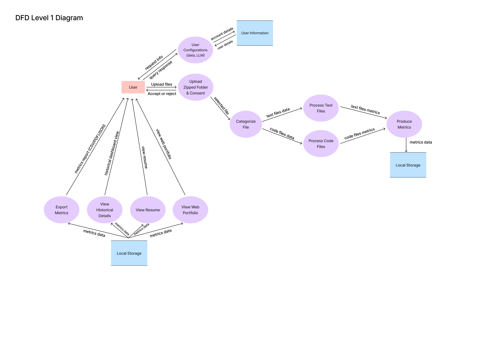

[](https://classroom.github.com/online_ide?assignment_repo_id=20544404&assignment_repo_type=AssignmentRepo)

# Capstone Project - Mining Digital Work Artifacts

## Team Contract

Our team contract outlining roles, responsibilities, communication expectations, and conflict resolution is available here:

[View Team Contract](docs/team/COSC%20499%20-%20Team%20Contract.pdf)

## Local Development Setup

### 1. Clone the Repository

```bash
git clone <repo-url> capstone-project-team-19
cd capstone-project-team-19
```

### 2. Create and Activate a Virtual Environment

#### On Windows

```bash
python -m venv venv
.\venv\Scripts\Activate.ps1
```

**Note for Windows:** If `pytest` returns an error, instead of `.\venv\Scripts\Activate.ps1`, try `source venv/bin/activate`.

#### On Mac/Linux

```bash
python -m venv venv
source venv/bin/activate
```

**Note for Mac users:** If you have multiple Python versions installed or `python` is not found, you may need to use `python3` instead:

```bash
python3 -m venv venv
source venv/bin/activate
```

### 3. Install Dependencies

```bash
pip install --upgrade pip           # Upgrade pip to avoid weird dependency errors
pip install -r requirements.txt
```

### 4. Run Tests

```bash
pytest
```

If everything is set up correctly, you should see the tests pass.

### Preparing Your ZIP Upload

To keep analysis simple, please structure the folder you zip and upload like this:

1. Place everything inside a single top-level directory (your "root" folder). The ZIP should contain only this folder at its highest level.
2. Inside the root folder you may optionally create subfolders named `individual/` and `collaborative/`.
   - If you create these folders, add each project as a subfolder beneath the appropriate one. Every subfolder under `individual/` is treated as an individual project; every subfolder under `collaborative/` is treated as a collaborative project.
3. If you do **not** create `individual/` or `collaborative/`, simply keep each project as a child folder directly under the root. The CLI will then ask you to classify each project one-by-one.
   - Any loose files left directly in the root (not inside a project folder) are ignored during analysis, so be sure to nest everything you want processed inside a project directory.

Example structures:

```
my-workspace/
├── individual/
│   ├── blog-site/
│   └── data-journal/
└── collaborative/
    ├── hackathon-app/
    └── research-tool/
```

or, if you prefer to classify through the prompts:

```
my-workspace/
├── blog-site/
├── data-journal/
├── hackathon-app/
└── research-tool/
```

After arranging your files, zip the root folder (e.g., zip `my-workspace/` into `my-workspace.zip`) and provide that ZIP file path to the CLI when prompted.

## Google Drive Integration

This project optionally supports Google Drive analysis through the Google Drive API.
All access is strictly consent-based and is not required for a project to be analyzed.

### For Course Evaluators (TAs)

Google Drive integration **can be tested by course evaluators**.

To support this, course evaluators have been added as **authorized test users**
in the Google Drive API project. Due to OAuth security restrictions,
credentials cannot be included in the repository and must be shared privately.

To enable Google Drive integration during evaluation:

1. Obtain `credentials.json` via private communication from the team.
2. Place the file at: `src/integrations/google_drive/google_drive_auth/credentials.json`
3. Verify the path is correct before running the application.

If credentials are not provided, the system will fall back to local-only analysis,
and all core functionality will remain available.

> Note: Google Drive OAuth requires the evaluator’s email to be a Google account (e.g., Gmail).

### For Team Development Use
Each team member has been added as a test user in the Google Drive API project
using the email associated with the **"COSC 499 - GROUP 19"** shared Google Drive folder.

To enable Google Drive integration locally:

1. Obtain `credentials.json` from the team (via private communication).
2. Place the file at: `src/integrations/google_drive/google_drive_auth/credentials.json`
3. Verify the path is correct before running the application.

> **Security Note**  
> `credentials.json` contains sensitive OAuth credentials.  
> This file is included in `.gitignore` and must never be committed to version control.

## Environment Variables and OAuth Setup

This project requires a `.env` file to exist in the project root in order to run,
even if optional API integrations are not used.

A template file (`.env.example`) is provided and should be copied directly.

### Required `.env` Setup

1. Copy the example file (manually or using a command):
    ```bash
    cp .env.example .env
    ```
    (On Windows, create the `.env` file manually or use `copy .env.example .env`.)

2. Ensure all variables below are present in `.env`:
    ```env
    GROQ_API_KEY=<your-api-key>
    GITHUB_CLIENT_ID=""

    DEVICE_CODE_URL="https://github.com/login/device/code"
    TOKEN_URL="https://github.com/login/oauth/access_token"
    ```
    The values for GROQ_API_KEY and GITHUB_CLIENT_ID may be left empty.
    The URL values are required and should not be modified.

> **Security Note**
> The `.env` file may contain sensitive information and is ignored by Git via `.gitignore`.
> Never commit real API keys or OAuth credentials to version control.

### GitHub OAuth (optional)

GitHub OAuth is used to analyze collaboration metrics such as commits, pull requests, reviews, and contribution frequency. This integration uses GitHub's **Device Flow OAuth**.

To enable GitHub analysis:
1. Create a GitHub OAuth App:
   - Visit https://github.com/settings/developers
   - Select **OAuth Apps --> New OAuth App**
   - Application name: `Capstone Portfolio Analyzer`
   - Homepage URL: `http://localhost`
   - Authorization callback URL: `http://localhost`
2. Copy the **Client ID** from the OAuth app.
3. Add the following to your `.env` file (as shown in `.env.example`):
    ```env
    GITHUB_CLIENT_ID=<your-client-id>
    ```

### LLM Services (optional)

Advanced text analysis features (e.g., project summaries and skill extraction using an LLM)
use the **Groq API**. This integration is optional and fully consent-based.

If no Groq API key is provided, the system will fall back to local-only analysis.

#### How to Set Up a Groq API Key

1. Log in or create a Groq account:
   - https://console.groq.com/login

2. Create an API key:
   - https://console.groq.com/keys

3. Add the following to you `.env` file in the project root:
    ```env
    GROQ_API_KEY=<your-groq-api-key>
    ```

> **Security Note** 
> API keys should never be committed to version control.
> The `.env` file is ignored via `.gitignore`, and a template (`.env.example`) is provided for reference.

### Preparing a Local `.git` Repository for Collaborative Analysis

1. **Find your repo**

   - Use a collaborative repo (with multiple authors).

2. **Clone locally**

   - Run:
     ```bash
     git clone <repo-url>
     ```
   - Use **Terminal (macOS)** or **Command Prompt/PowerShell (Windows)**.
     > ⚠️ Don’t download the ZIP — it won’t include `.git` history.

3. **Place the repo**

   - Put the cloned folder either in:
     ```
     root/collaborative/
     ```
     or directly in the **root** (without `collaborative/`).

4. **Zip the folder**
   - From the **root**, compress it into a `.zip`.

## System Architecture Diagram


The System Architecture Diagram outlines the complete pipeline from user data consent through metrics generation and portfolio output. It starts when the user grants or denies consent for external services (LLM and relevant APIs) and uploads a zipped project folder. The system parses and inspects the uploaded archive, handling corrupted or duplicate files before classifying each by type and access level.

The File Type Detector directs text and code files into different processing paths depending on user permissions. When no external access is allowed, the Simple Text Function performs offline analysis using local tools for linguistic complexity, readability, and topic modeling, while the Code Function analyzes source files to detect programming languages, frameworks, and structure metrics like complexity and contribution frequency. When consent is granted, the Advanced Text Function extends this analysis with LLM summaries, skill extraction, and measure of success.

Outputs from all three functions flow into the Metrics Calculation module, which standardizes extracted data into project-level metrics like summaries, activity timelines, project rankings, skill frequencies, work type ratios, and collaboration indicators. Finally, the Visualization and Export module takes in stored metrics to generate a resume and web portfolio using Matplotlib, Seaborn, and optionally an LLM. Results are stored in a shared database to enable retrieval, incremental updates, and reuse across sessions.

## Level 1 Data Flow Diagram



The Level 1 DFD captures the full loop from a user opting-in to analysis through the portfolio views they receive. A run begins when the user adjusts their configuration (data consent, LLM usage) and shares a zipped project folder. Those inputs are stored alongside account metadata so future runs can respect the same choices without re-prompting.

Uploaded files go through the categorization service, which tags each artifact (text, code, image, video, audio, CSV). The tagged batches feed into the media-specific processors where extractors pull metrics such as word counts, sentiment, frame features, commit history, or tabular summaries. Each processor returns a scoped metrics bundle to the metrics producer, which normalizes the data and stores the blended dataset.

Once metrics are available, the dashboard layer surfaces them in several destinations: the interactive historical view, resume builder, public web portfolio, and export pipeline (PDF/DOCX/CSV). These downstream tools all read from the shared metrics store, letting us plug in new visualizations without re-running analysis. The DFD makes it clear which components depend on local storage, which ones exchange user-facing data, and where new processors should integrate if we add artifact types later.

## Work Breakdown Structure

Work breakdown structure will be updated based on [this google sheets](https://docs.google.com/spreadsheets/d/1yeHoVlBvooq_YpePy--oXryqxtmau8V4wUhEGfgpzfs/edit?usp=sharing) (Milestone 2 and 3 will be updated based on what is updated on canvas.)

| No     | Module/Functionality                                  | Description                                                                                                                                                                                     | Member(s)   | Status          |
| ------ | ----------------------------------------------------- | ----------------------------------------------------------------------------------------------------------------------------------------------------------------------------------------------- | ----------- | --------------- |
| **1**  | **Project Plan**                                      |                                                                                                                                                                                                 |             |                 |
| 1.1    | Project Requirements                                  | Define project goal, do self research on gathering requirements                                                                                                                                 | All Members | Done            |
| 1.2    | System Architecture                                   | Generate system architecture diagram, use case diagram, DFD based on the requirements                                                                                                           | All Members | Done            |
| 1.3    | Project Proposal                                      | Generate project proposal based on requirements and system architecture                                                                                                                         | All Members | Done            |
| 1.4    | Updated Project Plan                                  | Update project plan based on evaluation, including System architecture diagram, DFD, and requirements                                                                                           | All Members | Done            |
| 1.5    | Local Environment                                     | Setup local environment based on project requirements                                                                                                                                           | Timmi       | Done            |
| **2**  | **Backend**                                           |                                                                                                                                                                                                 |             |                 |
| 2.1    | Consent Module                                        |                                                                                                                                                                                                 | Salma       | Done            |
| 2.1.1  | Ask for consent functionality                         | Ask user for consent of accessing data                                                                                                                                                          | Salma       | Done            |
| 2.1.2  | Consent store to database functionality               | Store consent to database for future configuration                                                                                                                                              | Salma       | Done            |
| 2.2    | Folder Processing Module                              |                                                                                                                                                                                                 | Timmi       | Done            |
| 2.2.1  | ZIP Extraction Functionality                          | Parse a specified zipped folder containing nested folders and files                                                                                                                             | Timmi       | Done            |
| 2.2.2  | File checking functionality                           | Check whether file in the folder is according to the accepted file format, if not, return error response                                                                                        | Timmi       | Done            |
| 2.2.3  | Storing to database functionality                     | Store file metadata in SQLite                                                                                                                                                                   | Timmi       | Done            |
| 2.3    | External Service Consent Module                       |                                                                                                                                                                                                 | Ivona       | Done            |
| 2.3.1  | Ask for consent functionality                         | Display permission text and risk                                                                                                                                                                | Salma       | Done            |
| 2.3.2  | Consent Storage                                       | Store consent in database for future configuration                                                                                                                                              | Salma       | Done            |
| 2.4    | File Processing Module                                |                                                                                                                                                                                                 |             | Done            |
| 2.4.1  | Link to External Service Functionality                | Use external service such as LLM to analyze files                                                                                                                                               | Adara, Salma| Done            |
| 2.4.2  | Alternative analysis modules                          | Implement local analysis alternatives that produce the same metrics                                                                                                                             | All Members | Done            |
| 2.4.3  | Metadata Extraction Functionality                     | Extract key information for each project/file                                                                                                                                                   | All Members | Done            |
| 2.4.5  | Skill Extraction Functionality                        | Extract key skills demonstrated in project                                                                                                                                                      | All Members | Done            |
| 2.4.6  | Project Identification Functionality                  | Distinguish individual/collaborative projects, Extrapolate individual contributions in collabortion projects, Extract metrics, identify programming language and framework used if it is a code | All Members | Done            |
| 2.4.7  | Project Information Storage Functionality             | Store identification result in database                                                                                                                                                         | All Members | Done            |
| 2.5    | Information Generator Module                          |                                                                                                                                                                                                 |             | Done            |
| 2.5.1  | Project Ranking Functionality                         | Rank importance of each project based on user's contributions                                                                                                                                   | Timmi       | Done            |
| 2.5.2  | Project Summarizing Functionality                     | Summarize top-ranked projects                                                                                                                                                                   | Timmi       | Done            |
| 2.5.3  | Chronological List Functionality                      | Produce chronological list of projects and skills exercised                                                                                                                                     | Timmi, Ivona | Done            |
| 2.6    | Past Data Modification Module                         |                                                                                                                                                                                                 |             | Done            |
| 2.6.1  | Retrieve Previous Portfolio information Functionality | Retrieve previous data for adding new data in the same project                                                                                                                                  | Adara       | Done            |
| 2.6.2  | Retrieve Previous Resume Item Functionality           | Retrieve previous data for adding new data in the same project                                                                                                                                  | Adara       | Done            |
| 2.6.3  | Delete Past Insights Functionality                    | Deleting past insights which is shared in multiple projects without affecting other projects                                                                                                    | Adara       | Done            |
| **3**  | **Testing and Verification**                          |                                                                                                                                                                                                 |             |                 |
| 3.1    | Unit Testing                                          | Perform unit test for all modules                                                                                                                                                               | All Members | Done            |
| 3.2    | Integration Testing                                   | Perform integration testing between modules                                                                                                                                                     | All Members | Done            |
| **4**  | **Documentation & Report**                            |                                                                                                                                                                                                 |             |                 |
| 4.1    | Milestone 1 Documentation                             | Prepare milestone 1 documentation                                                                                                                                                               | All Members | Done            |
| **5**  | **Review and Evaluation**                             |                                                                                                                                                                                                 |             |                 |
| 5.1    | Milestone #1 Review                                   | Review and Evaluate Milestone #1 for future use in milestone 2                                                                                                                                  | All Members | Done            |
| 5.2    | API Framework Decision                                | Decide API Framework to be used in milestone 2                                                                                                                                                  |             |                 |
| **6**  | **API Implementation**                                |                                                                                                                                                                                                 |             |                 |
| 6.1    | Implement endpoints for some functions                | Implement endpoints for functions such as uploading additional zipped folder, modification of data                                                                                              | All Members | Done            |
| 6.2    | Define acceptable JSON formats                        | Standardized JSON response formats                                                                                                                                                              |             |                 |
| **7**  | **Backend Update**                                    |                                                                                                                                                                                                 |             |                 |
| 7.1    | Incremental Data Addition Module                      |                                                                                                                                                                                                 |             |                 |
| 7.1.1  | Retrieve Previous Data                                | Retrieve previous data to be added (milestone 1)                                                                                                                                                |             | Done            |
| 7.1.2  | Handle Metadata                                       | Handle metadata for version tracking                                                                                                                                                            |             | Done            |
| 7.1.3  | Merge new data functionality                          | Merge new data with previously retrieved data                                                                                                                                                   |             | Done            |
| 7.2    | Duplicate File Handling Modules                       |                                                                                                                                                                                                 |             |                 |
| 7.2.1  | Identify Duplicate Functionality                      | Recognized duplicate files                                                                                                                                                                      |             | Patial          |
| 7.2.2  | Maintain Unique Files                                 | maintain using only one file of duplicates to avoid redundancy                                                                                                                                  |             | Done            |
| 7.2.3  | Return response to users                              | Return response to user for feedback functionality                                                                                                                                              |             | Done            |
| 7.3    | Database Update                                       |                                                                                                                                                                                                 |             |                 |
| 7.3.1  | Implement New Tables                                  | New tables for storing thumbnails image, etc.                                                                                                                                                   |             | Done            |
| 7.3.2  | Resume Text Update                                    | Update resume based on added file                                                                                                                                                               |             | Done            |
| 7.3.3  | Metrics and data updates                              | Update metrics based on added file                                                                                                                                                              |             | Done            |
| **8**  | **Human-in-the-Loop Module**                          |                                                                                                                                                                                                 |             |                 |
| 8.1    | User Customization Interface                          | Allow user to be involved in selection, customization and corrections                                                                                                                           |             |                 |
| 8.1.1  | Re-rank project functionality                         | Allow user to re-rank the project after the analyzation done                                                                                                                                    |             |                 |
| 8.1.2  | Corrections to chronology functionality               | Allow user to correct the chronology                                                                                                                                                            |             |                 |
| 8.1.3  | Modify attributes for project comparison              | Allow user to choose and modify attributes for project comparison                                                                                                                               |             |                 |
| 8.1.4  | Highlight specific skills                             | Allow user to choose specific skills to be represented                                                                                                                                          |             | Done            |
| 8.2    | Role and Evidence Functionality                       |                                                                                                                                                                                                 |             |                 |
| 8.2.1  | Assign user's key role                                | Allow user to input their key role in a project and incorporate it into the data                                                                                                                |             |                 |
| 8.2.2  | Attach success evidence                               | Allow user to attach success evidence of their project                                                                                                                                          |             |                 |
| 8.3    | Project Media Module                                  |                                                                                                                                                                                                 |             |                 |
| 8.3.1  | Project Thumbnail Upload Functionality                | New function to upload project thumbnail                                                                                                                                                        |             |                 |
| 8.4    | Result Customization Module                           |                                                                                                                                                                                                 |             |                 |
| 8.4.1  | Customize Portfolio Information                       | Allow users to customize and save portfolio information                                                                                                                                         |             |                 |
| 8.4.2  | Customize Project Wording                             | Allow users to customize and save the wording of a project used for a resume item                                                                                                               |             |                 |
| **9**  | **Data Display and Output**                           |                                                                                                                                                                                                 |             |                 |
| 9.1    | Portfolio Display Module                              |                                                                                                                                                                                                 |             |                 |
| 9.1.1  | Textual Information Display                           | Display textual information about a project as a portfolio showcase                                                                                                                             |             | Done            |
| 9.2    | Resume Display Module                                 |                                                                                                                                                                                                 |             |                 |
| 9.2.1  | Textual Information Display                           | Display textual information about a project as a résumé item                                                                                                                                    |             | Done            |
| 9.2.2  | Export Functionality                                  | Allow users to download/export the resume generated                                                                                                                                             |             |                 |
| **10** | **Testing**                                           |                                                                                                                                                                                                 |             |                 |
| 10.1   | Unit Test                                             | Perform unit test for all modules                                                                                                                                                               |             | Done            |
| 10.2   | Integration Testing                                   | Perform integration testing between modules                                                                                                                                                     |             | Done            |
| **11** | **Documentation**                                     |                                                                                                                                                                                                 |             |                 |
| 11.1   | Milestone 2 Documentation                             | Prepare for documentation                                                                                                                                                                       |             |                 |
| **12** | **Frontend**                                          |                                                                                                                                                                                                 |             |                 |
| 12.1   | System Plan                                           |                                                                                                                                                                                                 |             |                 |
| 12.1.1 | Review Milestone #2                                   | Review and Evaluate Milestone #1 for future use in milestone 2                                                                                                                                  |             |                 |
| 12.1.2 | Choose front-end framework                            | Decide front-end framework to be used                                                                                                                                                           |             |                 |
| 12.1.3 | Define UI/UX flow                                     | Define flow to be implemented                                                                                                                                                                   |             |                 |
| 12.1.4 | Design                                                | Design interface to be implemented                                                                                                                                                              |             |                 |
| 12.2   | One Page Resume Frontend                              |                                                                                                                                                                                                 |             |                 |
| 12.2.1 | Define resume layout                                  | Define resume layout to be displayed to users                                                                                                                                                   |             |                 |
| 12.2.2 | Implement frontend design and layout                  | Implement frontend design and resume layout                                                                                                                                                     |             |                 |
| 12.2.3 | Integrate Resume data from backend API                |                                                                                                                                                                                                 |             |                 |
| 12.2.4 | Display resume                                        |                                                                                                                                                                                                 |             |                 |
| 12.2.5 | Implement previous milestone's feature                | Implement previous milestone's feature in frontend such as downloading files, etc.                                                                                                              |             |                 |
| 12.3   | Web Portfolio Frontend                                |                                                                                                                                                                                                 |             |                 |
| 12.3.1 | Define layouts                                        | Define portfolio page layout to be displayed to users                                                                                                                                           |             |                 |
| 12.3.2 | Implement design and layout                           | Implement frontend design and layout                                                                                                                                                            |             |                 |
| 12.3.3 | Showcase Section                                      | Showcase of top 3 projects illustrating process to demonstrate evolution of changes                                                                                                             |             |                 |
| 12.3.4 | Integrate data from backend API                       |                                                                                                                                                                                                 |             |                 |
| 12.3.5 | Implement Previous Milestone's features               | Implement previous milestone's features in frontend.                                                                                                                                            |             |                 |
| 12.3.6 | Implement private dashboard                           | Private dashboard where user can interactively customize specific components or visualizations before going live                                                                                |             |                 |
| 12.3.7 | Implement public dashboard                            | Public dashboard where the dashboard information only changes based on search and filter                                                                                                        |             |                 |
| **13** | **Integration and Testing**                           |                                                                                                                                                                                                 |             |                 |
| 13.1   | Frontend and backend APIs integration                 | Integrate backend and frontend                                                                                                                                                                  |             |                 |
| 13.2   | Synchronization Test                                  | Test whether data in backend and frontend synchronized                                                                                                                                          |             |                 |
| 13.3   | User Testing                                          | User manual testing for usability and accessibility                                                                                                                                             |             |                 |
| **14** | **Documentation and Reporting**                       |                                                                                                                                                                                                 |             |                 |
| 14.1   | Milestone 3 Documentation                             | Prepare for milestone 3 documentation                                                                                                                                                           |             |                 |
