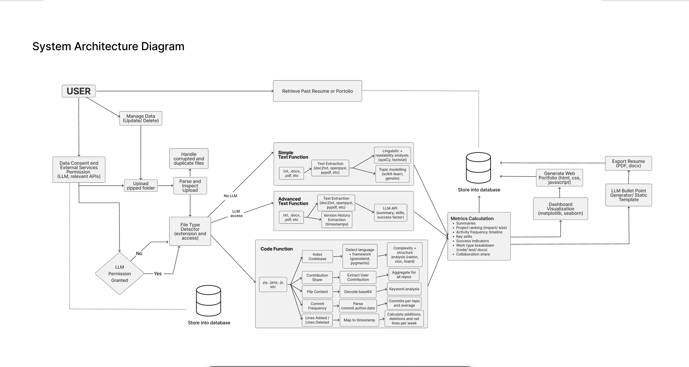

[](https://classroom.github.com/online_ide?assignment_repo_id=20544404&assignment_repo_type=AssignmentRepo)

# Capstone Project - Mining Digital Work Artifacts

## Local Development Setup

### 1. Clone the Repository

```bash
git clone <repo-url> capstone-project-team-19
cd capstone-project-team-19
```

### 2. Create and Activate a Virtual Environment

#### On Windows
```bash
python -m venv venv
.\venv\Scripts\Activate.ps1
```
**Note for Windows:** If `pytest` returns an error, instead of `.\venv\Scripts\Activate.ps1`, try `source venv/bin/activate`.

#### On Mac/Linux
```bash
python -m venv venv
source venv/bin/activate
```

**Note for Mac users:** If you have multiple Python versions installed or `python` is not found, you may need to use `python3` instead:
```bash
python3 -m venv venv
source venv/bin/activate
```

### 3. Install Dependencies
```bash
pip install --upgrade pip           # Upgrade pip to avoid weird dependency errors
pip install -r requirements.txt
```

### 4. Run Tests
```bash
pytest
```

If everything is set up correctly, you should see the tests pass.

## System Architecture Diagram



The System Architecture Diagram outlines the complete pipeline from user data consent through metrics generation and portfolio output. It starts when the user grants or denies consent for external services (LLM and relevant APIs) and uploads a zipped project folder. The system parses and inspects the uploaded archive, handling corrupted or duplicate files before classifying each by type and access level.

The File Type Detector directs text and code files into different processing paths depending on user permissions. When no external access is allowed, the Simple Text Function performs offline analysis using local tools for linguistic complexity, readability, and topic modeling, while the Code Function analyzes source files to detect programming languages, frameworks, and structure metrics like complexity and contribution frequency. When consent is granted, the Advanced Text Function extends this analysis with LLM summaries, skill extraction, and measure of success. 

Outputs from all three functions flow into the Metrics Calculation module, which standardizes extracted data into project-level metrics like summaries, activity timelines, project rankings, skill frequencies, work type ratios, and collaboration indicators. Finally, the Visualization and Export module takes in stored metrics to generate a resume and web portfolio using Matplotlib, Seaborn, and optionally an LLM. Results are stored in a shared database to enable retrieval, incremental updates, and reuse across sessions.

## Level 1 Data Flow Diagram


The Level 1 DFD captures the full loop from a user opting-in to analysis through the portfolio views they receive. A run begins when the user adjusts their configuration (data consent, LLM usage) and shares a zipped project folder. Those inputs are stored alongside account metadata so future runs can respect the same choices without re-prompting.

Uploaded files go through the categorization service, which tags each artifact (text, code, image, video, audio, CSV). The tagged batches feed into the media-specific processors where extractors pull metrics such as word counts, sentiment, frame features, commit history, or tabular summaries. Each processor returns a scoped metrics bundle to the metrics producer, which normalizes the data and stores the blended dataset.

Once metrics are available, the dashboard layer surfaces them in several destinations: the interactive historical view, resume builder, public web portfolio, and export pipeline (PDF/DOCX/CSV). These downstream tools all read from the shared metrics store, letting us plug in new visualizations without re-running analysis. The DFD makes it clear which components depend on local storage, which ones exchange user-facing data, and where new processors should integrate if we add artifact types later.