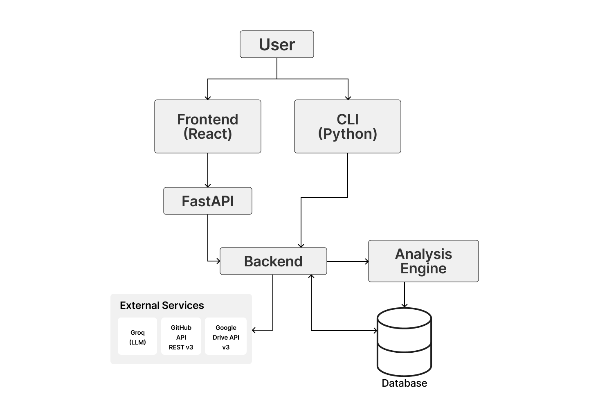
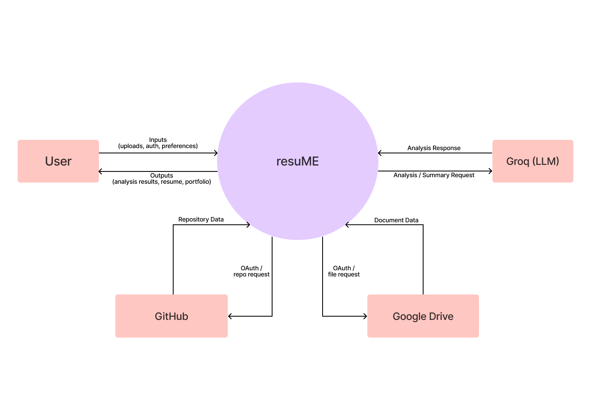
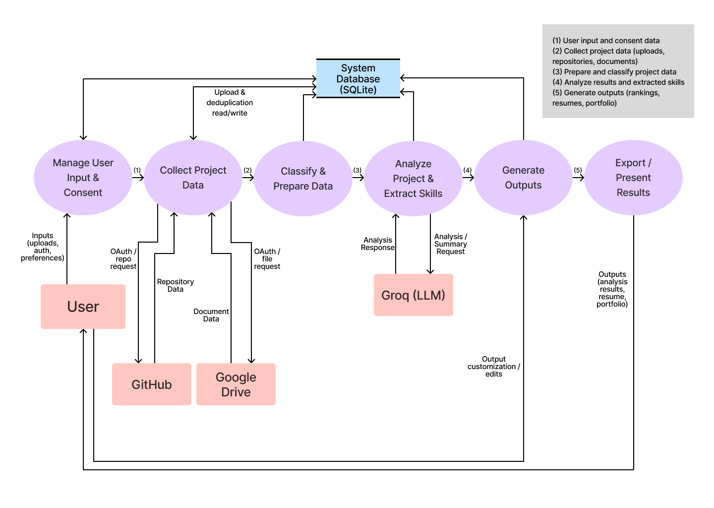

# System Architecture

This page describes **resuME** at Milestone 3: how users reach the system, how the backend is structured, how data flows at a high level, and how the analysis pipeline behaves end to end.

## M3 system architecture

The **web interface** (React, Vite) talks to the backend through **FastAPI** over HTTP, with **JWT** authentication for protected routes. The **CLI** (Python) does not go through that HTTP layer; it calls the same core services, database access, and analysis code **directly** in process.

The **backend** coordinates **SQLite** persistence, the **analysis** logic (metrics, skill extraction, optional LLM summarization), and integrations with **external services**: **Groq** for LLM-assisted analysis when the user consents and a key is configured; **GitHub** (OAuth and REST) for repository and contribution data when integrated; and **Google Drive** (OAuth and API) for collaborative document flows when integrated.

Earlier milestone diagrams (for reference) remain in the same folder: `plan/Milestone 2 System Architecture Diagram_1.png`, `plan/Milestone 2 System Architecture Diagram_2.png`.

---

## Data flow diagrams (M3)

### Level 0 — context diagram

The **Level 0** DFD shows **resuME** as a single process. The **User** supplies inputs (uploads, authentication, preferences) and receives outputs (analysis results, résumé, portfolio). The system exchanges data with **Groq** for optional LLM requests and responses, and with **GitHub** and **Google Drive** for OAuth and project or document data when those integrations are used.

### Level 1 — major processes

The **Level 1** DFD decomposes the system into six processes and a **System Database (SQLite)**. Numbered flows in the diagram (see legend) connect the pipeline: **Manage User Input & Consent** → **Collect Project Data** → **Classify & Prepare Data** → **Analyze Project & Extract Skills** → **Generate Outputs** → **Export / Present Results**.

- **Manage User Input & Consent** records consent and related preferences and reads/writes the database as needed.
- **Collect Project Data** ingests uploads and optional GitHub or Drive data. It **reads and writes** the database for **upload metadata, parsed files, versioning, and deduplication** (comparing new content against stored fingerprints and project versions).
- **Classify & Prepare Data** updates classifications and prepares data for analysis.
- **Analyze Project & Extract Skills** runs the analysis pipeline and, when allowed, exchanges **analysis/summary** requests and responses with **Groq**. Results are persisted.
- **Generate Outputs** reads stored summaries and metrics, applies **user customization** (edits, ranks, wording), and assembles rankings, résumé, and portfolio views.
- **Export / Present Results** delivers final outputs to the user (including exports such as DOCX/PDF where applicable).

The same logical pipeline is available through the **web UI**, the **REST API**, and the **CLI**; the DFD describes behavior, not a single transport.

---

## Clients: web frontend and CLI

**Web (React, Vite):** Users authenticate (register/login), then use browser workflows for uploads, consent, integrations (GitHub, Drive, LLM where applicable), portfolio and résumé views, exports, and settings—implemented as routes and screens that call **FastAPI** with JWT-backed requests.

**CLI (`python -m src.main`):** After entering a username, the user sees a **14-option** main menu (analyze, view summaries, résumé, portfolio, feedback, delete insights, ranked projects, chronological skills, activity heatmap, dates, thumbnails, all projects, profile, exit). Labels and order are defined in `src/menu/display.py`.

Both clients rely on the **same SQLite database and analysis services**; only the transport differs (HTTP vs in-process calls). Step-by-step user instructions belong in **installation** or **testing** docs, not in this architecture page.

---

## Analysis pipeline (new project)

When a user starts a **new analysis** (from the CLI or the web upload flow), the system runs the following pipeline. It matches the **Analyze new project** entry point on the CLI and the equivalent API-driven wizard on the web.

The **consent** step asks permission to analyze local files and to use external services where relevant. If consent is granted, the system parses the uploaded archive and sends content through the analysis layer; extracted material is removed after analysis completes.

The file-type detector and project structure classifier determine **code vs text** and **individual vs collaborative** paths.

Before analysis, the uploaded ZIP is **fingerprinted** to distinguish re-uploads from new versions. Re-uploads become new versions under the same project, not unrelated duplicates.

For every run, **non-LLM analysis** executes first. If LLM access is granted, summarization uses the configured provider; otherwise the user may supply a manual summary.

There are four analysis paths:

- **Individual code:** language, framework, complexity, git commits, author, and history. If `.git` is missing, the system may ask for GitHub integration; if not granted, git-based analysis is skipped.

- **Individual text:** linguistic and readability analysis, CSV analysis, and activity-type detection.

- **Collaborative code:** uses `.git` when present to filter the user’s files and analyze contribution metrics. GitHub integration may still be requested. If integrated, PRs, issues, and commits can be fetched and individual contribution analyzed; GitHub data also supports collaborative skills. If GitHub is not integrated and `.git` is missing, the user may supply a contribution summary used to match filenames, paths, and content. Code files go through language and framework detection and activity-type detection.

- **Collaborative text:** may ask for Google Drive access; the Google pipeline can extract contribution from comments, replies, and questions. If Drive is not used, the user may indicate which files and sections they worked on; those files follow the individual text pipeline for contribution.

All files (and contributed files for collaborative projects) pass through the **skill bucket** layer: criteria per skill are checked, scores and levels assigned, and missing criteria drive feedback. Unmet criteria produce improvement suggestions stored in `project_feedback`.

Analysis results are written to dedicated tables; overall project summaries are stored in `project_summaries`.

**Activity type** analysis: for code, pattern matching on filenames and PR title/body (if GitHub is integrated) yields proportions and file lists per activity type. For text, filename patterns and timestamps support activity evolution over time.

After analysis, projects are scored and ranked automatically.
