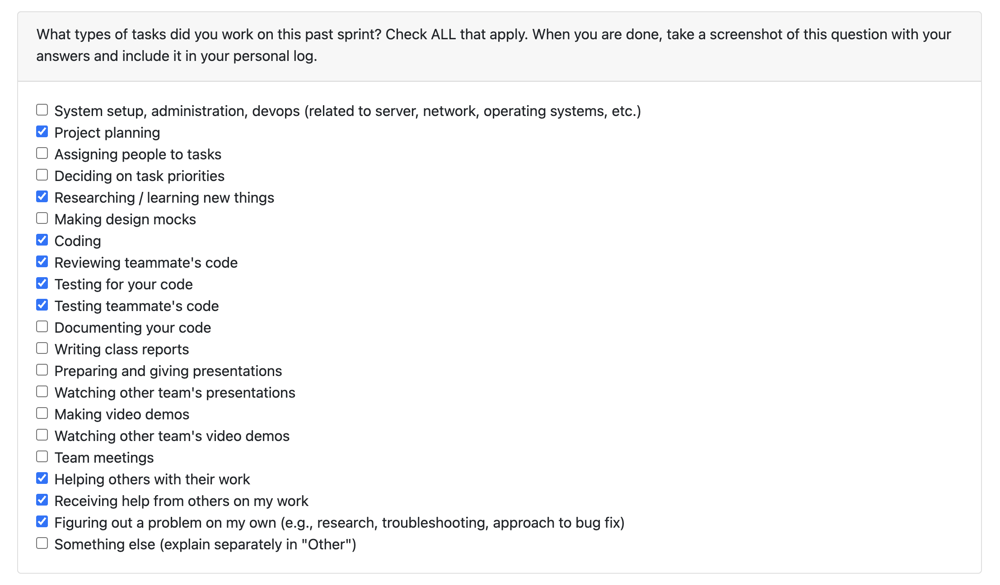
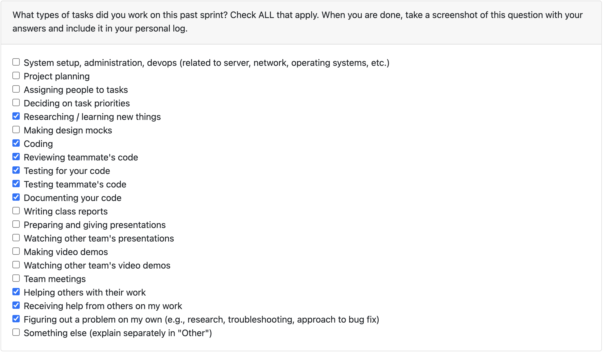
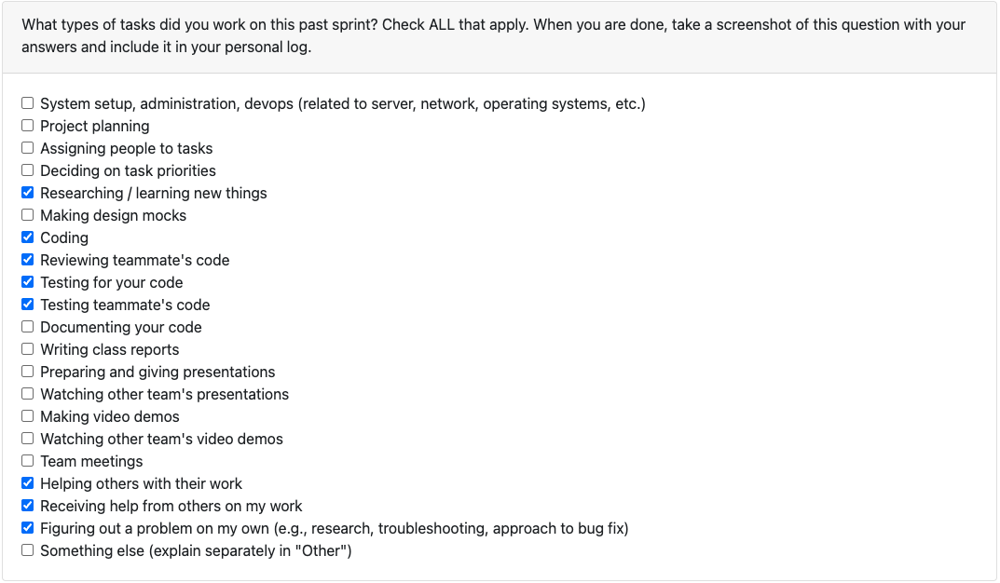
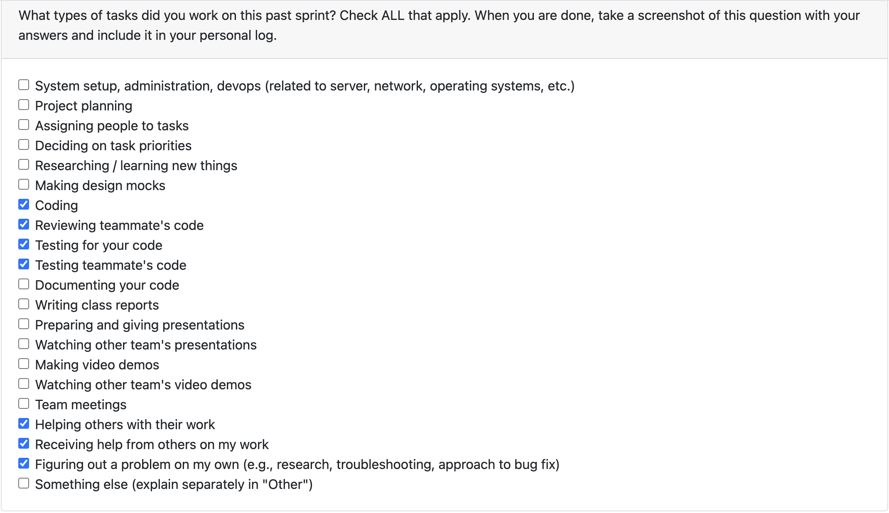
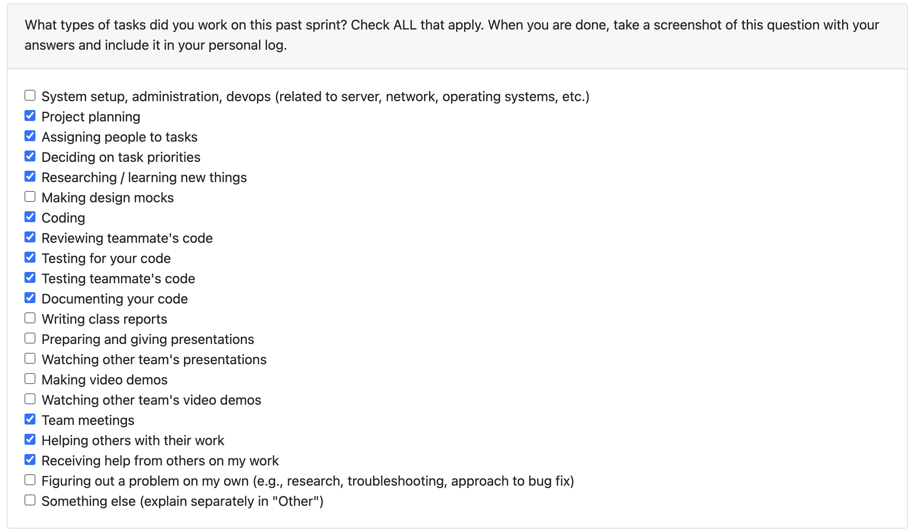

# Personal Log - Adara

## (Week 3) Monday 15th - Sunday 21st September

Week recap: Collaborated with the team to brainstorm project concept, usage scenarios, and potential features based on project specification in Monday's class, converted discussion bullet points into list of functional and non functional requirements and printed them for Wednesday's class. Compared list with other groups on Wednesday and modified the final requirements list, created team Kanban board on Github.

## (Week 4) Monday 22nd - Sunday 28th September

Week recap: Brainstormed the system architecture diagram with the team and shared it with other teams on Wednesday. Following that, I focused on expanding the CSV and GitHub functions of the diagram. For the CSV component, I broke down the function into smaller steps, identified the metrics we want to generate, and researched approaches for handling different scenarios (local vs. online files, availability of version history, and complexity of CSV content). 

For the GitHub component, I collaborated with Ammaar to research API endpoints and narrow down the most important repository metrics to include. I also explored different dashboard visualizations we’ll need for both CSV and GitHub data, aligning them with the metrics we identified. Along the way, I learned about Google Drive and OneDrive APIs to understand potential online file integrations.

I worked with Ivona to create the UML use case diagram, collaborated with Ammaar, Ivona, and Salma to draft the use case descriptions, and assisted Timmi and Salma in writing the Project Scope and Proposed Solution to ensure it captured all of our system’s key features. I also added several rows to the "Requirements, Testing, and Requirement Verification" section of the proposal.

## (Week 5) Monday 29th September - Sunday 5th October

Week recap: Worked with team on Monday to create DFD level 0 and 1 in class, then finalized some data labeling before printing the DFD for Wednesday's class. Looked through some articles online about how to draw DFDs and what are the differences between the levels to refresh knowledge. Went around swapping and evaluating other team's DFDs with the team on Wednesday and shared my opinion on the findings.

## (Week 6) Monday 6th - Sunday 12th October

Week recap: Discussed the final project requirements with team in class on wednesday. Then worked on modifying our System Architecture Diagram to better encapsulate all the project requirements; omitting some irrelevant modules, and adding new ones like offline processing modules for when external services are not accessible. Collaborated with Ammaar to make sure both the System Architecture Diagram and DFD Level 1 are aligned. Collaborated with Timmi in coding the requirement "Return error if uploaded file is in wrong format", expanding her work to include unsupported files (instead of just corrupted ones). Also logging failed uploads. Worked on the code/ script for dealing with duplicate files. Added unit tests for both of these features. Responded to feedback on PR by modifying code to consider all edge cases mentioned. Researched about MIME detectors and how to implement them. Reviewed PRs #36, #60, and #71.

## (Week 7) Monday 13th October - Sunday 19th October

Week recap: Coordinated with team mainly over Discord. Reviewed Johanes’ and Ivona’s feature PRs, providing detailed feedback including suggestions to fix an error in Johanes’ code. Researched how to integrate an LLM into our project for advanced text analysis, focusing on finding the ideal parameters such as temperature and max tokens, and identifying the best free model option (ended up choosing llama 3.1 8b instant using groq). Implemented the LLM-based text analysis module (llm_analyze.py) which generates structured outputs like summaries, inferred skills, and success factors. Integrated it into main.py with proper consent handling. Added progress bar visualization, also researched and drafted unit tests for the LLM module using mocked API responses to ensure test reliability.

## (Week 8) Monday 20th October - Sunday 26th October

Week recap: This week, I focused on expanding the LLM analysis pipeline to include code projects. I implemented the new code_llm_analyze.py module, which generates summaries based on README content, function headers, and comments passed through the same LLM as last week's. I also refactored helpers.py by moving extraction functions there and adding code specific extractions. I implemented a sanitizer to keep summaries first-person and consistent, removed the old 0/N tqdm prints, and fixed a bug where ZIPs with only files caused the program to stop. I also reviewed five PRs this week, doing additional research on POS tagging and Pygments to give feedback on improving topic modeling and language detection. Discussed with the team (through PR comments and Discord) about whether we should extract files from the database or local path, and if static dictionaries are still the best way to define supported file extensions.

For next week, I plan on further expanding the code llm analysis (individual) to include other metrics than just a summary. For reusability purposes I hope to coordinate with Salma on how to implement her collaborative code metric for this. I also would like to further the text file analysis to also evaluate files on a project level rather than single files as it is currently doing (e.g. analyzing outlines and drafts that makes up one project rather than analyzing each separately).

## (Week 9) Monday 27th October - Sunday 2nd November

Week recap: This week, I refactored both code_llm_analyze.py and text_llm_analyze.py to improve how project-level analyses are handled. For the text LLM module, I modified the logic so that it now performs analysis at the project folder level instead of analyzing each file individually. For the code LLM module, I reworked both code_llm_analyze.py and project_analysis.py. Initially, I reused Salma’s Git metrics function to display results at the individual code level. However, I later adopted Johanes’ implementation since it provides a more representative view of individual work patterns. Previously, LLM-based summaries were only generated for individual projects, and Git metrics were only available for collaborative ones. After the refactor, when users consent to LLM analysis, both individual and collaborative projects now produce three outputs: git metrics, project summary, and contribution summary.

Next week, I plan to clean up a few inconsistencies. For code_llm_analyze.py, I’ll handle cases where projects don’t have Git history and improve how it locates and reads README.md files for better context in summaries. For text_llm_analyze.py, I’ll fix the incorrect terminal output for project_name and refine how it prints analysis results to make them more consistent with the code LLM flow. Depending on the team's discussion on Monday I may also integrate csv file analysis or pull commit related code as extra input to generate the contribution summary.

## (Week 10) Monday 3rd - Sunday 9th November

Week recap: This week, I started with completing PR 179 on Wednesday morning that initially focused on adding a feature within text_llm_analyze.py that allowed for csv files to be taken in and considered as a supporting file (e.g. for scientific reports that had data collection in the form of a csv). This was done to address some reviews from last week's PR. 

These were the initial changes of the original PR:
- added an extractfromcsv module in helpers.py
- modified llm prompts in skills and success factors to include threshold for analyzing csv metadata

After getting a review from Ammaar on Thursday, I added four test cases testing (1) csv metadata extraction, (2) llm output for success factors includes csv insights, (3) auto selection of largest file in selecting the main file, (4) detection of supporting files.

I also started working on an unpushed PR that refactors project_name printing for text file analysis (because it was inconsistent last week) by changing the project_name initialization to getting the first folder above the filepath, instead of getting the second folder after zip_data. In this PR, I wanted to also refactor code_llm_analyze.py to deal with misprinting of git metrics when one of the projects do not have a git file (this PR is unpushed as I have not solved the misprinting issue yet but only the project_name identification).

After getting reviews from Timmi and Ivona on Saturday for PR 179, I reverted all the changes I did so there is no overlap between csv and the text llm analysis module. Instead, I created a new standalone csv_analyze.py that independently handles csv projects and supporting csvs using Pandas and Numpy, only using LLM for the dataset summary. I also updated project_analysis.py to correctly route csv files to the new module, refactored helpers.py to fetch file extensions from the database, and adjusted alt_analyze.py and text_llm_analyze.py to include database connections for consistency. This part took a while because there were a lot of dependent parts of the scripts that had not used the DB connection yet, I worked backwards on this following test-driven development. The new module now calculates and displays csv metadata (row and column counts, missing values, numeric summaries, and dataset growth trends).

By the end of the week, all tests for csv and text modules passed successfully, and the overall system exit issue from csv uploads was resolved.

NEXT WEEK: I plan to connect the output of csv_analyze.py for when the csv is a supporting file to the output of text_llm_analyze.py so that it is more resume ready (as of now it is just raw metrics). I also plan on working with Ivona to expand the CSV metadata extraction with Google Sheets through the Google Drive API, and finish up the refactoring PR of the git metrics misprint.

## (Week 12) Monday 17th - Sunday 23rd November

Week recap: 