# Personal Log - Adara

## Table of Contents

### Term 2
- [Week 11 & 12 (Mar 16 - 29)](#t2-week-11--12-monday-16th---sunday-29th-march)
- [Week 10 (Mar 9-15)](#t2-week-10-monday-9th---sunday-15th-march)
- [Week 9 (Mar 2-8)](#t2-week-9-monday-2nd---sunday-8th-march)
- [Week 6 & 8 (Feb 9 - Mar 1)](#t2-week-6--8-monday-9th-february---sunday-1st-march)
- [Week 4 & 5 (Jan 26 – Feb 8)](#t2-week-4--5-monday-26th-january---sunday-8th-february)
- [Week 3 (Jan 19-25)](#t2-week-3-monday-19th---sunday-25th-january)
- [Week 2 (Jan 12-18)](#t2-week-2-monday-12th---sunday-18th-january)
- [Week 1 (Jan 5-11)](#t2-week-1-monday-5th---sunday-11th-january)

### Term 1
- [Week 14 (Dec 1-7)](#week-14-monday-1st---sunday-7th-december)
- [Week 13 (Nov 24-30)](#week-13-monday-24th---sunday-30th-november)
- [Week 12 (Nov 17-23)](#week-12-monday-17th---sunday-23rd-november)
- [Week 10 (Nov 3-9)](#week-10-monday-3rd---sunday-9th-november)
- [Week 9 (Oct 27 - Nov 2)](#week-9-monday-27th---sunday-2nd-november)
- [Week 8 (Oct 20-26)](#week-8-monday-20th---sunday-26th-october)
- [Week 7 (Oct 13-19)](#week-7-monday-13th---sunday-19th-october)
- [Week 6 (Oct 6-12)](#week-6-monday-6th---sunday-12th-october)
- [Week 5 (Sept 29 - Oct 5)](#week-5-monday-29th-september---sunday-5th-october)
- [Week 4 (Sept 22-28)](#week-4-monday-22nd---sunday-28th-september)
- [Week 3 (Sept 15-21)](#week-3-monday-15th---sunday-21st-september)

## (Week 3) Monday 15th - Sunday 21st September

Week recap: Collaborated with the team to brainstorm project concept, usage scenarios, and potential features based on project specification in Monday's class, converted discussion bullet points into list of functional and non functional requirements and printed them for Wednesday's class. Compared list with other groups on Wednesday and modified the final requirements list, created team Kanban board on Github.

## (Week 4) Monday 22nd - Sunday 28th September

Week recap: Brainstormed the system architecture diagram with the team and shared it with other teams on Wednesday. Following that, I focused on expanding the CSV and GitHub functions of the diagram. For the CSV component, I broke down the function into smaller steps, identified the metrics we want to generate, and researched approaches for handling different scenarios (local vs. online files, availability of version history, and complexity of CSV content). 

For the GitHub component, I collaborated with Ammaar to research API endpoints and narrow down the most important repository metrics to include. I also explored different dashboard visualizations we’ll need for both CSV and GitHub data, aligning them with the metrics we identified. Along the way, I learned about Google Drive and OneDrive APIs to understand potential online file integrations.

I worked with Ivona to create the UML use case diagram, collaborated with Ammaar, Ivona, and Salma to draft the use case descriptions, and assisted Timmi and Salma in writing the Project Scope and Proposed Solution to ensure it captured all of our system’s key features. I also added several rows to the "Requirements, Testing, and Requirement Verification" section of the proposal.

## (Week 5) Monday 29th September - Sunday 5th October

Week recap: Worked with team on Monday to create DFD level 0 and 1 in class, then finalized some data labeling before printing the DFD for Wednesday's class. Looked through some articles online about how to draw DFDs and what are the differences between the levels to refresh knowledge. Went around swapping and evaluating other team's DFDs with the team on Wednesday and shared my opinion on the findings.

## (Week 6) Monday 6th - Sunday 12th October

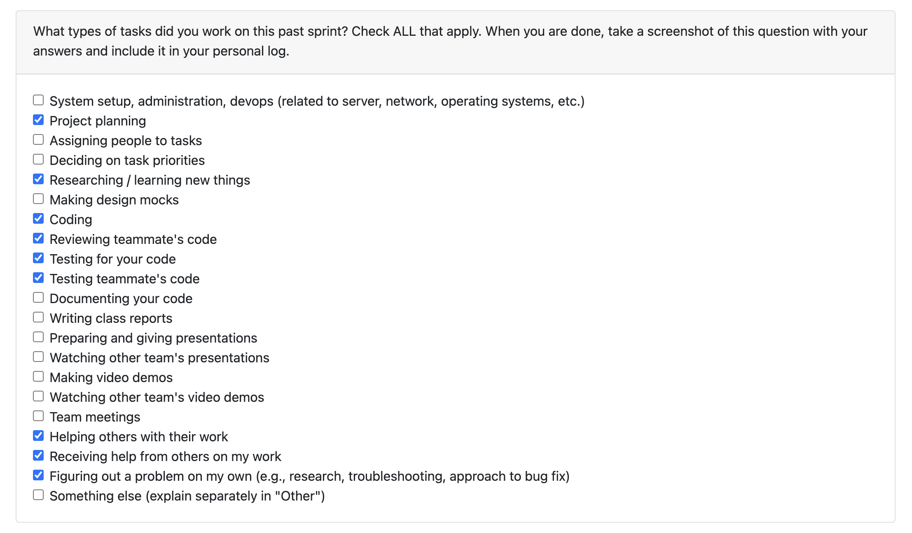

Week recap: Discussed the final project requirements with team in class on wednesday. Then worked on modifying our System Architecture Diagram to better encapsulate all the project requirements; omitting some irrelevant modules, and adding new ones like offline processing modules for when external services are not accessible. Collaborated with Ammaar to make sure both the System Architecture Diagram and DFD Level 1 are aligned. Collaborated with Timmi in coding the requirement "Return error if uploaded file is in wrong format", expanding her work to include unsupported files (instead of just corrupted ones). Also logging failed uploads. Worked on the code/ script for dealing with duplicate files. Added unit tests for both of these features. Responded to feedback on PR by modifying code to consider all edge cases mentioned. Researched about MIME detectors and how to implement them. Reviewed PRs #36, #60, and #71.

## (Week 7) Monday 13th October - Sunday 19th October

Week recap: Coordinated with team mainly over Discord. Reviewed Johanes’ and Ivona’s feature PRs, providing detailed feedback including suggestions to fix an error in Johanes’ code. Researched how to integrate an LLM into our project for advanced text analysis, focusing on finding the ideal parameters such as temperature and max tokens, and identifying the best free model option (ended up choosing llama 3.1 8b instant using groq). Implemented the LLM-based text analysis module (llm_analyze.py) which generates structured outputs like summaries, inferred skills, and success factors. Integrated it into main.py with proper consent handling. Added progress bar visualization, also researched and drafted unit tests for the LLM module using mocked API responses to ensure test reliability.

## (Week 8) Monday 20th October - Sunday 26th October

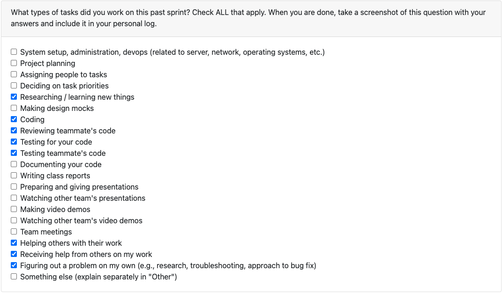

Week recap: This week, I focused on expanding the LLM analysis pipeline to include code projects. I implemented the new code_llm_analyze.py module, which generates summaries based on README content, function headers, and comments passed through the same LLM as last week's. I also refactored helpers.py by moving extraction functions there and adding code specific extractions. I implemented a sanitizer to keep summaries first-person and consistent, removed the old 0/N tqdm prints, and fixed a bug where ZIPs with only files caused the program to stop. I also reviewed five PRs this week, doing additional research on POS tagging and Pygments to give feedback on improving topic modeling and language detection. Discussed with the team (through PR comments and Discord) about whether we should extract files from the database or local path, and if static dictionaries are still the best way to define supported file extensions.

For next week, I plan on further expanding the code llm analysis (individual) to include other metrics than just a summary. For reusability purposes I hope to coordinate with Salma on how to implement her collaborative code metric for this. I also would like to further the text file analysis to also evaluate files on a project level rather than single files as it is currently doing (e.g. analyzing outlines and drafts that makes up one project rather than analyzing each separately).

## (Week 9) Monday 27th October - Sunday 2nd November

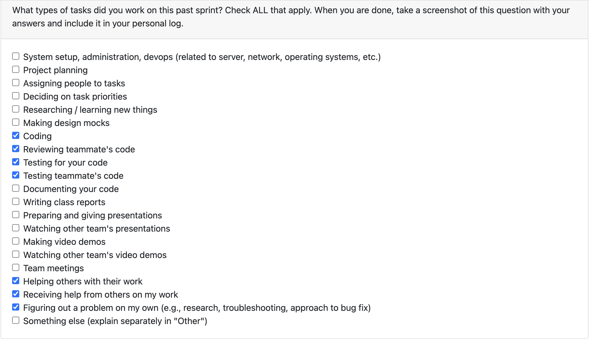

Week recap: This week, I refactored both code_llm_analyze.py and text_llm_analyze.py to improve how project-level analyses are handled. For the text LLM module, I modified the logic so that it now performs analysis at the project folder level instead of analyzing each file individually. For the code LLM module, I reworked both code_llm_analyze.py and project_analysis.py. Initially, I reused Salma’s Git metrics function to display results at the individual code level. However, I later adopted Johanes’ implementation since it provides a more representative view of individual work patterns. Previously, LLM-based summaries were only generated for individual projects, and Git metrics were only available for collaborative ones. After the refactor, when users consent to LLM analysis, both individual and collaborative projects now produce three outputs: git metrics, project summary, and contribution summary.

Next week, I plan to clean up a few inconsistencies. For code_llm_analyze.py, I’ll handle cases where projects don’t have Git history and improve how it locates and reads README.md files for better context in summaries. For text_llm_analyze.py, I’ll fix the incorrect terminal output for project_name and refine how it prints analysis results to make them more consistent with the code LLM flow. Depending on the team's discussion on Monday I may also integrate csv file analysis or pull commit related code as extra input to generate the contribution summary.

## (Week 10) Monday 3rd - Sunday 9th November

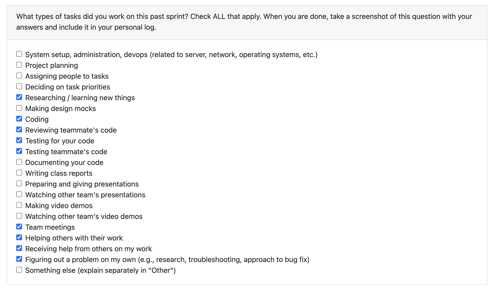

Week recap: This week, I started with completing PR 179 on Wednesday morning that initially focused on adding a feature within text_llm_analyze.py that allowed for csv files to be taken in and considered as a supporting file (e.g. for scientific reports that had data collection in the form of a csv). This was done to address some reviews from last week's PR. 

These were the initial changes of the original PR:
- added an extractfromcsv module in helpers.py
- modified llm prompts in skills and success factors to include threshold for analyzing csv metadata

After getting a review from Ammaar on Thursday, I added four test cases testing (1) csv metadata extraction, (2) llm output for success factors includes csv insights, (3) auto selection of largest file in selecting the main file, (4) detection of supporting files.

I also started working on an unpushed PR that refactors project_name printing for text file analysis (because it was inconsistent last week) by changing the project_name initialization to getting the first folder above the filepath, instead of getting the second folder after zip_data. In this PR, I wanted to also refactor code_llm_analyze.py to deal with misprinting of git metrics when one of the projects do not have a git file (this PR is unpushed as I have not solved the misprinting issue yet but only the project_name identification).

After getting reviews from Timmi and Ivona on Saturday for PR 179, I reverted all the changes I did so there is no overlap between csv and the text llm analysis module. Instead, I created a new standalone csv_analyze.py that independently handles csv projects and supporting csvs using Pandas and Numpy, only using LLM for the dataset summary. I also updated project_analysis.py to correctly route csv files to the new module, refactored helpers.py to fetch file extensions from the database, and adjusted alt_analyze.py and text_llm_analyze.py to include database connections for consistency. This part took a while because there were a lot of dependent parts of the scripts that had not used the DB connection yet, I worked backwards on this following test-driven development. The new module now calculates and displays csv metadata (row and column counts, missing values, numeric summaries, and dataset growth trends).

By the end of the week, all tests for csv and text modules passed successfully, and the overall system exit issue from csv uploads was resolved.

NEXT WEEK: I plan to connect the output of csv_analyze.py for when the csv is a supporting file to the output of text_llm_analyze.py so that it is more resume ready (as of now it is just raw metrics). I also plan on working with Ivona to expand the CSV metadata extraction with Google Sheets through the Google Drive API, and finish up the refactoring PR of the git metrics misprint.

## (Week 12) Monday 17th - Sunday 23rd November

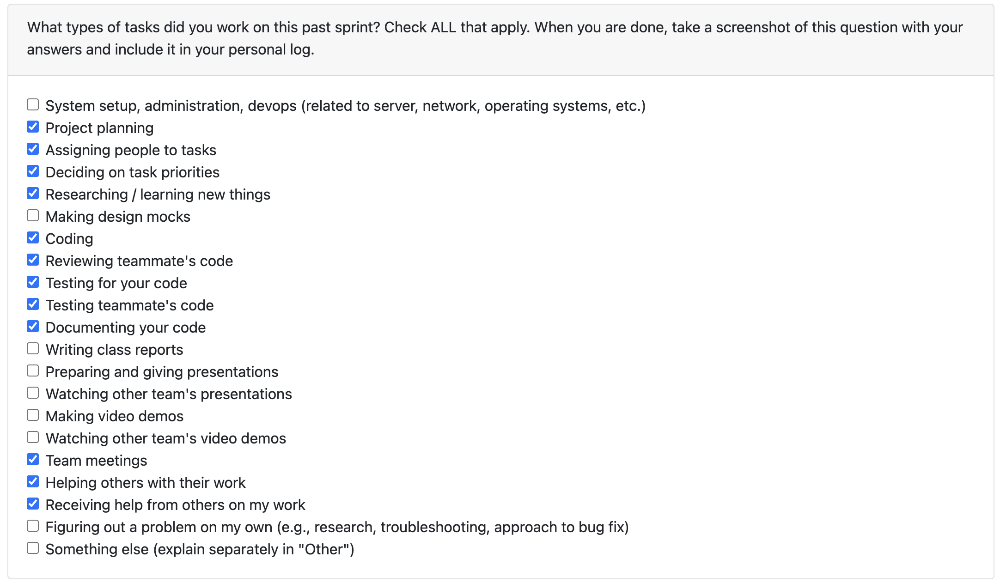

Week recap: This week, I worked on PR # 222 and PR # 227. I reviewed PRs 208, 209, 212, 224, 228, 237, 239, and 245, providing feedback on logical and runtime errors, an analysis of the possible cause, and suggestions of the solution if there was anything missing. 

For PR 222, this was basically a full architectural rewrite of the text-analysis pipeline. I initially only planned to extend the text skill detectors, but once I started working on them, it became clear that the existing pipeline was too entangled with LLM-dependent logic and duplicated code paths. I had to refactor the entire pipeline before the detectors could function reliably.

This refactor removed most of text_llm_analyze and reduced alt_analyze to only the linguistic-complexity functions. All substantive analysis is now centralized under the new text_analyze.py architecture, which defines a clean API for: (1) main-text extraction, (2) summary generation (LLM or manual), (3) CSV metadata integration, and (4) offline detector-based skill scoring. The major technical improvement is that summary generation and skill extraction are now fully decoupled—LLM consent now only determines which summary helper is used, not the execution path of the whole pipeline.

Visualization of the flow change:

    PREVIOUSLY:
        llm consent given     → text_llm_analyze
        llm consent not given → alt_analyze

    NOW:
        all text files        → text_analyze
                                 ├─ llm_summary (if consent accepted)
                                 └─ alt_summary (if consent rejected)

Once the centralized flow was in place, I implemented all ten text-skill detectors (clarity, structure, vocabulary, argumentation, depth, iterative process, planning, research, data collection, data analysis) using multi-criteria scoring with structured evidence.

To support the new architecture, I refactored legacy scripts: alt_analyze.py now only handles lexical diversity and readability; csv_analyze.py was updated to remove printing and expose analyze_all_csv(); and I removed large sections of text_llm_analyze that were no longer compatible with detector-based scoring. This cleanup removed a significant amount of dead logic and made the overall flow far more predictable.

I also rewrote the test suites (test_alt_analyze.py, test_csv_analyze.py, test_text_analyze.py) to match the new pipeline. In hindsight, this PR should have been split into two PRs (a pipeline refactor and a detector implementation).

For PR 227, I built the collaborative text-contribution flow. Previously, the system only handled individual text files and had no way of determining which parts of a group project a user actually worked on. I added an interactive contribution-selection pipeline that asks the user which sections of the main file they wrote, which supporting text files they contributed to, and which CSVs they worked with, then feeds only those selected portions into the skill detectors. I also added another llm prompt function to evaluate the impact of those contributions to the overall main file.

Next week: As I disabled calling store_text_offline_metrics() in PR 222, I will enable the call and update the function to pass the updated metrics and skills (it is currently breaking the code as the parameters are not updated based on the new flow yet, which is what I have to refactor).

## (Week 13) Monday 24th - Sunday 30th November

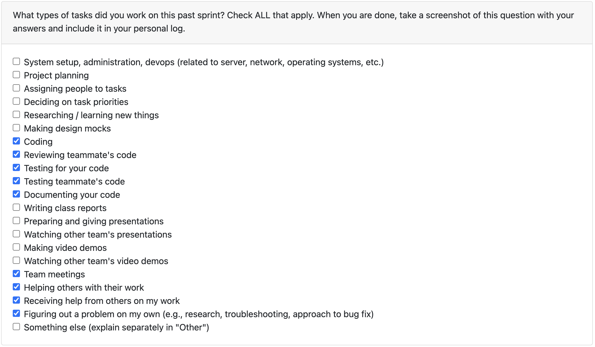

Week recap:

This week I refactored and fully restored our offline text-metrics storage pipeline (PR 272). I updated store_text_offline_metrics() and get_text_non_llm_metrics() to match the new text-analysis architecture, removed legacy LLM dependencies, and added support for storing csv_metadata alongside linguistic metrics. I also integrated the metrics flow directly into extract_text_skills(), ensuring that every text project—LLM or non-LLM—saves complete non-LLM metrics reliably. Finally, I fixed the test suite to support the new schema and updated fieldnames for the non_llm_text table.

I also completed the full “delete old insights” feature set (PR 284). I implemented project-level and resume-level deletion options, letting users safely remove outdated data without affecting shared resources. I added a hard-delete routine that cascades through all linked tables (files, classifications, summaries, metrics, GitHub/Drive ingestion) and introduced helpers for updating and refreshing resume snapshots. I added comprehensive tests for deleting a project, refreshing saved resumes, and validating the interactive menu behavior.

I then fixed the missing non-LLM summary collection for code projects (PR 285). Previously, only LLM-enabled analyses produced code summaries, meaning that projects without LLM consent had no stored summaries at all. I reworked the flow so that both individual and collaborative code projects now prompt users for a manual project summary, and all manual contribution summaries are saved under summary_json in the project_summaries table. This closes the gap in our summary coverage and ensures consistent downstream behavior.

Lastly, I redesigned the entire text-extraction pipeline to correctly detect real sections and paragraphs across all document formats (PR 287). The old logic collapsed or over-fragmented content depending on file type, causing PDFs, TXTs, and Markdown files to generate inaccurate section lists. I introduced a unified paragraph-normalization system that detects true headers, merges wrapped lines, respects blank-line boundaries, and properly groups Markdown content under its correct headings. This results in clean, meaningful section options for users in collaborative text analysis.

Along with these, I reviewed 5 PRs of my teammates.

Next week: I will focus on finalizing our milestone 1 presentation, and working with the team to prepare for the demo.

## (Week 14) Monday 1st - Sunday 7th December

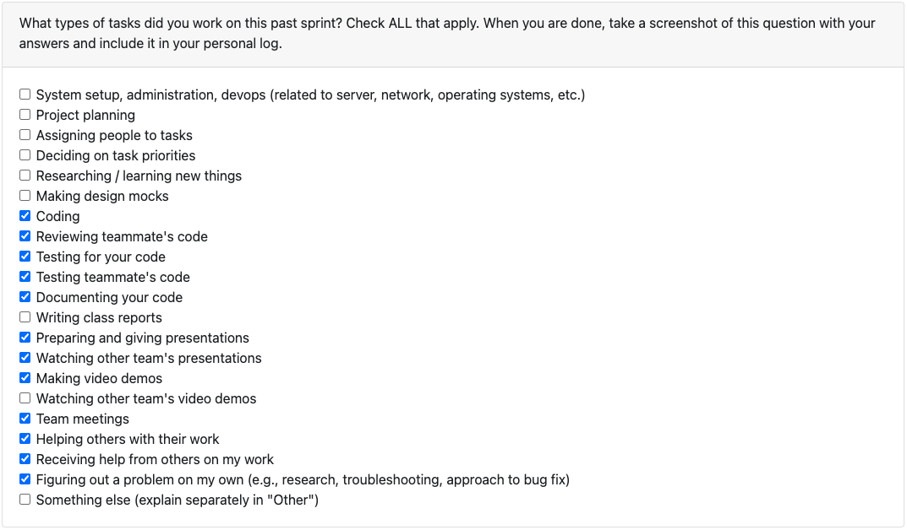

Week recap:

This week I prepared for the Milestone 1 presentation with my teammates, working on the text skill analysis slides. I then broke down the different flows we needed to record for the demo video (e.g. code vs text, llm vs. non llm, github, .git no .git, etc), and helped Ammaar by recording the text demo part. 

After that, I worked on a combined refactor and bug-fix related to the inaccuracy of LLM-generated summaries for collaborative code projects (PR 313). Previously, the system passed all function headers and comments from the entire codebase into the LLM, which produced summaries that were both noisy and not specific to the user’s actual contribution. I updated the analysis pipeline so that it now identifies the user’s top-contributed files (via .git data), loads their full contents, and passes only those to the LLM. This significantly improves the precision and relevance of contribution summaries. In the process, I also fixed an issue where the README extraction logic could not reliably locate project-root README files.

I then updated our data flow diagram (PR 315) to match the finalized system by adding the full menu layer, separating consent and analysis flows, showing all four project paths, and including new processes like skill bucket analysis, activity type detection, and LLM summarization. I also added GitHub and Google Drive integrations and updated the data stores so the DFD now accurately reflects how data moves through the system.

I reviewed Ammaar's PR and Ivona's PR, giving suggestions on how to fix some errors in the Google Drive integration.

Next week: No capstone work until January! 🎉 Looking forward to work with the team again for Milestone 2 😊

## (T2 Week 1) Monday 5th - Sunday 11th January

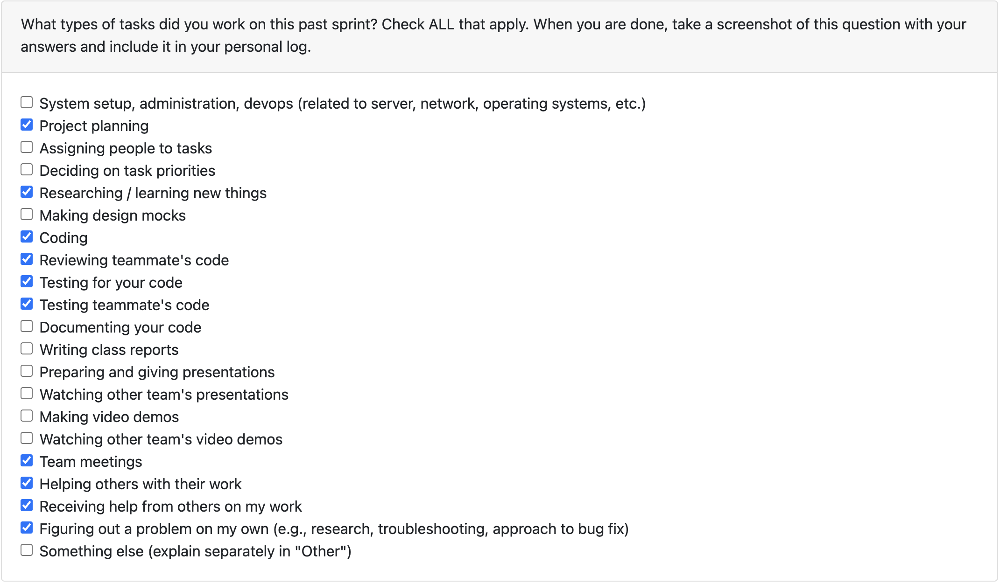

Week recap:

This week I worked on PR 339 to upgrade resume/snapshot rendering for both code and text projects by refactoring the “Contributions” section from generic activity-type labels into standardized, metric-backed bullets computed from existing analytics tables (previously, the "Contribution" bullet points generated in our resume was not something detailed enough to be included). For code projects, the renderer now pulls contribution signals from `code_collaborative_metrics` and/or `git_individual_metrics` (depending on whether Git metadata exists and project mode), derives percentages/LOC-based scope from those stored metrics, and maps them into deterministic resume templates (e.g., “contributed ~X% of the repository,” “authored ~Y LOC,” plus an impact-style line that references the highest-scoring detected bucket skills) with safe fallbacks when specific metrics are missing. For text projects, I fixed a collaboration percentage bug where contribution could exceed 100% by aligning the numerator/denominator to the same word-count scope (main + selected supporting files), and then applied the same contribution-bullet standardization using stored activity distributions from `text_activity_contribution` (turning activity counts into ratios to describe where time was spent, e.g., drafting vs data vs finalization). On top of that, I added a new “View project feedback” CLI option backed by a new `project_feedback` table + DB helpers (`src/db/project_feedback.py`), where unmet bucket criteria are persisted during detector execution (via updates to `text_detectors.py`) and later rendered as criteria-level improvement suggestions (text-only for now, code feedback planned next week). I also cleaned up redundant resume rendering paths and updated menu tests (`test_menu_display.py`) to reflect the new menu option and numbering changes.

These features and refactors closes issue 323. 

In PR reviews, I reviewed Timmi’s PR. I flagged an edge case where strict fingerprinting still appears path-sensitive when all filenames/paths are renamed despite identical content hashes, and suggested an optional content-only/path-insensitive exact-duplicate fingerprint if we want to support that scenario. I also reviewed and approved Salma’s DOCX export feature for Portfolio/Resume after confirming correct output.

Next week: I’ll extend feedback generation to code-based projects and add more targeted test coverage around the feedback + rendering changes.

## (T2 Week 2) Monday 12th - Sunday 18th January

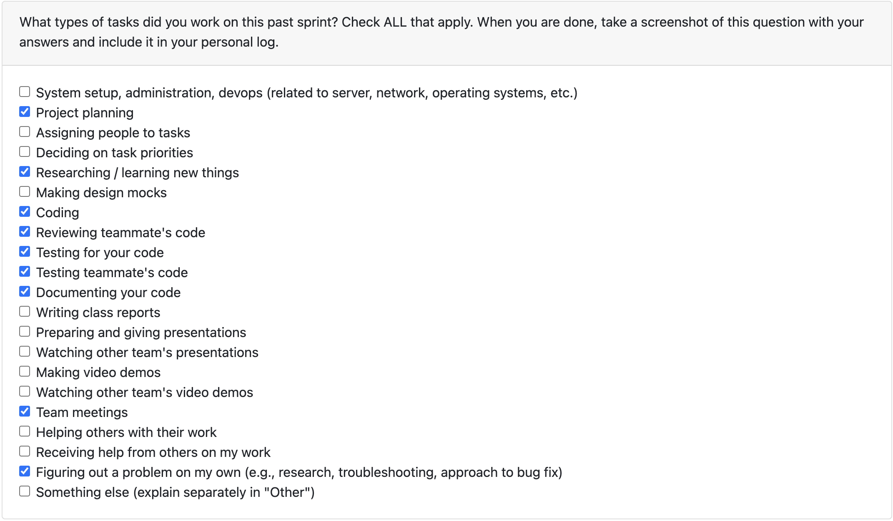

Week recap:

This week I worked on [PR 376](https://github.com/COSC-499-W2025/capstone-project-team-19/pull/376). After reviewing how `main.py` and `project_analysis.py` currently orchestrate the end-to-end analysis, I mapped out the different points where the CLI pauses for user input and realized `POST /projects/upload` can’t be implemented as one single endpoint. I brainstormed a wizard-style upload session design, documented 12 distinct workflows (text/code, individual/collab, LLM/non-LLM, Google/GitHub integrations, etc.), and broke the flow into a set of supporting endpoints that progressively collect inputs using an `upload_id` while persisting state in `uploads.state_json`. The brainstorm document can be accessed [here](https://docs.google.com/document/d/1kRJgC2j8xNbDi3-oLfreiviYlPMAYofwUteH6d4g7gQ/edit?usp=sharing)

**Coding tasks:** 
- I added an `uploads` table to the database schema and implemented DB helper functions in `src/db/uploads.py` to create, fetch, list, and update upload sessions (including state_json patching). I implemented the first four API endpoints needed for the upload wizard under `/projects/upload`: starting an upload (saving the ZIP + initializing the upload session), fetching upload status by `upload_id`, submitting project classifications (with validation against parsed layout), and submitting project types for mixed projects. I also updated `uploads_service.py` to run the parsing + layout detection automatically during upload (matching CLI behavior) and added an API-safe project type detection helper (`detect_project_type_auto`) so the API doesn’t hang on CLI `input()` prompts.

**Testing / debugging tasks:** 
- I tested all endpoints in Postman and debugged several issues, including an initial 422 error caused by missing multipart form data (“file” field), a 404 due to not having the GET status route wired, and a 500 error caused by status/state mismatch during the wizard progression. I fixed these by ensuring the correct request setup in Postman, adding the missing GET status route, and updating the wizard logic so uploads can automatically advance when there are no pending classification inputs (i.e., when `auto_assignments` fully covers the projects). I also added validation so users can’t submit classifications for unknown project names.

**Reviewing / collaboration tasks:** 
- I shared the wizard approach with the team and reviewed [PR 363](https://github.com/COSC-499-W2025/capstone-project-team-19/pull/363)

**Issues / blockers:** 
- The biggest blocker was translating CLI `input()` steps into an API-safe flow without breaking the existing analysis logic. I addressed this by separating “auto-detect” logic from “manual input” logic: whenever something can be inferred (folder placement, pure code/text projects), the API advances automatically; when ambiguity exists (mixed project types), the wizard pauses and requires a dedicated endpoint. Another issue was wizard state getting stuck at `needs_classification` even when there were no pending projects, which I fixed by auto-finalizing classifications when `pending_projects` is empty.

**Plan for next week:** Next week I’ll start implementing the next set of wizard endpoints (5–10) that handle the remaining user inputs required before analysis can run, and possibly continue some of the tasks I planned to do as mentioned in the previous T2W1 log.

## (T2 Week 3) Monday 19th - Sunday 25th January

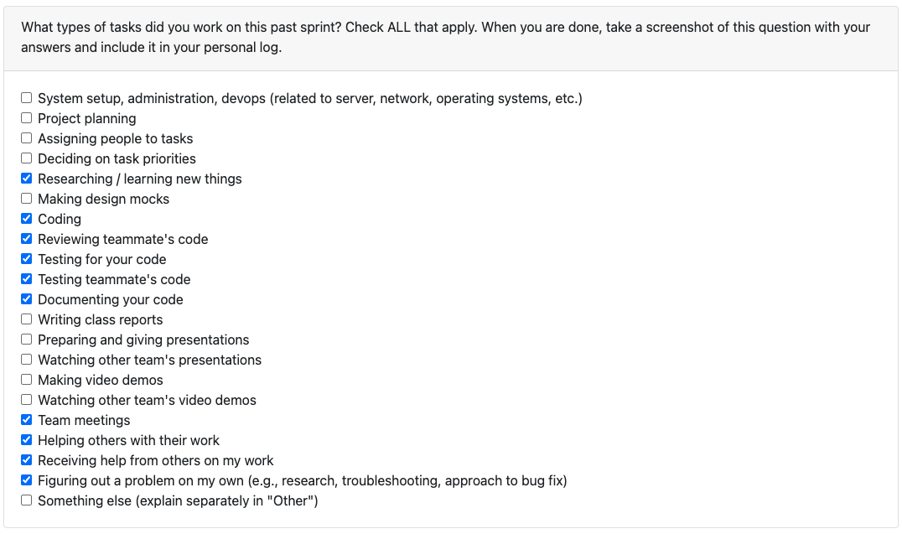

Week recap

This week I worked on [PR 389](https://github.com/COSC-499-W2025/capstone-project-team-19/pull/389). I extended the upload-session API to support the remaining pre-analysis inputs and deduplication resolution, including endpoints to list extracted project files for a given upload (`GET /projects/upload/{upload_id}/projects/{project_name}/files`, returning `all_files`, `text_files`, and `csv_files` with file metadata) and persist a user-selected main file (`POST /projects/upload/{upload_id}/projects/{project_name}/main-file`, validating safe relpaths and storing `state.file_roles[project_name].main_file` in `uploads.state_json`). I also worked on [PR 391](https://github.com/COSC-499-W2025/capstone-project-team-19/pull/391) where I integrated the dedup workflow by supporting `needs_dedup` and a resolve endpoint (`POST /projects/upload/{upload_id}/dedup/resolve`) that records per-project decisions (`skip|new_project|new_version`) and advances the upload state deterministically so the pipeline can continue.

**Testing / debugging tasks:** I added/updated API tests to match the new upload state machine and dedup integration: `tests/api/test_uploads_file_roles.py` covers state gating for file listing, the happy path list→choose main file→state persistence, and unsafe relpath rejection; `tests/api/test_uploads_dedup.py` covers exact-duplicate/loose-match behavior, `needs_dedup` triggering, and the resolve endpoint clearing dedup asks and recording decisions; and `tests/api/test_uploads_wizard.py` covers upload start/status plus validation rules for classification and mixed-project type submission. I debugged failures caused by state/schema drift (e.g., missing initialization for dedup tracking variables like `skipped_set`, and tests asserting outdated “duplicate upload must fail” behavior after the flow advanced to later states like `needs_file_roles`) and aligned both implementation and assertions with the current behavior.

**Reviewing / collaboration tasks:** I reviewed 4 PRs ([396](https://github.com/COSC-499-W2025/capstone-project-team-19/pull/396), [398](https://github.com/COSC-499-W2025/capstone-project-team-19/pull/398), [401](https://github.com/COSC-499-W2025/capstone-project-team-19/pull/398), [403](https://github.com/COSC-499-W2025/capstone-project-team-19/pull/403)) in total, and also flagged that small project uploads can produce edge cases for similarity-based dedup decisions (e.g., Jaccard threshold sensitivity), and suggested a follow-up discussion on whether threshold values should be tuned to better catch real user scenarios.

**Issues / blockers:** The main blocker was keeping the evolving upload state machine consistent across services, schemas, and tests while introducing dedup resolution and new file-role endpoints; several failures came from subtle mismatches between what the service now returns (e.g., progressing to `needs_file_roles` after dedup/auto steps) and what older tests expected (e.g., failing immediately on duplicates). I resolved this by initializing all dedup bookkeeping in `start_upload`, tightening state validation and error paths, and updating assertions to check state keys/decisions rather than assuming a single terminal status for duplicates.

**Plan for next week:** Next week I’ll continue extending the upload API to cover the remaining pre-analysis inputs needed to run the full pipeline (e.g., any summaries/analysis triggers).

## (T2 Week 4 & 5) Monday 26th January - Sunday 8th February

Week recap

The past two weeks I worked on four PRs: [464](https://github.com/COSC-499-W2025/capstone-project-team-19/pull/464), [446](https://github.com/COSC-499-W2025/capstone-project-team-19/pull/446), [431](https://github.com/COSC-499-W2025/capstone-project-team-19/pull/431), and [430](https://github.com/COSC-499-W2025/capstone-project-team-19/pull/430). In [464](https://github.com/COSC-499-W2025/capstone-project-team-19/pull/464), I added supporting-file contribution selection for collaborative text projects via two new POST endpoints (supporting text + supporting CSV), with relpath validation, filtering (e.g., excluding the main file and enforcing `.csv`), and persisting deduped/sorted selections into `uploads.state.contributions`. In [446](https://github.com/COSC-499-W2025/capstone-project-team-19/pull/446), I implemented main-file section contribution selection with GET/POST endpoints, refactored the section extraction logic into a reusable helper, and fixed missing dedup + auto project-type wiring that had fallen out of the main branch. In [431](https://github.com/COSC-499-W2025/capstone-project-team-19/pull/431), I fixed the “delete project” bug introduced by the dedup/versioning flow by extending the delete pipeline to also hard-delete the project’s dedup registry rows (`projects`, `project_versions`, `version_files`) so re-uploads don’t keep triggering strict/loose/Jaccard matches, and I removed dead delete code (`src/menu/delete.py`). In [430](https://github.com/COSC-499-W2025/capstone-project-team-19/pull/430), I made code project feedback behave like text feedback by emitting and persisting feedback rows during code skill extraction whenever detector/bucket criteria aren’t met, so “View project feedback” reflects results immediately after analysis.

**Testing / debugging tasks:** For [464](https://github.com/COSC-499-W2025/capstone-project-team-19/pull/464), I wrote an end-to-end test script that builds a minimal upload ZIP (main report + a few text + a few CSV), advances to `needs_file_roles`, sets the main file, hits both supporting-file endpoints, asserts relpaths are deduped/sorted and persisted back into upload state in the DB, and covers error cases like unsafe relpaths, relpaths not in the project, trying to include the main file as supporting text, non-csv passed to the csv endpoint, and calling endpoints before `needs_file_roles` / `needs_summaries`. For [446](https://github.com/COSC-499-W2025/capstone-project-team-19/pull/446), I added a script that creates a temporary upload + extracted main file, verifies the section list returned by `list_main_file_sections()` matches what `extract_document_sections()` produces, and asserts `set_main_file_contributed_sections()` correctly validates, dedupes/sorts, and persists selected section IDs into `uploads.state.contributions[project_name].main_section_ids`. For [431](https://github.com/COSC-499-W2025/capstone-project-team-19/pull/431), I updated tests to explicitly assert the dedup registry tables are cleared after deletion so a “deleted” project truly behaves like it’s gone. For [430](https://github.com/COSC-499-W2025/capstone-project-team-19/pull/430), I added test coverage for (1) the no-code-file case producing the single expected feedback row and persisting it to `project_feedback`, (2) unmet detector criteria (caching/serialization/hashmaps) emitting the correct missing-criteria feedback rows (right keys/labels) and persisting them, and (3) the 100% case producing no bucket feedback rows (so `project_feedback` stays empty).

**Reviewing / collaboration tasks:** I reviewed 8 PRs total: [463](https://github.com/COSC-499-W2025/capstone-project-team-19/pull/463), [461](https://github.com/COSC-499-W2025/capstone-project-team-19/pull/461), [455](https://github.com/COSC-499-W2025/capstone-project-team-19/pull/455), [436](https://github.com/COSC-499-W2025/capstone-project-team-19/pull/436), [434](https://github.com/COSC-499-W2025/capstone-project-team-19/pull/434), [428](https://github.com/COSC-499-W2025/capstone-project-team-19/pull/428), [424](https://github.com/COSC-499-W2025/capstone-project-team-19/pull/424), and [420](https://github.com/COSC-499-W2025/capstone-project-team-19/pull/420): for a few of them ([463](https://github.com/COSC-499-W2025/capstone-project-team-19/pull/463), [424](https://github.com/COSC-499-W2025/capstone-project-team-19/pull/424), [434](https://github.com/COSC-499-W2025/capstone-project-team-19/pull/434)) I mainly did end-to-end testing and confirmed the flow was solid, and for the others I focused on catching issues like flagging that skills highlight preferences were updating in the CLI but not reflected in portfolio PDF/DOCX exports because the export path was bypassing the highlighted-skills filtering logic ([461](https://github.com/COSC-499-W2025/capstone-project-team-19/pull/461)), pointing out that our current UNIQUE constraint still allows duplicate GitHub identities due to NULL behavior and suggesting partial unique indexes + a clearer `project_key` param name to avoid future version/versioning confusion ([455](https://github.com/COSC-499-W2025/capstone-project-team-19/pull/455)), calling out redundant DB fetches inside a loop to cut unnecessary queries ([436](https://github.com/COSC-499-W2025/capstone-project-team-19/pull/436)), recommending wrapping multi-step rank updates in a transaction so we don’t end up with half-shifted ranks if something errors mid-way ([428](https://github.com/COSC-499-W2025/capstone-project-team-19/pull/428)), and suggesting small refactors + test hardening (using real entrypoints instead of hardcoded asserts) to keep the codebase maintainable and make the tests actually protect against regressions ([420](https://github.com/COSC-499-W2025/capstone-project-team-19/pull/420)).

**Plan for next week:** Next week I’ll continue extending the upload API to cover the summary CLI endpoints and also the final run analysis endpoint.

## (T2 Week 6 & 8) Monday 9th February - Sunday 1st March

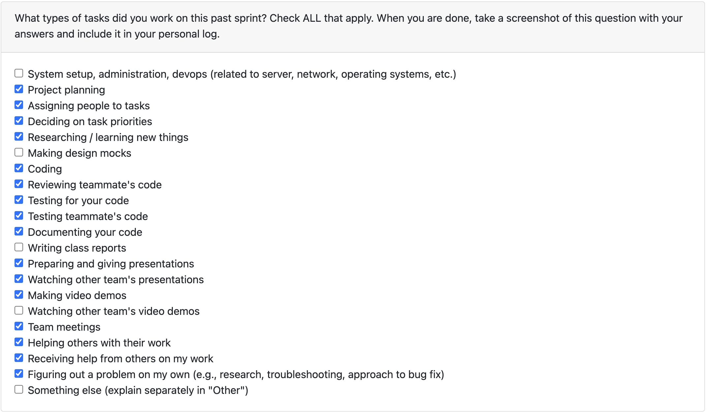

Week recap

The past sprints, I worked on 3 PRs, prepared for the class presentation, divided tasks for the video demo, and made the video demo. The first PR is [486](https://github.com/COSC-499-W2025/capstone-project-team-19/pull/486), which adds the manual summary step to the uploads wizard (to match the CLI flow). I added two POST endpoints: **POST** `/projects/upload/{upload_id}/projects/{project_key}/manual-project-summary` (stores `summary_text` under `uploads.state.manual_project_summaries[project_key]`) and **POST** `/projects/upload/{upload_id}/projects/{project_key}/manual-contribution-summary` (stores `manual_contribution_summary` under `uploads.state.contributions[project_key].manual_contribution_summary`). I also updated the wizard flow so that after the final file-role picking step (supporting file selection), the upload transitions from `needs_file_roles` → `needs_summaries` with the CSV-optional logic handled correctly, and refactored upload project routes to consistently use `project_key` (with per-upload key→name resolution). I also refactored the source of summary as our existing system had redundant CLI requests for the users.

The second one is [497](https://github.com/COSC-499-W2025/capstone-project-team-19/pull/497), where I added a CLI-only Activity Heatmap that generates a PNG showing activity type vs project version (v1…vN) for both code and text projects. The output is a matrix of activity types (rows) vs versions (columns), rendered as a GitHub-style tile heatmap and cached under `data/artifacts/heatmaps/` so reruns are fast and deterministic. I also added a prompt to choose between **diff** vs **snapshot** heatmap modes.

The key difference between the two heatmap modes is what each version column represents:
- **snapshot**: counts all eligible files that exist at that version (so it shows what the project “looks like” by v1/v2/v3)
- **diff**: counts only files that changed in that version (added + modified vs the previous version; v1 uses all files), so it shows what kind of work happened in each iteration

In the third one, [498](https://github.com/COSC-499-W2025/capstone-project-team-19/pull/498), I added API support for the Activity Heatmap so clients can fetch either a small JSON info payload or the PNG directly. I kept both endpoints since it’s not fully clear yet which one the frontend we would prefer (we might want to change the visualization configurations, hence why we have one endpoint that returns the heatmap json):
- **GET** `/projects/{project_name}/activity-heatmap` → returns an `ActivityHeatmapInfoDTO` including a `png_url`
- **GET** `/projects/{project_name}/activity-heatmap.png` → returns the PNG directly (`image/png`) using the cached artifact path when available

I also started working on PR [500](https://github.com/COSC-499-W2025/capstone-project-team-19/pull/500) (not ready for review yet) where I scaffolded the frontend using React + Vite, added the basic project structure and env-based API config, and wired it to our existing FastAPI backend with a small API client wrapper (including JWT Authorization header support). This was not part of the Milestone 2 requirements so we prioritized on getting other relevant PRs reviewed and merged.

**Testing:** I added a API test that creates a small upload ZIP, advances to `needs_summaries`, hits both summary endpoints, and asserts the summary fields are persisted back into upload state in the DB. For the heatmap work, I added pytest coverage for the CLI heatmap generator (code + text positive cases + a no-versions negative case), and an endpoint test for the API heatmap PNG route that asserts `200 OK` + `Content-Type: image/png` + valid PNG header bytes, plus a negative test that asserts `404` when the project is not found.

**Reviewing / collaboration tasks:** I reviewed 9 PRs in total, ensuring the changes work as expected and requesting changes along with suggested solutions when necessary.

**Plan for next week:** I will complete the frontend setup PR, and continue to implement the rest of the frontend features with the team.

## (T2 Week 9) Monday 2nd - Sunday 8th March

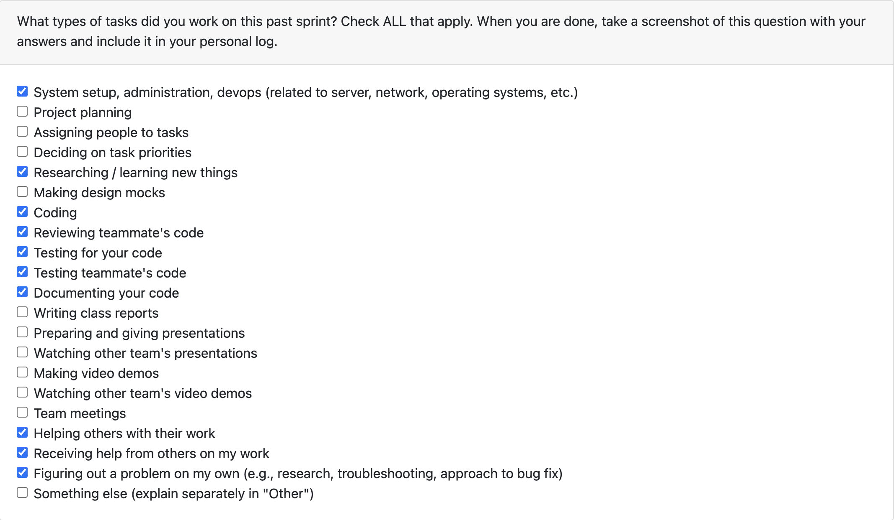

Week recap

This sprint I focused on getting our frontend foundation in place and unblocking Milestone 3 UI work, along with a few key code reviews on teammate PRs. I opened three frontend PRs: [#500](https://github.com/COSC-499-W2025/capstone-project-team-19/pull/500), [#522](https://github.com/COSC-499-W2025/capstone-project-team-19/pull/522), and [#533](https://github.com/COSC-499-W2025/capstone-project-team-19/pull/533). In [#500](https://github.com/COSC-499-W2025/capstone-project-team-19/pull/500), I scaffolded the React + Vite frontend under `/frontend`, added `.env.local` support for `VITE_API_BASE_URL`, and verified end-to-end connectivity by calling `GET /health` and rendering the response in the UI. In [#522](https://github.com/COSC-499-W2025/capstone-project-team-19/pull/522), I implemented the initial auth + home flow with Login/Register pages wired to `POST /auth/register` and `POST /auth/login`, stored the JWT in localStorage, and added a protected homepage + skeleton pages for Upload/Projects/Insights/Outputs to give the team a consistent routing and folder structure to build on. In [#533](https://github.com/COSC-499-W2025/capstone-project-team-19/pull/533), I added initial frontend component tests for the auth + home flow using Vitest/React Testing Library, covering login success/failure, register validation (password mismatch), register success redirect, homepage username rendering from JWT, “Start analyzing” navigation, and clickable `resuME` logo navigation.

**Testing / debugging tasks:** While building the frontend, I handled local dev integration issues (CORS setup for `http://localhost:5173`, Node/Vite setup quirks, and CSS overrides for the default Vite template). I also added/maintained frontend tests in [#533](https://github.com/COSC-499-W2025/capstone-project-team-19/pull/533) to validate routing and token behavior (mocking auth API calls and simulating JWTs for authenticated routing).

**Reviewing / collaboration tasks:** I reviewed and tested several teammate PRs. For backend work, I reviewed [#404](https://github.com/COSC-499-W2025/capstone-project-team-19/pull/404) (GET `/portfolio/{id}`) by testing both portfolio-present and portfolio-missing cases and confirming outputs and tests were correct. For frontend work, I reviewed [#531](https://github.com/COSC-499-W2025/capstone-project-team-19/pull/531) (frontend test stack) and flagged a missing `npm install` step in the README that caused `vitest: command not found`, plus suggested a higher-signal follow-up test for API client behavior (mocking `fetch` + auth header). I reviewed [#535](https://github.com/COSC-499-W2025/capstone-project-team-19/pull/535) (Projects page + Project Detail) and tested thumbnails/date editing, then left codebase cleanup suggestions like moving thumbnail blob fetch into the shared API client, removing unused CSS, simplifying feedback display, and formatting skill names. I reviewed [#540](https://github.com/COSC-499-W2025/capstone-project-team-19/pull/540) (upload wizard consent UI + tests) and confirmed the flow worked, then requested restoring missing API client methods (`putJson`, `patchJson`, `post`) to avoid regressions. Lastly, I reviewed [#545](https://github.com/COSC-499-W2025/capstone-project-team-19/pull/545) (Outputs page resume flow) and validated resume create/view/delete/export end-to-end, leaving non-blocking UX/API notes (custom delete modal + fixing/removing unused `getPortfolio()`).

**Plan for next week:** Continue building out the frontend page features (different modes, edit features, etc) and assisting any missing backend support.

## (T2 Week 10) Monday 9th - Sunday 15th March

## Week recap

This sprint I focused on extending our resume output workflow by moving user-specific resume content into a standalone profile flow, building out structured resume sections on top of it, and laying the foundation for our frontend redesign. I opened three PRs: [#573](https://github.com/COSC-499-W2025/capstone-project-team-19/pull/573), [#574](https://github.com/COSC-499-W2025/capstone-project-team-19/pull/574), and [#587](https://github.com/COSC-499-W2025/capstone-project-team-19/pull/587), while also spending a significant amount of time redesigning our UI in Figma.

In [#573](https://github.com/COSC-499-W2025/capstone-project-team-19/pull/573), I added a standalone user profile feature that lets users save and edit resume-level personal information outside of the resume menu, which keeps the backend structure aligned with the planned frontend where profile editing and resume editing will live on separate pages. This included storing and updating full name, email, phone, LinkedIn URL, GitHub URL, location, and a profile paragraph, and updating DOCX/PDF resume export so it reads from real profile data instead of hardcoded placeholders. I also made sure empty fields are omitted from the exported resume, hid the entire Profile section if no paragraph is saved, and rendered LinkedIn/GitHub as clickable labels instead of printing raw URLs.

In [#574](https://github.com/COSC-499-W2025/capstone-project-team-19/pull/574), I extended that standalone profile work by letting users add and delete structured education, certificate, and experience entries, then updated resume export to render them as separate sections using real saved content instead of the old placeholder behavior. I kept this logic outside of the resume menu as well so the backend remains consistent with the frontend direction we discussed.

A major part of my work this sprint also went into redesigning our frontend UI. I created around 20 pages of redesigned Figma screens covering the main flows of the app, which can be found here: [Redesigned UI Figma](https://www.figma.com/design/UbTpqtrgdtmvlvYvuAzGgd/Diagram-and-UI-Designs?node-id=793-1467&t=l6a3uDuri7AUauoG-1). As a team, we agreed to take inspiration from our client’s existing job board webpage when redesigning the UI so the product identity stays consistent and so future integration would be smoother if they decide to adopt the system more closely. A lot of my time went into not just creating polished mockups, but also thinking through repeated layouts, navigation patterns, popups, settings flows, and how different pages should feel visually connected.

I then translated that design work into [#587](https://github.com/COSC-499-W2025/capstone-project-team-19/pull/587), which sets up the shared UI baseline for the redesign without forcing an immediate page-by-page refactor. Instead of directly changing feature-owned pages and creating large merge conflicts, I focused this PR on introducing the shared theme, typography, layout patterns, reusable components, and migration documentation that the team can build on incrementally. This included updating global UI theme values in `src/index.css`, standardizing colors and typography, updating `TopBar` to match the redesigned navigation styling, and adding reusable shared components such as `AppButton`, `AppInput`, `AppTextarea`, `AppSelect`, `AppField`, `AppRadio`, `AppDialogShell`, `ConfirmDialog`, `CreateResumeDialog`, `ContactDialog`, `ContributionBulletsDialog`, `DurationDialog`, `Breadcrumbs`, `PageContainer`, `PageHeader`, `SectionCard`, `SectionTabs`, `OverflowMenu`, `TagPill`, and `FeatureTile`. I also added a shared icon export file, a `/ui-preview` page so teammates can preview the baseline components without refactoring their pages first, and a `ui-migration` document to guide future adoption of the redesign.

**Testing / debugging tasks:** For [#573](https://github.com/COSC-499-W2025/capstone-project-team-19/pull/573), I added and refined tests for standalone profile defaults, profile save/update/clear flows, helper behavior for cleaned profile fields and full-name fallback, and DOCX/PDF export behavior for populated vs empty profile data, including hyperlink rendering for LinkedIn/GitHub. I also handled review feedback by updating the profile flow so full name could override username in exported resumes. For [#574](https://github.com/COSC-499-W2025/capstone-project-team-19/pull/574), I added and updated tests covering the new resume section order and the rendering/omission logic for Education, Experience, and Certificates, along with DB helper tests for listing, adding, and deleting education/certificate/experience entries. I also spent time trimming the tests down to the minimum meaningful cases after the PRs became too large, so the added coverage stayed focused on proving the new features worked instead of duplicating older export behavior.

**Reviewing / collaboration tasks:** I reviewed and tested several teammate PRs this week. For [#578](https://github.com/COSC-499-W2025/capstone-project-team-19/pull/578), I tested Timmi’s new activity heatmap on text projects, confirmed it was working as expected, and left a non-blocking UI suggestion about making the beginner/intermediate/advance labels more visual with icons or color coding before approving it. For [#579](https://github.com/COSC-499-W2025/capstone-project-team-19/pull/579), I tested Johanes’s public/private endpoints in Postman and verified multiple cases including public vs private skill timeline behavior, ranked project filtering, a private project 404 unhappy path, and a public project detail happy path before approving it. For [#584](https://github.com/COSC-499-W2025/capstone-project-team-19/pull/584), I tested the public portfolio link from an unlogged-in account and confirmed that the intended public project displayed correctly, then raised follow-up product questions about showing dates and whether our public portfolio should eventually incorporate the current insights/dashboard functionality. For [#590](https://github.com/COSC-499-W2025/capstone-project-team-19/pull/590), I did more in-depth manual testing on collaborative text upload flows and found issues around step progression, inactive buttons, project-type folder uploads, and missing analysis data. I documented reproducible behavior, identified likely causes tied to folder structure/project type detection, and also left several UI/API cleanup suggestions while still approving the PR so the team could keep moving.

**Plan for next week:** Refactoring current frontend pages to adopt the new UI components.

## (T2 Week 11 & 12) Monday 16th - Sunday 29th March

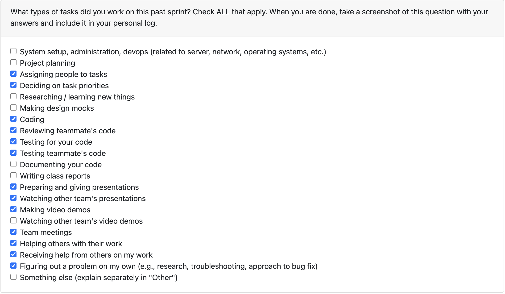

## Week recap

This sprint I focused on three main tracks: frontend UI migration, bug fixes across the upload and resume flows, and thorough PR review and testing across the team.

I opened four PRs this sprint: [#613](https://github.com/COSC-499-W2025/capstone-project-team-19/pull/613), [#616](https://github.com/COSC-499-W2025/capstone-project-team-19/pull/616), [#679](https://github.com/COSC-499-W2025/capstone-project-team-19/pull/679), and [#689](https://github.com/COSC-499-W2025/capstone-project-team-19/pull/689).

In [#613](https://github.com/COSC-499-W2025/capstone-project-team-19/pull/613), I refactored the Login and Register pages to use the shared UI baseline, strengthened route protection so protected pages no longer render for users with missing, invalid, or expired tokens, and updated the API client so 401 responses automatically clear the token and redirect to login. I also refactored the Home page to match the redesigned layout, replacing the old hero section with a welcome panel and shortcut navigation cards for the four main user flows. On the testing side, I updated auth form tests, added route guard coverage, fixed two failing frontend tests related to skill bar and ranked project score formatting, and updated home page tests to reflect the new shortcut-based UI.

In [#616](https://github.com/COSC-499-W2025/capstone-project-team-19/pull/616), I applied the shared layout baseline across all main authenticated pages by introducing `PageContainer`, `PageHeader` breadcrumb structure, and `SectionCard` wrappers without fully refactoring each page's internal components. The goal was to make the app feel visually consistent before peer testing without creating large merge conflicts for teammates. Pages updated included the upload flow pages, insights, outputs, projects, project detail, and profile. I also adjusted heatmap sizing, breadcrumb spacing, and updated affected tests to account for the new wrappers and router context.

In [#679](https://github.com/COSC-499-W2025/capstone-project-team-19/pull/679), I fixed a bug where key role ended up as `None` for LLM-consented users who left the manual contribution summary blank, by adding a fallback chain in `_prompt_contribution_and_key_role` that tries the LLM-generated contribution summary and then the project summary text before giving up. I also replaced the free-text key role input with a controlled dropdown: hidden on the Setup page when LLM consent is given, showing all roles by project type when consent is not given, and showing bucket-score-filtered roles on the resume edit page via a new `GET /resume/{resume_id}/projects/{project_summary_id}/eligible-roles` endpoint. A new `role_eligibility.py` module centralizes the role definitions and threshold mappings. I wrote unit tests for `get_eligible_roles` and API tests for the endpoint, and updated `ResumeDetail.test.tsx` to use `selectOptions` for the dropdown and added tests for the loading and populated states.

In [#689](https://github.com/COSC-499-W2025/capstone-project-team-19/pull/689), I traced and fixed four layered bugs that were causing manual project and contribution summaries to silently fail for individual projects. The status gate in `uploads_manual_summaries_service.py` was blocking individual projects entirely since they never reach `needs_summaries`. The project key guard was throwing 409 for any upload where `summaries_required_project_keys` was empty, which is always the case for individual projects. The state path mismatch in `_build_project_api_inputs` meant the summaries were being read from the wrong keys at run time even when they did persist. And on the frontend, `ProjectDetail.tsx` was gating the contribution summary section behind `project.project_mode === "collaborative"`, hiding it for individual projects entirely. I also applied `normalizeContributionSummary` to `project.summary_text` so backend placeholder strings render as "No summary yet." instead of printing raw.

**Reviewing and collaboration tasks:** I reviewed and tested twelve teammate PRs this sprint. For [#633](https://github.com/COSC-499-W2025/capstone-project-team-19/pull/633), I tested Salma's upload fix end to end, confirmed the unfinished upload flow was resolved, and documented three remaining issues around individual project supporting files checklist, file detection after a cancelled re-upload, and collaborative text analysis producing zero contribution despite sections being saved in the DB. I traced the last issue to the setup UI and analysis runtime deriving document sections independently with different code paths, causing selected section IDs to go out of range at run time, and fixed it by threading cached sections through the call chain. For [#634](https://github.com/COSC-499-W2025/capstone-project-team-19/pull/634), I tested Timmi's GitHub connection fix and confirmed it was working. For [#635](https://github.com/COSC-499-W2025/capstone-project-team-19/pull/635) and [#637](https://github.com/COSC-499-W2025/capstone-project-team-19/pull/637), I tested Timmi's date formatting improvements and the resume project add/remove flow and approved both with minor non-blocking suggestions. For [#644](https://github.com/COSC-499-W2025/capstone-project-team-19/pull/644), I confirmed the heatmap color intensity fix was accurate. For [#656](https://github.com/COSC-499-W2025/capstone-project-team-19/pull/656), I reviewed Johanes's public dashboard toggle and suggested two UX improvements: a warning modal when toggling public without granting access, and a friendlier message for visitors hitting a private dashboard URL. For [#660](https://github.com/COSC-499-W2025/capstone-project-team-19/pull/660) and [#661](https://github.com/COSC-499-W2025/capstone-project-team-19/pull/661), I tested Ammaar's portfolio removal and resume UI refactor and approved both with small suggestions. For [#662](https://github.com/COSC-499-W2025/capstone-project-team-19/pull/662), I tested Ammaar's delete account feature end to end including DB verification and approved with a non-blocking suggestion to move security settings higher on the profile page. For [#675](https://github.com/COSC-499-W2025/capstone-project-team-19/pull/675), [#678](https://github.com/COSC-499-W2025/capstone-project-team-19/pull/678), [#681](https://github.com/COSC-499-W2025/capstone-project-team-19/pull/681), and [#684](https://github.com/COSC-499-W2025/capstone-project-team-19/pull/684), I tested Ivona's one-page resume detection, Johanes's skill visibility toggling, Timmi's skill expertise categorization in the resume view and export, and Johanes's public insights refactor, and approved all four.

**Plan for next week:** Watching other team's video demos