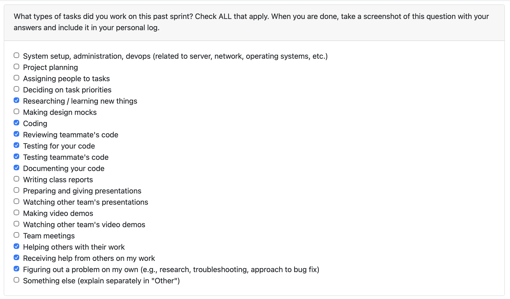
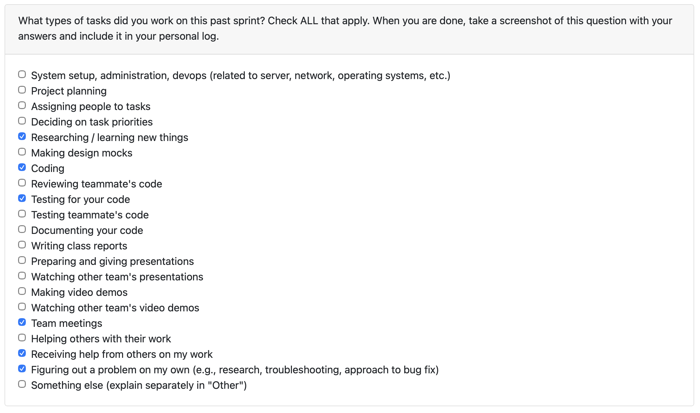
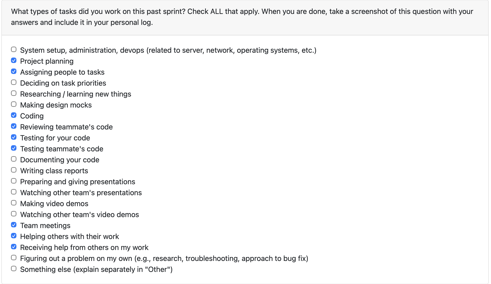
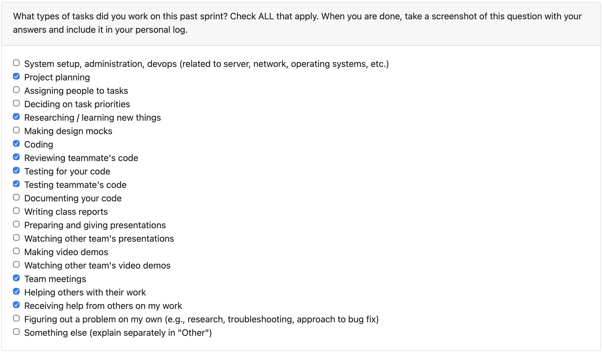
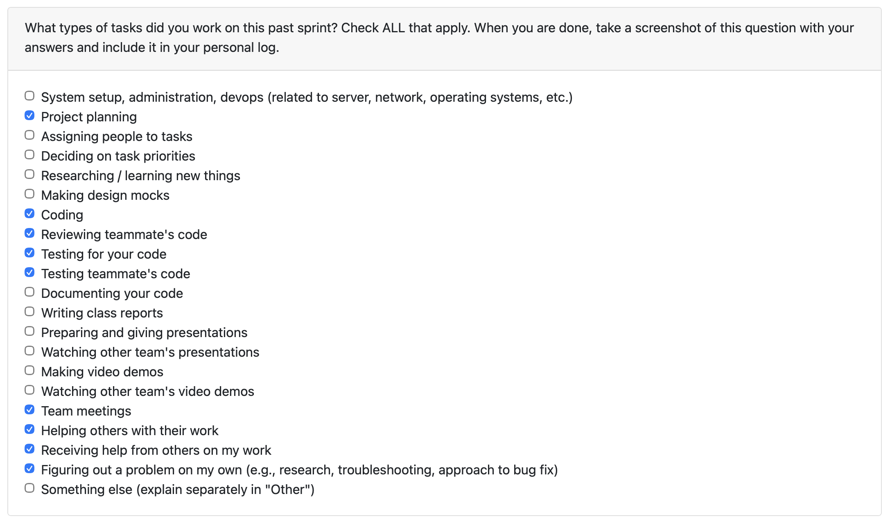
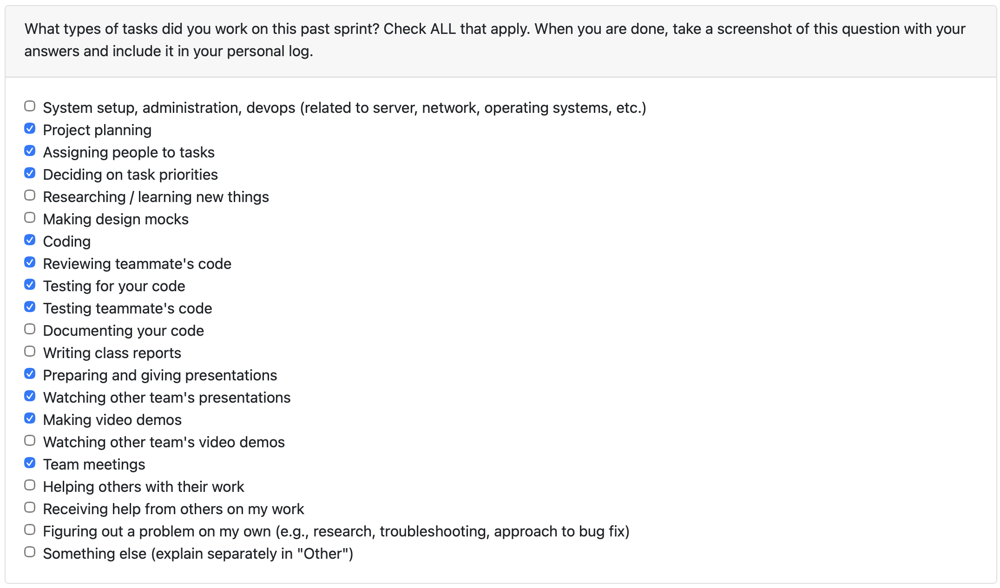
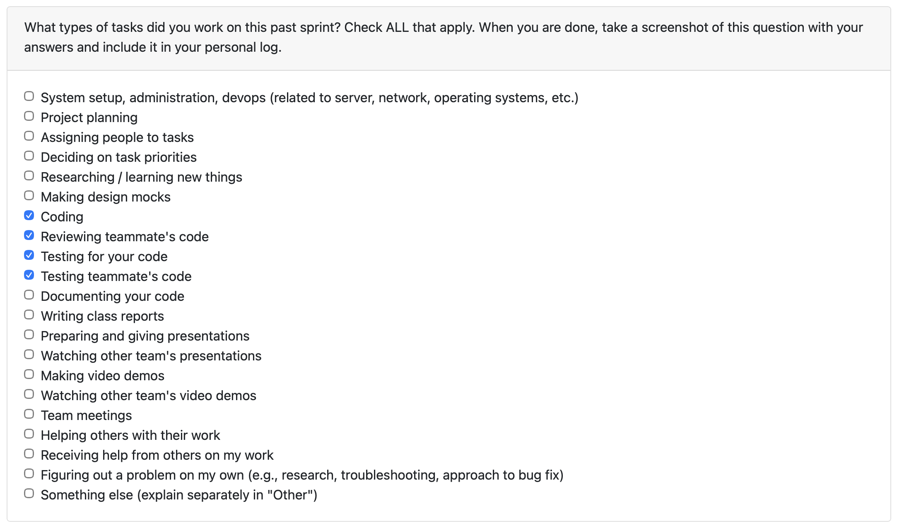

# Personal Log - Ammaar

## (Week 3) Monday 15th - Sunday 21st September

Week recap: Worked with the team on creating a list of functional and non-functional requirements. On Wednesday, during class we met with other teams and compared requirements.

## (Week 4) Monday 22nd - Sunday 28th September

Week recap: This week I focused on API research and authentication architecture. I did a deep dive into GitHub's authentication options, comparing GitHub Apps versus GitHub OAuth and mapping how each approach aligns with our required REST API calls. I also researched the Google Drive API authentication flow and identified the specific endpoints we'll need.

Building on Adara's comprehensive GitHub endpoint research, I expanded our system architecture diagram to incorporate GitHub processes. I also expanded the architecture around the code/script function and added to the dashboard visualization components for both local code analysis and GitHub-specific analysis features.

On the documentation side, I updated and revised our use case descriptions based on the UML case diagram that Ivona and Adara created. I also assisted Johanes with updating the file function in the system architecture when he encountered access issues with the Figma file.

Finally, I converted our project proposal from Word format to Markdown as required for submission.

## (Week 5) Monday 29th September - Sunday 5th October

Week recap: On Monday, our team worked together to create the DFD Level 0 and Level 1 diagrams. We finalized the main processes, data flows, and external entities, making sure the diagrams aligned with our functional requirements and system architecture.

On Wednesday, we joined the in-class activity where we rotated between different teams to compare DFDs. This gave us useful insights into how other groups represented their processes, especially around metrics extraction, artifact databases, and error handling. The comparison helped us refine our understanding of what details our diagrams capture well and what areas might need more specificity.

## (Week 6) Monday 6th October - Sunday 12th October

Week recap: This week we kicked off implementation and started coding! I had the chance to collaborate with Adara on refining our DFD and system architecture diagram. After reviewing the professor's updated requirements, I made some adjustments to the level 1 data flow diagram, and Adara helped ensure everything stayed in sync between our diagrams.

I also had the chance to collaborate with the team through several PR reviews:

1. Timmi's environment setup PR was solid - I added a quick note in the readme for Mac users since I'd run into that issue myself.

2. Salma's consent feature was well-structured - I suggested a couple of small tweaks to make sure it behaves exactly as we want, and she quickly addressed them.

3. Timmi's parsing PR was great - I noticed one test failing (probably from the main merge) and discovered something interesting about the file paths when running commands from different directories.

4. Johannes' WBS was well-organized - I did some reading on WBS best practices and shared a few ideas on how we might expand it to cover more of our requirements comprehensively.

## (Week 7) Monday 13th October - Sunday 19th October

Week recap: Focused on the project classification flow. I extended the backend to persist project tags, updated the CLI to auto-detect `individual/` and `collaborative/` folder structures, and added Markdown support in the parser so doc-heavy projects are recognized. I also updated the README with ZIP-prep instructions. Wrapped up with a dedicated test suite covering the new layout analyzer and confirmed the existing consent/user configuration tests still pass.

As for PR reviews, I reviewed Timmi’s parsing to DB PR to make sure the new schema changes fit smoothly with the parsing flow. I also reviewed Johanes' PR on alternate analysis methods and provided some feedback.

## (Week 8) Monday 20th October - Sunday 26th October

Week recap: I merged the Store Raw Project Info PR (#117) so every parsed file now gets saved with its project name. That change means downstream analysis can group artifacts without re-checking folder paths. I linked the parser straight into the `projects` table and updated the schema. I also worked on the “reject consent first” bug (#116). I wrote a regression test, and confirmed the UI flow is accurate to the logic we intended.

Next week’s focus: implement the cleanup that deletes `zip_data/` right after parsing and analysis (this was agreed upon by the team).

## (Week 9) Monday 27th October - Sunday 2nd November

Week recap: This week I worked on two features and reviewed two PRs. I also updated the team log with everyone's contributions.

For my first PR (#140), I added cleanup functionality to delete the `zip_data/` folder after parsing is done. Timmi suggested moving the cleanup call from `prompt_and_store()` to `main()` to keep responsibilities separate, which made sense. I refactored it and added unit tests. 

For my second PR (#142), I replaced our hard-coded language detection with Pygments so we can now recognize way more file types: Rust, Go, Kotlin, TypeScript, Swift, and others. This really broadens what our system can analyze for building portfolios and resumes later on.

On the PR review side, I reviewed Timmi's GitHub OAuth PR (#152). Found a few issues during testing. Timmi fixed everything quickly and got it working smoothly.

I also reviewed Adara's text analysis refactoring PR (#160). I noticed analysis only worked for PDFs initially and project names weren't displaying correctly. She fixed both issues, added markdown support, and synced with the main branch. Everything passed after her changes.

Next week's focus: I'll be working on updating the database schema and connecting the Google Drive API.

## (Week 10) Monday 3rd November - Sunday 9th November

Week recap: This week I worked on two feature PRs and reviewed three PRs from teammates.

For my first feature PR (#182), I expanded our framework detection from 14 frameworks to over 100, covering Python web frameworks (Django, Flask, FastAPI, Tornado), JavaScript/TypeScript frameworks (React, Vue, Next.js), mobile frameworks (React Native, Expo), CSS frameworks (Material-UI, Sass), build tools (Vite, Webpack), ORMs (Prisma), and state management libraries (Redux, Zustand). I also refactored the test file by creating a `_test_framework_detection()` helper function to cut down on boilerplate, which made the tests way cleaner.

For my second feature PR (#193), I added storage for offline text analysis metrics so we can reuse results later. I created a new `text_offline_metrics` table linked to `project_classifications`, added DB helper functions (`get_classification_id` and `store_text_offline_metrics`), and modified `alternative_analysis()` to return its summary so it can be persisted. I also added comprehensive unit tests covering upsert functionality, field preservation during partial updates, and edge cases like missing payloads. Timmi requested additional test coverage for edge cases, so I added tests to ensure existing fields aren't overwritten during updates and that empty/missing fields are handled gracefully.

For PR reviews, I reviewed Salma's collaborative summary improvements (#184). She fixed a bug where manual project descriptions were being requested even when users accepted LLM consent, added a helpful template for user input, and filtered out filler words using NLTK for better keyword extraction. After Timmi's feedback about the template being too text-heavy, she shortened it into a cleaner bullet list. Everything looked good after her changes.

I also reviewed Adara's CSV support PR (#179). She added CSV file handling to the text LLM analysis pipeline with metadata extraction. I noticed there were no unit tests for the new `extractfromcsv()` function and no integration tests showing how CSV metadata flows through the LLM pipeline, so I requested test coverage for these scenarios. Timmi and Ivona found additional issues with file extension validation duplication and errors when CSV was the only file type. Adara added the test cases I requested, refactored to fetch extensions from the database instead of the file path, and created a separate `csv_analyze.py` module to handle CSV files independently. Still waiting for her final updates to approve.

Finally, I reviewed Timmi's GitHub metrics PR (#185). She integrated GitHub OAuth, repo linking, and metrics collection (commits, PRs, issues). The architecture was solid with clear separation between API calls, storage, and orchestration. All tests passed and the GitHub integration worked smoothly when I tested it locally.

Next week's focus: I'll continue working on the database schema updates.

## (Week 12) Monday 17th November - Sunday 23rd November

Week recap: This week I worked on two feature PRs focused on code skill detection infrastructure and implementation, and reviewed seven PRs from teammates covering text activity types, code activity types, collaborative text contributions, text skill implementation, project summary integration, and GitHub collaboration metrics.

For my first feature PR (#224), I worked on the complete infrastructure for accurate skill detection in collaborative code projects. Previously, our system would analyze all files in a project regardless of who wrote them, meaning users got credit for their teammates' code. I solved this by integrating Git history tracking with our skill extraction pipeline. The implementation parses .git folders during collaborative analysis to determine which files each user worked on (including lines changed and commit counts), stores this data in a new `user_code_contributions` table, and filters the file list during skill extraction so detectors only run on files the user actually modified. I also implemented file content loading from disk using the correct path construction (`src/analysis/zip_data/{zip_name}/{file_path}`), which required querying the zip_name from the database.

For my second feature PR (#226), I implemented the actual code detector functions using regex-based pattern matching to identify 26 different coding patterns across 9 skill categories: Object-Oriented Programming, Data Structures, Algorithms, Architecture & Design, Code Quality, Testing & CI, Security & Error Handling, Frontend, and Backend development. The detectors support Python, JavaScript, Java, C/C++, Go, and Ruby. Each detector includes comment filtering, line-start anchors, word boundary matching, and context-aware patterns to minimize false positives. I switched from counting raw detection signals to a weighted scoring system, where certain patterns contribute more to skill scores than others. I also made large functions count as a negative weight in the Code Quality bucket (Ivona caught that it was initially counting as positive).

For PR reviews, I reviewed Johannes's text activity type detection (#228), which implemented duration analysis and activity categorization (Planning, Research, Drafting, Revision, Data, Final) using timestamp analysis and keyword-based pattern matching. I reviewed Salma's code activity type detection (#233) where she implemented a clean 6-file modular architecture. I reviewed Adara's collaborative text contribution workflow (#227) where users select which sections and files they contributed to. I reviewed Adara's massive text skill implementation refactor (#222) that restructured the entire text analysis pipeline with 10 new skill detectors. I reviewed Timmi's project summary integration (#221) that introduced the ProjectSummary dataclass to standardize insight capture across all analysis flows. I reviewed Timmi's GitHub collaboration analysis functions (#213) with modules for computing collaboration skills from GitHub metrics. Finally, I reviewed Timmi's skill detection flow PR (#212) that established the full pipeline structure with SkillBucket architecture and detector registry pattern.

Next week's focus: I'll continue working on the follow-up items from the code skill detection PRs and ensure the code skills are completely finished for milestone 1.

## (Week 13) Monday 24th November - Sunday 30th November

Week recap: This week I worked on three feature PRs focused on resume generation and retrieval, fixing framework detection, and improving Google Drive integration. I also reviewed seven PRs from teammates covering project summaries, code collaborative metrics storage, project ranking, chronological project listing, activity diversity improvements, and top projects summarization. I also updated and revised the team contract for everyone to review and sign.

For my feature PR (#276), I completed the resume generation and retrieval system. The "View resume items" flow now lets users create frozen resume snapshots or view existing ones. When creating a resume, the system pulls current project summaries, ranks all projects, and includes only the top five. Each snapshot renders readable sections for individual/collaborative code and text projects showing languages, frameworks, summaries, contributions, and skills, plus a skills summary at the bottom. I implemented skill bucket mapping to user-friendly labels for both technical skills (like "Object-Oriented Programming" and "Data Structures") and writing skills (like "Clarity" and "Research Depth"), and stored snapshots to a dedicated `resume_snapshots` table for later viewing. Johannes found the menu flow confusing—when choosing option 2 (view existing resume) with no saved resumes, it returned to the main menu instead of staying in the resume submenu where users could create one. Timmi agreed and also suggested refactoring `resume.py` into separate files for better readability and moving them into a `/menu/resume` folder. I made both changes: updated the menu logic to keep users in the resume submenu and refactored the code into separate files organized in a dedicated resume folder.

For my feature PR (#271), I optimized Google Drive file linking and fixed word counting. Previously, the system queried all Drive files which took over a minute. Now it queries files by base name with MIME filters, making the "Loading files..." step complete in under a second. I also fixed Google Docs revision word counting which was using raw character length instead of actual words. Salma noted that the optimization broke the browse functionality—it only returned exact matches instead of showing possible matches. Adara suggested adding an option to "remove file name matching filter" for edge cases. I implemented a hybrid solution that keeps the optimized file matching by default but allows users to browse the full Drive if they choose (the loading is deferred to only if they select this option).

For my feature PR (#278), I fixed a critical bug where frameworks weren't being detected or stored in the database, which would have affected ranking, resume, and portfolio creation. The issue was in the framework detection path logic not looking at the correct directory for the code projects.

For PR reviews, I reviewed Timmi's complete project summaries PR that stores all extracted analysis data into the `project_summaries` table, enabling proper project ranking and retrieval for Milestone 1 requirements. I reviewed Salma's code collaborative metrics storage PR that created `code_collaborative_metrics` and `code_collaborative_summary` tables to persist local git metrics and both manual/LLM summaries. I reviewed Timmi's project ranking PR implementing a fully weighted scoring system with availability scoring, base scoring (skills, contribution strength, activity diversity), code-specific scoring (complexity, git activity, github collaboration, tech stack), and text-specific scoring (writing quality), using weighted averaging so certain metrics carry more weight—this establishes the scoring foundation for resume/portfolio generation. I reviewed Ivona's chronological project listing PR that retrieves all analyzed projects sorted by completion date (newest first) and adds it as a menu item. I reviewed Timmi's activity diversity improvement PR that replaced the previous equal-weight approach with Shannon entropy to fix inflated diversity scores—previously, tiny activities (0.05% documentation) influenced the score as much as dominant ones (99.5% coding), and the Shannon entropy solution rewards balanced distributions while penalizing skewed ones without unfairly punishing projects for having small but important activities like documentation. Finally, I reviewed Timmi's top projects summaries PR that implements the "Summarize the top ranked projects" milestone requirement by adding a `view_top_projects_summaries()` function accessible via menu option [6] --> [2] that collects all project data, sorts by descending score, retrieves the top 3 projects, and prints their summaries in a formatted list.

Next week's focus: I'll work on the presentation, demo video and updating the README.

## (Week 14) Monday 1st December - Sunday 7th December

Week recap: This week I worked on one feature PR, reviewed one PR, and focused heavily on presentation preparation and final deliverables.

For my feature PR (#300), I implemented keyword-based file contribution tracking for collaborative code projects without local .git directories. The system now infers contributed files by matching keywords from user descriptions against filenames, paths, and file content. This populates the same table used when .git is present, allowing activity summaries and skill extraction to run on user-scoped files instead of the entire codebase. I also fixed missing language, framework, and contribution summary data in the database for no-git collaborative projects and improved prompt guidance for users.

I reviewed Timmi's skill detector optimization PR (#302) that reduced runtime by precompiling regex patterns, using string checks before regex and filtering non-code files.

This week I also spent significant time working on our presentation slides and demo video. I presented during our scheduled time and peer-reviewed five other team presentations. I did some planning for the deliverables due Sunday, discussed the approach with the team, and worked with Adara on producing the demo video.

Next week's focus: Relax and get back to it in January :)

## (Week 15) Monday January 5 - Saturday January 11

Week recap: This week I worked on one feature PR and reviewed two PRs from teammates.

For my feature PR (#332), I implemented the key role incorporation system for collaborative code projects. The system now requires manual contribution summaries for all collaborative code projects (even when LLM is enabled), ranks the top-8 key files within Git-contributed files, and scopes skill/activity detection to only those key files while keeping LLM project summaries unchanged. I refactored the key-file ranking helpers into the collaborative helper module for reusability across Git and non-Git flows, updated the portfolio display to prefer manual contribution summaries over LLM summaries, and added a cleanup function to delete file contributions for a project to prevent stale data. Tests cover Git-file ranking edge cases, contribution cleanup, and the full collaborative project analysis flow.

For PR reviews, I reviewed Johannes's project reranking feature (#337) which added three intuitive menu options (reorder multiple projects, set specific rank, reset to automatic ranking) under menu 6. I suggested switching the manual reorder input from typing full project names to number selection like he did for "set specific project rank" to make it faster and less error-prone, and recommended adding test coverage for the interactive_reorder input validation and set_specific_rank flows to close the gap. I reviewed Salma's Word export feature (#336) which added DOCX exporters for portfolio and resume views with standardized layouts matching the CLI views. I caught two issues: export filenames are date-only so multiple exports on the same day silently overwrite earlier docs (suggested adding timestamps or prompting before overwriting), and the invalid-choice message says "Please enter 1–3" even though option 4 exists.

Next week's focus: I'll address any follow-up items from the key role PR and continue working on remaining milestone deliverables.