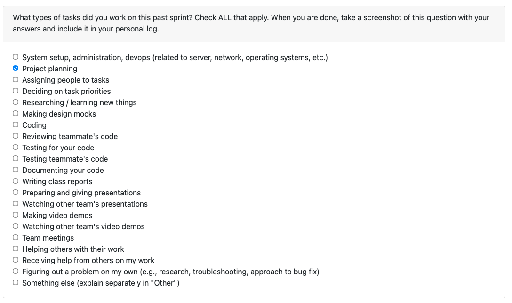
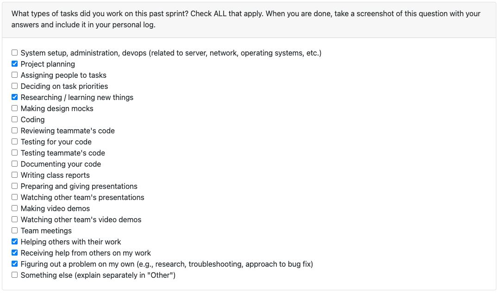
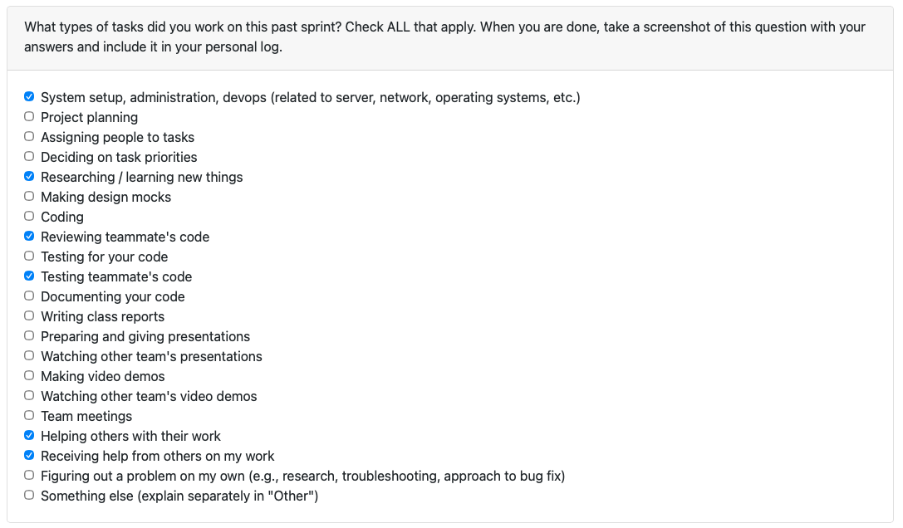

# Personal Log - Ammaar

## (Week 3) Monday 15th - Sunday 21st September

Week recap: Worked with the team on creating a list of functional and non-functional requirements. On Wednesday, during class we met with other teams and compared requirements.

## (Week 4) Monday 22nd - Sunday 28th September

Week recap: This week I focused on API research and authentication architecture. I did a deep dive into GitHub's authentication options, comparing GitHub Apps versus GitHub OAuth and mapping how each approach aligns with our required REST API calls. I also researched the Google Drive API authentication flow and identified the specific endpoints we'll need.

Building on Adara's comprehensive GitHub endpoint research, I expanded our system architecture diagram to incorporate GitHub processes. I also expanded the architecture around the code/script function and added to the dashboard visualization components for both local code analysis and GitHub-specific analysis features.

On the documentation side, I updated and revised our use case descriptions based on the UML case diagram that Ivona and Adara created. I also assisted Johanes with updating the file function in the system architecture when he encountered access issues with the Figma file.

Finally, I converted our project proposal from Word format to Markdown as required for submission.

## (Week 5) Monday 29th September - Sunday 5th October

Week recap: On Monday, our team worked together to create the DFD Level 0 and Level 1 diagrams. We finalized the main processes, data flows, and external entities, making sure the diagrams aligned with our functional requirements and system architecture.

On Wednesday, we joined the in-class activity where we rotated between different teams to compare DFDs. This gave us useful insights into how other groups represented their processes, especially around metrics extraction, artifact databases, and error handling. The comparison helped us refine our understanding of what details our diagrams capture well and what areas might need more specificity.

## (Week 6) Monday 6th October - Sunday 12th October

Week recap: This week we kicked off implementation and started coding! I had the chance to collaborate with Adara on refining our DFD and system architecture diagram. After reviewing the professor's updated requirements, I made some adjustments to the level 1 data flow diagram, and Adara helped ensure everything stayed in sync between our diagrams.

I also had the chance to collaborate with the team through several PR reviews:

1. Timmi's environment setup PR was solid - I added a quick note in the readme for Mac users since I'd run into that issue myself.

2. Salma's consent feature was well-structured - I suggested a couple of small tweaks to make sure it behaves exactly as we want, and she quickly addressed them.

3. Timmi's parsing PR was great - I noticed one test failing (probably from the main merge) and discovered something interesting about the file paths when running commands from different directories.

4. Johannes' WBS was well-organized - I did some reading on WBS best practices and shared a few ideas on how we might expand it to cover more of our requirements comprehensively.
