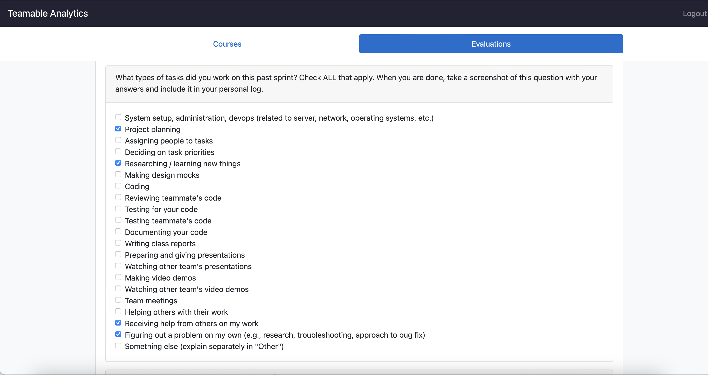
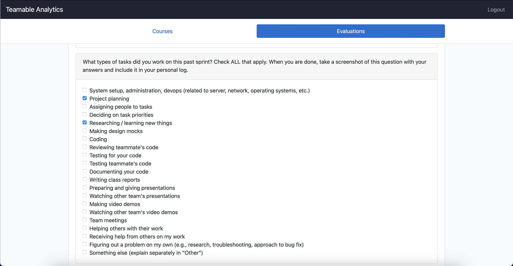
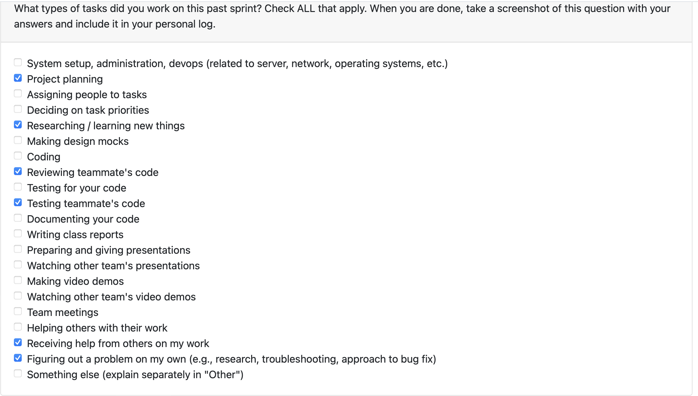
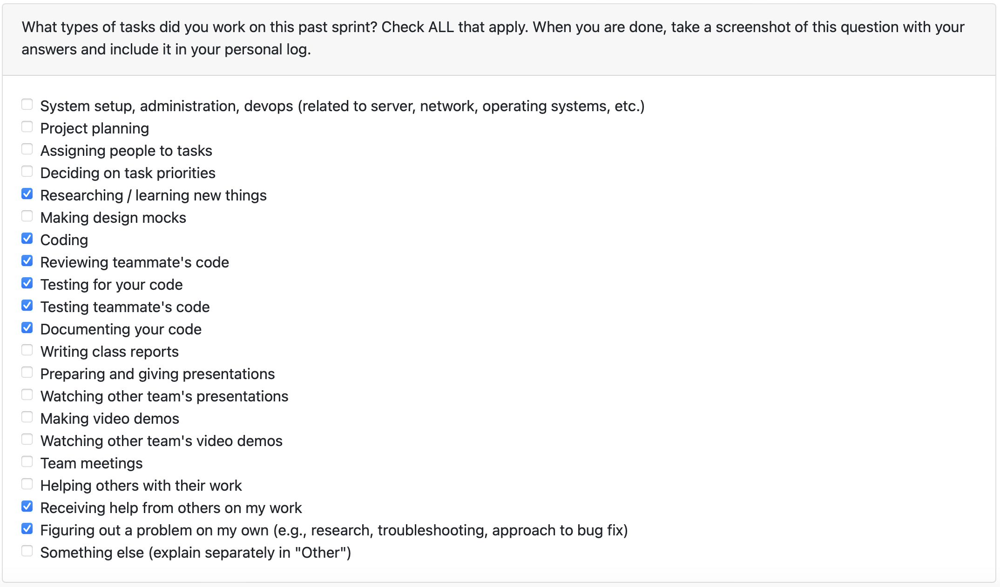
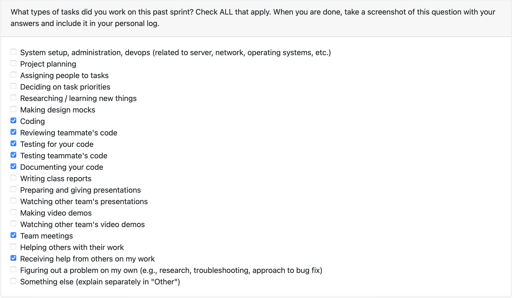
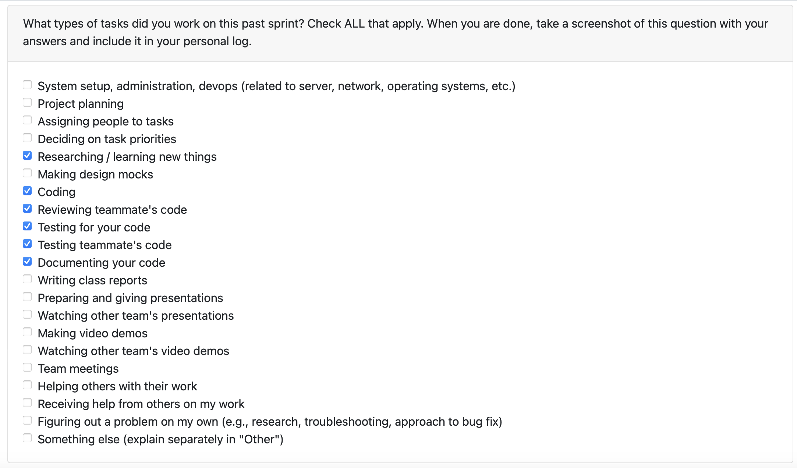
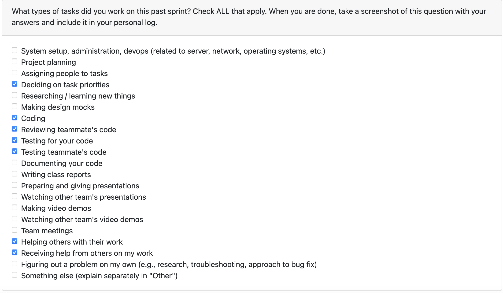
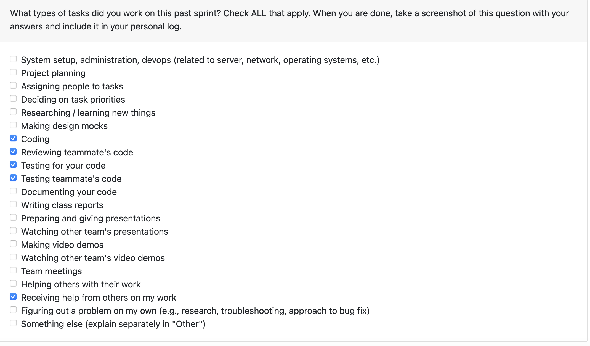
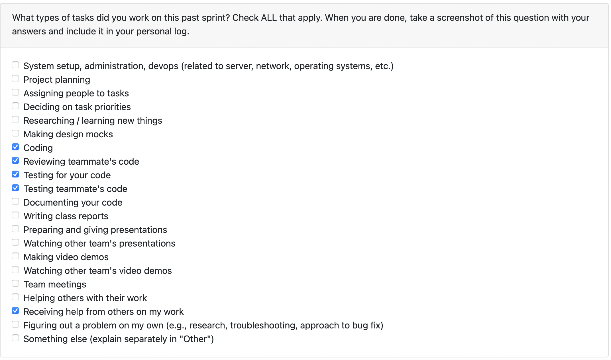

# Personal Log - Johanes

## (Week 3) Monday 15th - Sunday 21st September

Week recap: Discussed and worked on the project requirement by gathering ideas in google docs with the team. On Wednesday, discussed with three other teams and exchanging idea by evaluating each other's project requirements.

## (Week 4) Monday 22nd - Sunday 28th September

Week recap: Discussed with the team on designing the architecture diagram. Collaborate together and integrate everything in one document of project proposal. Discussed with three other teams as mentioned in team weekly logs, evaluating each other, compared our architecture and reflect on our own diagram. Added and removed some features that we agreed on.

Did a research on text extracting and processing function (both docx and pdf files), added details to text function and dashboard visualization part on architecture diagram, and project proposal.

I was helped by ammaar in adding details to the architecture diagram since I cant access to the figma due to student account verification problem. 

## (Week 5) Monday 29th September - Sunday 5th October

Week recap: Discussed and built DFD with team during class on Monday, and reflect based on other team's DFDs on Wednesday. Did a research about differences between DFD level 0 and level 1.

## (Week 6) Monday 6th October - Sunday 12th October

Week recap: Our team started few codings, I am in charge in creating the WBS. My teammate suggested about the WBS needs to be more detailed on milestone 2 and 3. Did a research about what a proper WBS should look like. Did a review for my teammate's PR.

## (Week 7) Monday 13th October - Sunday 19th October

Week recap: implemented the alternative analyses, did some research about the functions to be used in the implementation. Get some feedback from teammate. Feedbacks will be discussed in class on wednesday for further update. 

## (Week 8) Monday 20th October - Sunday 26th October

Week recap: continued implementing the alternative analysis, reviewed some teammate PRs, get some feedback from teammate, did a minor fix for reusing configuration, but wont be merged this week. Next week i plan to start the implementation of alternative analysis on code files.

## (Week 9) Monday 27th October - Sunday 2nd November

Week recap: Implementing the individual metrics analysis necessary for code project (non-llm). Reviewed some teammate PRs, get feedback from Salma and Timmi about branching from main branch, etc.

Next week i plan to implement saving project metrics that was produced, into database. Might have to discussed further with teammates on incoming team meeting.

## (Week 10) Monday 3rd November - Sundah 9th November

Week recap: This week I worked on implementing the database for llm text analysis to allow reusing of previous metrics. Created a new table to store the metrics, which linked to project_classifications, following what has been discussed with Ammaar. added get_classification_id following ammaar's PR and reusing that function. Modified run_text_llm_analysis to return the result of the analysis, so that it can be used to store in project_analysis. Previously I called the store metrics to database in the text_llm_analyze, but seeing ammaar's PR, to keep things maintainable and consistent, I moved the function to be called in project_analysis.py. Reviewed by Salma and Timmi, Timmi found the inconsistency between separator in windows and mac, which causes error in the test. I did a change based on Timmi's review.

Reviewed Timmi's PR gave some feedback based on the error I found, reviewed adara and ammaar's PR.

Next week plan: Continue storing other metrics result to database.

## (Week 12) Monday 17th November - Sunday 23rd November

Week recap: I created a new table to store the metrics, with foreign key to the proejct_classifications. I worked on classifying activity type of text project, whether it is a revision file, research file, final file, draft file, or a data file. I used static dictionary. I also add priority variable to the activity so it doesnt have conflict within each activity when classifying. I stored the activity_metrics to the database for future use. I reviewed adara and salma's pr and give some suggestion to improve their feature. 

Next week plan: I plan to modify start menu to display options such as analyze new project, view old project, delete old project, and view resume items and view portfolio items

# (Week 13) Monday 24th November - Sunday 30th November

Week recap: I stored necessary code metrics that was not merged last week, and also stored the individual github analysis metrics. I started modifying the menu options to show 6 choices, retrieve old summaries, retrieve portfolio, retrieve resume, delete old insights, start new analysis, and quit. The implementation is done in src/menu to separate the menu files. I also implemented the retrieve old summaries menu by taking the summary_text in the project_summaries table. In further PR, my teammate modified the list menu to show another menu for requirement of milestone 1. 

I also reviewed Ammaar's PR, Adara's PR, and some other teammates.

Next week plan: I plan to help with the video demo and presentation slides.