# Personal Log - Johanes

## Table of Contents

### Term 2
- [Week 10 (March9-March 15)](#t2-week-10-monday-9th-march-sunday-15th-march)
- [Week 9 (March 2-March 8)](#t2-week-9-monday-2nd-march-sunday-8th-march)
- [Week 6-8 (Feb 9-March 1)](#t2-week-6-8-monday-9th-february--sunday-1st-march)
- [Week 4&5 (Jan 26-Feb 8)](#t2-week-45-monday-26th-january---sunday-8th-february)
- [Week 3 (Jan 19-25)](#t2-week-3-monday-19th-january---sunday-25th-january)
- [Week 2 (Jan 12–18)](#t2-week-2-monday-12th-january---sunday-18th-january)
- [Week 1 (Jan 5–11)](#t2-week-1-monday-5th-january---sunday-11th-january)

### Term 1

- [Week 14 (Dec 1–7)](#week-14-monday-1st-december---sunday-7th-december)
- [Week 13 (Nov 24–30)](#week-13-monday-24th-november---sunday-30th-november)
- [Week 12 (Nov 17–23)](#week-12-monday-17th-november---sunday-23rd-november)
- [Week 10 (Nov 3–9)](#week-10-monday-3rd-november---sunday-9th-november)
- [Week 9 (Oct 27–Nov 2)](#week-9-monday-27th-october---sunday-2nd-november)
- [Week 8 (Oct 20–26)](#week-8-monday-20th-october---sunday-26th-october)
- [Week 7 (Oct 13–19)](#week-7-monday-13th-october---sunday-19th-october)
- [Week 6 (Oct 6–12)](#week-6-monday-6th-october---sunday-12th-october)
- [Week 5 (Sept 29–Oct 5)](#week-5-monday-29th-september---sunday-5th-october)
- [Week 4 (Sept 22–28)](#week-4-monday-22nd---sunday-28th-september)
- [Week 3 (Sept 15–21)](#week-3-monday-15th---sunday-21st-september)

## (Week 3) Monday 15th - Sunday 21st September

Week recap: Discussed and worked on the project requirement by gathering ideas in google docs with the team. On Wednesday, discussed with three other teams and exchanging idea by evaluating each other's project requirements.

## (Week 4) Monday 22nd - Sunday 28th September

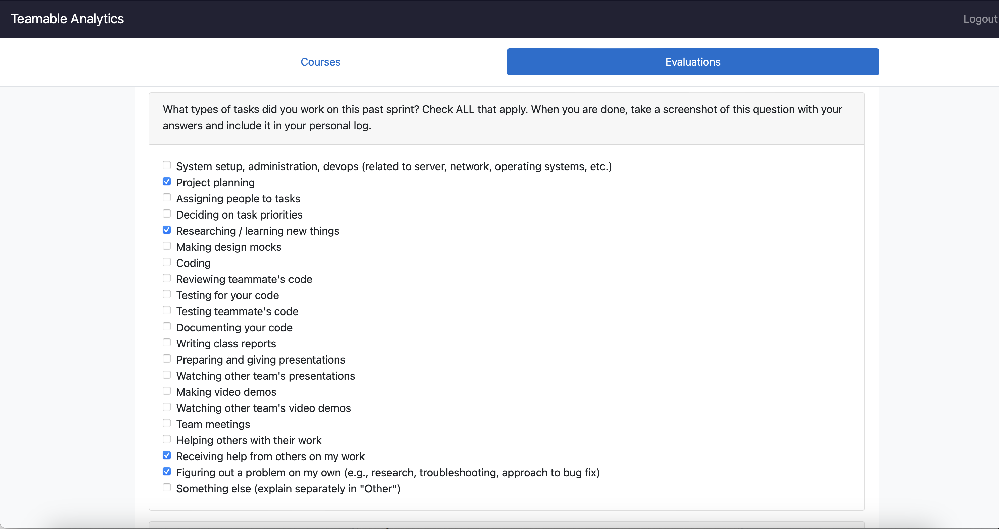

Week recap: Discussed with the team on designing the architecture diagram. Collaborate together and integrate everything in one document of project proposal. Discussed with three other teams as mentioned in team weekly logs, evaluating each other, compared our architecture and reflect on our own diagram. Added and removed some features that we agreed on.

Did a research on text extracting and processing function (both docx and pdf files), added details to text function and dashboard visualization part on architecture diagram, and project proposal.

I was helped by ammaar in adding details to the architecture diagram since I cant access to the figma due to student account verification problem. 

## (Week 5) Monday 29th September - Sunday 5th October

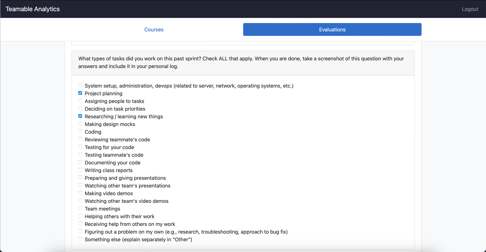

Week recap: Discussed and built DFD with team during class on Monday, and reflect based on other team's DFDs on Wednesday. Did a research about differences between DFD level 0 and level 1.

## (Week 6) Monday 6th October - Sunday 12th October
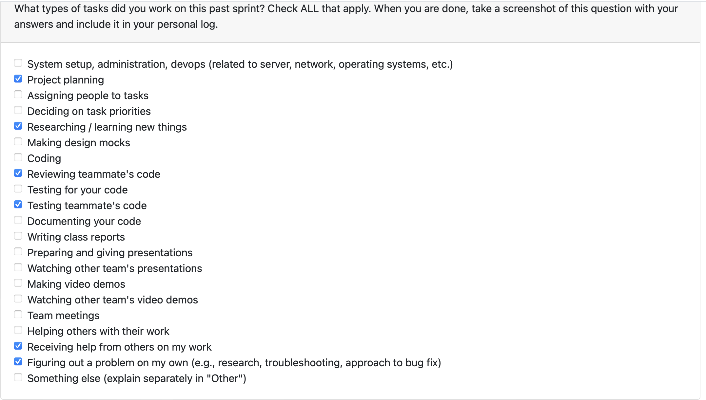

Week recap: Our team started few codings, I am in charge in creating the WBS. My teammate suggested about the WBS needs to be more detailed on milestone 2 and 3. Did a research about what a proper WBS should look like. Did a review for my teammate's PR.

## (Week 7) Monday 13th October - Sunday 19th October
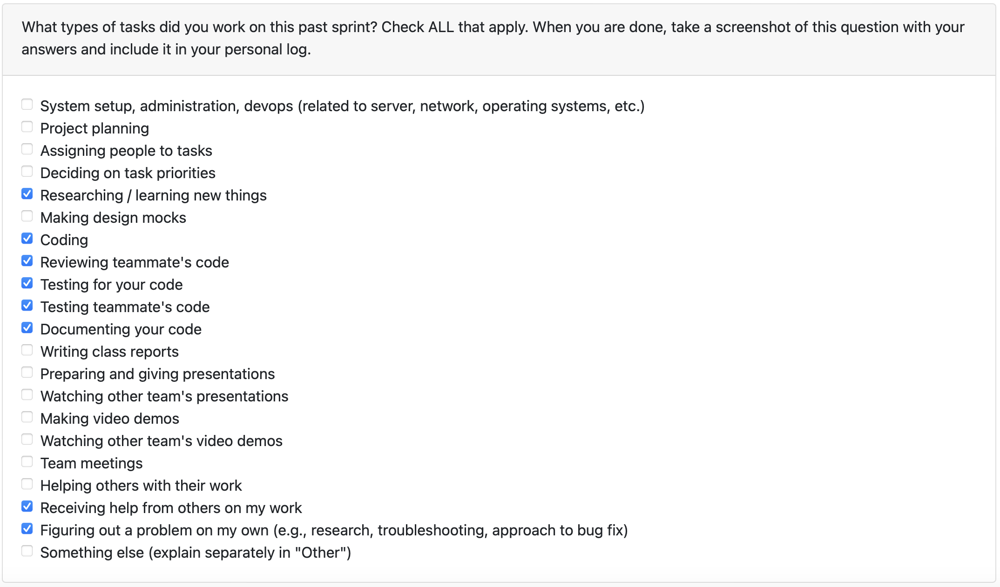

Week recap: implemented the alternative analyses, did some research about the functions to be used in the implementation. Get some feedback from teammate. Feedbacks will be discussed in class on wednesday for further update. 

## (Week 8) Monday 20th October - Sunday 26th October
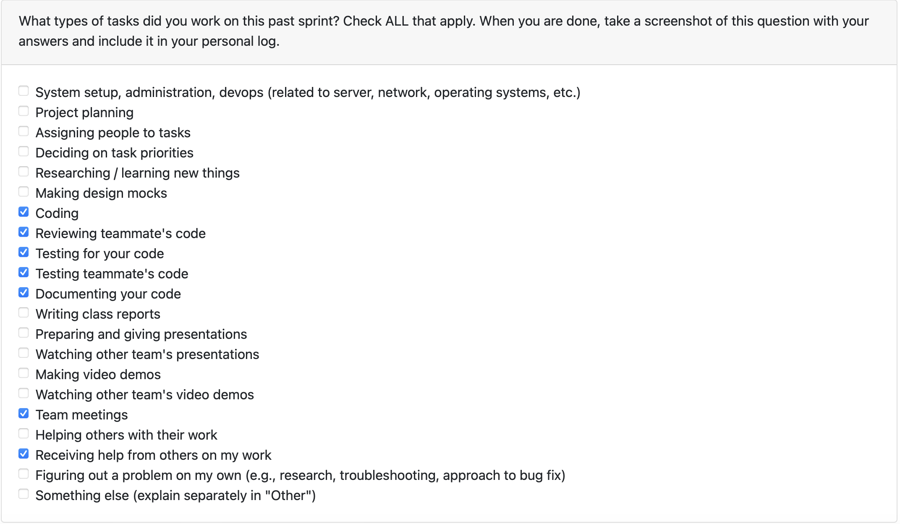

Week recap: continued implementing the alternative analysis, reviewed some teammate PRs, get some feedback from teammate, did a minor fix for reusing configuration, but wont be merged this week. Next week i plan to start the implementation of alternative analysis on code files.

## (Week 9) Monday 27th October - Sunday 2nd November

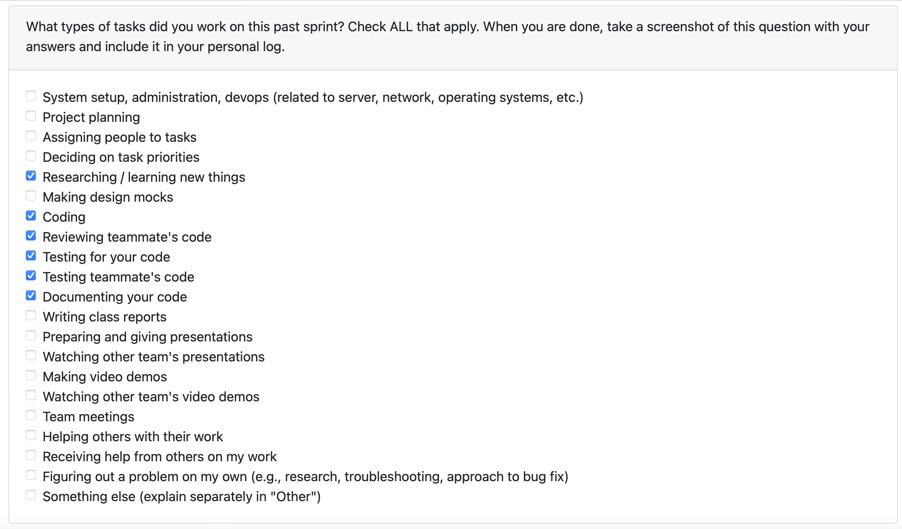

Week recap: Implementing the individual metrics analysis necessary for code project (non-llm). Reviewed some teammate PRs, get feedback from Salma and Timmi about branching from main branch, etc.

Next week i plan to implement saving project metrics that was produced, into database. Might have to discussed further with teammates on incoming team meeting.

## (Week 10) Monday 3rd November - Sunday 9th November

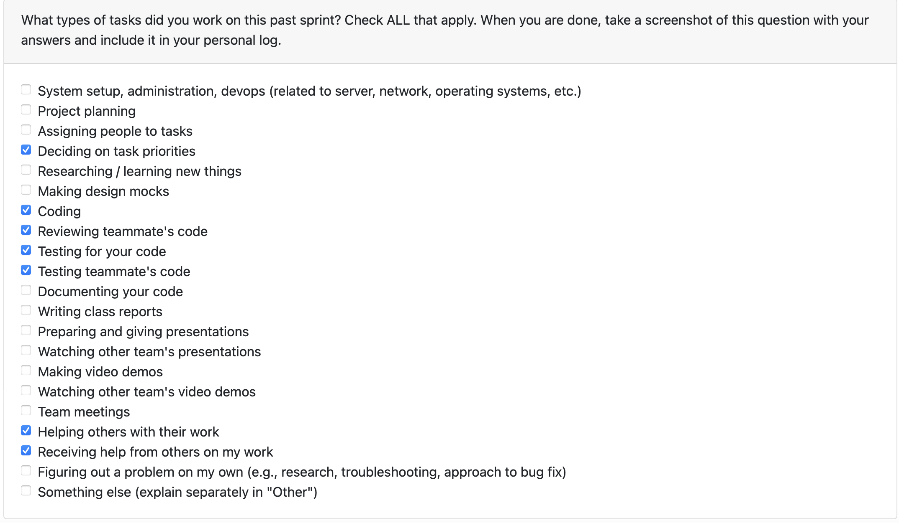

Week recap: This week I worked on implementing the database for llm text analysis to allow reusing of previous metrics. Created a new table to store the metrics, which linked to project_classifications, following what has been discussed with Ammaar. added get_classification_id following ammaar's PR and reusing that function. Modified run_text_llm_analysis to return the result of the analysis, so that it can be used to store in project_analysis. Previously I called the store metrics to database in the text_llm_analyze, but seeing ammaar's PR, to keep things maintainable and consistent, I moved the function to be called in project_analysis.py. Reviewed by Salma and Timmi, Timmi found the inconsistency between separator in windows and mac, which causes error in the test. I did a change based on Timmi's review.

Reviewed Timmi's PR gave some feedback based on the error I found, reviewed adara and ammaar's PR.

Next week plan: Continue storing other metrics result to database.

## (Week 12) Monday 17th November - Sunday 23rd November
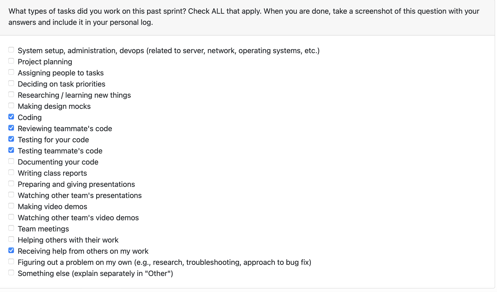
Week recap: I created a new table to store the metrics, with foreign key to the proejct_classifications. I worked on classifying activity type of text project, whether it is a revision file, research file, final file, draft file, or a data file. I used static dictionary. I also add priority variable to the activity so it doesnt have conflict within each activity when classifying. I stored the activity_metrics to the database for future use. I reviewed adara and salma's pr and give some suggestion to improve their feature. 

Next week plan: I plan to modify start menu to display options such as analyze new project, view old project, delete old project, and view resume items and view portfolio items

## (Week 13) Monday 24th November - Sunday 30th November
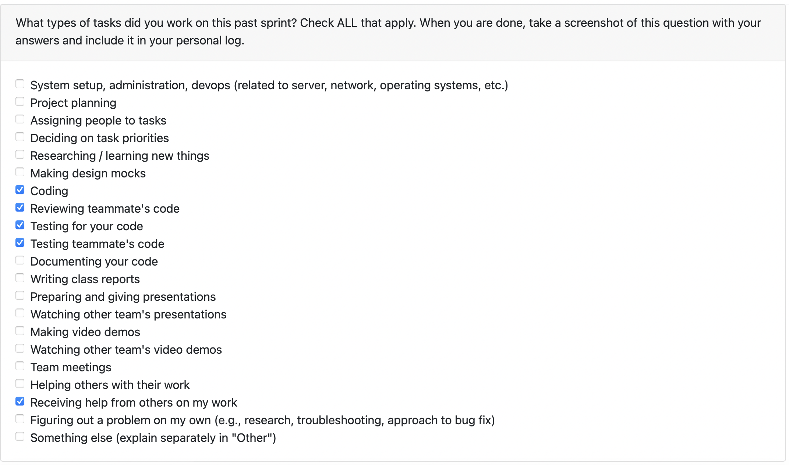
Week recap: I stored necessary code metrics that was not merged last week, and also stored the individual github analysis metrics. I started modifying the menu options to show 6 choices, retrieve old summaries, retrieve portfolio, retrieve resume, delete old insights, start new analysis, and quit. The implementation is done in src/menu to separate the menu files. I also implemented the retrieve old summaries menu by taking the summary_text in the project_summaries table. In further PR, my teammate modified the list menu to show another menu for requirement of milestone 1. 

I also reviewed Ammaar's PR, Adara's PR, and some other teammates.

Next week plan: I plan to help with the video demo and presentation slides.

## (Week 14) Monday 1st December - Sunday 7th December
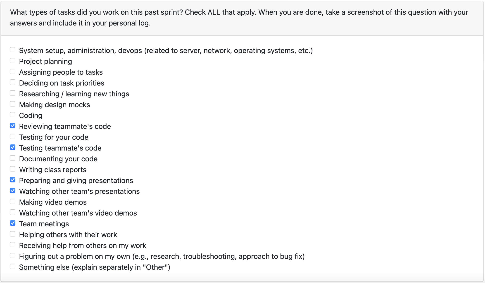
Week recap: I updated the System Architecture Diagram based on what we have currently in milestone 1. Added Skill Bucket Analysis box, Activity Type box, and updated the description. I also reorganized the flow of the diagram.
Me and my teammate also worked on the presentation.

I reviewed some of my teammate's PR.

Next week plan: No sprint next week. Preparing for final exam. 

## (T2 Week 1) Monday 5th January - Sunday 11th January
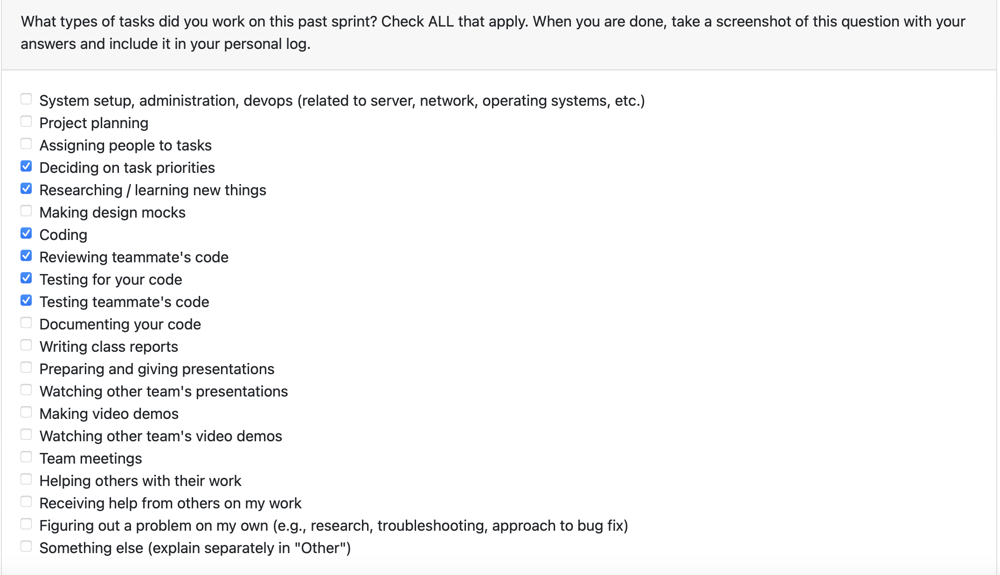
Week recap: 

I added new feature that allows user to edit the project rank. Previously, the projects were ranked based on the score obtained from the analysis. This feature allows user to manually edit the rank, so that user can choose which projects to be showcased at the top.

I also started to implement the editing chronology feature which allows user to edit the start and end date of a project. However, i chose to continue it in the next week.

I received feedback from ammaar to change the behavior of the bulk rank editing to use number instead of typing project name.

I also gave feedback to Timmi's PR, finding the small error about the path issues.

Next week plan: Continue the unfinished feature, and continue implementing milestone requirement 3.

## (T2 Week 2) Monday 12th January - Sunday 18th January
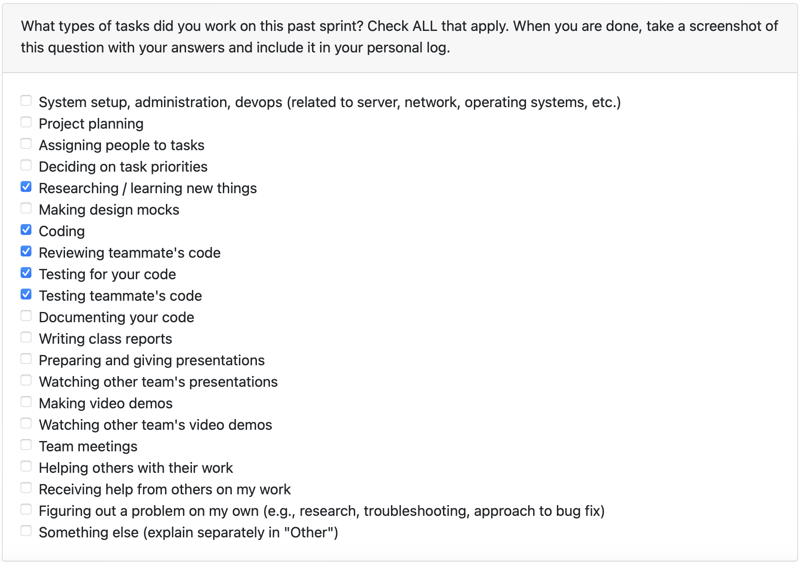
Week recap: 

This week i worked on 2 PRs and reviewed 2 PRs:

1st PR: ([#338])(https://github.com/COSC-499-W2025/capstone-project-team-19/pull/338)
I continued the draft PR I made about editing date functionality. In the pr we also discussed about possible additional edge cases that I overlooked.

2nd PR: ([#370])(https://github.com/COSC-499-W2025/capstone-project-team-19/pull/370)
I implemented both POST and GET api endpoint for the consents, based on the user_id. 

PR I reviewed: ([#372])(https://github.com/COSC-499-W2025/capstone-project-team-19/pull/372)
I reviewed salma's PR about add images for project thumbnails and found a bug where the image not showing for big dimensions, which was addressed by resizing image into 800x800 if it exceeds the limit of 800x800. I also noticed other bug such as saving duplicates of edited thumbnails. I also gave feedback about the CLI menu.

I also tested ivona's PR ([#374])(https://github.com/COSC-499-W2025/capstone-project-team-19/pull/374) for the endpoints of get skills, all resumes, and specific resume

Next week plan: Continue implementing other api endpoints

## (T2 Week 3) Monday 19th January - Sunday 25th January
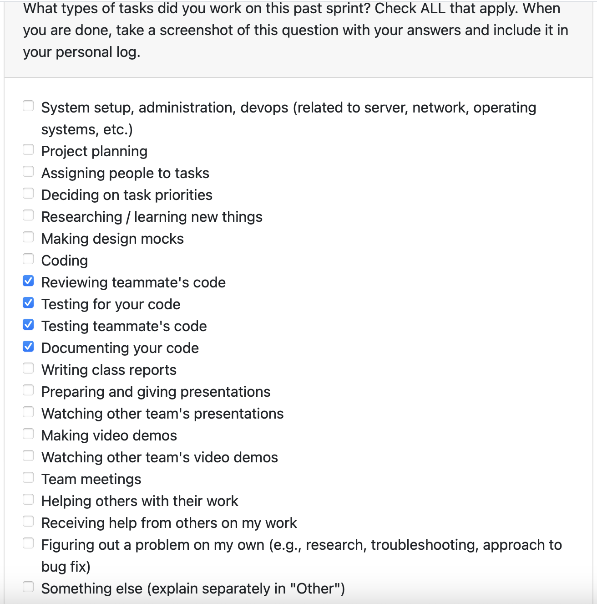
Week recap: 

This week i worked on 1 PR

1st PR: ([#402])(https://github.com/COSC-499-W2025/capstone-project-team-19/pull/402)
I continued implementing the endpoint for resume generating and resume editing. At first I was implementing it following the CLI menu flow. However, I got feedback to make it more flexible so that the user does not have to edit certain project, they can just edit the resume name, which is makes sense. 

PR I reviewed: ([#392])(https://github.com/COSC-499-W2025/capstone-project-team-19/pull/392)
I reviewed Timmi's PR about the authentication, giving feedback about password length and combination limitation to increase security

I also tested Salma's PR ([#396])(https://github.com/COSC-499-W2025/capstone-project-team-19/pull/396) 
Giving feedback about how the PDF should be formatted.

I also reviewed some other PRs giving feedback about reminder on using Authorization: Bearer <token> instead of still using user id in the header.

Next week plan: Continue implementing other api endpoints

## (T2 Week 4&5) Monday 26th January - Sunday 8th February
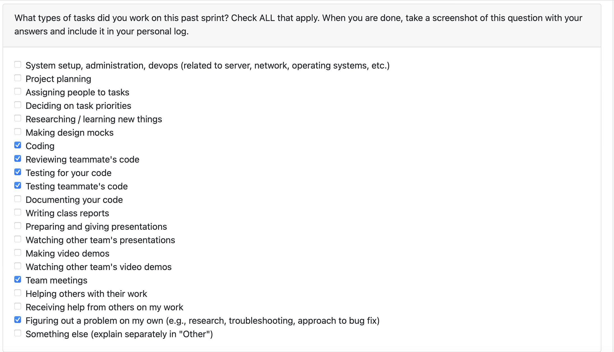
Week recap: 
These two weeks I've been working on 4 prs. 

First PR: PR #436, where I implemented the api endpoint for portfolio generation, and portfolio editing. I also updated the resume editing endpoint so that it can do the key_role editing too.

Second PR: PR #448, when peer testing, I found one bug in the system where completely unrelated projects were detected as related by the system. It is due to the project file contain .DS_Store (metadata files) which wasnot filtered out by the system. In some cases, each folder contains .DS_Store, which make it was detected as duplication by the system, I fixed that by filtering out the file.

Third PR: PR #461, I implemented the new feature of highlighting skills, allowing user to choose which skill to be shown in either portfolio or resume. At first i implemented it globally, however, ammaar's comment made sense, to follow the existing overriding pattern, which allow user to customize it manually per resume per project. I choose to implement the per project customization in the next PR since this PR already too big. This PR was also reviewed by adara where she catches the bug where exporting to pdf and docx does not reflect the highlighted skills. (Has not been merged yet, I am hoping to merge this PR by this midnight.)

Fourth PR: API/skill highlight. this is the api endpoint for the implementation of my third PR. However, due to many changes made in previous PR, i choose to draft it and continue next week.

I didnt reviewed many PR these 2 weeks, I acknowledge my inactivity during these 2 weeks due to overloaded assignments I am having. I will try to catch up next week.

I reviewed Ammaar's Key Role PR, where one case (no .git) was skipped, so the user cant input they key role in that case. I also reviewed Adara's PR and Salma's PR

Next week plan: Continue implementing the endpoint and make the necessary update for the skill highlighting features.

## (T2 Week 6-8) Monday 9th February- Sunday 1st March
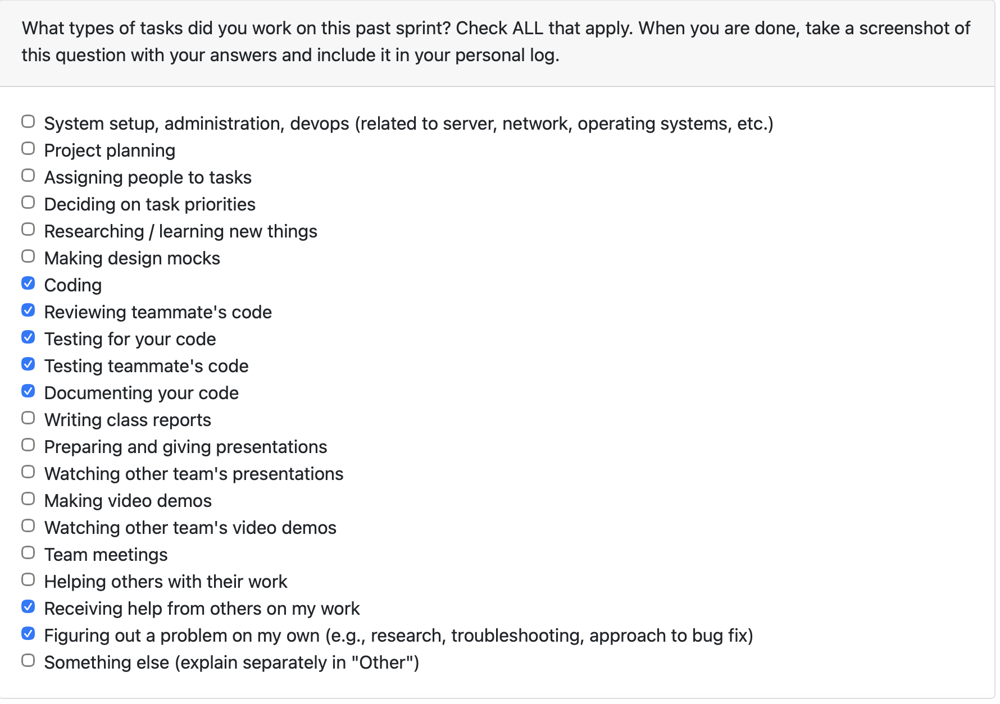

Week recap:
These three weeks I've been working on three PRs

First PR: #483
As per comments in the previous pr, I updated the behaviour of skill highlighting feature. I moved the implementation to be under resume and portfolio menu, not as a new cli menu. Under portfolio menu, skill editing is done per project, while under resume is done per resume, which follows the format of skill in both resume and portfolio.

Second PR: #485
I decided to close my previous pr about the api skill highlight and remake it since now the implementation is different. The api is now under /resume/{resume_id}/edit and /portfolio/edit. Which follow the implementation of the cli menu

Third PR: #499
Skill timeline api will be useful for creating a skill progression graph/dashboard in the frontend. It returns the cumulative score of all skills gained grouped by date. Cumulative formula is currently using : `1-(1-current)*(1-new)`, which considered better than capping or taking the maximum of comparison between two scores. This formula consider the skills gained from the second project with lower weight knowing that the user has previous knowledge of the corresponding skills.

I didn't review much PR on these three weeks, I reviewed adara's pr on summary api, questioning about the status after adding summary that remain the same. I also reviewed salma's pr on updating api.md

## (T2 Week 9) Monday 2nd March-Sunday 8th March
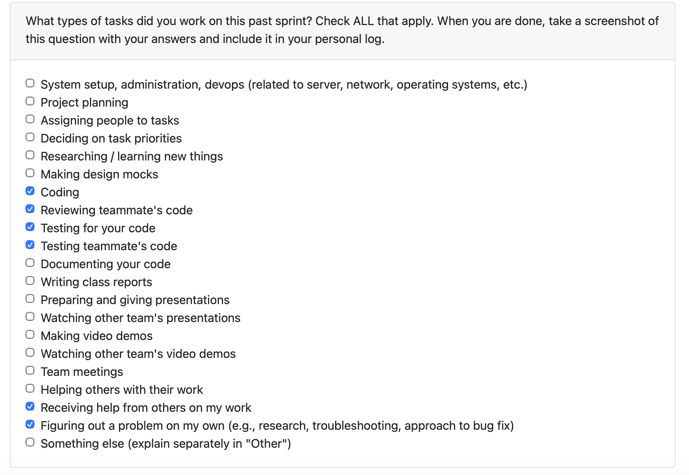
Week recap:
This week, I worked on 2 PRs:

First PR: #535
This is a PR for projects page. There are 2 pages that is implemented in this PR, /projects and /projects/{project_id}. /projects page shows list of the projects along with it's thumbnail. While /projects/{project_id}, is the project detail when user click a certain project in /projects page. The projects/{project_id} page shows the thumbnail and allows user to edit and remove thumbnail, edit date or reset date into auto which goes back into our initial date detection, summary including contribution summary if it is collaborative, and feedbacks. It also has navigation to next/previous project following the order in the projects page, if next/previous project exist.

I got feedback from salma and adara on this PR about some unused styling sheet, and confirmation for removing thumbnail.

Second PR: #553
It is to test the page whether it is showing to the user as expected. Test cases are listed in the PR description.

PRs I reviewed:
#522: I reviewed this PR regarding the error message returned to be more specific.

#533: I reviewed this PR regarding the error in test due to changing token from the previous PRs.

#540: Approved this PR.

Next week plan: 
Probably designing web portfolio layout and implementing it.

## (T2 Week 10) Monday 9th March-Sunday 15th March
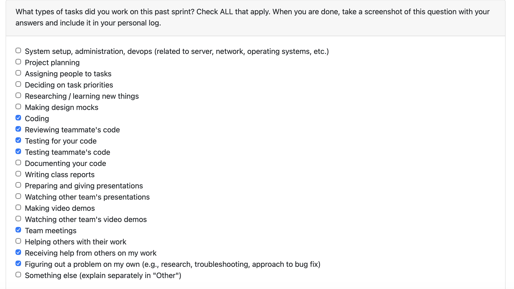
Week recap:
This week, I worked on 2 PRs:

First PR: #579
This is a PR for setting up the backend for the public page. For now, it only have the endpoints to support get project, project detail, ranking, skills. More endpoints such as heatmap and portfolio will be implemented to support the implementation of the public insights and output page.

This PR also implement the feature of setting which projects is public/private, and whether the public page is accessible or not.

Second PR: #584
This PR is the implementation of Public Projects and Public Project Details page. Public Projects only shows projects that the account owner sets to public, while public project details, shows the details such as summary, contribution, thumbnail, duration, and skills.

PRs I reviewed:
#576: I reviewed this PR regarding maximizing the utilisation of skills timeline endpoint by making a line chart to show the improvement of each skill from time to time

#590: I reviewed this PR regarding the consistency of the status update when user clicked each save button.

Next week plan: 
Continue implementing public page for the output and insights. Planning to have it merged before Wednesday (Peer Testing)