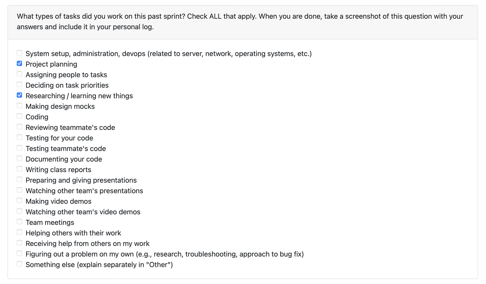
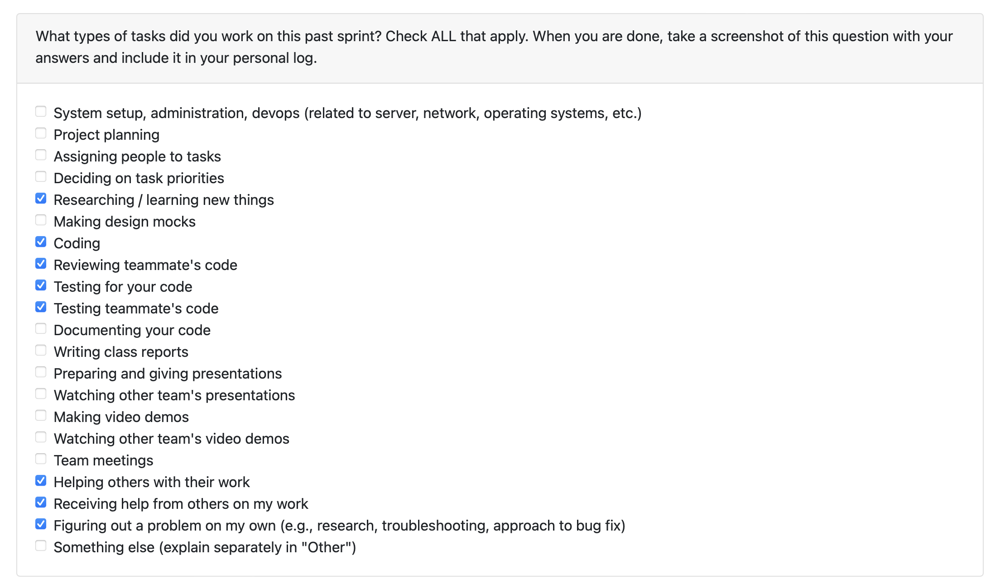
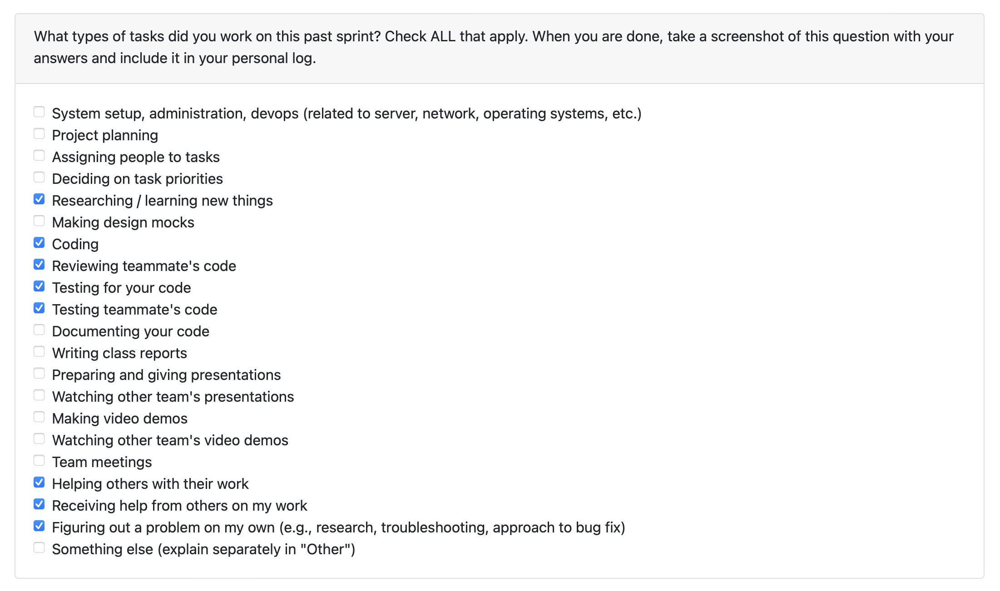
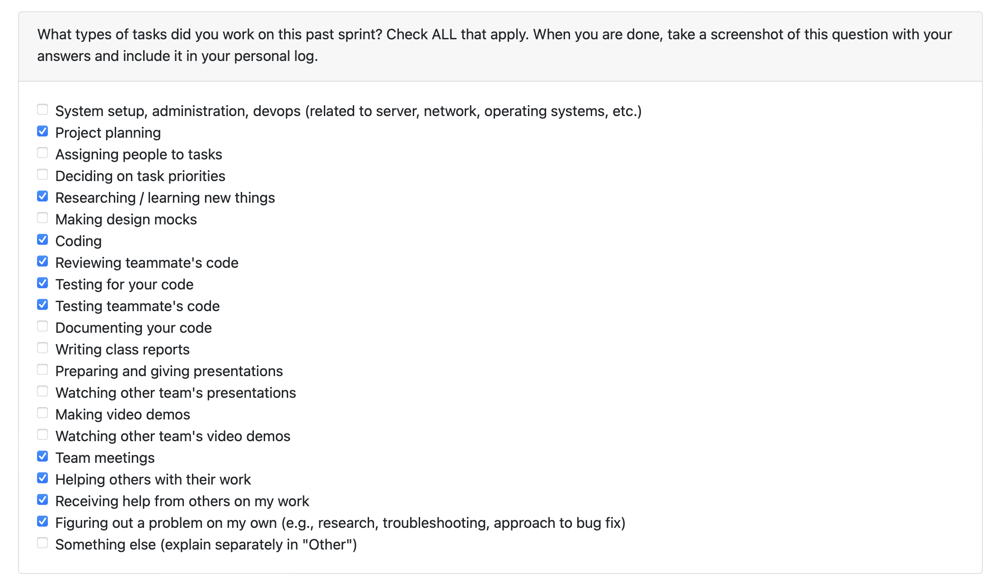
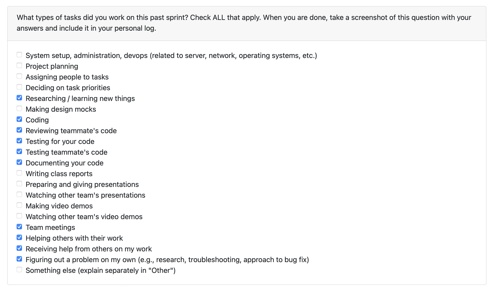
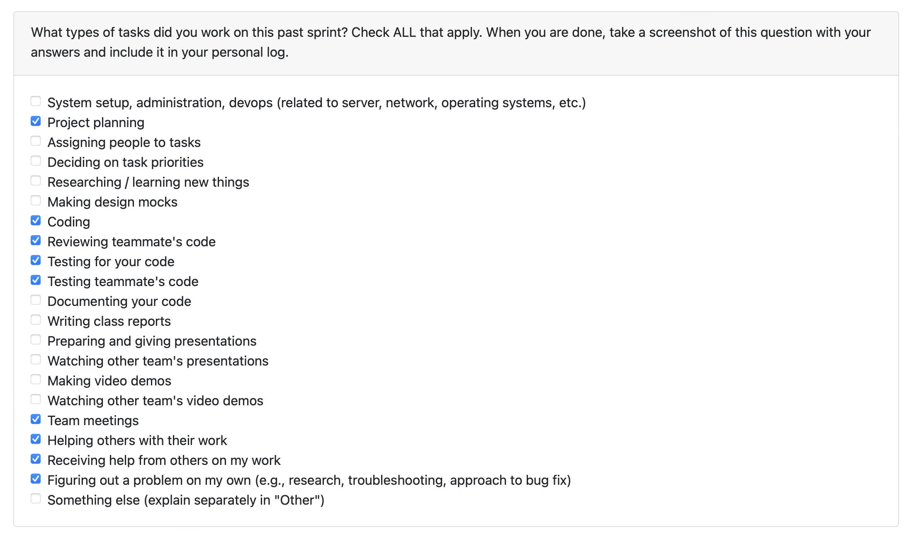
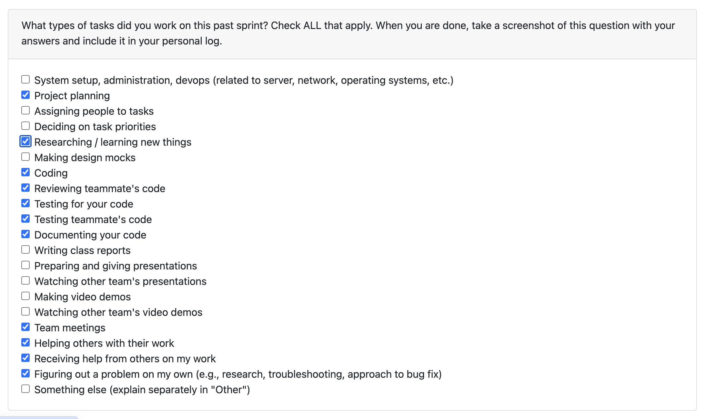
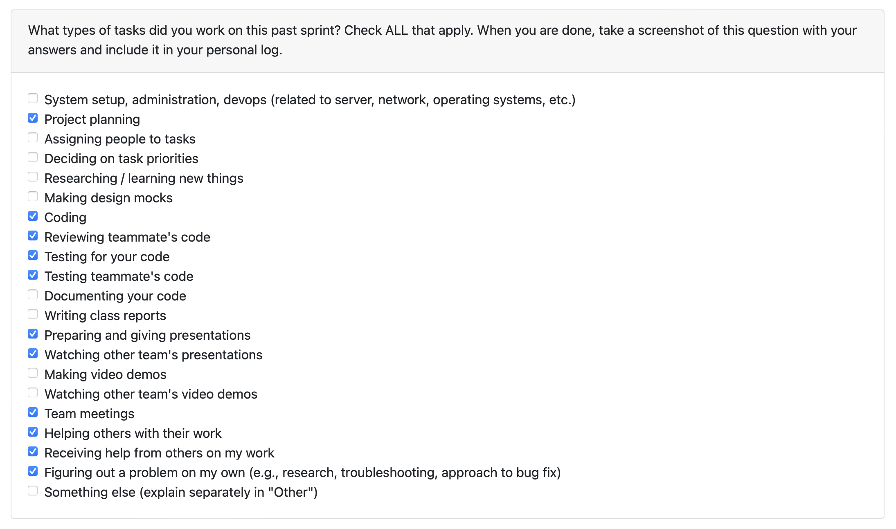
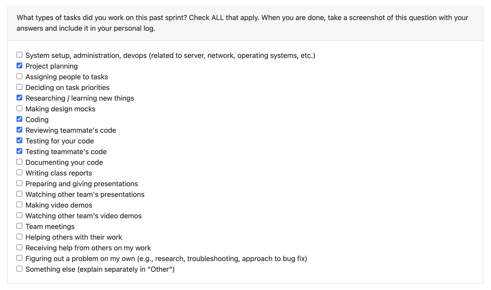
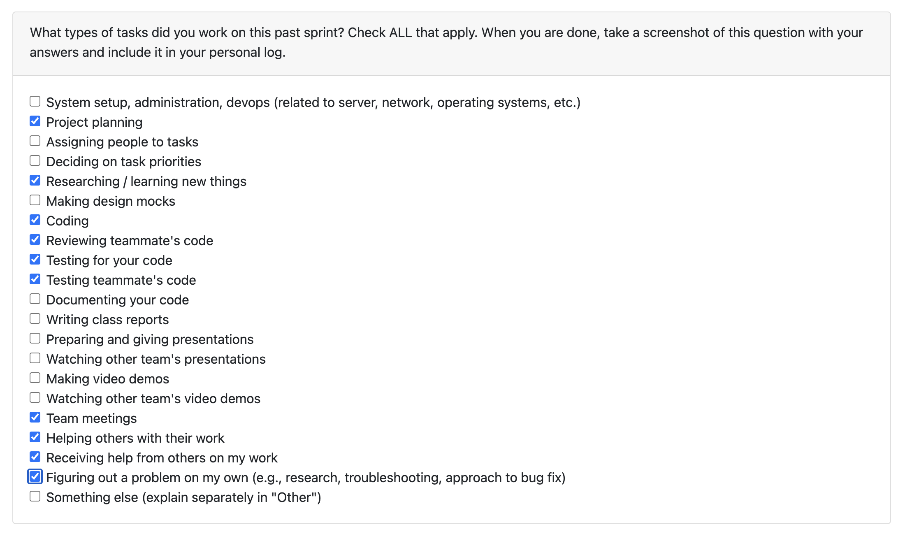

# Personal Log - Salma

## Table of Contents

### Term 2

- [Week 2 (Jan 12–18)](#t2-week-2-monday-january-12---sunday-january-18)
- [Week 1 (Jan 5–11)](#t2-week-1-monday-january-5---sunday-january-11)

### Term 1

- [Week 14 (Dec 1–7)](#week-14-monday-1st-december---sunday-7th-december)
- [Week 13 (Nov 24–30)](#week-13-monday-november-24---sunday-november-30)
- [Week 12 (Nov 17–23)](#week-12-monday-november-17---sunday-november-23)
- [Week 10 (Nov 3–9)](#week-10-monday-november-3---sunday-november-9)
- [Week 9 (Oct 27–Nov 2)](#week-9-monday-27th-october---sunday-2nd-november)
- [Week 8 (Oct 20–26)](#week-8-monday-20th-october---sunday-26th-october)
- [Week 7 (Oct 13–19)](#week-7-monday-13th-october---sunday-19th-october)
- [Week 6 (Oct 6–12)](#week-6-monday-6th-october---sunday-12th-october)
- [Week 5 (Sept 29–Oct 5)](#week-5-monday-29th-september---sunday-5th-october)
- [Week 4 (Sept 22–28)](#week-4-monday-22nd---sunday-28th-september)
- [Week 3 (Sept 15–21)](#week-3-monday-15th---sunday-21st-september)

---

## (Week 3) Monday 15th - Sunday 21st September

Week recap:

- Discussed the initial project details with the team and brainstormed functional and non-functional requirements.
- Met with other groups to compare requirements, took notes, and revised the list based on feedback and online team discussions.
- Reviewed and approved some pull requests on GitHub.

## (Week 4) Monday 22nd - Sunday 28th September

Week recap:

- Met with the team on Monday to discuss and draft the initial architecture diagram. Took notes, compared with another team on Wednesday, and revised the diagram.
- Created a shared Figma file for design collaboration and architecture diagram development.
- Researched the audio function and integrated it into both the architecture diagram and dashboard visualization. The accompanying document outlines the workflow, including audio input, preprocessing, transcription, speaker diarization, and categorization into work or non-work artifacts with summary metrics.
- Worked on the proposed solution and use cases for the project proposal.

## (Week 5) Monday 29th September - Sunday 5th October

Week recap:

- Built the Data Flow Diagram (DFD) with the team on Monday.
- Met with another team on Wednesday to compare diagrams and took notes.
- Researched the differences between DFD Level 0 and Level 1.
- Prepared a Figma file and reusable diagram template to make teamwork easier.

## (Week 6) Monday 6th October - Sunday 12th October

Week Recap:

- Reviewed the professor’s requirements and discussed them with the team during Wednesday’s class.
- Worked on the consent feature: drafted the consent text, implemented logic to store consent responses in the SQLite database, and wrote tests to ensure both accepted and rejected responses are stored correctly.
- Made several adjustments based on feedback e.g. incorporated Ammaar’s suggestion to add the .db file to .gitignore and ensured test data doesn’t pollute the actual user consent database.
- Provided comments and suggestions on pull requests, such as the file output placement in Timmi’s ZIP parsing PR. Also reviewed other PRs, including DFD Level 1 (Ammaar) and WBS (Johanes).

## (Week 7) Monday 13th October - Sunday 19th October

Week recap:

- Worked on implementing user configuration based on username or user_id for future uses. This feature allows users to save and modify their user consent and LLM consent settings. It also handles edge cases, such as when a user is logged in but has not yet set their configuration, or when only a partial configuration is provided. Additionally, I created a local database view (latest_user_consent) for quick lookups of usernames and their most recent consent settings.
- Provided comments and suggestions on multiple PRs. For example, I reviewed Timmi’s PR and suggested storing file metadata based on username or user_id. I also reviewed Johanes’ PR and provided some suggestions for next steps.

## (Week 8) Monday 20th October - Sunday 26th October

Week Recap:

- Continued Timmi’s PR to fix the send_to_analysis flow for correctly directing individual and collaborative work. Made adjustments based on feedback, such as adding missing arguments and implementing a loop system for user prompts.
- Reviewed several PRs and provided feedback e.g., Ammaar’s PR on consent flow logic, Timmi’s PR on redirecting individual vs. collaborative work, and Adara’s PR on using bullet points instead of paragraphs in resumes.
- Worked on code collaborative analysis to detect .git folders and generate metrics like the number of commits and overall summary per project.

Next steps: continue developing the code collaborative analysis for global summaries from all projects (possibly using LLMs), refactor the code, and move on to non-code collaborative analysis.

## (Week 9) Monday 27th October - Sunday 2nd November

Week Recap:

- Refactored code_collaborative_analysis.py to reuse language and framework detection functionality, separate core logic from helpers, and integrate project classifications (classification = collaborative, type = code).
- Reviewed and provided feedback on some PRs (e.g. Ammaar’s and Johanes’s) to make the language/framework detection and metrics output more user-friendly.
- Worked on generating summaries for all code-collaborative projects using Git metrics and user input (without LLM).

Next Steps: improve the non-LLM summary generation for code-collaborative analysis based on feedback from Johanes and Timmi e.g. use NLTK for stopword removal and provide a user input template. If time allows, I also plan to store the metrics into the DB.

## (Week 10) Monday November 3 - Sunday November 9

Week recap:

- Improved the summary of non-llm code collaborative analysis:

  - Provided a template to the user with clear instructions and an example input (e.g., “please include what the project does, your technical focus, your contribution,” etc.). Shortened and reformatted the template into bullet points based on Timmi’s feedback.
  - Fixed a related bug: only asks for user input if the user rejects LLM consent, and the question is moved earlier (before any analysis) to avoid redundant prompts per project.
  - Enhanced the stopwords filter for keyword extraction from all user inputs using NLTK.

- Reviewed and provided some feedback on some PRs, for example:
  - Reviewed Timmi’s PR on GitHub metrics to suggest handling runtime errors (e.g., empty repos, missing GitHub client ID) gracefully by printing error messages and continuing the program instead of stopping.
  - Suggested renaming Ammaar’s non-LLM metrics table to non_llm_text for consistency with Johanes’ llm_text table.

Next week: I plan to store non-LLM code collaborative metrics (was unsure about the DB refactoring but now resolved). If time allows, I also plan to refactor the repo structure to include subfolders such as e.g., consent/, common/, text_individual_analysis/, etc.

## (Week 12) Monday November 17 - Sunday November 23

I postponed storing the non-LLM collaborative code metrics because a few milestone-1 tasks became higher priority. Here’s what I completed over the past weeks:

- PR #206 (Repo restructuring during reading week)

  - Refactored the src/ directory into clearer subfolders for better organization and maintainability.
  - Updated all related imports and path references across scripts and tests.
  - Applied Timmi’s suggestion to rename common/ to utils/ to follow industry standard.

- PR #233 (Code activity-type detection basic logic pipeline)

  - Implemented build_activity_summary() to aggregate activity counts from files and PRs, including percentage breakdowns.
  - Added a standardized formatter for both individual and collaborative analysis flows.
  - Created test_code_activity_type.py to validate path shortening, formatter output, and aggregation logic.
  - Activity detection uses keyword matching on filenames and PR text (e.g., test/spec → Testing, readme/md → Documentation, refactor/fix/bug/docs in PRs → corresponding category). Anything else defaults to Feature Coding.

- PR #238 (Improvements for PR #233)

  - Integrated user-associated files into the collaborative analysis logic.
  - Incorporated teammate feedback: removed duplicate imports (Ammaar), excluded dependency files by reusing the list from the non-LLM analysis (Johanes), and moved SQL-related queries into src/db (Ivona).
  - Updated the console output to a cleaner table format.
  - Store data in code_activity_metrics.
  - Updated and expanded tests to cover all edge cases.

- Reviewed and provided feedback on several PRs, including:
  - Johanes’ PR on text activity detection, suggesting that SQL-related queries be moved into src/db.
  - Timmi’s PR on the GitHub analysis function, recommending a quick word/topic-diversity check to ensure comments are actually meaningful.
  - Ammaar’s PR on collaborative code-skill detection, suggesting a clearer table name change from user_file_contributions to user_code_contributions.

Next Week: I plan to re-run main to identify and fix remaining issues/possible edge cases (e.g., the text-individual flow) to finish Milestone 1. I’ll also discuss with the team whether the terminal-output reformatting task can be split into smaller subtasks. If still needed, I’ll also store the non-LLM collaborative code metrics.

## (Week 13) Monday November 24 - Sunday November 30

Week Recap

- In Monday’s class, I discussed team contract and coordinated the plan for the week with teammates.
- PR #269: I implemented storage for code-collaborative metrics and both LLM and non-LLM summaries. I also wrote tests covering metric insertion and updates, safe handling of missing or partial sections, and storing both summary types for the same project.
- PR #283: I worked on retrieving previously generated portfolio information, including each project's title, importance score, type, mode, duration, activity breakdown, skills, and summary. I loaded primary metadata from the project_summaries table and fetched missing details from the relevant supporting tables. I added tests for scenarios such as no projects, a single project, multiple projects, and missing values. I also integrated teammate feedback by adding a shared test helper and moving helpers outside src/menu/portfolio.py.
- PR #291: I fixed path-resolution issues for code and text projects. This included addressing incorrect detection of the same .git directory across multiple projects, ensuring text-analysis tasks properly detect supporting files, etc. I implemented a three-path lookup (zip_name/project_name, zip_name/individual/project_name, zip_name/collaborative/project_name). I removed unused functions and updated all related tests.

I also reviewed and provided feedback on several PRs, including:

- Ammaar’s PR on speeding up Google Drive linking, where I asked clarifying questions and identified test issues.
- Timmi’s PR on project-ranking scoring, where I recommended a threshold-based approach, though a stronger weighted method using Shannon entropy was ultimately implemented.
- Johanes’ and Adara’s PR, where I helped verify that code metrics and text offline metrics were stored correctly in the database.

Next week: I plan to help with the presentation or demo, and update the README to prevent zip path issues. I will also re-run main to identify and fix remaining issues and edge cases if available.

## (Week 14) Monday 1st December - Sunday 7th December

Week Recap:

- I worked on PR #307, where I added a verbose logging option allowing users to switch between detailed debug output and a clean minimal view. I implemented a global VERBOSE flag, added runtime prompts, and reviewed all major execution paths (code/text, individual/collaborative, with/without GitHub/GDrive) to ensure the logs behave correctly. I also added and updated tests to cover both verbose and non-verbose cases.
- I collaborated with the team on the project presentation (I mainly worked on the local .git detection logic and code activity type slides) and practicing speaking delivery. I reviewed teammates’ content to ensure I could contribute confidently during the presentation and Q&A. I also completed peer evaluations for the other teams.

I also reviewed and provided feedback on several PRs, including:

- Ammaar’s PR on keyword search and Populate Code Contribution when local .git is unavailable. I suggested moving DB related queries to src/db to maintain consistency with our repository structure.
- Ivona’s PR on implementation of text collaborative contribution skills. I found three test failures caused by a mismatch between the function logic and the test expectations. The code uses different weights (1.6 instead of 1.4 for questions) and calculates balance using ratios rather than absolute difference, so the tests may need to be updated to align with the logic.
- Johanes’ PR on the system architecture diagram update. I suggested updating the diagram so that all four analysis modes (text and code in both individual and collaborative formats) connect to activity type detection. I also recommended reflecting that collaborative code analysis checks for a .git folder before prompting GitHub integration, and that individual code analysis also runs activity type detection and may request GitHub integration.

Next week: No sprint next week. I’m looking forward to coming back recharged next term and ready for Milestone #2.

## (T2 Week 1) Monday January 5 - Sunday January 11

I worked on PR #336, adding Word (.docx) export for the Portfolio and Resume views so users can generate documents from their analyzed project data. This included building DOCX exporters, adding menu prompts, standardizing layouts (skills, projects, contributions, summaries) to match the CLI, updating .gitignore to exclude ./out/, and updating python-docx dependencies.

I also reviewed PRs from Ammaar (incorporating key roles) to suggest reusing existing summaries, Johanes (project re-ranking) to ensure it works correctly, and Timmi (duplicate detection) to suggest minor UI improvements.

Next week: I plan to add support for project images as thumbnails and include them in DOCX exports for resume and portfolio. I’ll also check with the TA and the team on whether we should support multiple portfolios or keep a single one.

## (T2 Week 2) Monday January 12 - Sunday January 18

I worked on PR [#368](https://github.com/COSC-499-W2025/capstone-project-team-19/pull/368) to improve resume exporting. This included refining contribution bullet points, reorganizing the resume into proper sections (profile, skills, projects, and education), removing unnecessary placeholder text, and adding PDF export support. Based on review feedback, I removed language percentage from the resume exporting and retained only languages with dominance above 10%.

I worked on PR [#372](https://github.com/COSC-499-W2025/capstone-project-team-19/pull/372) to enable users to associate an image with a project's thumbnail. This introduced a “Manage project thumbnails” menu, centralized image storage via an /images directory, database support through a new project_thumbnails table, and integration of thumbnails into portfolio exporting. In response to review feedback, I standardized thumbnail image sizes, resolved image duplication issues, and improved the UI.

I also reviewed some PRs such as:

- Ammaar's PR ([#355](https://github.com/COSC-499-W2025/capstone-project-team-19/pull/355) on customizing resume) to suggest adding an option to add or remove contribution bullet points.
- Johanes' PR ([#338](https://github.com/COSC-499-W2025/capstone-project-team-19/pull/338) on editing project chronology) to add more validation checks when inserting dates.
- Timmi's PR ([#363](https://github.com/COSC-499-W2025/capstone-project-team-19/pull/363) on duplicate checking) to give a suggestion on fixing path issues.

Next week: I plan to add PDF exporting support for portfolios, and potentially take on a task related to API endpoints or other task decided during the team meeting.
