# Team Log

## Table of Contents

### Term 2

- [Week 1 (Jan 5-11)](#term-2-week-1-monday-january-5---sunday-january-11)
- [Week 2 (Jan 12-18)](#term-2-week-2-monday-january-12---sunday-january-18)
- [Week 3 (Jan 19-25)](#term-2-week-3-monday-january-19---sunday-january-25)
- [Week 4 + 5 (Jan 26 - Feb 8)](#term-2-week-4-5-monday-january-26---sunday-february-8)
- [Week 6-8 (Feb 9 - Mar 1)](#term-2-week-6-8-monday-february-9---sunday-march-1)
- [Week 9 (Mar 2-8)](#term-2-week-9-monday-march-2---sunday-march-8)
- [Week 10 (Mar 9-15)](#term-2-week-10-monday-march-9---sunday-march-15)
- [Week 11 + 12 (Mar 16 - 29)][]

### Term 1

- [Week 14 (Dec 1-7)](#week-14-monday-december-1---sunday-december-7)
- [Week 13 (Nov 24-30)](#week-13-monday-november-24---sunday-november-30)
- [Week 12 (Nov 17-23)](#week-12-monday-november-17---sunday-november-23)
- [Week 10 (Nov 3-9)](#week-10-monday-november-3---sunday-november-9)
- [Week 9 (Oct 27 - Nov 2)](#week-9-monday-27th-october--sunday-2nd-november)
- [Week 8 (Oct 20-26)](#week-8-monday-20th---sunday-26th-october)
- [Week 7 (Oct 13-19)](#week-7-monday-13th---sunday-19th-october)
- [Week 6 (Oct 6-12)](#week-6-monday-6th---sunday-12th-october)
- [Week 5 (Sept 29 - Oct 5)](#week-5-monday-29th-september---sunday-5th-october)
- [Week 4 (Sept 22-28)](#week-4-monday-22nd---sunday-28th-september)
- [Week 3 (Sept 15-21)](#week-3-monday-15th---sunday-21st-september)

## (Week 3) Monday 15th - Sunday 21st September

Week recap: The team discussed and worked on creating a list of functional and non-functional requirements. On Wednesday, during class we met with other teams and compared requirements.

Discussion went well with other teams, we found out that there are some features that our team has, while other's not, and vice versa.

Such as other team has trend analysis and onboarding tutorial while our team does not
Our team has a feature where we ask for user's permission, while other team does not.

### Additional Context

| Team    | Highlights                                                                                                                                                                                                                                                                                    |
| ------- | --------------------------------------------------------------------------------------------------------------------------------------------------------------------------------------------------------------------------------------------------------------------------------------------- |
| Team 20 | **Functional:** More detailed file classification (e.g., programming language and type). **Functional:** Analysis runs only on new files to avoid redundancy. **Security:** Omits user permission requests before accessing local files.                                                |
| Team 17 | **Functional:** Adds trend analysis visualizations and file previews for user approval. **Non-functional:** Groups requirements under performance, scalability, reliability, security, maintainability, and privacy. **New:** Includes an onboarding/tutorial experience at app launch. |
| Team 3  | **Functional:** Generates resume bullet points and provides a timeline visualization. **Non-functional:** Favors a modular codebase design. **Use Case:** Extends the system to HR platforms and hiring managers.                                                                       |

Plan for the next cycle: Discussing about team's project proposal and architecture diagram that will be submitted next week

## (Week 4) Monday 22nd - Sunday 28th September

### Week recap:

The team worked on building the architecture diagram and writing the project proposal. On Wednesday, we conversed with other teams about their architecture diagrams, then regrouped to discuss what we liked, didn't like, and what we wanted to add/expand on in our own diagram. We also finally decided to work on native app instead of web app considering the challenges of learning new things that might be useful for us in the future.

For the project proposal, we divided writing responsibilities among the team. We also split up research tasks for the different file type functions. Team members researched approaches for text (PDF, DOCX), images, videos, audio, csv, and code analysis as well as retrieving data from online sources (Google Drive and Github). We integrated our research into the architecture diagram, and the dashboard visualization was expanded to include them.

### Burnup chart

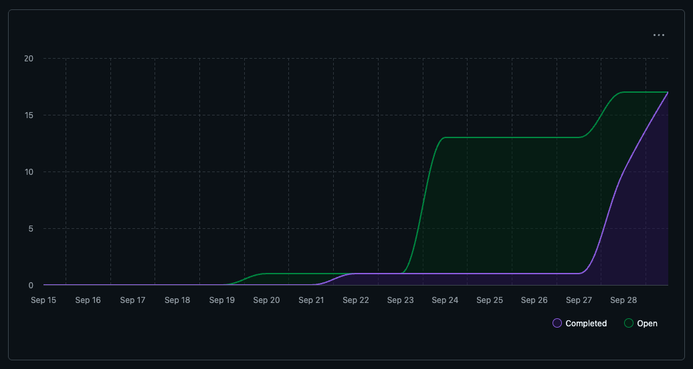

### Github usernames

| GitHub Username | Student Name          |
| --------------- | --------------------- |
| `AdaraPutri`    | Adara Putri           |
| `ammaarkhan`    | Ammaar Khan           |
| `ivonanicetin`  | Ivona Nicetin         |
| `johaneshp`     | Johanes Hamonangan    |
| `salmavkh`      | Salma Vikha Ainindita |
| `taoTimTim`     | Timmi Draper          |

### Table view of completed tasks by username

| GitHub Username | Screenshot                                                                  |
| --------------- | --------------------------------------------------------------------------- |
| `AdaraPutri`    | 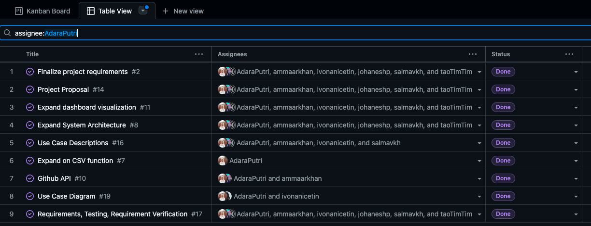     |
| `ammaarkhan`    | 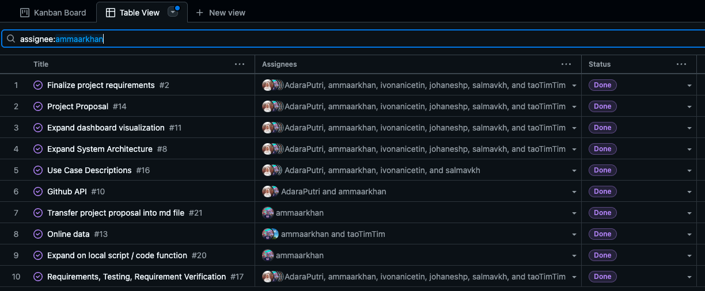   |
| `ivonanicetin`  | 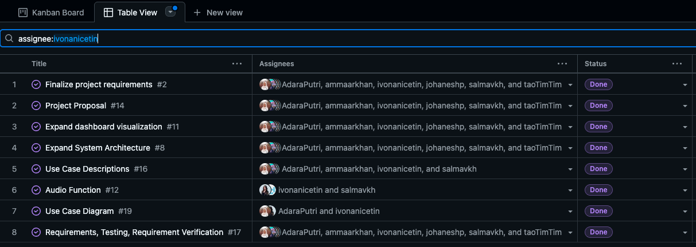     |
| `johaneshp`     | 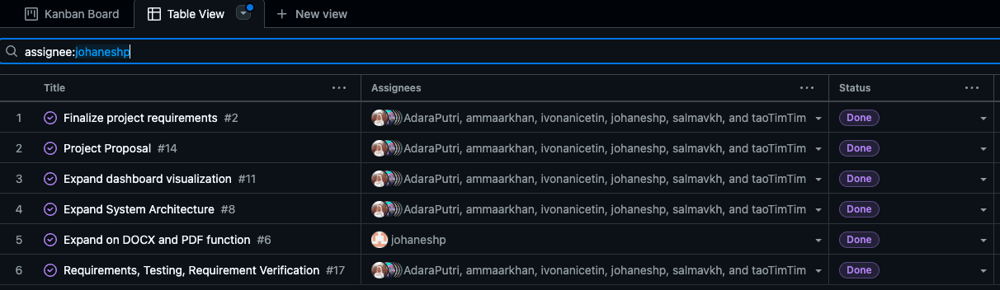 |
| `salmavkh`      | 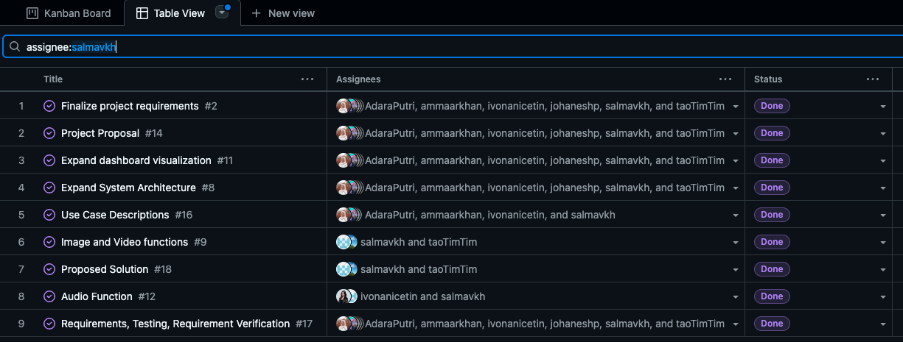     |
| `taoTimTim`     | 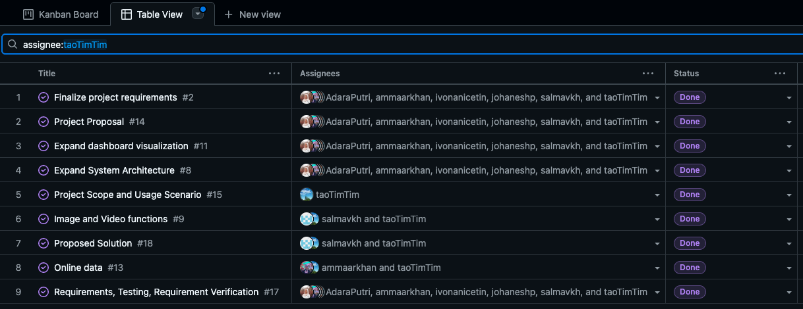     |

### Table view of in progress tasks by username

Not applicable – no tasks in progress.

### Additional context

#### Differences/Similarities with Other Teams' Architecture Diagrams

| Team    | Takeaways                                                                                                                                                                                                                                                              |
| ------- | ---------------------------------------------------------------------------------------------------------------------------------------------------------------------------------------------------------------------------------------------------------------------- |
| Team 14 | Included a portfolio builder that we decided to skip. Connected with GitHub, which inspired us to add that feature. Plans to leave room for a future web frontend rather than staying app-only. Stored both raw and processed data (we don't store raw data). |
| Team 15 | Avoids using a database, keeping everything local. Does not support music, audio, or video files (we plan to include them). Has post-processing in between ML and metrics steps to tidy up the data.                                                             |
| Team 18 | Also uses Electron to support cross-platform desktop development.                                                                                                                                                                                                      |

Plan for next cycle: Build the Data Flow Diagram (DFD) that must be submitted next week

## (Week 5) Monday 29th - Sunday 5th October

### Week recap:

The team focused on building the Data Flow Diagram (DFD). On Monday, we collaborated to draft Level 0 and Level 1, aligning on system boundaries, external entities, and the major data stores and flows. We looked at examples and articles online to understand the difference between a Level 0 and Level 1 diagram and consulted the professor on our DFD Level 1 draft in class. The feedback was to break down the different metric functions like we did in the System Architecture diagram and to include separate arrows from the "Categorize File" process to each functions. On Wednesday, we went around in class comparing DFDs with other teams, then regrouped to discuss what we liked, didn't like, and what we wanted to refine or add to our diagrams.

### Burnup chart

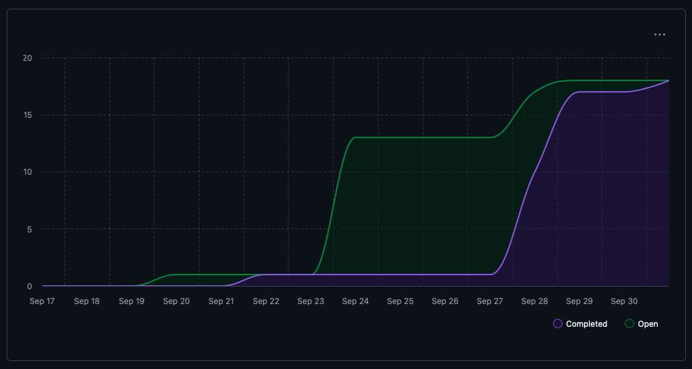

### Github usernames

| GitHub Username | Student Name          |
| --------------- | --------------------- |
| `AdaraPutri`    | Adara Putri           |
| `ammaarkhan`    | Ammaar Khan           |
| `ivonanicetin`  | Ivona Nicetin         |
| `johaneshp`     | Johanes Hamonangan    |
| `salmavkh`      | Salma Vikha Ainindita |
| `taoTimTim`     | Timmi Draper          |

### Table view of completed tasks by username

| GitHub Username | Screenshot                                                                    |
| --------------- | ----------------------------------------------------------------------------- |
| `AdaraPutri`    |      |
| `ammaarkhan`    |    |
| `ivonanicetin`  |      |
| `johaneshp`     |  |
| `salmavkh`      | 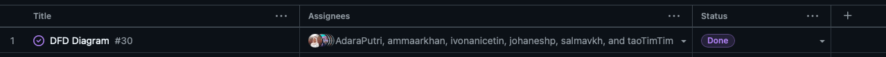     |
| `taoTimTim`     |      |

### Table view of in progress tasks by username

Not applicable – no tasks in progress.

### Additional context

#### Differences/Similarities with Other Teams' DFD Diagrams

| Team    | Takeaways                                                                                                                                                                                                                                                                   |
| ------- | --------------------------------------------------------------------------------------------------------------------------------------------------------------------------------------------------------------------------------------------------------------------------- |
| Team 11 | Focuses on scanning file metadata rather than calculating metrics. Lacks a dedicated metrics module and renders the dashboard as static HTML. We still need clarity on how their data extraction supports the insights they expect to present.                        |
| Team 17 | Level 0 and Level 1 structures align closely with ours. Introduces error logging and an artifact database, though the data ingestion flow remains unclear. Aims to output a portfolio experience instead of a dashboard; users can opt out of saving to the database. |
| Team 15 | Restricts processing to text files only, applying an ML model for every document. Does not handle images or video sources. Open questions on what metrics they intend to surface from the ML pipeline.                                                                |

## (Week 6) Monday 6th - Sunday 12th October

### Week recap:

This week, the team focused on moving from design to implementation, refining both the System Architecture Diagram and DFD Level 1 to reflect all updated project requirements and new modules like offline processing. The team also began coding key system features: setting up the local environment, implementing ZIP file parsing, and enhancing it with error handling for unsupported and duplicate files, MIME validation, and detailed logging. Unit tests were added to ensure these features work as intended. Additionally, the team worked on creating and testing the consent form for external service usage, ensuring responses are correctly stored in the database. Everyone reviewed and refined multiple PRs, aligning coding progress with the finalized system design.

### Burnup chart

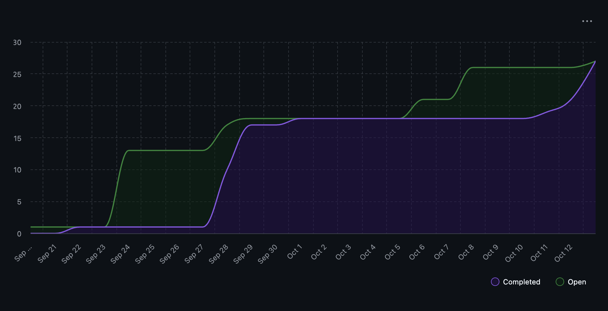

### Github usernames

| GitHub Username | Student Name          |
| --------------- | --------------------- |
| `AdaraPutri`    | Adara Putri           |
| `ammaarkhan`    | Ammaar Khan           |
| `ivonanicetin`  | Ivona Nicetin         |
| `johaneshp`     | Johanes Hamonangan    |
| `salmavkh`      | Salma Vikha Ainindita |
| `taoTimTim`     | Timmi Draper          |

### Table view of completed tasks by username

| GitHub Username | Screenshot                                                                |
| --------------- | ------------------------------------------------------------------------- |
| `AdaraPutri`    | 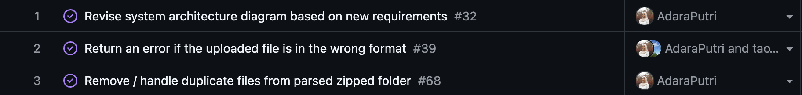     |
| `ammaarkhan`    | 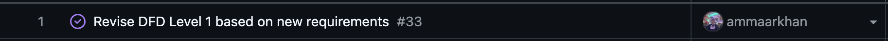   |
| `ivonanicetin`  | 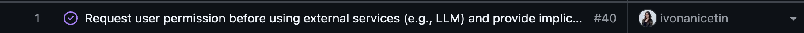     |
| `johaneshp`     | 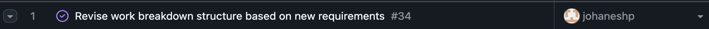 |
| `salmavkh`      | 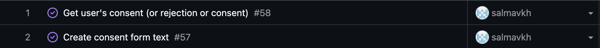     |
| `taoTimTim`     | 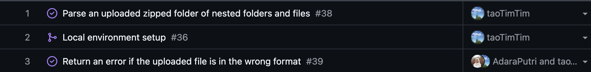     |

### Table view of in progress tasks by username

Not applicable – no tasks in progress.

## (Week 7) Monday 13th - Sunday 19th October

### Week recap:

This week, the team continued implementation work for Milestone 1, completing several major system features. Timmi added the Pull Request template, fixed a Windows-specific MIME-type detection bug to ensure consistent file recognition across platforms, and completed the integration of ZIP file parsing with metadata storage in the local SQLite database. Salma implemented user-configuration storage, enabling persistent saving of user consent preferences (accepted and rejected for both LLM usage and file parsing). Ivona completed the feature for detecting and identifying the programming language and framework used in uploaded coding projects. Ammaar developed the feature that distinguishes individual projects from collaborative ones, allowing the system to identify when files belong to shared repositories versus solo workspaces for more accurate contribution tracking. Johanes implemented the alternative analysis feature, ensuring that when user data cannot be sent to an external service, the system automatically performs a local analysis to maintain functionality and data privacy. Adara implemented the advanced text function, which analyzes text files using LLM and prints the metrics found to the user.

### Burnup chart

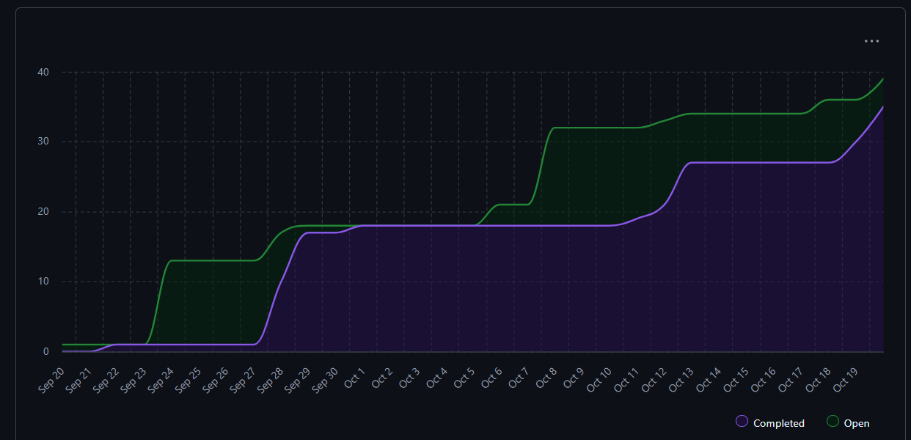

### Github usernames

| GitHub Username | Student Name          |
| --------------- | --------------------- |
| `AdaraPutri`    | Adara Putri           |
| `ammaarkhan`    | Ammaar Khan           |
| `ivonanicetin`  | Ivona Nicetin         |
| `johaneshp`     | Johanes Hamonangan    |
| `salmavkh`      | Salma Vikha Ainindita |
| `taoTimTim`     | Timmi Draper          |

### Table view of completed tasks by username

| GitHub Username | Screenshot                                                                    |
| --------------- | ----------------------------------------------------------------------------- |
| `AdaraPutri`    | 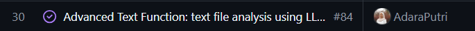     |
| `ammaarkhan`    |    |
| `ivonanicetin`  | 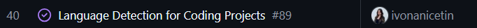     |
| `johaneshp`     | 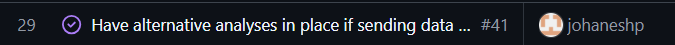 |
| `salmavkh`      |      |
| `taoTimTim`     | 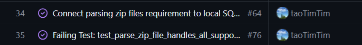     |

### Table view of in progress tasks by username

Not applicable – no tasks in progress.

## (Week 8) Monday 20th - Sunday 26th October

### Week recap:

This week, the team focused on improving the analysis pipeline, database consistency, and overall user experience. Ammaar implemented a fix ensuring that the program exits cleanly when a user declines consent, and updated the parsing process so that each file now stores its associated project name, making downstream grouping and analysis more reliable. Timmi developed the project-type classification feature, enabling automatic detection of whether a project is code- or text-based and routing it accordingly. She also added a safeguard to prevent duplicate ZIP uploads from being reprocessed in the database. Salma refined the send_to_analysis flow by adding user prompts between individual and collaborative analysis phases, reorganizing functions for clarity, and ensuring a smoother, more modular pipeline. Johanes improved the alternative analysis logic by refining keyword filters, applying POS tagging, and enhancing topic extraction to ensure that only meaningful terms are analyzed during local runs. Ivona refactored the language detection module to align with the new database schema, ensuring accurate identification of languages used in code projects, and added features to detect frameworks of a coding project by identifying the configuration/dependency files in a given project. Adara fixed an issue where ZIP uploads containing only files (and no folders) caused the program to stop, and added an LLM-based code analysis feature that generates resume-style summaries for entire code project by extracting README content, function definitions, and comments across each folder.

Plan for next week:
Next week, the team plans to continue to implement the milestone 1 requirements.
Adara plans to keep implementing the code and text file analysis.
Ammaar will implement deleting the `zip_data` folder after parsing.
Ivona plans to implement better language/framework detection to include more languages and frameworks.
Timmi plans to cotinue implementing more file analysis and to add more duplications checks.
Johanes plans to continue implementing analysis of code.
Salma plans to continue developing the code collaborative analysis for global summaries from all projects (possibly using LLMs), refactor the code, and move on to non-code collaborative analysis.

We're going to meet virtually on Monday to discuss further about our plans.

### Burnup chart

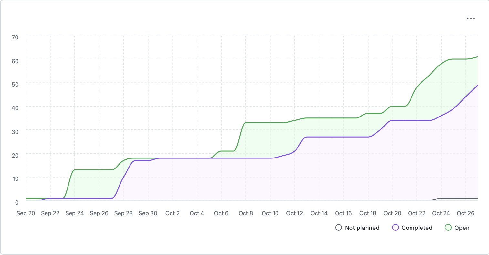

### Github usernames

| GitHub Username | Student Name          |
| --------------- | --------------------- |
| `AdaraPutri`    | Adara Putri           |
| `ammaarkhan`    | Ammaar Khan           |
| `ivonanicetin`  | Ivona Nicetin         |
| `johaneshp`     | Johanes Hamonangan    |
| `salmavkh`      | Salma Vikha Ainindita |
| `taoTimTim`     | Timmi Draper          |

### Table view of completed tasks by username

| GitHub Username | Screenshot                                                                    |
| --------------- | ----------------------------------------------------------------------------- |
| `AdaraPutri`    | 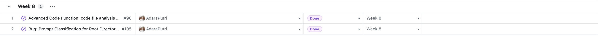     |
| `ammaarkhan`    | 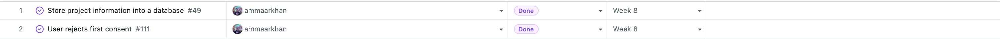   |
| `ivonanicetin`  | 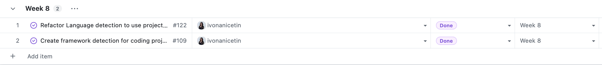     |
| `johaneshp`     | 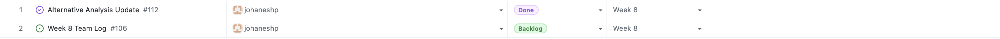 |
| `salmavkh`      | 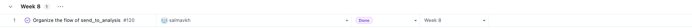     |
| `taoTimTim`     | 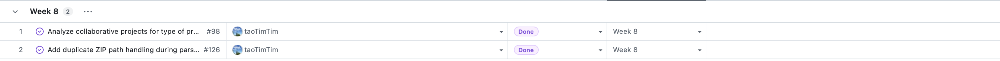     |

### Table view of in progress tasks by username

| GitHub Username | Screenshot                                                                   |
| --------------- | ---------------------------------------------------------------------------- |
| `ivonanicetin`  | 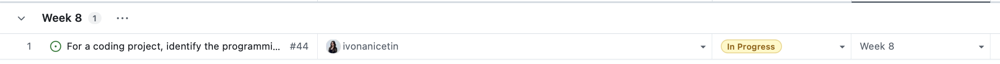 |

## (Week 9) Monday 27th October – Sunday 2nd November

### Week recap

The team focused on improving project-level analysis and expanding what data we can work with. Adara refactored both text and code LLM pipelines so each project now produces git-aware metrics, project summaries, and contribution highlights, all organized by project folder. Ammaar added cleanup functionality to delete the extracted ZIP workspace after processing and switched our language detector to Pygments, which lets us support way more programming languages. Ivona set up the Google Drive OAuth flow so users can authorize and pull their cloud documents directly into our analysis pipeline. Johanes built the first version of individual code metrics that work outside the LLM path, giving us consistent baselines even when users don't consent to LLM usage. Salma streamlined the collaborative code analyzer by reusing our language and framework detectors and improving the non-LLM summaries we generate from git history. Timmi implemented the GitHub OAuth handshake so collaborative projects can connect to repositories for better contribution breakdowns later on.

### Plan for the next cycle

- Adara will improve the code LLM flow by handling repos without git data and better README ingestion, plus align text output formatting with the code analyzer.
- Ammaar will start updating the database schema to store metrics and help with the external API data analysis.
- Ivona will keep expanding framework detection coverage and look into contribution metrics from the newly fetched Drive files.
- Johanes will save the new project metrics into the database so they can power future dashboards.
- Salma will iterate on the non-LLM collaborative summaries by adding NLP cleanup and storage based on team feedback.
- Timmi will use the new OAuth flow to pull contribution data from GitHub and continue refactoring the main CLI flow.

### Burnup chart

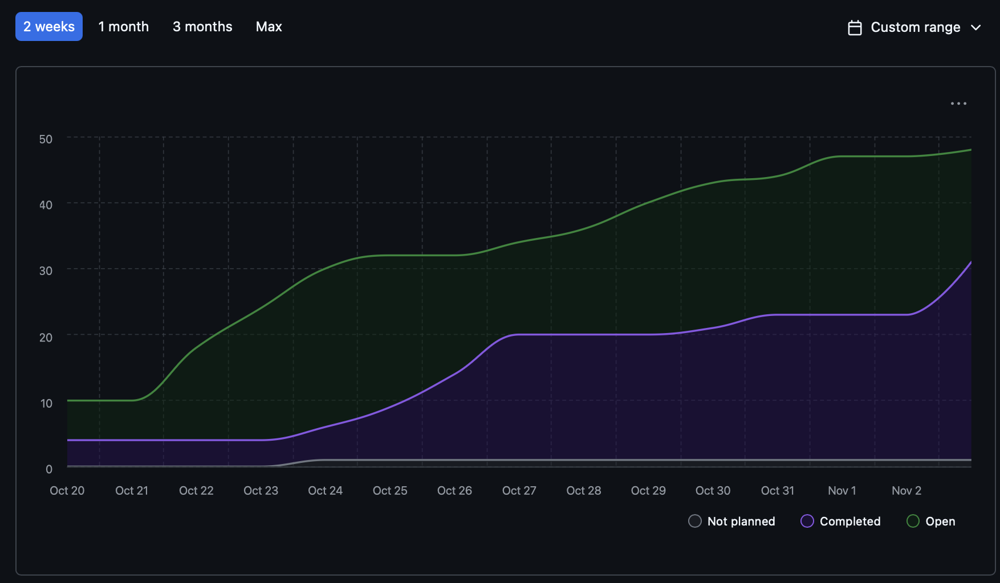

### Github usernames

| GitHub Username | Student Name          |
| --------------- | --------------------- |
| `AdaraPutri`    | Adara Putri           |
| `ammaarkhan`    | Ammaar Khan           |
| `ivonanicetin`  | Ivona Nicetin         |
| `johaneshp`     | Johanes Hamonangan    |
| `salmavkh`      | Salma Vikha Ainindita |
| `taoTimTim`     | Timmi Draper          |

### Table view of completed tasks by username

| GitHub Username | Screenshot                                                                   |
| --------------- | ---------------------------------------------------------------------------- |
| `AdaraPutri`    | 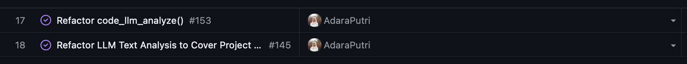     |
| `ammaarkhan`    | 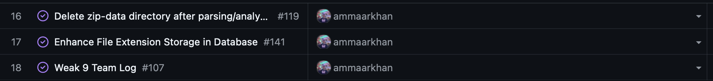   |
| `ivonanicetin`  | 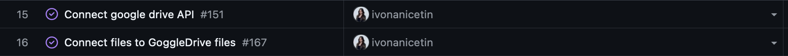     |
| `johaneshp`     | 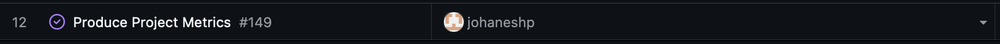 |
| `salmavkh`      | 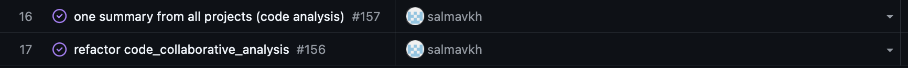     |
| `taoTimTim`     | 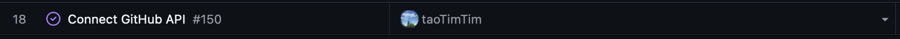     |

### Table view of in progress tasks by username

| GitHub Username | Screenshot                                                                   |
| --------------- | ---------------------------------------------------------------------------- |
| `ivonanicetin`  | 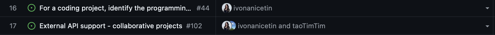 |
| `taoTimTim`     | 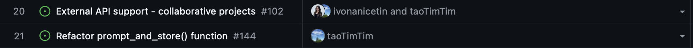 |

## (Week 10) Monday November 3 - Sunday November 9

### Week recap

This week, the team focused on improving how different parts of the system work together and ensuring the analysis pipeline runs smoothly across all file types. We added support for CSV files, linked Google Drive and GitHub data more effectively, and made sure results from both LLM and non-LLM analyses are stored consistently in the database. The main workflow was cleaned up to reduce repetition and make the overall process easier to follow, while user prompts and summaries were refined to produce clearer and more useful outputs. Through code reviews, shared testing, and close collaboration, the team resolved several integration issues and strengthened the overall reliability and flow of the project.

### Plan for the next cycle

The team will focus on linking related modules and improving data connections across the system. The CSV analysis will be connected to text outputs to make dataset results more complete and readable, while CSV metadata extraction will be expanded to support Google Sheets through the Google Drive API. The team will continue improving collaboration analysis by refining Google Drive and GitHub integrations, adding more API calls, and fixing remaining bugs. More tables and metrics will be added to the database (e.g., non-LLM code collaborative results) to make analysis outputs easier to track and reuse. Work will also continue on refining the database structure, cleaning up code, and organizing the repo structure into subfolders and helper files for better readability and maintenance.

### Burnup chart

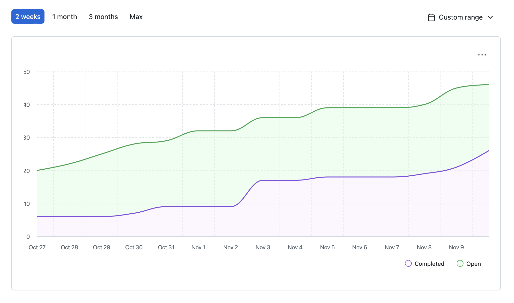

### Github usernames

| GitHub Username | Student Name          |
| --------------- | --------------------- |
| `AdaraPutri`    | Adara Putri           |
| `ammaarkhan`    | Ammaar Khan           |
| `ivonanicetin`  | Ivona Nicetin         |
| `johaneshp`     | Johanes Hamonangan    |
| `salmavkh`      | Salma Vikha Ainindita |
| `taoTimTim`     | Timmi Draper          |

### Table view of completed tasks by username

| GitHub Username | Screenshot                                                                  |
| --------------- | --------------------------------------------------------------------------- |
| `AdaraPutri`    | 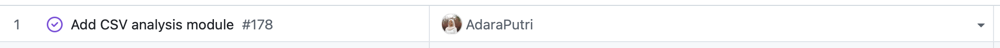     |
| `ammaarkhan`    | 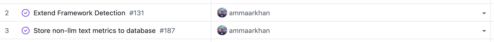   |
| `ivonanicetin`  | 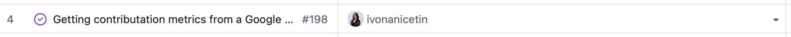     |
| `johaneshp`     | 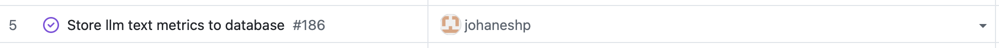 |
| `salmavkh`      | 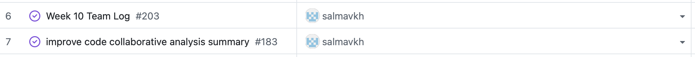     |
| `taoTimTim`     | 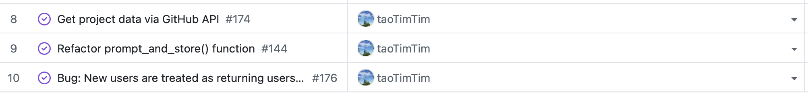     |

### Table view of in progress tasks by username

| GitHub Username | Screenshot                                                                  |
| --------------- | --------------------------------------------------------------------------- |
| `ivonanicetin`  | 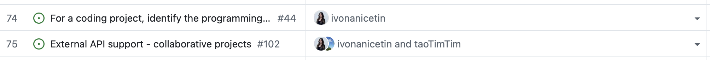 |
| `taoTimTim`     | 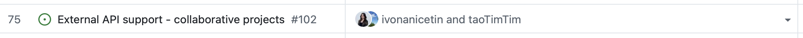 |
| `salmavkh`      | 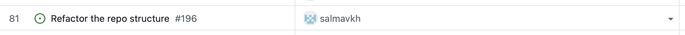 |

## (Week 12) Monday November 17 - Sunday November 23

### Week recap

This week, the team focused on completing the remaining core requirements for Milestone 1, with a stronger emphasis on generating skill oriented outputs for the portfolio and resume. This work was complemented by refactoring pipelines and the database, implementing new features, and carrying out targeted feature optimizations. We implemented text and code activity type detection using filenames for both domains and PR keyword signals for code, and ensured all results are persisted in the database. We also refactored the overall repository structure by introducing clearer subfolders and reorganizing the database layer by splitting db.py into a schema module and table specific query modules. In parallel, we continued implementing storage for key analysis outputs including activity types, skill extraction results, contribution data, and project summaries so the entire analysis pipeline now persists consistently across the system. Collaborative workflows were strengthened by improving file contribution tracking, optimizing Google Drive integration, and enhancing text and code detectors. Overall, this week concentrated on solidifying core infrastructure while expanding functionality to support more accurate and scalable project analysis.

### Plan for the next cycle

Next week, the team will complete the remaining Milestone 1 requirements. The team will focus on finishing the integration between pipelines and database storage, refining project summary retrieval, reducing unnecessary print output, and completing collaborative text-analysis features such as Google Drive metrics and contribution scoring. We also plan to refine the start-menu interface, improve the clarity of resume and portfolio outputs, and address remaining GitHub API edge cases. Continuous PR review and cleanup will support final stabilization for the upcoming milestone.

### Burnup chart

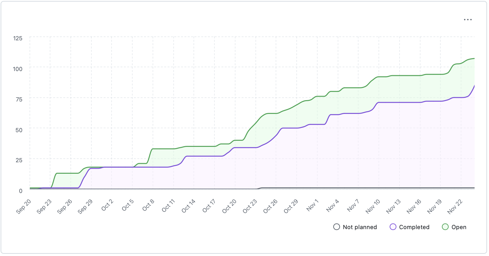

### Github usernames

| GitHub Username | Student Name          |
| --------------- | --------------------- |
| `AdaraPutri`    | Adara Putri           |
| `ammaarkhan`    | Ammaar Khan           |
| `ivonanicetin`  | Ivona Nicetin         |
| `johaneshp`     | Johanes Hamonangan    |
| `salmavkh`      | Salma Vikha Ainindita |
| `taoTimTim`     | Timmi Draper          |

### Table view of completed tasks by username

| GitHub Username | Screenshot                                                                    |
| --------------- | ----------------------------------------------------------------------------- |
| `AdaraPutri`    | 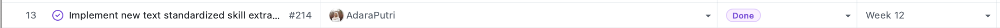     |
| `ammaarkhan`    | 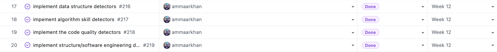   |
| `ivonanicetin`  | 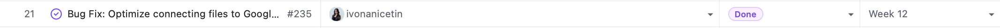     |
| `johaneshp`     | 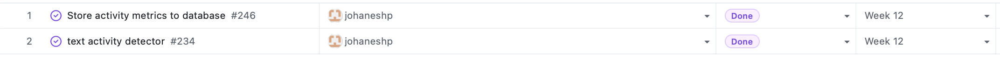 |
| `salmavkh`      | 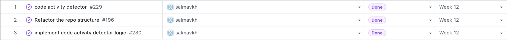     |
| `taoTimTim`     | 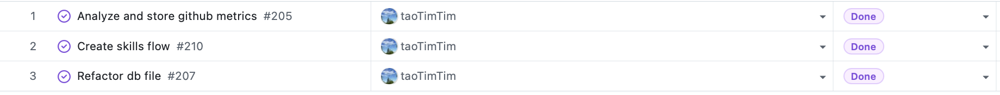     |

## (Week 13) Monday November 24 - Sunday November 30

### Week recap

This week, the team focused on refactoring and fixing issues, and updated the start menu. Starting from modifying the menu, to give user options such as, retrieve portfolio, retrieve resume, delete insights, etc. Once all skills and metrics produced, project_summaries table started to be filled with necessary information obtained from analysis worked on the previous weeks. Project_summaries table is used in the retrieval of informations such as portfolio and resume, skills list in chronological order, deletion of projects and resume, producing chronological list of project, project ranking. The issues that are fixed and refactored such as file path handling which is now using the project_name from database, file text sections extractions, adding prompt for user's summary in non llm analysis, framework detection path issue, optimization of google drive analysis and word counting fix. Overall, this week concentrated on using all the project_summaries table information to create the portfolio and resume, fulfilling the milestone requirements, and fixing issues that existed from previous weeks.

### Plan for the next cycle

we'll do optimization needed to improve the performance, and any changes needed for the deliverables of milestone 1. We'll start working on the presentation, updating readme, and demo video. Starting to plan for milestone 2, and any further plans will be discussed after the presentation.

### Burnup chart

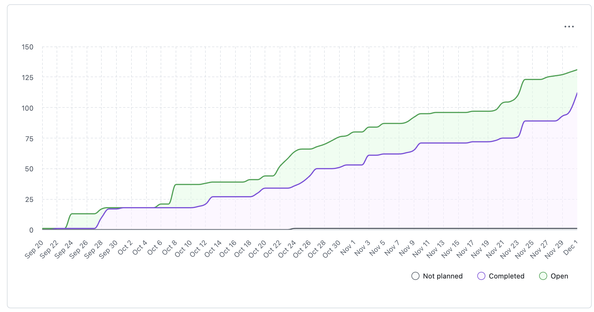

### Github usernames

| GitHub Username | Student Name          |
| --------------- | --------------------- |
| `AdaraPutri`    | Adara Putri           |
| `ammaarkhan`    | Ammaar Khan           |
| `ivonanicetin`  | Ivona Nicetin         |
| `johaneshp`     | Johanes Hamonangan    |
| `salmavkh`      | Salma Vikha Ainindita |
| `taoTimTim`     | Timmi Draper          |

### Table view of completed tasks by username

| GitHub Username | Screenshot                                                                    |
| --------------- | ----------------------------------------------------------------------------- |
| `AdaraPutri`    | 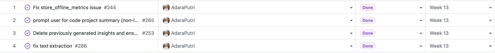     |
| `ammaarkhan`    | 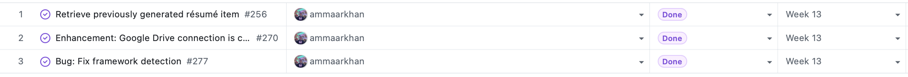   |
| `ivonanicetin`  | 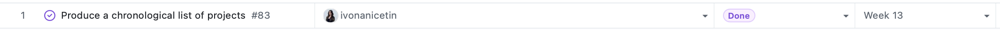     |
| `johaneshp`     | 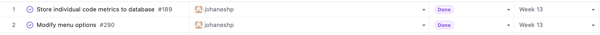 |
| `salmavkh`      | 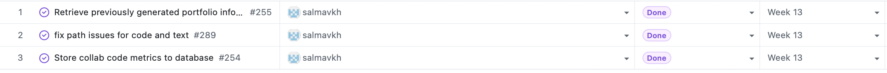     |
| `taoTimTim`     | 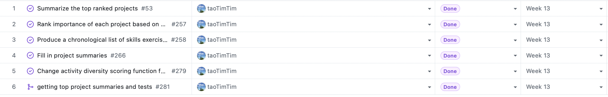     |

## (Week 14) Monday December 1 - Sunday December 7

### Week recap

This week, the team focused on fixing bugs and issues, finished the milestone 1 requirement, and working on presentation and deliverables. We also continue the collaborative skill analysis from google drive integration. Our project now have "Verbose" logging mode where user can choose to view debug output or just clean view of analysis. We also refactored the llm code contribution summary so that now LLM only summarize based on the files that user contributed to. We also consider another edge cases for analysis without .git files and no github integration by taking the user's contributed files based on the contribution summary they provided.

We updated the readme files, wbs, DFD, and System Architecture Diagram based on what we have so far in milestone 1. We also recorded the video demo to show how the system works. Github integration issues were also addressed this week. We fixed the github issues counting, and user's review storage. GraphQL API is used in fetching PR's data which improve the performance.

Overall, this week concentrated on fixing issues, working on Milestone 1 Deliverables, and updating readme file.

### Plan for the next cycle

No sprint for next week. Milestone 2 will be reassessed at the beginign of next year.

### Burnup chart

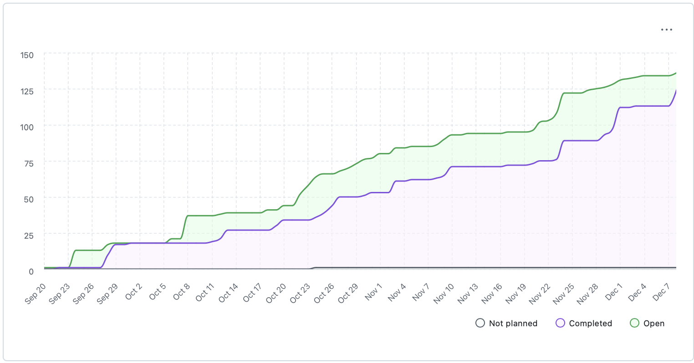

### Github usernames

| GitHub Username | Student Name          |
| --------------- | --------------------- |
| `AdaraPutri`    | Adara Putri           |
| `ammaarkhan`    | Ammaar Khan           |
| `ivonanicetin`  | Ivona Nicetin         |
| `johaneshp`     | Johanes Hamonangan    |
| `salmavkh`      | Salma Vikha Ainindita |
| `taoTimTim`     | Timmi Draper          |

### Table view of completed tasks by username

| GitHub Username | Screenshot                                                                  |
| --------------- | --------------------------------------------------------------------------- |
| `AdaraPutri`    | 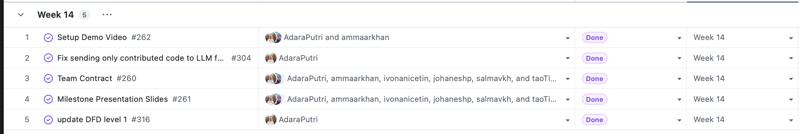     |
| `ammaarkhan`    | 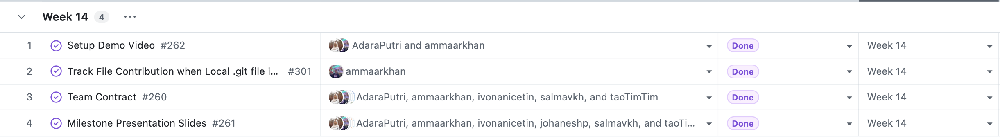   |
| `ivonanicetin`  | 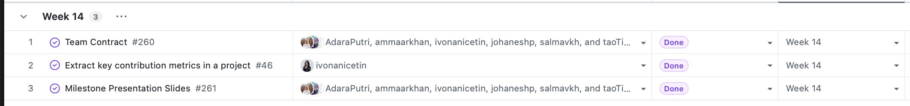     |
| `johaneshp`     | 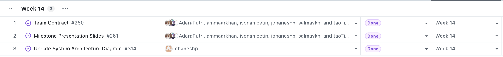 |
| `salmavkh`      | 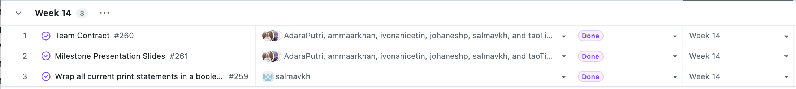     |
| `taoTimTim`     | 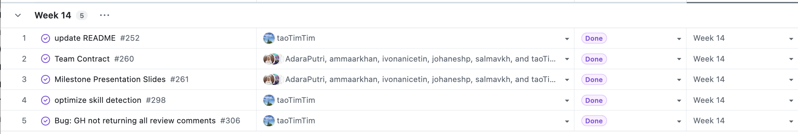     |

## (Term 2 Week 1) Monday January 5 - Sunday January 11

### Week recap

This week, after winter break, we continued to implement milestone 2 requirements. Duplicate files detection now reimplemented, by detecting the content of the file, not the filename. The system now can distinguish between completely new projects, exact duplicates, and related projects. We also started implementing the incorporating key role, however, this feature will be discussed further for clarification of what the system should do and produce. We also implemented the feature outputting a text file of resume and portfolio. The system can now export the resume and portfolio into docx file with the layout following the output in terminal. We also implemented a new feature that allows user to receive feedback based on the unmet criteria from skill bucket. For now, the feedback only for the text project. Feedback for code project will be implemented in the next week/next PR. The contribution section in both code and text project now are more detailed, giving information about how much contributions the user has given in a project. We also implemented the rerank project feature, allowing user to rerank project manually not following the order of project score, which will be used to decide which project to be showcased first. We also implemented the new feature where user is given flexibility to choose which projects to be shown in the resume

Overall, this week focused on implementing necessary features needed to fulfill milestone 2 requirements

### Plan for the next cycle

We will continue implementing the milestone 2 requirements, and fix bugs that was found during the implementation this week.

### Burnup chart

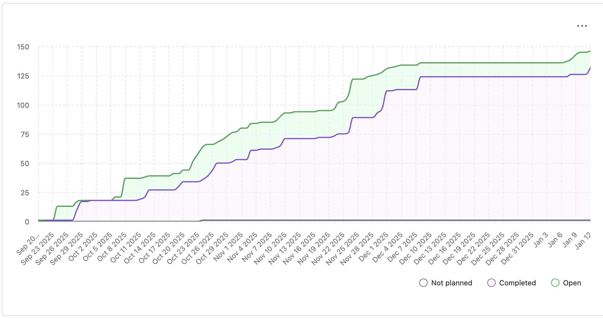

### Github usernames

| GitHub Username | Student Name          |
| --------------- | --------------------- |
| `AdaraPutri`    | Adara Putri           |
| `ammaarkhan`    | Ammaar Khan           |
| `ivonanicetin`  | Ivona Nicetin         |
| `johaneshp`     | Johanes Hamonangan    |
| `salmavkh`      | Salma Vikha Ainindita |
| `taoTimTim`     | Timmi Draper          |

### Table view of completed tasks by username

| GitHub Username | Screenshot                                                                   |
| --------------- | ---------------------------------------------------------------------------- |
| `AdaraPutri`    |      |
| `ammaarkhan`    | 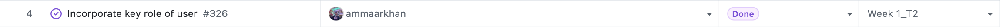   |
| `ivonanicetin`  | 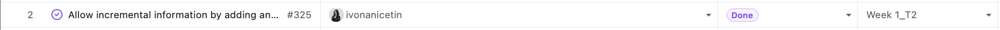     |
| `johaneshp`     | 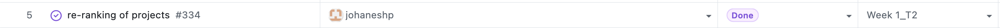 |
| `salmavkh`      | 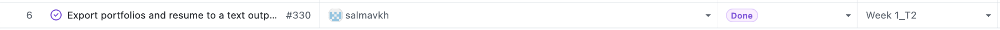     |
| `taoTimTim`     | 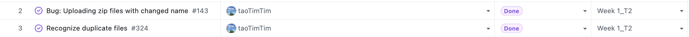     |

## (Term 2 Week 2) Monday January 12 - Sunday January 18

### Week recap

**Connection to previous week:**  
After completing some of the first few Milestone 2 requirements last week, the team continued to fix some bugs and began wrapping the system as an API service.

### Coding tasks

The team fixed resume rendering crashes and edge cases in [PR #354](https://github.com/COSC-499-W2025/capstone-project-team-19/pull/354), including correcting the resume creation flow to pass required DB parameters and safely formatting text projects with two-stage activity breakdowns. Resume customization was added in [PR #355](https://github.com/COSC-499-W2025/capstone-project-team-19/pull/355), introducing editable overrides for project summaries, contribution bullets, and display names, with support for resume-only edits versus global overrides that propagate across resumes and portfolio rendering.

To support Milestone 2’s service requirement, the API foundation and documentation were introduced in [PR #357](https://github.com/COSC-499-W2025/capstone-project-team-19/pull/357), including a FastAPI skeleton, conventions, and a services layer to avoid endpoints connecting to the DB directly. Several API endpoints were implemented to expose analyzed data, including project retrieval in [PR #369](https://github.com/COSC-499-W2025/capstone-project-team-19/pull/369), privacy consent GET/POST in [PR #370](https://github.com/COSC-499-W2025/capstone-project-team-19/pull/370), and resume/skills retrieval endpoints in [PR #374](https://github.com/COSC-499-W2025/capstone-project-team-19/pull/374).

Resume exporting was significantly improved in [PR #368](https://github.com/COSC-499-W2025/capstone-project-team-19/pull/368) by restructuring sections to match standard resume formatting, upgrading contribution bullets to be metric-backed, and adding PDF export support. Project thumbnails were added in [PR #372](https://github.com/COSC-499-W2025/capstone-project-team-19/pull/372), enabling add/edit/remove flows, storing images centrally under an `/images` directory, persisting paths in a new table, and integrating thumbnails into portfolio exports. Duplicate detection was strengthened in [PR #363](https://github.com/COSC-499-W2025/capstone-project-team-19/pull/363) via path normalization, better renamed-file handling, and two-tier strict/loose fingerprinting to distinguish exact duplicates from potential new versions.

A key Milestone 2 blocker was addressed by designing the upload flow as a resumable wizard rather than a single request. The first four wizard endpoints plus upload session persistence were implemented in [PR #376](https://github.com/COSC-499-W2025/capstone-project-team-19/pull/376), including a new `uploads` table, state stored in `state_json`, shared DB connection handling, and endpoints for starting uploads, polling status, submitting classifications, and submitting project types for mixed projects.

### Testing or debugging tasks

The team added and updated unit tests across resume rendering, exporting, and API routes, including endpoint coverage for resumes and skills in [PR #374](https://github.com/COSC-499-W2025/capstone-project-team-19/pull/374). API functionality was also validated through manual Postman testing to confirm correct headers, expected status codes (including 404s for missing projects), and stable wizard state progression in [PR #376](https://github.com/COSC-499-W2025/capstone-project-team-19/pull/376). Resume export changes, including PDF generation, were verified alongside dependency updates in [PR #368](https://github.com/COSC-499-W2025/capstone-project-team-19/pull/368).

### Reviewing or collaboration tasks

The team aligned on API conventions (services layer, user ID passed via headers, and documentation format) during review of [PR #357](https://github.com/COSC-499-W2025/capstone-project-team-19/pull/357). PR reviews also covered correctness and UX clarity for the duplicate-detection changes in [PR #363](https://github.com/COSC-499-W2025/capstone-project-team-19/pull/363) and the thumbnail/export integration in [PR #372](https://github.com/COSC-499-W2025/capstone-project-team-19/pull/372), ensuring the features remained consistent with existing CLI flows and database behavior.

### Plan for the next cycle

We will continue implementing the milestone 2 requirements, and fix bugs that was found during the implementation this week.

### Burnup chart

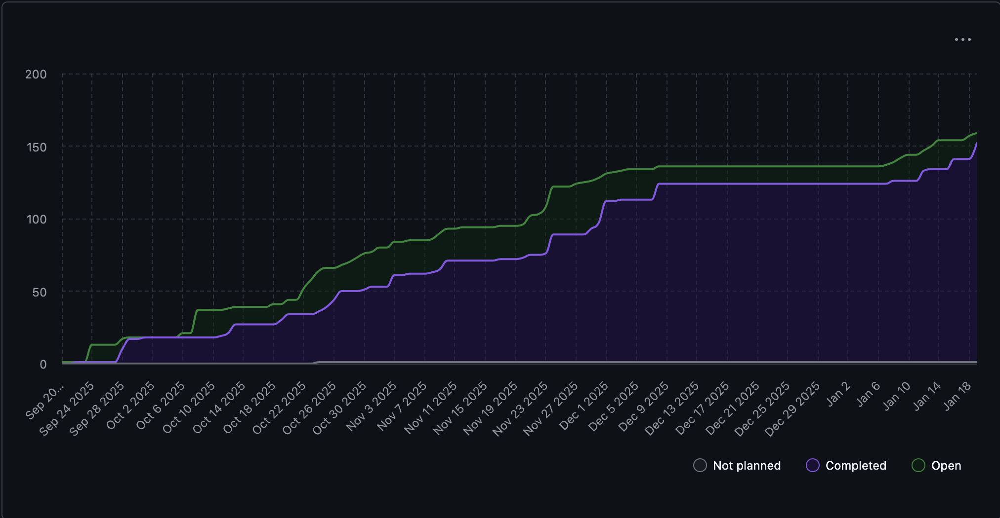

### Github usernames

| GitHub Username | Student Name          |
| --------------- | --------------------- |
| `AdaraPutri`    | Adara Putri           |
| `ammaarkhan`    | Ammaar Khan           |
| `ivonanicetin`  | Ivona Nicetin         |
| `johaneshp`     | Johanes Hamonangan    |
| `salmavkh`      | Salma Vikha Ainindita |
| `taoTimTim`     | Timmi Draper          |

### Table view of completed tasks by username

| GitHub Username | Screenshot                                                                    |
| --------------- | ----------------------------------------------------------------------------- |
| `AdaraPutri`    | 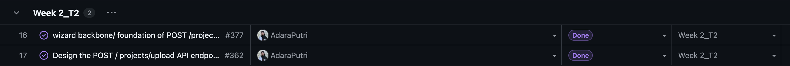     |
| `ammaarkhan`    | 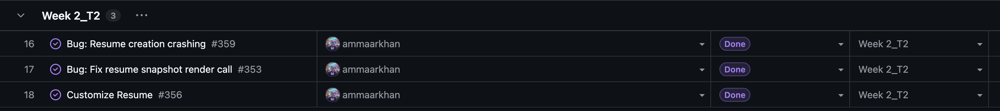   |
| `ivonanicetin`  | 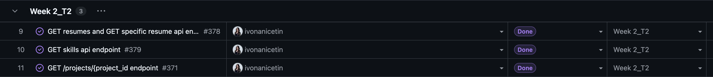     |
| `johaneshp`     | 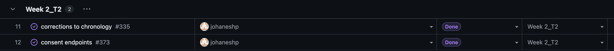 |
| `salmavkh`      | 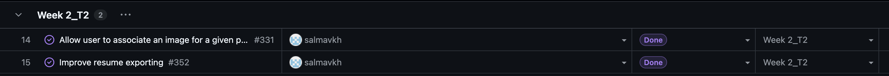     |
| `taoTimTim`     | 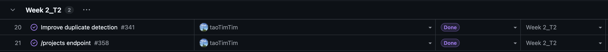     |

## (Term 2 Week 3) Monday January 19 - Sunday January 25

**Connection to previous week:**  
Building on the previous week’s API skeleton, initial GET endpoints, and the upload wizard backbone, the team focused on making the upload flow correct under real re-uploads (deduplication + versioning), adding authentication for secure API access, expanding resume/portfolio customization and export options, and continuing external integration work (GitHub OAuth).

### Coding tasks

The team integrated existing CLI deduplication logic directly into the API upload wizard in [PR #391](https://github.com/COSC-499-W2025/capstone-project-team-19/pull/391) to ensure duplicate and near-duplicate projects are handled before classification or project-type steps. This added persisted wizard fields (`dedup_skipped_projects`, `dedup_new_versions`, `dedup_asks`), introduced a new wizard status (`needs_dedup`), and implemented a resolution endpoint (`POST /projects/upload/{upload_id}/dedup/resolve`) so the UI can choose between skip/new project/new version paths without server-side prompting. Based on review feedback about false negatives in small projects, dedup matching was refined in [PR #398](https://github.com/COSC-499-W2025/capstone-project-team-19/pull/398) by shifting from hash-only Jaccard similarity to a combined scoring approach (path + content similarity) with improved prompt context for decision-making.

To secure the API, JWT authentication was implemented in [PR #392](https://github.com/COSC-499-W2025/capstone-project-team-19/pull/392), including username/password support, `/register` and `/login` endpoints, token-based authorization enforced across routes, and updated documentation and environment configuration (`JWT_SECRET`). The team also expanded the API surface for resume workflows by implementing resume generation and editing endpoints in [PR #402](https://github.com/COSC-499-W2025/capstone-project-team-19/pull/402), including automatic fallback behavior (top projects) when no project selection is provided.

Customization work continued by improving the resume contribution editing UX in [PR #393](https://github.com/COSC-499-W2025/capstone-project-team-19/pull/393), allowing users to append new bullets or fully replace contributions. Portfolio customization was added in [PR #394](https://github.com/COSC-499-W2025/capstone-project-team-19/pull/394), enabling portfolio-only vs global overrides for display names, summaries, and contribution bullets with tests validating override precedence. Portfolio exporting was extended with PDF support in [PR #396](https://github.com/COSC-499-W2025/capstone-project-team-19/pull/396), ensuring exported PDFs reflect edited wording and thumbnails and updating export test coverage.

The team also fixed correctness issues in LLM-based code summaries in [PR #401](https://github.com/COSC-499-W2025/capstone-project-team-19/pull/401) by preventing unintended fallback to zip-level READMEs, clarifying prompt behavior when a project README is missing (fallback to code structure/comments), and adding debug traces to make the summary source selection auditable. Finally, GitHub integration endpoints were implemented using OAuth authorization code flow in [PR #403](https://github.com/COSC-499-W2025/capstone-project-team-19/pull/403), adding endpoints for starting OAuth, listing repositories, linking a repo, and handling the callback (`/auth/github/callback`) with updated API documentation.

### Testing or debugging tasks

The team added and updated targeted test coverage across dedup resolution behavior and scoring changes (including small-project edge cases) in [PR #391](https://github.com/COSC-499-W2025/capstone-project-team-19/pull/391) and [PR #398](https://github.com/COSC-499-W2025/capstone-project-team-19/pull/398). Authentication changes in [PR #392](https://github.com/COSC-499-W2025/capstone-project-team-19/pull/392) were validated through Postman by using Bearer tokens and verifying route protection, and environment setup was updated to require `JWT_SECRET`. Export workflows were verified through new/updated tests for portfolio PDF generation and alignment of DOCX tests in [PR #396](https://github.com/COSC-499-W2025/capstone-project-team-19/pull/396). The LLM summary fixes in [PR #401](https://github.com/COSC-499-W2025/capstone-project-team-19/pull/401) added tests to ensure project summaries and contribution summaries use the correct project-scoped context and focused file selection. GitHub OAuth endpoints and flow behavior were tested with added pytest coverage in [PR #403](https://github.com/COSC-499-W2025/capstone-project-team-19/pull/403).

### Reviewing or collaboration tasks

The team collaborated on aligning wizard behavior with frontend needs by persisting dedup outcomes in upload state and introducing a clean resolve endpoint in [PR #391](https://github.com/COSC-499-W2025/capstone-project-team-19/pull/391). Review feedback also prompted follow-up improvements for small-project dedup in [PR #398](https://github.com/COSC-499-W2025/capstone-project-team-19/pull/398). The team coordinated on cross-PR dependencies for customization work (noting rebase requirements between [PR #393](https://github.com/COSC-499-W2025/capstone-project-team-19/pull/393) and [PR #394](https://github.com/COSC-499-W2025/capstone-project-team-19/pull/394)) and ensured exported artifacts reflect override precedence and thumbnails. For GitHub OAuth in [PR #403](https://github.com/COSC-499-W2025/capstone-project-team-19/pull/403), the team aligned on expected frontend-driven sequencing and documented setup requirements in the README and `.env.example`.

### Issues or blockers

A recurring blocker was inconsistent behavior when re-uploading projects through the API, where older uploaded data could influence classification and project-type decisions. This was addressed by running dedup immediately after ZIP parsing in [PR #391](https://github.com/COSC-499-W2025/capstone-project-team-19/pull/391), skipping exact duplicates, renaming confident new versions for consistent downstream naming, and pausing the wizard only when user decisions are required. Another issue was brittleness of hash-only similarity for small projects, which was mitigated by combined similarity scoring and clearer prompts in [PR #398](https://github.com/COSC-499-W2025/capstone-project-team-19/pull/398). API security concerns (no way to verify user identity) were addressed by introducing JWT auth and password-based login in [PR #392](https://github.com/COSC-499-W2025/capstone-project-team-19/pull/392). Incorrect LLM summaries caused by README fallback behavior were addressed by enforcing project-scoped context and adding debug traces in [PR #401](https://github.com/COSC-499-W2025/capstone-project-team-19/pull/401).

### Plan / goals for next week

Next week, the team will continue completing the remaining upload wizard endpoints and validations, especially around integration sequencing and service-layer safeguards for GitHub linking flows introduced in [PR #403](https://github.com/COSC-499-W2025/capstone-project-team-19/pull/403). Resume generation/edit API behavior from [PR #402](https://github.com/COSC-499-W2025/capstone-project-team-19/pull/402) will be stabilized with additional edge-case testing, and customization/export flows will be finalized once dependent branches are merged and rebased ([PR #393](https://github.com/COSC-499-W2025/capstone-project-team-19/pull/393), [PR #394](https://github.com/COSC-499-W2025/capstone-project-team-19/pull/394), [PR #396](https://github.com/COSC-499-W2025/capstone-project-team-19/pull/396)). Further test coverage will be added for dedup resolution paths and authenticated API access to ensure consistent behavior under repeated uploads and multi-resume scenarios.

### Burnup chart

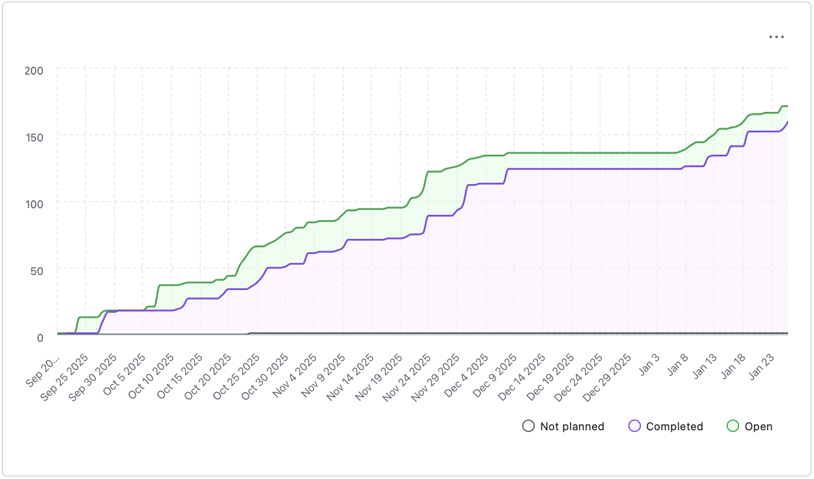

### Github usernames

| GitHub Username | Student Name          |
| --------------- | --------------------- |
| `AdaraPutri`    | Adara Putri           |
| `ammaarkhan`    | Ammaar Khan           |
| `ivonanicetin`  | Ivona Nicetin         |
| `johaneshp`     | Johanes Hamonangan    |
| `salmavkh`      | Salma Vikha Ainindita |
| `taoTimTim`     | Timmi Draper          |

### Table view of completed tasks by username

| GitHub Username | Screenshot                                                                    |
| --------------- | ----------------------------------------------------------------------------- |
| `AdaraPutri`    | 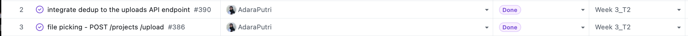     |
| `ammaarkhan`    | 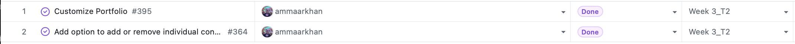   |
| `ivonanicetin`  |      |
| `johaneshp`     |  |
| `salmavkh`      | 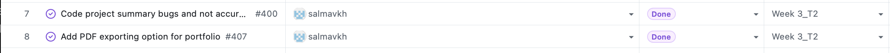     |
| `taoTimTim`     | 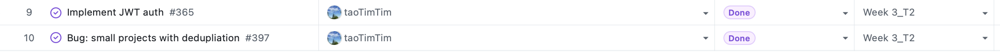     |

## (Term 2 Week 4-5) Monday January 26 - Sunday February 8

**Connection to previous week:**  
Following Week 3’s work on stabilizing the upload wizard (dedup + versioning), authentication, and the first wave of resume/portfolio features, the team continued working on finishing the remaining API endpoints. This period was mainly focused on completing missing routes, migrating the system to handle project versions, and expanding export and feedback support.

### Coding tasks

The team implemented and finalized several remaining endpoints needed for full API coverage.

Ranking and feedback functionality was implemented through new ranking endpoints and feedback routes in [PR #428](https://github.com/COSC-499-W2025/capstone-project-team-19/pull/428) and [PR #442](https://github.com/COSC-499-W2025/capstone-project-team-19/pull/442), allowing users to submit structured feedback and improving downstream customization workflows. The final touches to the CLI flow of code feedback was completed in [PR #430](https://github.com/COSC-499-W2025/capstone-project-team-19/pull/430). Project date API routes were implemented in [PR #445](https://github.com/COSC-499-W2025/capstone-project-team-19/pull/445), so the user can have automatic dates or manually set the dates of a project.

Deletion support across the API was added in [PR #434](https://github.com/COSC-499-W2025/capstone-project-team-19/pull/434), ensuring projects and their associated records can be removed safely from our system using the API endpoints/routes. Resume and portfolio export API routes were additionally implemented in [PR #447](https://github.com/COSC-499-W2025/capstone-project-team-19/pull/447), so users can download their resumes/portfolios from the frontend. The portfolio export was improved in [PR #435](https://github.com/COSC-499-W2025/capstone-project-team-19/pull/435). An endpoint for refreshing a resume when a project is deleted was implemented in [PR #440](https://github.com/COSC-499-W2025/capstone-project-team-19/pull/440) so that if the user wants they can remove a deleted project from their resume(s).

The necessary endpoints for generating and editing the portfolio was implemented in [PR #436](https://github.com/COSC-499-W2025/capstone-project-team-19/pull/436). Getting the users contributions to a code project with API routes was finalized in [PR #446](https://github.com/COSC-499-W2025/capstone-project-team-19/pull/446), matching the text contribution routes implemented last week.

Additionally, we implemented the necessary API endpoints for supporting Google Drive and the local git file identies in [PR #463](https://github.com/COSC-499-W2025/capstone-project-team-19/pull/463) and [PR #455](https://github.com/COSC-499-W2025/capstone-project-team-19/pull/455), respectively.

Adding the user's key role to the resume, and allowing the user to edit their key role, was implemented and completed in [PR #420](https://github.com/COSC-499-W2025/capstone-project-team-19/pull/420) and [PR #424](https://github.com/COSC-499-W2025/capstone-project-team-19/pull/424).

Project version support (for timelines, heatmaps, project progressions) required refactoring the database, queries, and helpers, and so the start for supporting different versions was done in [PR #450](https://github.com/COSC-499-W2025/capstone-project-team-19/pull/450) and [PR #456](https://github.com/COSC-499-W2025/capstone-project-team-19/pull/456).

Additional bug fixes were addressed in [PR #431](https://github.com/COSC-499-W2025/capstone-project-team-19/pull/431) and [PR #448](https://github.com/COSC-499-W2025/capstone-project-team-19/pull/448).

### Testing or debugging tasks

Testing during Weeks 4–5 primarily involved writing and updating pytest coverage for the newly implemented endpoints. The team validated ranking/feedback routes, deletion behavior, resume/portfolio export flows, and portfolio editing functionality, and ran manual tests to ensure the ongoing project version refactor did not break existing upload or resume workflows.

Bugs were fixed as they were found.

### Reviewing or collaboration tasks

The team followed the required review process where each PR received at least two reviewers before merging. Many changes were requested throughout the review cycle, with team members identifying bugs, missing edge cases, and consistency issues across endpoints. Collaboration was important during these weeks since multiple contributors were implementing API routes in parallel, and we worked together to ensure new endpoints matched the patterns and expectations of the existing codebase.

### Issues or blockers

There were no major technical blockers, but development slowed down at times due to the ongoing project version refactor. Since the version-scoped database changes affected shared tables, queries, and helper functions, this led to frequent merge conflicts and extra rebasing work. With multiple dependent PRs open at once, review and integration also took longer than usual, but overall the past two weeks went smoothly.

### Plan / goals for next week

Next week, the team will focus on completing the remaining work for project versioning support, including finishing the necessary database and endpoint updates and implementing the logic for timelines, heatmaps, and project progressions. We will continue finalizing any remaining API routes and ensuring we are not missing any major endpoints required for the frontend. The team will also decide on the framework and structure moving forward for the next stage of development, and begin preparing for the Milestone 2 deliverables.

### Burnup chart

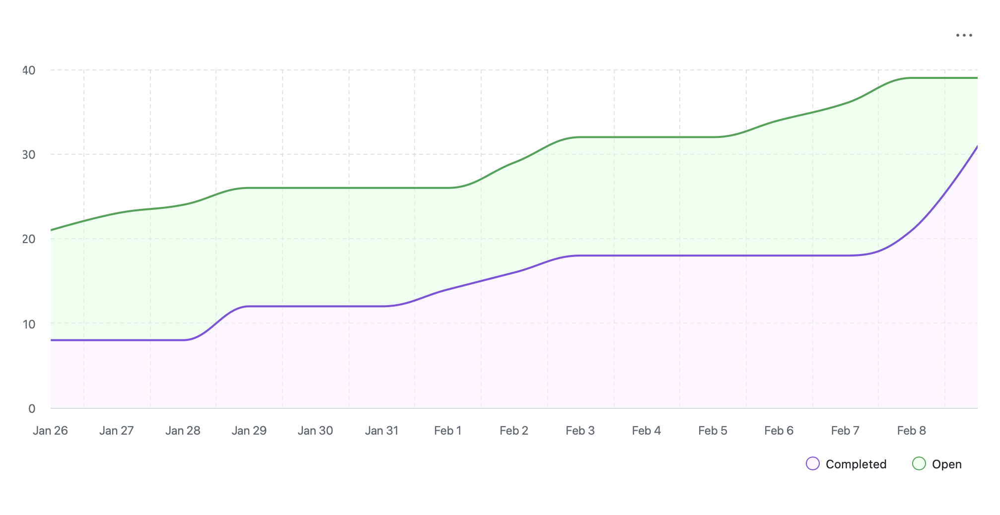

### Github usernames

| GitHub Username | Student Name          |
| --------------- | --------------------- |
| `AdaraPutri`    | Adara Putri           |
| `ammaarkhan`    | Ammaar Khan           |
| `ivonanicetin`  | Ivona Nicetin         |
| `johaneshp`     | Johanes Hamonangan    |
| `salmavkh`      | Salma Vikha Ainindita |
| `taoTimTim`     | Timmi Draper          |

### Table view of completed tasks by username

| GitHub Username | Screenshots                                                                                                                                          |
| --------------- | ---------------------------------------------------------------------------------------------------------------------------------------------------- |
| `AdaraPutri`    | 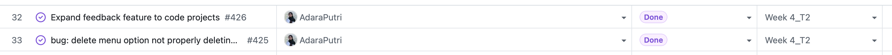   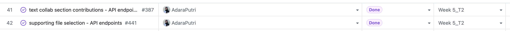         |
| `ammaarkhan`    | 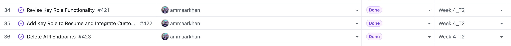   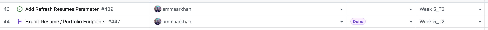     |
| `ivonanicetin`  | 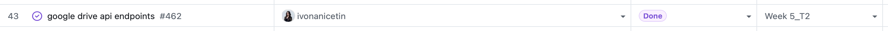                                                                                  |
| `johaneshp`     | 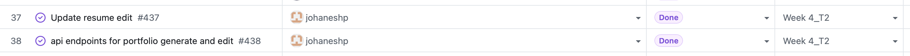   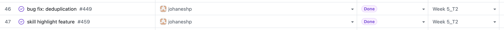 |
| `salmavkh`      | 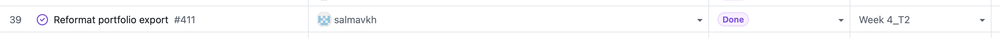   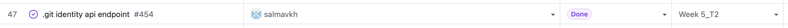         |
| `taoTimTim`     | 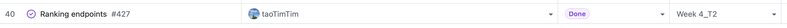   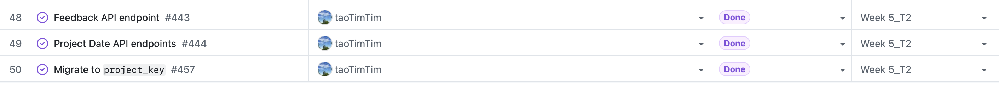         |

### Table view of under review tasks by username

| GitHub Username | Screenshots                                                                |
| --------------- | -------------------------------------------------------------------------- |
| `johaneshp`     | 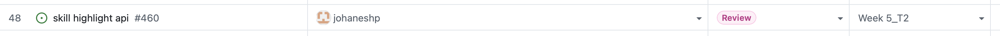 |

## (Term 2 Week 6-8) Monday February 9 - Sunday March 1

**Connection to previous week:**  

In week 4-5, we were still implementing the API endpoints, both the required ones and the additional endpoints our system needs for our features and architecture. We planned to finish implementing the endpoints in week 6 and 7, and over reading break, specifically focusing on project versioning, heatmaps, timelines/evolutions, and finalizing the project upload flow. 

### Coding tasks

This week focused heavily on finalizing project versioning and building out the core analytics layer that powers the Insights page (ranked projects, skill timelines, and activity heatmaps).

The final project versioning migration was completed in [PR #481](https://github.com/COSC-499-W2025/capstone-project-team-19/pull/481), solidifying the database refactor required to properly support multiple project versions, evolution tracking, and time-based insights. Building on this foundation, ranked projects and project evolution logic were implemented in [PR #490](https://github.com/COSC-499-W2025/capstone-project-team-19/pull/490), enabling the system to evaluate projects based on contribution and progression data.

Activity visualization support was implemented through the feature/activity heatmap in [PR #497](https://github.com/COSC-499-W2025/capstone-project-team-19/pull/497), with its corresponding API endpoints completed in [PR #498](https://github.com/COSC-499-W2025/capstone-project-team-19/pull/498). The skill timeline endpoint was added in [PR #499](https://github.com/COSC-499-W2025/capstone-project-team-19/pull/499), allowing chronological tracking of skill growth across projects and versions. Skill highlighting behavior was refined in [PR #483](https://github.com/COSC-499-W2025/capstone-project-team-19/pull/483) and [PR #485](https://github.com/COSC-499-W2025/capstone-project-team-19/pull/485) to ensure important skills are shown consistently across analytics views and providing flexibility in skill highlighting per project, rather than overall skills.

Summary related endpoints were finalized in [PR #486](https://github.com/COSC-499-W2025/capstone-project-team-19/pull/486), allowing the user to provide summaries manually during upload. Thumbnail support was added in [PR #480](https://github.com/COSC-499-W2025/capstone-project-team-19/pull/480), allowing the thumbnails to be displayed in the users portfolio.

Resume functionality was further refined with the ability to remove a project from a resume via API and CLI in [PR #477](https://github.com/COSC-499-W2025/capstone-project-team-19/pull/477). A dedicated key role endpoint was implemented in [PR #492](https://github.com/COSC-499-W2025/capstone-project-team-19/pull/492), this supports the project key role in the upload process via the wizard API we have built.

Finally, analysis execution flow was completed through readiness validation and execution endpoints in [PR #509](https://github.com/COSC-499-W2025/capstone-project-team-19/pull/509) and [PR #510](https://github.com/COSC-499-W2025/capstone-project-team-19/pull/510). These PRs ensure the system verifies required inputs and state before running analytics, ensuring that all necessary inputs from the user are correctly retrieved.

Minor fixes and integration adjustments were addressed throughout these PRs to maintain schema consistency and align backend behavior with frontend requirements.

### Testing or debugging tasks

This week included documentation updates and targeted fixes to improve reliability and clarity across the system.

The API documentation was updated in [PR #493](https://github.com/COSC-499-W2025/capstone-project-team-19/pull/493) to fix multiple incorrect sections, such as incorrect JSON responses, duplication, and making request-bodies consistent with each other. This PR additionally fixed some inconsistencies in the API documentation regarding endpoint URLs, for example the **Projects* section contained multiple endpoints that had the path `/projects` in the endpoint URL making the endpoint appear to be `/projects/projects` when really it only started with `/projects`.

A bug affecting resume contribution bullets for projects containing .git directories was resolved in [PR #505](https://github.com/COSC-499-W2025/capstone-project-team-19/pull/505). The issue caused  contribution bullet point generation in certain code projects to be empty. An issue was discovered during the review of this PR regarding the filepaths, more specifically how Mac and Windows handle filepaths differently, this was resolved in this same PR.

To support testing and reproducibility of versioning and analysis workflows, structured test ZIP files were added in [PR #506](https://github.com/COSC-499-W2025/capstone-project-team-19/pull/506), along with updates to the README to document proper testing procedures. This is a requirement for Milestone 2.

### Reviewing or collaboration tasks

This week involved reviewing and integrating multiple interdependent analytics and versioning PRs, requiring careful coordination to ensure consistency in the codebase. Since many features (heatmaps, skill timelines, ranked projects, summaries) rely on the finalized project versioning structure, a few PRs branched off it and needed rebasing once it got reviewed. This did not cause many issues, but did require a more collaborative process amongst the team.

### Issues or blockers

No real issues or blockers were found this week. The team worked really well together to ensure all the milestone 2 requirements would be met, and we collaborated a ton to finish the video demo, wireframes, and final architecture and documentation.

### Plan / goals for next week

The plan is to begin implementing the frontend. A PR for setting up React and Vite has already been started [PR #500](https://github.com/COSC-499-W2025/capstone-project-team-19/pull/500), it just needs to be completed. Once that is done and merged, we will split the pages amongst each other and start building the UI. We will also need to implement the code for the HTTP endpoints to call the backend APIs, most likely we will create those as we need them while building the frontend.

### Burnup chart

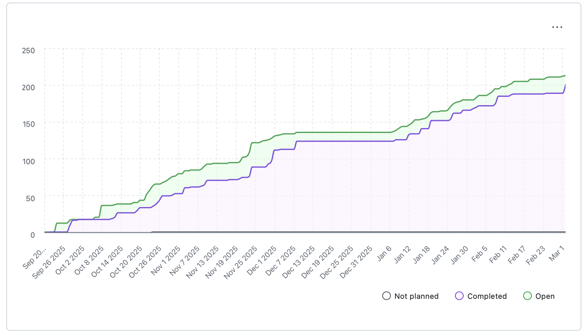

### Github usernames

| GitHub Username | Student Name          |
| --------------- | --------------------- |
| `AdaraPutri`    | Adara Putri           |
| `ammaarkhan`    | Ammaar Khan           |
| `ivonanicetin`  | Ivona Nicetin         |
| `johaneshp`     | Johanes Hamonangan    |
| `salmavkh`      | Salma Vikha Ainindita |
| `taoTimTim`     | Timmi Draper          |

### Table view of completed tasks by username

| GitHub Username | Screenshots                                                                                                                                          |
| --------------- | ---------------------------------------------------------------------------------------------------------------------------------------------------- |
| `AdaraPutri`    |    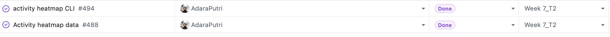         |
| `ammaarkhan`    |    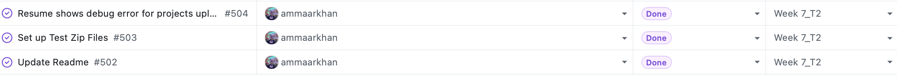     |
| `ivonanicetin`  |                                                                                |
| `johaneshp`     | 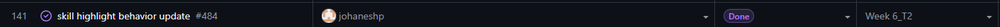   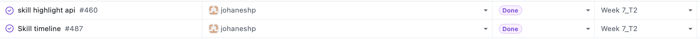 |
| `salmavkh`      | 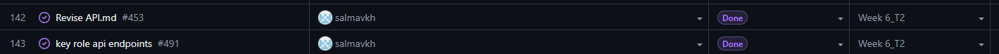   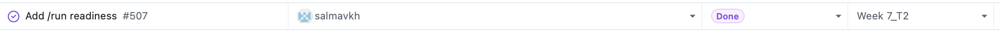         |
| `taoTimTim`     | 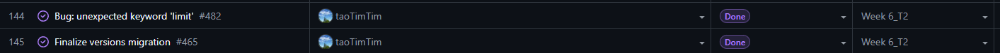   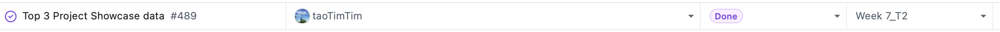         |

### Table view of under review tasks by username

| GitHub Username | Screenshots                                                                |
| --------------- | -------------------------------------------------------------------------- |
| `AdaraPutri`    |  |

## (Term 2 Week 9) Monday March 2 - Sunday March 8

**Connection to previous week:**

In weeks 6-8, we finalized all remaining backend API endpoints, completed project versioning, and built out the core analytics layer (ranked projects, skill timelines, activity heatmaps). The plan was to begin implementing the frontend once the React + Vite setup PR was completed and merged.

### Coding tasks

This week marked the official start of frontend development. The React + Vite frontend scaffold was completed and merged in [PR #500](https://github.com/COSC-499-W2025/capstone-project-team-19/pull/500), establishing the base project structure under `/frontend` with environment configuration for backend connectivity.

With the scaffold in place, the authentication and home page UI was implemented in [PR #522](https://github.com/COSC-499-W2025/capstone-project-team-19/pull/522), wiring Login and Register pages to the existing FastAPI auth endpoints with token storage and navigation handling. The frontend test stack (Vitest + React Testing Library) was set up in [PR #531](https://github.com/COSC-499-W2025/capstone-project-team-19/pull/531), providing the foundation for all frontend testing going forward.

The Insights page began taking shape with ranked projects implemented in [PR #524](https://github.com/COSC-499-W2025/capstone-project-team-19/pull/524), displaying project cards ranked by contribution and progression data. The skill timeline feature was implemented in [PR #530](https://github.com/COSC-499-W2025/capstone-project-team-19/pull/530), with a follow-up PR adding a Code/Text/All toggle to the bar chart in [PR #548](https://github.com/COSC-499-W2025/capstone-project-team-19/pull/548).

The upload wizard was started with the consent flow UI built in [PR #540](https://github.com/COSC-499-W2025/capstone-project-team-19/pull/540), implementing the first step of the upload process with a shared wizard layout. The full upload flow (Upload, Projects, Deduplication, Classification stages) was completed in [PR #551](https://github.com/COSC-499-W2025/capstone-project-team-19/pull/551).

The Projects page was implemented in [PR #535](https://github.com/COSC-499-W2025/capstone-project-team-19/pull/535), displaying a list of projects with thumbnails and individual project detail views. The Resume Output page was implemented in [PR #545](https://github.com/COSC-499-W2025/capstone-project-team-19/pull/545), supporting resume creation, viewing, deletion, and export to DOCX/PDF. This PR also fixed a backend bug where `detect_frameworks()` returned a Python `set` instead of a list, causing JSON serialization failures during resume creation for code projects.

Tailwind CSS and shadcn/ui were set up in [PR #552](https://github.com/COSC-499-W2025/capstone-project-team-19/pull/552) to provide a consistent component library and styling system for the frontend.

The UI for the user's Profile page was implemented in [PR #560](https://github.com/COSC-499-W2025/capstone-project-team-19/pull/560).

### Testing or debugging tasks

Frontend tests for the Login, Register, and Home pages were added in [PR #533](https://github.com/COSC-499-W2025/capstone-project-team-19/pull/533), covering component rendering, API call mocking, navigation, token storage, and error messaging. Tests for the Insights page (ranked projects and skill timeline tabs) were added in [PR #550](https://github.com/COSC-499-W2025/capstone-project-team-19/pull/550). Tests for the Projects page were added in [PR #553](https://github.com/COSC-499-W2025/capstone-project-team-19/pull/553), covering project list loading and rendering, as well as project detail views.

A bug in the project feedback endpoint was fixed in [PR #514](https://github.com/COSC-499-W2025/capstone-project-team-19/pull/514), where a `project_key` vs `project_name` type mismatch caused the endpoint to return empty arrays. The test helper had the same bug, which was masking the issue. README and API documentation were also updated in [PR #515](https://github.com/COSC-499-W2025/capstone-project-team-19/pull/515) with clarified setup instructions and fixes to duplicated and inconsistent sections.

### Reviewing or collaboration tasks

Several frontend PRs this week had dependency chains that required coordinated rebasing. The Insights page PRs (#524, #530, #548) branched off the frontend setup (#500) and login (#522) PRs, so they needed rebasing once those were merged. The test stack PR (#531) was also a prerequisite for the test PRs (#533, #550, #553). The team coordinated reviews to unblock these chains efficiently.

### Issues or blockers

A backend serialization bug was discovered while building the Resume Output page: `detect_frameworks()` returned a Python `set` which is not JSON-serializable, causing resume creation to fail for code projects. This was caught and fixed within [PR #545](https://github.com/COSC-499-W2025/capstone-project-team-19/pull/545). No other major blockers were encountered.

### Plan / goals for next week

The plan is to integrate a UI component library and update the Figma designs with a refined color palette to modernize the look and feel. From there, we will flesh out the pages we've started on (Insights, Upload, Projects, Resume Output) and work towards completing the full end-to-end flow on the frontend, including the portfolio view. We will also continue adding frontend tests as pages are finalized.

### Burnup chart

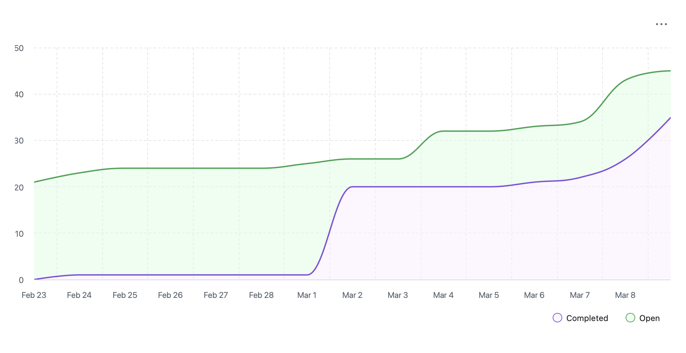

### Github usernames

| GitHub Username | Student Name          |
| --------------- | --------------------- |
| `AdaraPutri`    | Adara Putri           |
| `ammaarkhan`    | Ammaar Khan           |
| `ivonanicetin`  | Ivona Nicetin         |
| `johaneshp`     | Johanes Hamonangan    |
| `salmavkh`      | Salma Vikha Ainindita |
| `taoTimTim`     | Timmi Draper          |

### Table view of completed tasks by username

| GitHub Username | Screenshots                                                        |
| --------------- | ------------------------------------------------------------------ |
| `AdaraPutri`    | 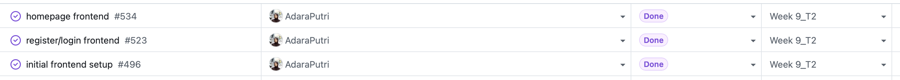       |
| `ammaarkhan`    | 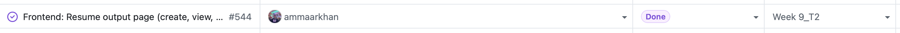     |
| `ivonanicetin`  | 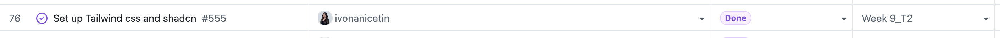       |
| `johaneshp`     | 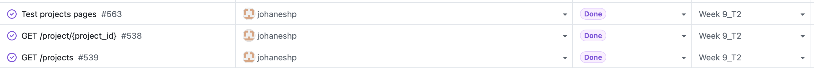   |
| `salmavkh`      | 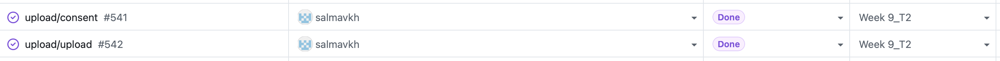       |
| `taoTimTim`     | 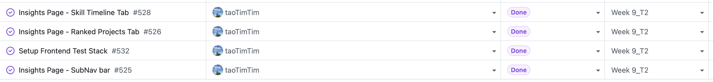       |

### Table view of under review tasks by username
 |

## (Term 2 Week 10) Monday March 9 - Sunday March 15

**Connection to previous week:**  
Building on the previous week’s initial frontend setup and page initialization, this week the team focused on polishing the full features of each pages, from Upload all the way to Outputs. Backend limitations identified last week were worked on this week (a couple of new endpoints and CLI behavior to support frontend). The team also began migrating to a more uniform UI design that represents our client's identity.

### Coding tasks

This week, the team focused on turning several previously backend- or CLI-only flows into more complete, frontend-ready product features. On the resume side, standalone profile management was implemented in [PR #573](https://github.com/COSC-499-W2025/capstone-project-team-19/pull/573), allowing users to save and edit personal information outside the resume menu, and this was extended in [PR #574](https://github.com/COSC-499-W2025/capstone-project-team-19/pull/574) to support structured education, certificate, and experience entries that now render properly in exports instead of using placeholders. Resume editing was also brought into the frontend in [PR #575](https://github.com/COSC-499-W2025/capstone-project-team-19/pull/575), where users can now edit resume names and project-level content directly from the resume detail page while the backend correctly resolves override precedence before returning data. On the analytics side, the Insights page was heavily reorganized in [PR #576](https://github.com/COSC-499-W2025/capstone-project-team-19/pull/576) and expanded in [PR #578](https://github.com/COSC-499-W2025/capstone-project-team-19/pull/578) with heatmaps and a Skills Log to make skill activity more visual and easier to navigate. Public-facing portfolio functionality also progressed through new backend endpoints in [PR #579](https://github.com/COSC-499-W2025/capstone-project-team-19/pull/579) and corresponding public project/project-detail pages in [PR #584](https://github.com/COSC-499-W2025/capstone-project-team-19/pull/584). In parallel, the upload wizard continued to mature through frontend Setup work in [PR #585](https://github.com/COSC-499-W2025/capstone-project-team-19/pull/585), shared UI redesign groundwork in [PR #587](https://github.com/COSC-499-W2025/capstone-project-team-19/pull/587), and Google Drive connection plus real analysis execution in [PR #590](https://github.com/COSC-499-W2025/capstone-project-team-19/pull/590), bringing the full Upload-to-Analyze flow closer to the intended final experience.

### Testing or debugging tasks

The team also spent time strengthening test coverage and resolving issues exposed during integration. The standalone profile and structured resume-entry work in [PR #573](https://github.com/COSC-499-W2025/capstone-project-team-19/pull/573) and [PR #574](https://github.com/COSC-499-W2025/capstone-project-team-19/pull/574) added and updated tests for profile defaults, save/update/clear behavior, helper logic, section visibility, and correct DOCX/PDF export rendering. Frontend refactoring in [PR #576](https://github.com/COSC-499-W2025/capstone-project-team-19/pull/576) and [PR #578](https://github.com/COSC-499-W2025/capstone-project-team-19/pull/578) included updating tests to match the new Insights structure while removing obsolete tests tied to deleted components, and [PR #587](https://github.com/COSC-499-W2025/capstone-project-team-19/pull/587) also fixed existing failing frontend tests caused by an empty auth test file and an incorrect mock route expectation in the home flow. Upload-related work in [PR #585](https://github.com/COSC-499-W2025/capstone-project-team-19/pull/585) and [PR #590](https://github.com/COSC-499-W2025/capstone-project-team-19/pull/590) involved debugging readiness checks, run-state behavior, and Drive warnings so that analysis only proceeds when each project is actually prepared. The team also encountered failing framework detector tests during the week, where assertions expected an empty set instead of an empty list, and this was investigated as part of keeping test behavior aligned with the current implementation rather than masking the underlying return-type change.

### Reviewing or collaboration tasks

A major part of this week’s work involved coordinating across frontend and backend branches so that features landed in a way that matched the final product flow rather than just individual implementation pieces. The profile-related work in [PR #573](https://github.com/COSC-499-W2025/capstone-project-team-19/pull/573), [PR #574](https://github.com/COSC-499-W2025/capstone-project-team-19/pull/574), and [PR #575](https://github.com/COSC-499-W2025/capstone-project-team-19/pull/575) required the team to align on how personal information, resume-specific edits, and override priority should behave across exports and detail pages. Similarly, the public portfolio work in [PR #579](https://github.com/COSC-499-W2025/capstone-project-team-19/pull/579) and [PR #584](https://github.com/COSC-499-W2025/capstone-project-team-19/pull/584) depended on shared understanding of which data should be exposed publicly and how public pages should differ from authenticated internal pages. The Insights refactor and heatmap additions in [PR #576](https://github.com/COSC-499-W2025/capstone-project-team-19/pull/576) and [PR #578](https://github.com/COSC-499-W2025/capstone-project-team-19/pull/578) also involved discussion around how to make highly informational data more visual and better aligned with what was discussed in class. In addition, [PR #587](https://github.com/COSC-499-W2025/capstone-project-team-19/pull/587) served as a shared baseline for the redesign, giving teammates a common theme, reusable components, and migration guidelines so pages can be updated incrementally without causing large merge conflicts.

### Issues or blockers

The main blockers this week came from integration complexity rather than isolated feature implementation. Several of the new frontend pages depended on backend behavior being returned in exactly the right shape, which surfaced issues such as resume APIs returning raw snapshot values instead of resolved override values before this was fixed in [PR #575](https://github.com/COSC-499-W2025/capstone-project-team-19/pull/575). Upload flow work also exposed readiness and sequencing problems, especially around setup completeness, Google Drive mapping, and when analysis should be allowed to run, which required additional fixes in [PR #585](https://github.com/COSC-499-W2025/capstone-project-team-19/pull/585) and [PR #590](https://github.com/COSC-499-W2025/capstone-project-team-19/pull/590). On the frontend side, the team was working while a broader UI redesign was also beginning, so there was a risk of duplicated effort or merge conflict across feature pages until the shared baseline in [PR #587](https://github.com/COSC-499-W2025/capstone-project-team-19/pull/587) was introduced. There were also smaller debugging blockers during the week, including failing framework detector tests caused by mismatched expectations about empty return types, which reflected how test suites can drift when implementation details change across branches.

### Plan / goals for next week

Next week, the team plans to continue stabilizing these newly connected flows so they behave consistently from end to end. Especially there will be more test PRs added that were not covered in this sprint. We will also be refining the UI migration to the new design, and preparing our system for peer testing on Wednesday.

### Burnup chart

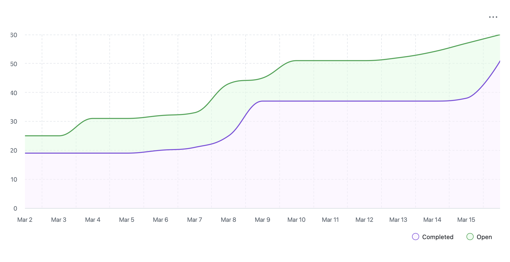

### Github usernames

| GitHub Username | Student Name          |
| --------------- | --------------------- |
| `AdaraPutri`    | Adara Putri           |
| `ammaarkhan`    | Ammaar Khan           |
| `ivonanicetin`  | Ivona Nicetin         |
| `johaneshp`     | Johanes Hamonangan    |
| `salmavkh`      | Salma Vikha Ainindita |
| `taoTimTim`     | Timmi Draper          |

### Table view of completed tasks by username

| GitHub Username | Screenshots                                                        |
| --------------- | ------------------------------------------------------------------ |
| `AdaraPutri`    | 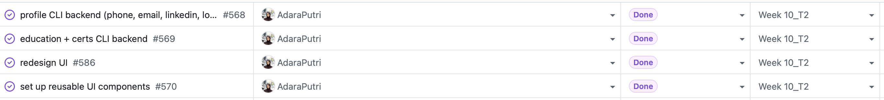       |
| `ammaarkhan`    | 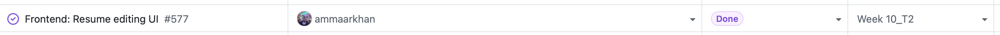     |
| `johaneshp`     | 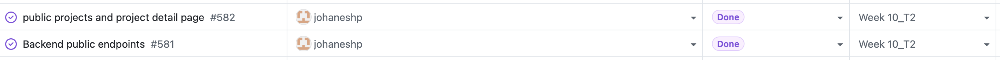   |
| `salmavkh`      | 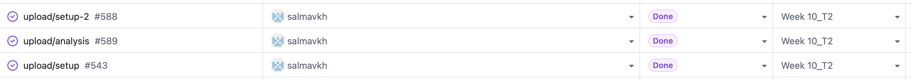       |
| `taoTimTim`     | 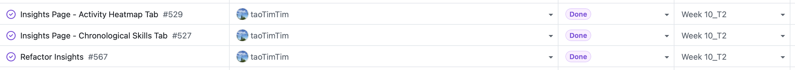       |

### Table view of in progress tasks by username
| GitHub Username | Screenshots                                                        |
| --------------- | ------------------------------------------------------------------ |
| `ivonanicetin`  | 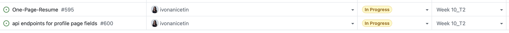       |

## (Term 2 Week 11 + 12) Monday March 16 - Sunday March 29

**Connection to previous week:**  

Building on Week 10, where the team focused on connecting major flows (Upload --> Analyze --> Outputs) and beginning the UI redesign, Weeks 11 and 12 were focused on completing and refining the system. During this time, the team finalized core features across the application, aligned all pages with the updated UI baseline, and improved overall usability and stability through additional fixes and testing. This period represents the transition from feature implementation to a more complete and polished final product. We additionally took in all the feedback from the peer evaluations and implemented the changes necessary to make the user experience less confusing.

### Coding tasks

For the code, the team focused on finishing the application by completing remaining features, aligning the UI, and improving overall usability across the system. Since many PRs were completed in Weeks 11 and 12, we have written about them in a grouped format, organizing them based on which part of the system they relate to.

**Home Page, Shared Frontend UI, and Authentication**

[PR #613](https://github.com/COSC-499-W2025/capstone-project-team-19/pull/613) refactored authentication flows and route protection so users with invalid or missing tokens are redirected properly, and also redesigned the Home page to match the updated UI system. [PR #616](https://github.com/COSC-499-W2025/capstone-project-team-19/pull/616) introduced a shared page-level layout across authenticated pages, adding a consistent container,  navigation, and structure to support the UI redesign.

**Public and Private Projects Page**

[PR #617](https://github.com/COSC-499-W2025/capstone-project-team-19/pull/617) implemented *public* insights and resume views so selected projects can be displayed externally with skill timelines, rankings, heatmaps, and resume data. [PR #618](https://github.com/COSC-499-W2025/capstone-project-team-19/pull/618) refactored the Projects and Project Details pages, including public versions, and updated the FeatureTile component to support thumbnails for consistent project cards. [PR #635](https://github.com/COSC-499-W2025/capstone-project-team-19/pull/635) improved how project dates are displayed by introducing clearer formatting and handling missing or partial date data, while also fixing public project date fallbacks. [PR #636](https://github.com/COSC-499-W2025/capstone-project-team-19/pull/636) redesigned project visibility controls by moving the project visibility toggle from project cards to the project detail page and simplifying the projects list to show private/public as read-only indicators. [PR #656](https://github.com/COSC-499-W2025/capstone-project-team-19/pull/656) added a toggle in the main navigation/header bar that allows users to switch between their private and public views and updated public pages to follow the new UI baseline. [PR #674](https://github.com/COSC-499-W2025/capstone-project-team-19/pull/674) introduced a Top Projects section on the public projects page to highlight ranked projects and additionally implemented links under each project that takes the user directly to project-specific activity insights.

**Profile Page**

[PR #619](https://github.com/COSC-499-W2025/capstone-project-team-19/pull/619) implemented the frontend Profile page UI, allowing users to edit personal details, certifications, education, experience, and summaries. [PR #662](https://github.com/COSC-499-W2025/capstone-project-team-19/pull/662) added account deletion functionality with backend cleanup to remove all associated user data. [PR #666](https://github.com/COSC-499-W2025/capstone-project-team-19/pull/666) applied peer-testing fixes to the Profile page, including improved placeholders, unsaved change warnings, and logout functionality. [PR #671](https://github.com/COSC-499-W2025/capstone-project-team-19/pull/671) implemented end-to-end change-password functionality, including backend validation, frontend UI, and supporting tests and documentation.

**Resume Page & Export**

[PR #637](https://github.com/COSC-499-W2025/capstone-project-team-19/pull/637) added the ability to remove and add projects to a resume through updated UI and backend endpoints. [PR #660](https://github.com/COSC-499-W2025/capstone-project-team-19/pull/660) renamed the Outputs page to Resume and simplified navigation by removing the unused landing and portfolio view. [PR #661](https://github.com/COSC-499-W2025/capstone-project-team-19/pull/661) refactored the Resume page and related components to align with the updated Tailwind and shared UI styling system. [PR #675](https://github.com/COSC-499-W2025/capstone-project-team-19/pull/675) improved resume export by enforcing a one-page constraint, adding backend validation, and adding preview behavior to better match final output. [PR #678](https://github.com/COSC-499-W2025/capstone-project-team-19/pull/678) added controls to allow users to choose which skills appear in their resume and updated export behavior accordingly. [PR #679](https://github.com/COSC-499-W2025/capstone-project-team-19/pull/679) improved how key roles are assigned and selected, including fixing missing values and replacing free text input with a controlled dropdown. This was discussed in the last weekly, Wednesday meeting with the TA (Week 11). [PR #681](https://github.com/COSC-499-W2025/capstone-project-team-19/pull/681) implemented organizing skills by expertise on the one-page resume, using stored skill levels to group skills appropriately, and updated tests to reflect the new behavior. Lastly, [PR #672](https://github.com/COSC-499-W2025/capstone-project-team-19/pull/672) moved summary editing from the resume section to the project details page and added a new backend endpoint to support this change.

**Upload Page**

[PR #633](https://github.com/COSC-499-W2025/capstone-project-team-19/pull/633) fixed several issues in the upload workflow, including duplicate analysis detection, deduplication problems, and missing summaries, while also improving the UI with clearer instructions and better navigation behavior.

**Insights Page**

[PR #621](https://github.com/COSC-499-W2025/capstone-project-team-19/pull/621) updated skill level indicators from text labels to a star-based system to improve clarity and reduce visual clutter.

### Testing or debugging tasks

Following the coding work, the team focused on stabilizing key workflows and improving reliability across the system through targeted debugging and additional test coverage.

**Upload Flow**

[PR #634](https://github.com/COSC-499-W2025/capstone-project-team-19/pull/634) improved and stabilized the GitHub integration flow in the upload setup by fixing issues with OAuth handling, token validation, and repository loading that previously caused inconsistent behavior. This PR also refactored the flow into clearer step-based interactions with better UI feedback. Following that, [PR #667](https://github.com/COSC-499-W2025/capstone-project-team-19/pull/667) improved unfinished upload handling by adding recovery and cleanup mechanisms, including new API endpoints and frontend flows to prevent stale file path issues and allow users to safely exit,resume, or restart uploads. [PR #669](https://github.com/COSC-499-W2025/capstone-project-team-19/pull/669) added comprehensive frontend test coverage for the upload wizard flow, covering consent validation, recovery handling, setup navigation, and analysis execution, along with shared test utilities to support consistent testing across related pages.

**Bugs**

[PR #644](https://github.com/COSC-499-W2025/capstone-project-team-19/pull/644) fixed a bug in the Project Heatmap where low-activity cells were incorrectly displayed with maximum intensity due to improper scaling logic, the PR updated the normalization to better reflect actual activity levels.

[PR #689](https://github.com/COSC-499-W2025/capstone-project-team-19/pull/689) fixed issues where manual project and contribution summaries entered during setup were not being persisted or displayed correctly. This addresses / fixes backend validation errors, state mismatches, and frontend rendering conditions so summaries now appear properly on the Project Detail page.

**Refactoring**

[PR #684](https://github.com/COSC-499-W2025/capstone-project-team-19/pull/684) refactored the public insights and resume pages to align with their private counterparts and incorporated updates from recent fixes, including the Project Heatmap. This PR also implemented tests for the public insights and outputs page, ensuring our system has better coverage. The tests mock the public API and assert loading and error states, page structure, switching between insight views (including heatmap tabs), and the public resume view (skills summary, projects, date formatting, export controls, and multi-project ordering).

### Documentation Tasks

[PR #664](https://github.com/COSC-499-W2025/capstone-project-team-19/pull/664) - Milestone 3 documentation was organized and expanded, centralizing key artifacts such as system architecture, DFD diagrams, installation guides, testing reports, and known bugs into structured docs linked from the main README. Updates also enabled easier generation of test coverage reports, improving clarity and accessibility for reviewers and future developers.

### Reviewing or collaboration tasks

The team collaboratively prepared for the Milestone 3 presentation by organizing slide content and practicing the presentation together. For the Milestone 3 deliverables, work was distributed evenly. The majority of the team worked on the demo video, splitting up the pages they will cover, and the rest of the team put together the documentation requirements, which was then merged into `main`.

Additionally, the team resolved merge conflicts and managed PR dependencies to ensure smooth integration as each PR was merged into main.

### Issues or blockers

No major blockers were encountered during this period, and the team made steady progress across features and deliverables. Minor challenges included managing merge conflicts and coordinating work across dependent branches, which were resolved through communication and careful PR sequencing/reviewing.

### Plan / goals for next week

This was the last week of coding and deliverables. In the following weeks, The team will be contributing to the final class requirements separately, being the project voting and the last quiz. Other than that, we will each be studying hard for our finals and celebrating the win of completing this project with a strong finish. We are all proud of the project we have built, and are thankful to have had a team that overall worked very well together.

### Burnup chart

### Github usernames

| GitHub Username | Student Name          |
| --------------- | --------------------- |
| `AdaraPutri`    | Adara Putri           |
| `ammaarkhan`    | Ammaar Khan           |
| `ivonanicetin`  | Ivona Nicetin         |
| `johaneshp`     | Johanes Hamonangan    |
| `salmavkh`      | Salma Vikha Ainindita |
| `taoTimTim`     | Timmi Draper          |

### Table view of completed tasks by username

| GitHub Username | Screenshots                                                        |
| --------------- | ------------------------------------------------------------------ |
| `AdaraPutri`    | 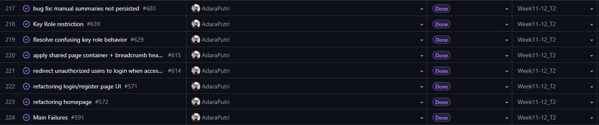       |
| `ammaarkhan`    | 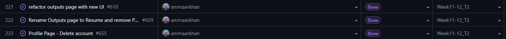     |
| `johaneshp`     | 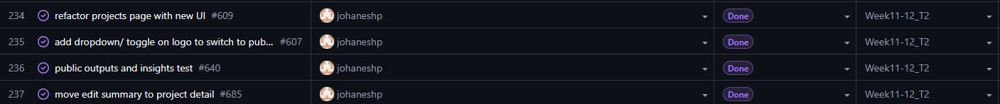   | 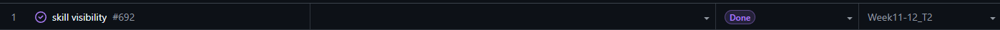 |
| `salmavkh`      | 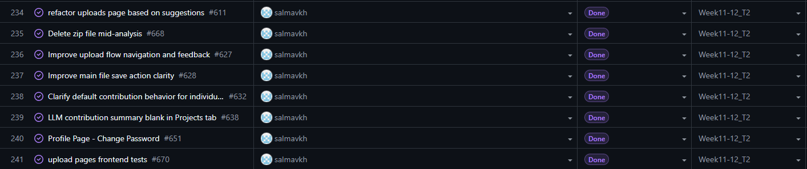       |
| `taoTimTim`     | 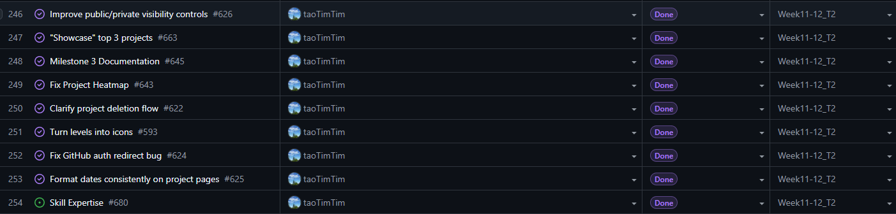       |
| `ivonanicetin`  | 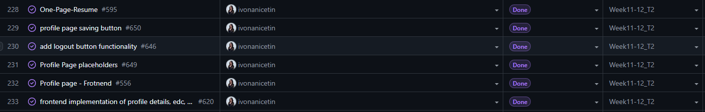       |

