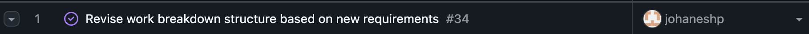

# Team Log

## (Week 3) Monday 15th - Sunday 21st September

Week recap: The team discussed and worked on creating a list of functional and non-functional requirements. On Wednesday, during class we met with other teams and compared requirements.

Discussion went well with other teams, we found out that there are some features that our team has, while other's not, and vice versa.

Such as other team has trend analysis and onboarding tutorial while our team does not
Our team has a feature where we ask for user's permission, while other team does not.

### Additional Context

| Team    | Highlights                                                                                                                                                                                                                                                                                    |
| ------- | --------------------------------------------------------------------------------------------------------------------------------------------------------------------------------------------------------------------------------------------------------------------------------------------- |
| Team 20 | **Functional:** More detailed file classification (e.g., programming language and type). **Functional:** Analysis runs only on new files to avoid redundancy. **Security:** Omits user permission requests before accessing local files.                                                |
| Team 17 | **Functional:** Adds trend analysis visualizations and file previews for user approval. **Non-functional:** Groups requirements under performance, scalability, reliability, security, maintainability, and privacy. **New:** Includes an onboarding/tutorial experience at app launch. |
| Team 3  | **Functional:** Generates resume bullet points and provides a timeline visualization. **Non-functional:** Favors a modular codebase design. **Use Case:** Extends the system to HR platforms and hiring managers.                                                                       |

Plan for the next cycle: Discussing about team's project proposal and architecture diagram that will be submitted next week

## (Week 4) Monday 22nd - Sunday 28th September

### Week recap:

The team worked on building the architecture diagram and writing the project proposal. On Wednesday, we conversed with other teams about their architecture diagrams, then regrouped to discuss what we liked, didn't like, and what we wanted to add/expand on in our own diagram. We also finally decided to work on native app instead of web app considering the challenges of learning new things that might be useful for us in the future.

For the project proposal, we divided writing responsibilities among the team. We also split up research tasks for the different file type functions. Team members researched approaches for text (PDF, DOCX), images, videos, audio, csv, and code analysis as well as retrieving data from online sources (Google Drive and Github). We integrated our research into the architecture diagram, and the dashboard visualization was expanded to include them.

### Burnup chart

### Github usernames

| GitHub Username | Student Name          |
| --------------- | --------------------- |
| `AdaraPutri`    | Adara Putri           |
| `ammaarkhan`    | Ammaar Khan           |
| `ivonanicetin`  | Ivona Nicetin         |
| `johaneshp`     | Johanes Hamonangan    |
| `salmavkh`      | Salma Vikha Ainindita |
| `taoTimTim`     | Timmi Draper          |

### Table view of completed tasks by username

| GitHub Username | Screenshot                                                                  |
| --------------- | --------------------------------------------------------------------------- |
| `AdaraPutri`    |      |
| `ammaarkhan`    |    |
| `ivonanicetin`  |      |
| `johaneshp`     |  |
| `salmavkh`      |      |
| `taoTimTim`     |      |

### Table view of in progress tasks by username

Not applicable – no tasks in progress.

### Additional context

#### Differences/Similarities with Other Teams' Architecture Diagrams

| Team    | Takeaways                                                                                                                                                                                                                                                              |
| ------- | ---------------------------------------------------------------------------------------------------------------------------------------------------------------------------------------------------------------------------------------------------------------------- |
| Team 14 | Included a portfolio builder that we decided to skip. Connected with GitHub, which inspired us to add that feature. Plans to leave room for a future web frontend rather than staying app-only. Stored both raw and processed data (we don't store raw data). |
| Team 15 | Avoids using a database, keeping everything local. Does not support music, audio, or video files (we plan to include them). Has post-processing in between ML and metrics steps to tidy up the data.                                                             |
| Team 18 | Also uses Electron to support cross-platform desktop development.                                                                                                                                                                                                      |

Plan for next cycle: Build the Data Flow Diagram (DFD) that must be submitted next week

## (Week 5) Monday 29th - Sunday 5th October

### Week recap:

The team focused on building the Data Flow Diagram (DFD). On Monday, we collaborated to draft Level 0 and Level 1, aligning on system boundaries, external entities, and the major data stores and flows. We looked at examples and articles online to understand the difference between a Level 0 and Level 1 diagram and consulted the professor on our DFD Level 1 draft in class. The feedback was to break down the different metric functions like we did in the System Architecture diagram and to include separate arrows from the "Categorize File" process to each functions. On Wednesday, we went around in class comparing DFDs with other teams, then regrouped to discuss what we liked, didn't like, and what we wanted to refine or add to our diagrams.

### Burnup chart

### Github usernames

| GitHub Username | Student Name          |
| --------------- | --------------------- |
| `AdaraPutri`    | Adara Putri           |
| `ammaarkhan`    | Ammaar Khan           |
| `ivonanicetin`  | Ivona Nicetin         |
| `johaneshp`     | Johanes Hamonangan    |
| `salmavkh`      | Salma Vikha Ainindita |
| `taoTimTim`     | Timmi Draper          |

### Table view of completed tasks by username

| GitHub Username | Screenshot                                                                  |
| --------------- | --------------------------------------------------------------------------- |
| `AdaraPutri`    |    |
| `ammaarkhan`    |  |
| `ivonanicetin`  |    |
| `johaneshp`     |  |
| `salmavkh`      |    |
| `taoTimTim`     |    |

### Table view of in progress tasks by username

Not applicable – no tasks in progress.

### Additional context

#### Differences/Similarities with Other Teams' DFD Diagrams

| Team  | Takeaways                                                                                                                                                                                                                         |
| ----- | --------------------------------------------------------------------------------------------------------------------------------------------------------------------------------------------------------------------------------- |
| Team 11 | Focuses on scanning file metadata rather than calculating metrics. Lacks a dedicated metrics module and renders the dashboard as static HTML. We still need clarity on how their data extraction supports the insights they expect to present. |
| Team 17 | Level 0 and Level 1 structures align closely with ours. Introduces error logging and an artifact database, though the data ingestion flow remains unclear. Aims to output a portfolio experience instead of a dashboard; users can opt out of saving to the database. |
| Team 15 | Restricts processing to text files only, applying an ML model for every document. Does not handle images or video sources. Open questions on what metrics they intend to surface from the ML pipeline.                                                          |

## (Week 6) Monday 6th - Sunday 12th October

### Week recap:

This week, the team focused on moving from design to implementation, refining both the System Architecture Diagram and DFD Level 1 to reflect all updated project requirements and new modules like offline processing. The team also began coding key system features: setting up the local environment, implementing ZIP file parsing, and enhancing it with error handling for unsupported and duplicate files, MIME validation, and detailed logging. Unit tests were added to ensure these features work as intended. Additionally, the team worked on creating and testing the consent form for external service usage, ensuring responses are correctly stored in the database. Everyone reviewed and refined multiple PRs, aligning coding progress with the finalized system design.

### Burnup chart

### Github usernames

| GitHub Username | Student Name          |
| --------------- | --------------------- |
| `AdaraPutri`    | Adara Putri           |
| `ammaarkhan`    | Ammaar Khan           |
| `ivonanicetin`  | Ivona Nicetin         |
| `johaneshp`     | Johanes Hamonangan    |
| `salmavkh`      | Salma Vikha Ainindita |
| `taoTimTim`     | Timmi Draper          |

### Table view of completed tasks by username

| GitHub Username | Screenshot                                                                  |
| --------------- | --------------------------------------------------------------------------- |
| `AdaraPutri`    |    |
| `ammaarkhan`    |  |
| `ivonanicetin`  |    |
| `johaneshp`     |  |
| `salmavkh`      |    |
| `taoTimTim`     |    |

### Table view of in progress tasks by username

Not applicable – no tasks in progress.

## (Week 7) Monday 13th - Sunday 19th October

### Week recap:

This week, the team continued implementation work for Milestone 1, completing several major system features. Timmi added the Pull Request template, fixed a Windows-specific MIME-type detection bug to ensure consistent file recognition across platforms, and completed the integration of ZIP file parsing with metadata storage in the local SQLite database. Salma implemented user-configuration storage, enabling persistent saving of user consent preferences (accepted and rejected for both LLM usage and file parsing). Ivona completed the feature for detecting and identifying the programming language and framework used in uploaded coding projects. Ammaar developed the feature that distinguishes individual projects from collaborative ones, allowing the system to identify when files belong to shared repositories versus solo workspaces for more accurate contribution tracking. Johanes implemented the alternative analysis feature, ensuring that when user data cannot be sent to an external service, the system automatically performs a local analysis to maintain functionality and data privacy. Adara implemented the advanced text function, which analyzes text files using LLM and prints the metrics found to the user.

### Burnup chart

### Github usernames

| GitHub Username | Student Name          |
| --------------- | --------------------- |
| `AdaraPutri`    | Adara Putri           |
| `ammaarkhan`    | Ammaar Khan           |
| `ivonanicetin`  | Ivona Nicetin         |
| `johaneshp`     | Johanes Hamonangan    |
| `salmavkh`      | Salma Vikha Ainindita |
| `taoTimTim`     | Timmi Draper          |

### Table view of completed tasks by username

| GitHub Username | Screenshot                                                                  |
| --------------- | --------------------------------------------------------------------------- |
| `AdaraPutri`    |    |
| `ammaarkhan`    |  |
| `ivonanicetin`  |    |
| `johaneshp`     |  |
| `salmavkh`      |    |
| `taoTimTim`     |    |

### Table view of in progress tasks by username

Not applicable – no tasks in progress.

## (Week 8) Monday 20th - Sunday 26th October

### Week recap:

This week, the team focused on improving the analysis pipeline, database consistency, and overall user experience. Ammaar implemented a fix ensuring that the program exits cleanly when a user declines consent, and updated the parsing process so that each file now stores its associated project name, making downstream grouping and analysis more reliable. Timmi developed the project-type classification feature, enabling automatic detection of whether a project is code- or text-based and routing it accordingly. She also added a safeguard to prevent duplicate ZIP uploads from being reprocessed in the database. Salma refined the send_to_analysis flow by adding user prompts between individual and collaborative analysis phases, reorganizing functions for clarity, and ensuring a smoother, more modular pipeline. Johanes improved the alternative analysis logic by refining keyword filters, applying POS tagging, and enhancing topic extraction to ensure that only meaningful terms are analyzed during local runs. Ivona refactored the language detection module to align with the new database schema, ensuring accurate identification of languages used in code projects. Adara fixed an issue where ZIP uploads containing only files (and no folders) caused the program to stop, and added an LLM-based code analysis feature that generates resume-style summaries for entire code project by extracting README content, function definitions, and comments across each folder. [ADD IVONA'S NEXT PR AS WELL]

### Burnup chart

### Github usernames

| GitHub Username | Student Name          |
| --------------- | --------------------- |
| `AdaraPutri`    | Adara Putri           |
| `ammaarkhan`    | Ammaar Khan           |
| `ivonanicetin`  | Ivona Nicetin         |
| `johaneshp`     | Johanes Hamonangan    |
| `salmavkh`      | Salma Vikha Ainindita |
| `taoTimTim`     | Timmi Draper          |

### Table view of completed tasks by username

| GitHub Username | Screenshot                                                                  |
| --------------- | --------------------------------------------------------------------------- |
| `AdaraPutri`    |    |
| `ammaarkhan`    |  |
| `ivonanicetin`  |    |
| `johaneshp`     |  |
| `salmavkh`      |    |
| `taoTimTim`     |    |

### Table view of in progress tasks by username

Not applicable – no tasks in progress.