# Personal Log - Timmi

## Table of Contents

### Term 2
- [Week 4-5 (Jan 26 - Feb 8)](#t2-week-4-5-monday-january-26---sunday-february-8)
- [Week 3 (Jan 19-25)](#t2-week-3-monday-january-19---sunday-january-25)
- [Week 2 (Jan 12-18)](#t2-week-2-monday-january-12---sunday-january-18)
- [Week 1 (Jan 5-11)](#t2-week-1-monday-january-5---sunday-january-11)

### Term 1
- [Week 14 (Dec 1-7)](#week-14-monday-december-1---sunday-december-7)
- [Week 13 (Nov 24-30)](#week-13-monday-november-24---sunday-november-30)
- [Week 12 (Nov 17-23)](#week-12-monday-november-17---sunday-november-23)
- [Week 10 (Nov 3-9)](#week-10-monday-november-3---sunday-november-9)
- [Week 9 (Oct 27-Nov 2)](#week-9-monday-october-27---sunday-november-2)
- [Week 8 (Oct 20-26)](#week-8-monday-october-20---sunday-october-26)
- [Week 7 (Oct 13-19)](#week-7-monday-october-13---sunday-october-17)
- [Week 6 (Oct 6-12)](#week-6-monday-6th-october---sunday-12th-october)
- [Week 5 (Sept 29-Oct 5)](#week-5-monday-29th-september---sunday-5th-october)
- [Week 4 (Sept 22-28)](#week-4-monday-22nd---sunday-28th-september)
- [Week 3 (Sept 15-21)](#week-3-monday-15th---sunday-21st-september)

## (Week 3) Monday 15th - Sunday 21st September

Week Recap: Worked with the team to build the functional and non-functional requirements. Conversed with other teams on Wednesday, Sept. 17th, about both ours and their project requirements, we compared ideas and gained feedback on how to clean up our project requirements. Performed personal research, and conversed with my team, on the project specifications, specifically data storage.

## (Week 4) Monday 22nd - Sunday 28th September

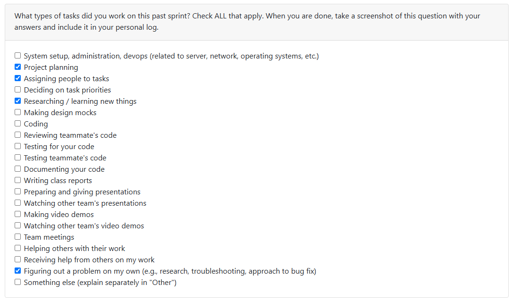

Worked with the team to build the architecture diagram and put together the project proposal. On Wednesday, we conversed with other teams about their architecture diagrams, then regrouped and talked about what we liked, what we didn't, and what we wanted to add/expand on.

I was assigned to write the *Project Scope and Usage Scenario* and the *Proposed Solution* (with Salma) in the project proposal. Additionally, the team split up research tasks on the different file type functions.

I took on the Image function, Video function, and getting data from online sources (Google Drive) with Ammaar, and thus spent a few hours researching how we would analyze those file types. I then added the processes to the Architecture Diagram.

I also helped with the *Tech Stack* and the *Requirements, Testing, and Requirement Verification* sections in the project proposal, as well as expanded on the dashboard visualization in the architecture diagram.

## (Week 5) Monday 29th September - Sunday 5th October

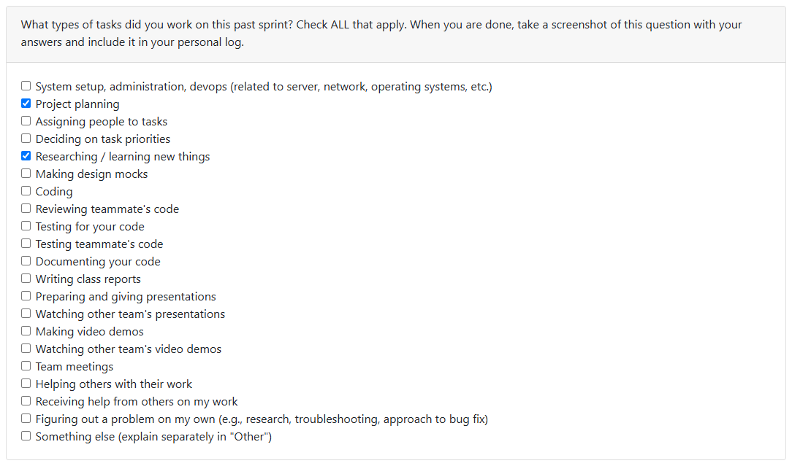

Week Recap: On Monday the team began working on the DFD, both Level 0 and Level 1. We researched DFD's to ensure we were putting the correct elements in our diagram, as they are specific to the level of the DFD. On Wednesday, we conversed with other teams, exchanging diagrams. We asked questions about their diagrams to learn their process and plans, and they asked about ours. 

## (Week 6) Monday 6th October - Sunday 12th October

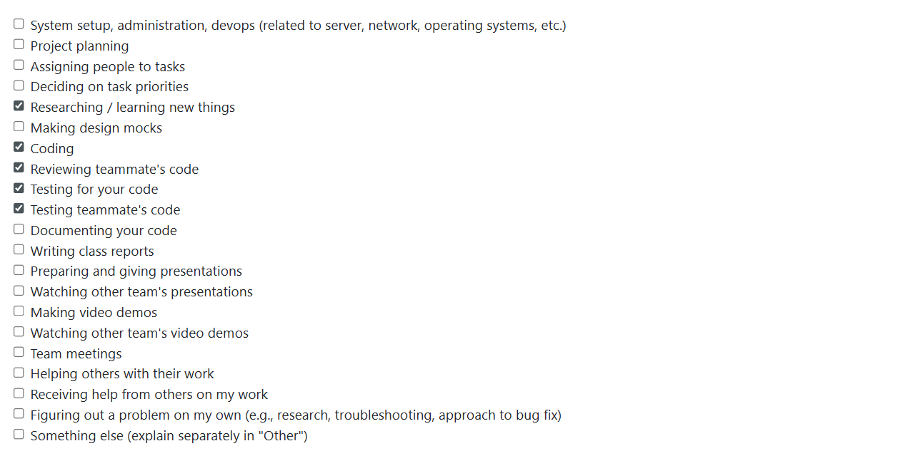

Week Recap: Spent time inputting each requirement as in issue. We did not have a meeting this week, so each team member self-assigned a task to themselves. I took on setting up the local environment and implementing the requirement "parsing zip files". I researched how to parse a file in python, and also general python set up for the system. Additionally, I wrote the tests for the parsing files requirement.

My PR's: 
- Local environment setup
- Parsing files

Reviewed the following PR's:
- User consent feature (Salma)
- Add updated system architecture diagram and description (Adara)
- Wbs (Johanes)

## (Week 7) Monday October 13 - Sunday October 17 

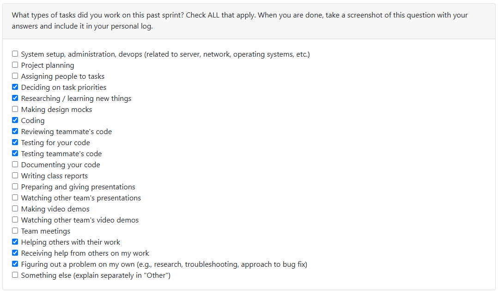 

Week Recap: This week, I started by setting up the PR template and ensuring all assigned issues were in the Kanban board. Then, I fixed a Windows-specific bug where MIME detection was failing to recognize certain CSV files during pytest runs, which required additional research to resolve. I also connected the parsed ZIP files to the database so the files metadata is now stored in the database. The files themselves remain stored locally on the user’s machine rather than within the database, which is something the team plans to discuss further in our next meeting. 

My PR's:
- 74 (Pull request template)
- 77 (Windows test failure)
- 78 (Parsing to db)

Reviewed the following PR's:
- 75 (Store user config) - Salma

## (Week 8) Monday October 20 - Sunday October 26

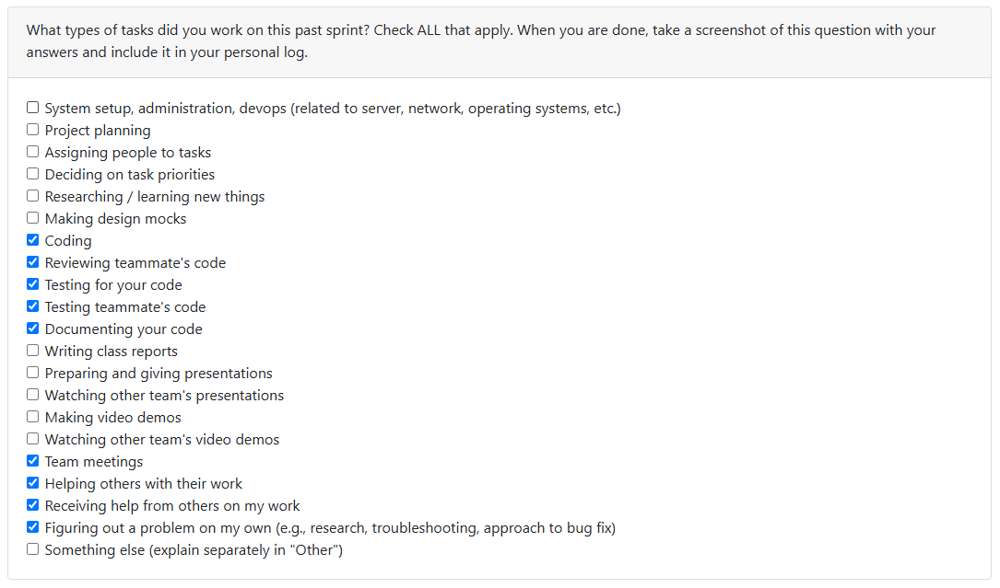

Week Recap: This week, I started by removing and refactoring the `zip_data` folder so that raw files would no longer be saved in the directory or the database. This change was discussed with the team on Wednesday, October 22. However, when my PR was reviewed, there was some confusion because parts of the existing analysis code still relied on those raw files being saved. There was a misunderstanding about which files were stored where, and after further discussion on Discord, we decided that the `zip_data` folder would only be removed after the parsing and analysis are complete. I then closed my PR without merging and created an issue to implement this change in the future.

After that, I began implementing the flow for parsing and analysis by adding a `project_type` attribute to the `project_classifications` table to indicate whether each project was code or text. I also added modular routing for collaborative versus individual projects. Collaborative projects now trigger contribution analysis to determine which parts the user worked on, while individual projects go straight to file analysis. All relevant tests have been implemented.

Additionally, Ivona and I discussed the need for further duplication checks when uploading a ZIP file. I then implemented code to check if the ZIP file had already been uploaded, and if so it prompts the user to choose what they would like to do (reuse the old analaysis or replace the files with the new ones). Further duplication checks will need to be implemented.

Next week, I plan to continue with the analysis of the files and continue to implement duplication checks, as there is one case that is still getting through despite being a duplicate.

My PR's:
- 104 (Refactor/remove zip data saving) - closed, unmerged
- 118 (Project type classification)
- 127 (Fix/duplicate zip path)

## (Week 9) Monday October 27 - Sunday November 2

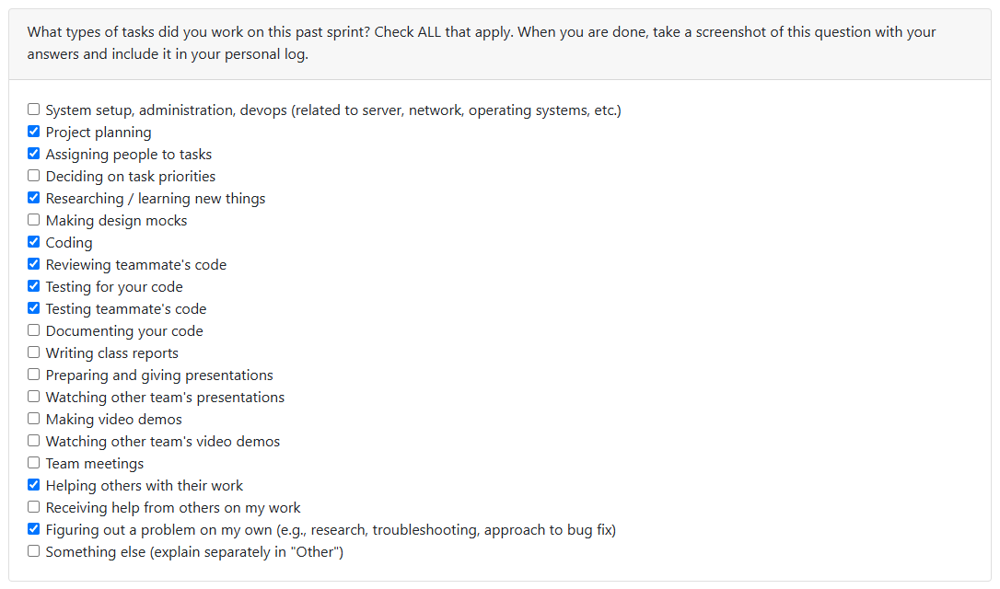

Week Recap: This week I worked on implementing the GitHub OAuth to further the collaboration analysis. Although no metrics have been pulled from GitHub yet, I worked on setting up the authentication flow through GitHub. If the user agrees, they can connect their project to a GitHub repository, which will allow us to analyze more individual contributions to a collaborative project. I included multiple tests and ensured the GitHub tokens were securely stored in the local database.

Next week, I plan to extend the individual contributions to a collaborative project by actually requesting and recieving dating via the GitHub API. This function will only run if the user has given permission to connect to GitHub, as was implemented last week. I also began refactoring the main flow (specifically the file `main.py`), but because of how messy the file is it is taking me longer than expected. Thus, I will continue my refactoring and hope to have this PR done early next week.

Last week, I had planned on extending the duplication techniques, but the team discussed this and realized any further duplication checks are not a requirement until Milestone 2. Saving this for the next milestone will allow us to focus more on the Milestone 1 requirements.

## (Week 10) Monday November 3 - Sunday November 9

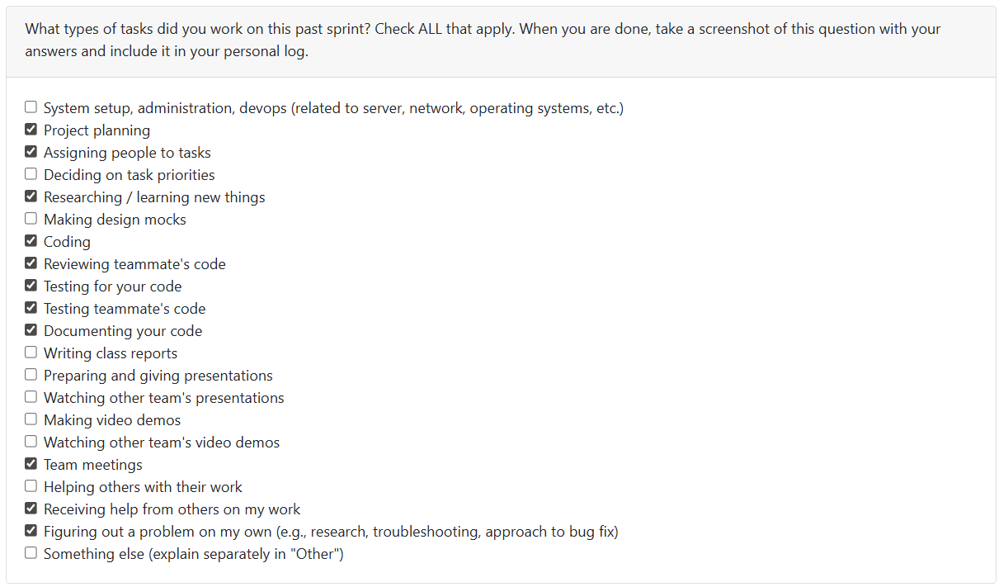

Week Recap: This week I touched on various parts of the system. I focused a lot on refactoring, understanding existing code, and improving maintainability instead of just adding new features. I also tried to review PRs within 24 hours of them opening, to avoid them sitting there for days, so I reviewed a ton this week.

I started by refactoring the main flow in `main()` and `prompt_and_store()`, since both functions had grown into large and hard-to-follow chunks. I spent time reading through the logic and deciding how to break things apart cleanly, then extracted different responsibilities into helper functions. I followed a TDD-style approach while refactoring, so I had to keep running the tests repeatedly to make sure I wasn't breaking behavior. This took a while, but the code is now much cleaner and easier to follow. We also discussed re-structuring the project directory last week, so even though I created new helper functions, I purposely left them in the same file for now until we reorganize the file structure as a team.

After that, I worked on fixing a bug in the onboarding flow. New users were mistakenly being treated as existing users with no consents, and although I understood the problem well, I wanted to find the cleanest possible fix instead of throwing something together. I spent time looking through the database helper functions to see if the logic I needed already existed rather than rewriting something. Eventually I found `get_user_by_username()`, which returns `None` when a user doesn’t exist, and called the function before creating a user record so we can properly distinguish first-time users. This required adjusting the if/else logic, and one test scenario became logically impossible, so I turned it into a defensive case. This PR took longer than expected because I wanted to ensure I was not writing duplicate code, and was reusing what already existed in the system.

The rest of my time was spent continuing the GitHub integration. The API connection itself was easy enough since authentication already existed, the hardest part was figuring out how to structure it cleanly inside our codebase. The project still isn't modular enough, so I had to refactor as I went and rename some folders and functions to better reflect their purpose (for example, changing the `github_auth` folder to just `github`). I spent a lot of time reading older code, figuring out how to avoid duplication, and deciding where logic should live. Once I established a plan, actually pulling GitHub data and storing it in the database was straightforward. This part was both fun and frustrating because I like API work and seeing everything connect, but the lack of documentation and organization in our system means every small change requires digging through a lot of code first.

Next week (reading break), I plan to continue expanding the GitHub analysis by adding more API calls, restructuring the `github_repo_metrics` table into something more modular instead of one large JSON dump, and integrating the metrics into our analysis output. I also want to continue refactoring and will probably start by either breaking `main.py` into separate files now that the flow is cleaned up or breaking the file `db.py` into separate files (one for the schema, one for access functions).

My PRs:
- 173 - Refactor the main flow, both main and store_and_prompt
- 177 - Fix consent flow for new users and update edge case test
- 185 - GitHub metrics

## (Week 12) Monday November 17 - Sunday November 23

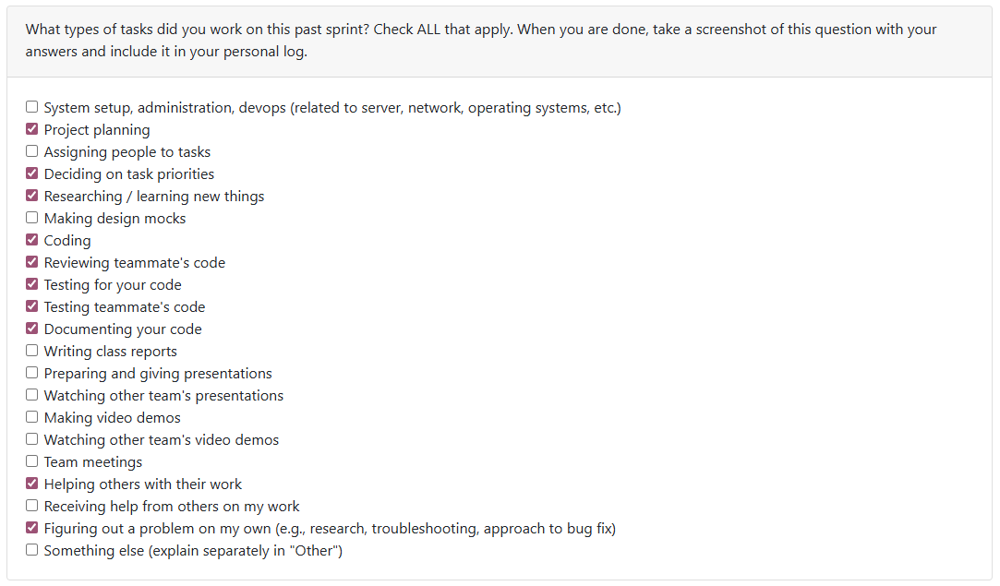

Week Recap: This week I focused heavily on completing core components of the system that were necessary for meeting the milestone requirements. I implemented the full GitHub integration flow, expanded and finalized the pipelines, and contributed major restructuring across the project. I also resolved several GitHub conflicts that emerged due to delayed PR reviews, which required me to manually migrate work into new branches.

A large portion of my time was also spent determining our remaining tasks for the milestone. Because consistent communication was difficult, I created detailed documents outlining the project structure and the outstanding work needed, which helped the team get clarity on what still had to be completed. These documents are all on Google Docs, and thus are not included in the repository.

In addition to this, I continued cleaning up the codebase by organizing modules, improving flow consistency, implementing new flow/pipelines, and preparing for the next phase of development.

Technical Breakdown:
- #208 (Refactor/db module split) - Refactored the whole `db.py` file. Separated the schema from the helper functions, then further split the helper functions into files based on which table the functions were accessing.
- #209 (GitHub metrics db storage) - Normalized the `github_repo_metrics` table, so instead of storing a JSON text the table has proper metric columns. I updated all areas of the code to account for this change (storing/parsing functions, updating integration flow, and fixing tests)
- #212 (Skill detection flow) - Implemented the full skill detection pipeline. Previously, all the analyses were spread out among the system, printing and storing different types of metrics, and not technically detecting the skills the user shows in their projects. This pipeline takes the analyses already implemented and sends the data into a skill detector flow, where the project is parsed via several detector functions (the functions themselves were not implemented in this PR, only the flow was). 
- #213 (GitHub analysis functions) - Implemented the initial modules used to determine the user's collaboration skills in a coding project. The functions themselves were not fully implemented here, only the flow and supporting classes. 
- #221 (Integration for project summaries) - Implemented the Project Summaries flow. As the analyses are run, the project summary is filled in, so later the system can print and store the project summaries instead of all the various types of anlyses we previously had implemented. This will make the final milestone requirements much easier to implement (retrieval and parsing).
- #225 (GitHub analysis final implementation) - Completely finished the full GitHub collaboration analysis. My previous GitHub PRs were partial, and more focused on flow, but this one fully fleshed out any missing sections and conencted all the components. When the user connects to GitHub, their collaboration skills are now detected and stored in the database. Detecting these skills will help the user understand their contribution patterns (team dynamics, workload, etc.).

Additionally, I reviewed as many PRs as my time schedule allowed.

Next Week:
- Refactor the project summary so that the system prints results stored in the project summary database rather than using the current flow. 
- Separate the printing of resume items and portfolio items to make the output clearer and more aligned with the user experience we intend.
- Clarify (and possibly implement) the things Salma mentioned in PR #225 (GitHub API not returning ALL comments on a PR, only some, and ensuring all comments are being stored)

I also plan to refactor the print statements throughout the codebase. Right now the system prints too much during a run, so my goal is to reduce unnecessary output and ensure that only the final project summaries are displayed to the user.

## (Week 13) Monday November 24 - Sunday November 30

Week Recap:
This week I focused on the tasks assigned to me during our Wednesday meeting after the lecture. My main job was to implement the project ranking system, which meant figuring out how to combine all the different metrics we collect into one meaningful score. This required a lot of thought, since each metric represents a different aspect of a project, and it was not immediately obvious how to balance them. To keep things consistent, I separated the ranking process into two paths: one for code projects and one for text projects. They still shared some common scoring steps, but each type also needed its own specific functions because of how different the stored metrics are. Once each metric was calculated, I normalized everything so that all the scores were on the same scale. This made it possible to combine them and avoid situations where one metric overshadowed the others. Updating the `project_summaries` table was also necessary so that all the information needed for ranking was stored consistently.

I additionally implemented the chronological list of skills, which required pulling together data from several tables (one complete query seemed to be the easiest and best solution) and making sure each skill was tied to the correct project and timestamp. Alongside that, I added the feature to list all project summaries so users can easily view the summaries for each uploaded project.

While working on the ranking system, I got helpful feedback on my PR #273 from my team members, but it was especially Salma who pointed out that the activity diversity metric was not distinguishing between small and large contributions. After researching different approaches, I decided to use Shannon entropy, as it is a good way to measure how spread out or varied a set of data (activities) is. I included a detailed comment on what Shannon entropy is and how it works inside the code (file: `/src/insights/rank_projects`, function: `activity_diversity()`). This improved the overall balance of the ranking system. I implemented this in a separate PR (#280) because my ranking feature was needed for my other team members to complete their PRs.

Overall, the work went smoothly this week, but coming up with a fair and realistic ranking method was definitely difficult and required a lot of time looking at the different metrics and analyses. The implementation itself was not too bad once the approach was decided. I also reviewed multiple PRs to keep the teams flow moving forward.

My PRs:
- #267 (Filling project summaries) - Completed the project summaries by ensuring all necessary data was being stored in the table `project_summaries`
- #273 (Feature/rank projects) - Implemented the scoring functions and incorporated the list of ranked projects into the main menu
- #274 (producing a chronological list of skills) - Implemented query to retrieve all project summaries for a user and incorporated the list into the main menu
- #280 (Activity Diversity Scoring function Change) - Changed the ranking system function `activity_diversity()` to use Shannon entropy
- #281 (getting top project summaries and tests) - Listed only the top three ranked projects and their attached summaries

Next Week:
Next week, I plan to implement any remaining changes assigned to me that we decide are necessary for the Milestone 1 deliverable. I will also be working with my team to build the demo slides for our presentation on Wednesday and will be contributing to the Milestone 1 deliverable that is due Sunday, December 7th.

## (Week 14) Monday December 1 - Sunday December 7

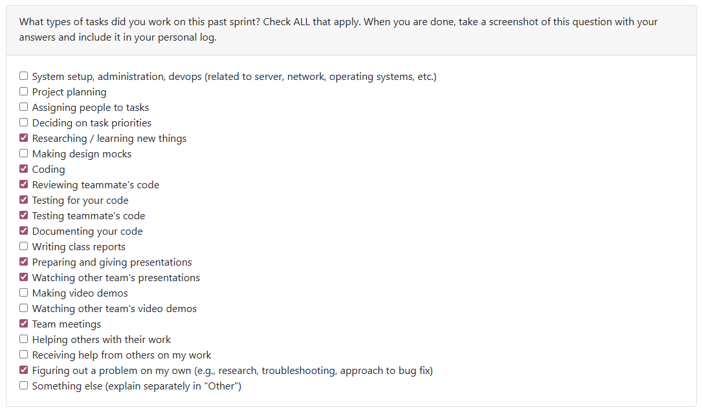

Week recap:
This week I worked on the tasks assigned to me. I optimized the skill detection with various different optimizations. Previously, the code skill detection was quite slow because it was reading the code line by line, so for large projects this would take awhile. Every file was being sent into the detector, where each detector broke the file down into lines to search for the regex patterns previously created. My PR description is quite detailed on what optimizations I implemented, but I will mention the main ones here:
- Moved the regex patterns out of the detector functions so they are compiled only once, instead of each time the detector is called. This cut the time down quite a bit, but not enough for me to be happy with the speed.
- Checking the string manually with startswith / substring before running the regex. Although regex is powerful, it is slow and bulky. By checking the substring first we cut down on how many regex is checked, speeding up the whole process.
- Broke the file down into an array of lines *before* sending the array into the detector. This stopped each detector from having to break a file down itself. Previously, if there were 10 detectors they would each break the file down in the same way. Now, the file is broken down once and sent into each detector.

All other optimizations were smaller, and did not have as much of an impact as I had wanted, hence why there were so many different optimizations implemented. For further details, look at PR #302. 

Additionally, I fixed a bug in the GitHub Integration. It was not retrieving metrics accurately, so I went through the code to find the issues. Most of the issues were because the count for certain metrics (e.g., issues and review comments) were not counting just the user's counts. Also, there are different types of review, meaning just review comments are counted separately from approvals/request changes (this is a GitHub thing, not our code). While I was fixing these bugs, the retrieval for fetching GitHub metrics was slow, upwards of 5 minutes, so I optimized it by using GraphQL. GraphQL was specifically created for this very reason, that is, fetching tons of data from GitHub via their REST API. I only had the GraphGQL code retieve the paginated requests (review comments, PR comments, etc.), but eventually I would like to make it perform *all* the fetch requests, not just some.

I also worked on updating the README. I ensured all steps for getting the .env variables and running the system were clear. I also added the team contract to the README.

Lastly, I worked on the slides with the rest of my team, specifically the GitHub Integration slide and the Skill Buckets slide.

My PRs:
- #302 (optimizing skill detector) - Optimized the skill detector to run faster.
- #309 (Fixing GitHub comments bug and optimizing requests) - Fixed the GH integration bug and optimized github fetch requests to the GitHub REST API.
- #310 (updated README) - updated the README with the team contract and updated the .env file section to provide steps.

Next week, there is no sprint. I will be studying for exams and waiting excitedly for winter break. In January, my team will reassess Milestone 2 and begin assigning tasks as needed.

## (T2 Week 1) Monday January 5 - Sunday January 11

This week I worked on completing the milestone 2 task of project duplication. I worked on this a little bit last term before realizing it was a milestone 2 requirement, and thus I left it alone to work on more time-sensitive tasks. Last term, I had already done research on the best way to detect duplication, which was through hashing, and so I already had a plan headed into my task this week. I decided on three main scenarios that needed to be considered: exact duplicate project, brand new project, and a similar project (could be an updated version of a project or just a similar project that is not the same). I used Jaccard similarity to determine if a project is a duplication. Further implementation details can be found in PR #329. My team caught a few edge cases that I missed, but due to the size of my PR I will be addressing those next week on top of my assigned task. This allows me to keep my PR's smaller and more manageable. 

My PR's:
- #329 (Duplicate projects)

Next week I will continue to complete the duplicate project task, as well as anything else assigned to me. I would like to also eventually research the security of our database, as I don't believe it to be very secure.

## (T2 Week 2) Monday January 12 - Sunday January 18

I began working on the API requirements ([#357](https://github.com/COSC-499-W2025/capstone-project-team-19/pull/357)). I implemented the setup required for the API, such as adding the FastAPI requirements in, creating the directory structure (services, routes, etc.) and began the API documentation file. I also implemented one API endpoint (/projects), to ensure all the setup I did is clear for my team members. 

I also worked on catching the edge cases in the duplication checks, ([#363](https://github.com/COSC-499-W2025/capstone-project-team-19/pull/363)). I added path normalization so folders organized with `/collaborative` and `/individual` are caught, ensured projects with different filepaths and filenames were detected as duplicates if the file content is the same, and I changed the code to stop suggesting that smaller projects (very few files) are duplicates.

I reviewed as many PR's as my time allowed, making suggestions and raising questions where I deemed necessary.

The duplication check PR works off the PR I did last week where I implemented the main duplication flow ([#329](https://github.com/COSC-499-W2025/capstone-project-team-19/pull/329)), and thus was a continuation based on the requested changes by the reviewers. 

Next week I would like to continue implementing endpoints, but also take a look at the security of the system. Some parts of the system are not very secure such as the storage of the GitHub encryption key, authentication for the API endpoints (JWT Auth), and encrypting the database file. I hace created issues for these and plan on bringing them up to my team in our meeting on Monday.

## (T2 Week 3) Monday January 19 - Sunday January 25

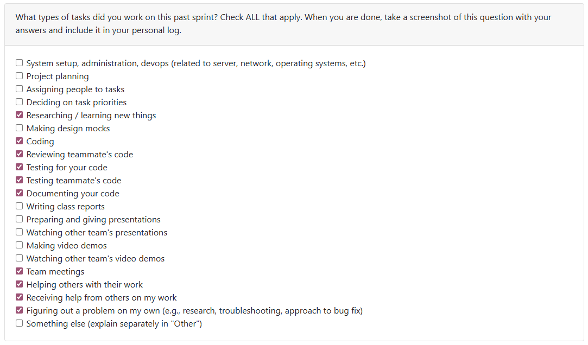

This week, I implemented JWT authentication for FastAPI in PR #392. This ensures our API is secure and that no random users can gain access. To make this meaningful, I also had to implement passwords in the database and throughout the system. Without passwords, JWT authentication wouldn’t actually prove anything. If a user can simply claim to be user X with no way to verify it, the token is pointless, thus passwords are necessary.

After this, I updated all existing API endpoints to use `Authorization: Bearer <token>` instead of `X-user-id`.

Additionally, my team members noticed in PR #391 that small projects were sometimes being detected as duplicates. Since I originally implemented the duplication process, I decided to fix this edge case in PR #398. I added more scoring and detection logic specifically for small projects. That said, because small projects naturally contain very few files, our system may still miss some cases. There simply may not be enough data to confidently detect duplication, or (in rare cases), a very small project could be so similar to another that it gets flagged. At the very least, this PR improves the detection and hopefully makes the small case of it not being caught smaller.

Last week, I mentioned wanting to look more deeply into the system’s security. After spending a couple of hours researching, I learned that because we decided on local storage, it’s inherently more difficult to secure the database file. No matter what we do, since the file lives on the user’s machine, they can ultimately do whatever they want with it. They don’t have access to other users’ data, so the only real downside is that they could mess with their own data or the schema, potentially breaking the software. For the scope of this project, this is a minor issue. Fixing it properly would require reworking the entire database system we’ve built over the past few months, so I left it as-is.

I also looked into the security concern around how the GitHub key is stored. The main issue is that the key lives right beside the project on the user’s machine, meaning the user can simply find it if they want. While it would be interesting to move this to a more secure location, the team ultimately agreed it isn’t worth the time and complexity when we have other milestone requirements to meet.

Next week, I plan to continue implementing API endpoints and take on any tasks assigned to me by the team.

## (T2 Week 4-5) Monday January 26 - Sunday February 8

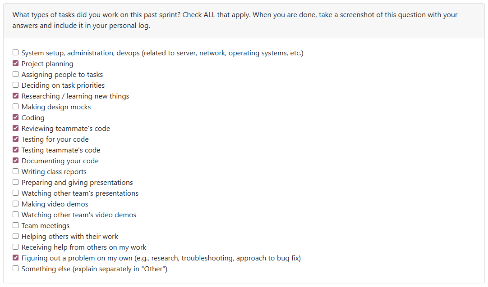

This log covers both week 4 and week 5.

**Coding Tasks**
- I implemented the endpoints for displaying and editing project ranking in [PR #428](https://github.com/COSC-499-W2025/capstone-project-team-19/pull/428). I tried to keep the implementation as close as possible to the existing CLI menu option for project ranking, so I was able to reuse a lot of code that was already in the system.

- I also implemented the endpoint that returns feedback for a specific project in [PR #442](https://github.com/COSC-499-W2025/capstone-project-team-19/pull/442). Similar to the ranking endpoints, most of the work was already supported in the database, it was mainly just connecting the pieces together through the API.

- The last endpoints I added were the project date ones in [PR #445](https://github.com/COSC-499-W2025/capstone-project-team-19/pull/445). These needed a bit more logic than the others, like validation (making sure the dates are real, in the correct format, and that the end date isn’t before the start date) and switching between automatically detected dates and manually set dates.

**Refactoring / Project Versioning**
In [PR #450](https://github.com/COSC-499-W2025/capstone-project-team-19/pull/450), I started a much larger refactor to prepare for project versions. Before this, the system relied heavily on the project name through the `project_classifications` table. But once we started adding multiple versions of projects (which can all have the same name), we didn’t really have a clean way to identify which version we needed or track differences between them. This refactor was the start of migrating toward a stable project identity based on IDs instead of names. I continued this work in [PR #456](https://github.com/COSC-499-W2025/capstone-project-team-19/pull/456), where I removed the remaining reliance on `project_name` and migrated the system to use `project_key` instead. With this change, we can more easily find specific versions of a project, analyze them separately, and support the timelines and heatmaps we need for Milestone 3.

Next week, I want to continue the project versioning implementation by removing legacy code that is no longer up to date with the switch to `project_key`. I’ll also be starting the logic for building timelines, heatmaps, and project progression data, and I’d like to implement the API endpoints for those visuals as well.